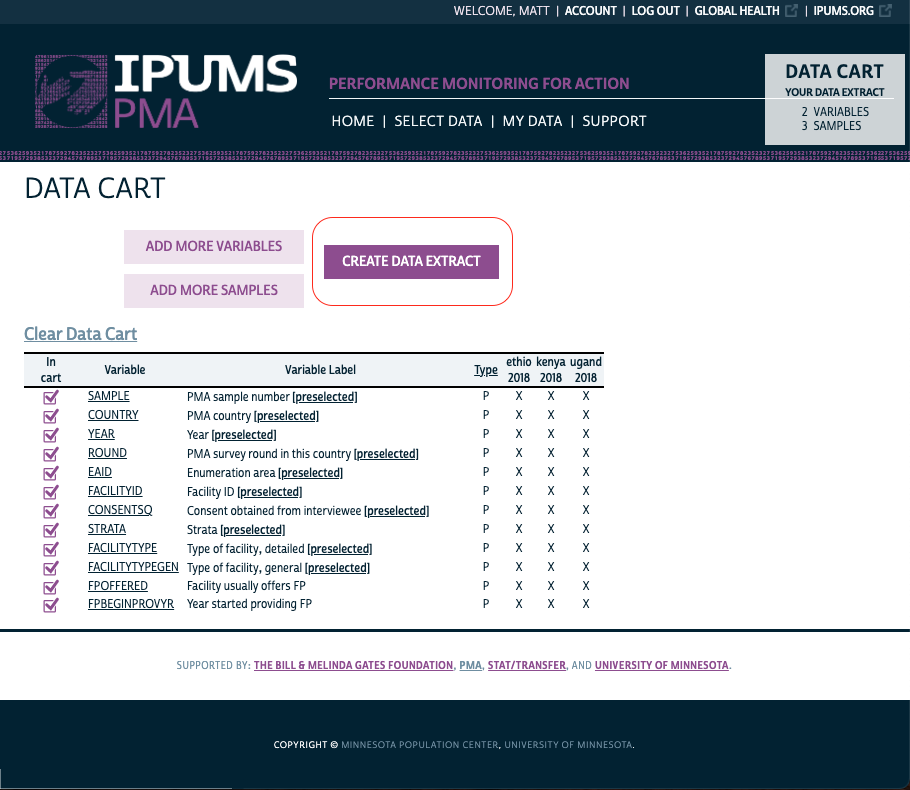
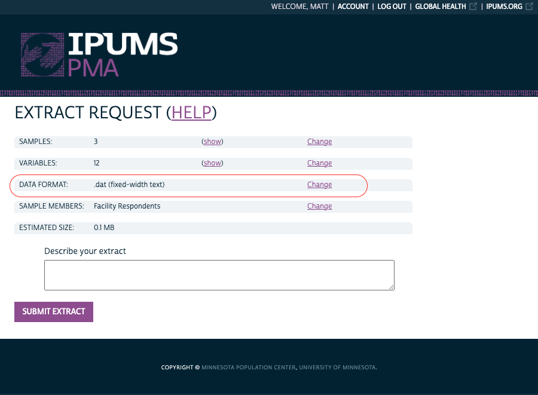

IPUMS PMA is the harmonized version of the multinational survey [Performance Monitoring for Action](https://www.pmadata.org/) (formerly known as Performance Monitoring and Accountability 2020 - PMA2020). IPUMS PMA lets researchers easily browse the contents of the survey series and craft customized microdata files they download for analysis.

# How to access the data

## User Guide 
Visit the IPUMS PMA [data dissemination website](https://pma.ipums.org/) to browse the available data, and then follow the posted [user guide](https://pma.ipums.org/pma/userguide.shtml) to get started with an extract of interest. 

Note: all users must register for a **free** account. See user guide for details.

## YouTube Tutorials
Visit the [IPUMS PMA YouTube page](https://www.youtube.com/playlist?list=PLHMF4C5RDaejhm4Hdm3fulvaoKkhTrOHa) for a video playlist showing how to do things like:

 * register for a free IPUMS account
 * select from the available units of analysis
 * build a data extract 
 * select cases of interest
 * use the available survey weights
 
# Importing the data

## Fixed-width Data Format (dat)

Once you have registered and finished selecting PMA samples and variables for your extract, click the "View Cart" button to begin checkout. 

Review the contents of your extract and clik the "Create Data Extract" button as shown:

```{r}

```

On this final page **be sure to change the data format to ".dat (fixed-width text)" if it is not selected by default**:

```{r}

```

You will receive an email when your extract request has been processed. Click the included link to find a download page like this one. *You must download both the data file and the DDI codebook*:

```{r}
knitr::include_graphics("images/download-extract.png")
```

## The `ipumsr` package

The R package [ipumsr](http://tech.popdata.org/ipumsr/index.html) provides the tools you will need to import the data file and DDI codebook into R. You can install the package from CRAN with:

<aside>
Click <a href="../2020-12-10-get-r-and-packages/index.html#r-packages">here</a> for more information on R packages.
</aside>

`install.packages("ipumsr")`

Note the location where your data file and DDI codebook were saved (in my case, they were saved in my local "Downloads" folder). Substitute your own paths into the function shown below:

```{r, eval=F, echo=T}
dat <- ipumsr::read_ipums_micro(
  ddi = "~/Downloads/pma_00001.xml",
  data_file = "~/Downloads/pma_00001.dat.gz"
)
```

You're done! The dataset is now accessible as the R object, `dat`.
