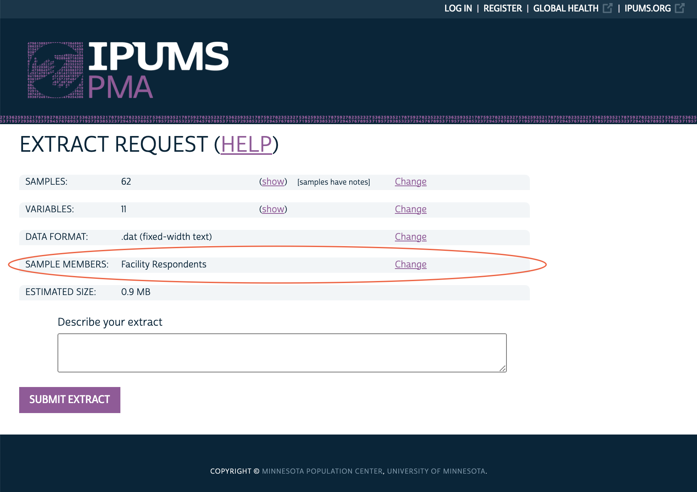

```{r setup, echo=F}
knitr::opts_chunk$set(echo = FALSE)

# downloadthis::download_dir(
#   path = ".",
#   output_name = basename(getwd()),
#   button_label = "Download this page as R code",
#   button_type = "default",
#   has_icon = T,
#   icon = "fa fa-save"
# )
```

When you visit [pma.ipums.org](https://pma.ipums.org/pma-action/variables/group) and begin browsing data, you'll notice that PMA data are available for several different units of analysis.

You can see which unit of analysis you're currently browsing - or switch to a different unit of analysis - in this box:

```{r}
knitr::include_graphics("images/cur-fp-person.png")
```

Click [CHANGE](https://pma.ipums.org/pma-action/extract_requests/clear?return_url=%2Fpma-action%2Fvariables%2Fgroup), and you'll see the different units of analysis that are available:

```{r}
knitr::include_graphics("images/choose-unit.png")
```

This [Data Discovery](../../index.html#category:Data_Discovery) post kicks off a series of posts all about the data available for the **Family Planning - Service Delivery Point** unit of analysis. As you'll see, these data are meant to provide important context for the individuals included in the **Family Planning - Person** series: while SDP data are *not* nationally representative, they can help provide a rich portrait of the health service environment experienced by women and households. 

You'll find more blog posts about SDP data by following the [Individuals in Context](../../index.html#category:Individuals_in_Context) series. Look for upcoming posts about:

  * Working with variable groups created from multiple response questions 
  * Merging SDP summary data with Household and Female data
  * Mapping SDP Data with GPS Data from our partners at [pmadata.org](https://www.pmadata.org/)
  * Merging SDP Data with spatial datasets from external sources
  * An example of the sort of spatial analysis you can perform with SDP data 
  
# What is an SDP?

A Service Delivery Point (SDP) is any type of facility that provides health services to a community: you'll find a breakdown of the available facility types for each sample listed in [FACILITYTYPE](https://pma.ipums.org/pma-action/variables/FACILITYTYPE). Because countries may include regionally-specific facility types, we've integrated major groupings together in the variable [FACILITYTYPEGEN](https://pma.ipums.org/pma-action/variables/FACILITYTYPEGEN). For example, you may find SDP data available from any of these general facility types:

  * Hospitals
  * Health Centers
  * Health Clinics
  * Other Health Facilities
  * Private Practices
  * Dispensaries
  * Pharmacies / Chemists / Drug Shops
  * Boutiques / Shops 
  * Other

PMA samples SDPs managed by governments, NGOs, faith-based organizations, private sector organizations, and a range of other institutions. You'll find the managing authority for each SDP listed in [AUTHORITY](https://pma.ipums.org/pma-action/variables/AUTHORITY).

# Survey Topics

While all SDP surveys cover similar topics, individual questions may be posed somewhat differently - or not at all - for any given sample. That's where IPUMS PMA comes in: we harmonize differences across samples and document the availability of every variable for each sample.

<aside>
You'll find the full text PDF of the original questionnaire administered to all SDPs in a particular sample <a href="https://pma.ipums.org/pma/enum_materials.shtml">here</a>. 
</aside>

IPUMS PMA also organizes SDP variables by topic. These topics currently include:

  * Facility Characteristics
    * General Facility Characteristics 
    * Geography
    * Areas Served 
    * Staffing 
    * Medical Equipment
    * Funding
    * Management
    * Performance Feedback 
    * Quality of Care
    * Service Statistics 
    * Medical Records
    * Transportation
  * Family Planning Services 
    * Services Provided
    * Contraceptive Stock
    * Reason for Stockout
    * Clients Served
    * Stock Supplier
    * Fees
    * Facility Condition
  * Other Health Services
    * Abortion
    * Post-abortion Care
    * STDs
    * Antenatal Care
    * Labor and Delivery
    * Postpartum Care
    * Delivery Medicines 
    * Community Health Workers
    * Vaccinations
    * Health Programs
    * Medicines in Stock
    * Other
    
<aside>
These are listed in the TOPICS menu and are subject to growth & reorganization.

```{r}
knitr::include_graphics("images/topics.png")
```
</aside>

Additionally, there are a number of [technical variables](https://pma.ipums.org/pma-action/variables/group?id=tech_techvar) related to survey administration. For example, every SDP included in the sample frame receives a unique [FACILITYID](https://pma.ipums.org/pma-action/variables/FACILITYID) (this ID is preserved across survey rounds if a facility is surveyed more than once). However, some facilities never responded to the questionnaire if, for example, no individual respondent was present, competent, and available to be interviewed (see [AVAILABLESQ](https://pma.ipums.org/pma-action/variables/AVAILABLESQ)); if no such person was available - or if such a person declined the interview - the variable [CONSENTSQ](https://pma.ipums.org/pma-action/variables/CONSENTSQ) will indicate that survey consent was never obtained. The variable [RESULTSQ](https://pma.ipums.org/pma-action/variables/RESULTSQ) indicates whether the questionnaire was fully completed or, if not, it provides the reason.

<aside>
For SDPs where <b>CONSENTSQ</b> is "No", most variables will take the value <b>"Not interviewed (SDP questionnaire)"</b>. 

Note that the value <b>"NIU (not in universe)"</b> pertains to SDPs that were intentionally skipped because a question was deemed <b>out-of-scope</b>.
</aside>

You may choose whether to include SDPs where `RESULTSQ` indicates that the questionnaire was not fully completed. Click `CREATE DATA EXTRACT` from you Data Cart:

```{r}
knitr::include_graphics("images/create-extract.png")
```

Then click `CHANGE` next to Sample Members:

```{r}

```

Finally, choose whether to include *only* "Facility Respondents" (those who fully completed the questionnaire), or "All Cases" instead:

```{r}
knitr::include_graphics("images/sample-members.png")
```

# Sample Design

So what conclusions can you draw from SDP data? First, it's important to note that the SDP sample design is **not nationally representative**, and there are **no sampling weights** for SDP data.^[The files do contain a weight variable for the sampling units `EAWEIGHT`, which is a probability weight representing the likelihood of an enumeration area being selected for sampling. The collectors of the original data do not recommend using `EAWEIGHT` to weight SDP variables.] In other words, it is not possible to get a sense of the national health services profile in a particular country using SDP data.

Instead, facilities were selected for the SDP survey using the same geographic **enumeration areas** used to select households for each Household and Female survey. To see how this works, let's look at an example dataset collected from Burkina Faso in 2017, beginning with the set of female respondents to the Household questionnaire (other household members and female non-respondents have been excluded):

<aside>
<a href="https://pma.ipums.org/pma/resources/documentation/PMA2020_Survey_Sampling_Strategy_Memo.pdf">Read more</a> about the Household and Female sampling strategy.
</aside>

```{r, echo = T, results='hide'}
library(tidyverse)

bf17_hhf <- ipumsr::read_ipums_micro(
  ddi = "data/pma_00011.xml",
  data = "data/pma_00011.dat.gz") %>% 
  filter(YEAR == 2017)
```

<aside>
Check out our posts on <a href="../2020-12-10-get-r-and-packages/index.html#r-packages">R Packages</a> and <a href="../2020-12-10-get-ipums-pma-data/index.html">Loading IPUMS PMA data into R</a>.

To use this code, be sure to change both file paths to match your own extract!
</aside>

The [Dataset Notes](https://pma.ipums.org/pma/resources/dataset_notes/hhf/PMA2017_BFR5_HHQFQ_v1_DatasetNotes_26Aug2018_English.pdf) for this sample describe a two-stage cluster design with urban-rural strata, producing a sample of women from **83 enumeration areas**. If we count the number of unique values from [EAID](https://pma.ipums.org/pma-action/variables/EAID#codes_section) in our data, we see that there are 83 unique identification numbers - one for each enumeration area:

```{r, echo = T}
n_distinct(bf17_hhf$EAID)
```

We can also see how these enumeration areas are distributed throughout the 13 administrative regions of Burkina Faso. Note that we have more enumeration areas in the Central region (including the capital, Ouagadougou), and we have fewer enumeration areas in regions where the population is lower (Centre-Sud, Plateau-Central, Sud-Ouest, etc.):

```{r, echo = T}
bf17_hhf %>% 
  group_by(GEOBF) %>% 
  summarize(.groups = "keep", n_EAID = n_distinct(EAID)) %>% 
  arrange(n_EAID)
```

Although the same number of households are randomly selected from within each enumeration area (typically 35), this concentration of enumeration areas within population-dense regions helps to ensure that the Household and Female data *are* nationally representative. 

Let's now look at the sample of SDPs collected from Burkina Faso in that same year:

```{r, results='hide', echo=T}
bf17_sdp <- ipumsr::read_ipums_micro(
  ddi = "data/pma_00008.xml",
  data = "data/pma_00008.dat.gz") %>% 
  filter(YEAR == 2017)
```

<aside>
Remember: to use this code, be sure to change both file paths to match your own extract!
</aside>

[Dataset Notes](https://pma.ipums.org/pma/resources/dataset_notes/sdp/PMA2017_BFR5_SDP_v1_DatasetNotes_31Aug2018.pdf) for the SDP sample explain that the same 83 enumeration areas used in the Household and Female Sample were used to select facilities for the SDP sample. Moreover, we can confirm that all of enumeration areas in the SDP data also appear in the HHF data:

```{r, echo = T}
all(bf17_sdp$EAID %in% bf17_hhf$EAID)
```

But is the reverse true? *Is every enumeration area from the Household and Female Sample represented in the SDP data?*

```{r, echo = T}
all(bf17_hhf$EAID %in% bf17_sdp$EAID)
```

Perhaps surprisingly, the answer is *no*. To learn why, we have to dig a bit deeper into the SDP Dataset Notes. There, we see that a facility located within the physical boundaries of one of the 83 enumeration areas from the Household and Female Survey would have been included in the SDP sample. However, *there may be enumeration areas - particularly in remote areas - where no facilities are located*. 

Fortunately, PMA also includes data about the service catchment area for some facilities.^[This information is only available for SDPs where the managing authority listed in `AUTHORITY` is "government".] You can include this information by selecting the variable series [EASERVED](https://pma.ipums.org/pma-action/variables/EASERVED). If a given facility serves more than one enumeration area, `EASERVED1` will contain the enumeration area ID code for the first enumeration area on its catchment list, `EASERVED2` will contain the ID code for the second one, and so forth. If that same facility serves 5 enumeration areas, the variables `EASERVED6`, `EASERVED7`, and so forth would be "NIU (not in universe)". 

<aside>
The IPUMS PMA extract system automatically determines the right maximum number of `EASERVED` variables by finding the facility with the largest service catchment list in your extract. 
</aside>

**What does this mean?** As we'll show in an upcoming post in [this series](../../index.html#category:Individuals_in_Context), it's possible to create a portrait of the health service environment provided to individuals sampled in the Household and Female surveys. This portrait extends beyond the list of facilities *located in* an individual's geographic enumeration area, but users should take care to understand that the scope of facilities *providing services to* that enumeration area is somewhat limited by sample design. 


