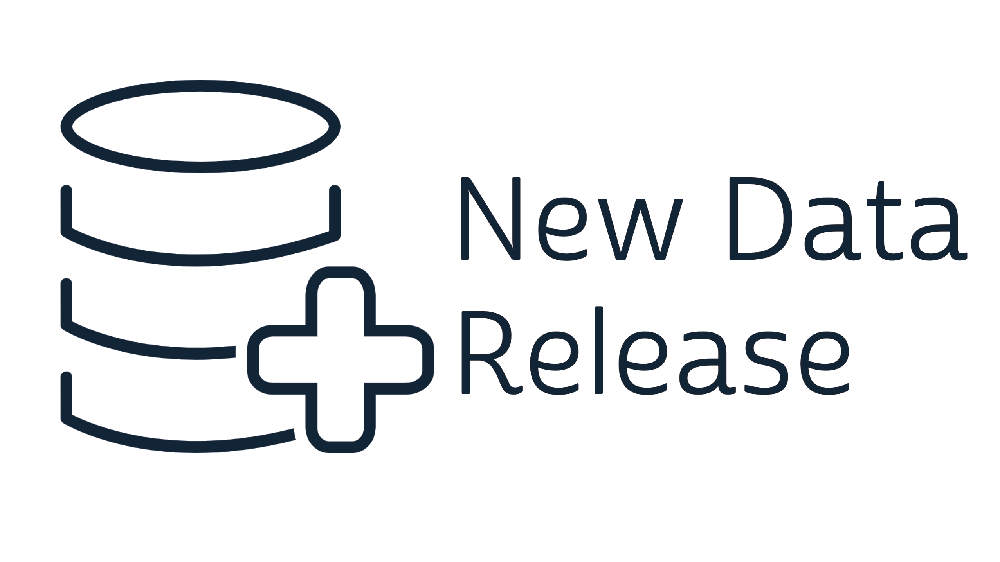

```{r setup, echo=F}
library(tidyverse)
knitr::opts_chunk$set(echo = TRUE)
options(tibble.max_extra_cols = 5)
varlink <- function(var){
  paste0("(https://pma.ipums.org/pma-action/variables/", var, ")")
}

# downloadthis::download_dir(
#   path = ".",
#   output_name = basename(getwd()),
#   button_label = "Download this page as R code",
#   button_type = "default",
#   has_icon = T,
#   icon = "fa fa-save"
# )
```

We're excited to announce the release of several new [Service Delivery Point](../2021-01-26-sdp-data/index.html) samples this month over at [pma.ipums.org]`r varlink("group")`! As always, you'll find the new data harmonized with older samples wherever the new surveys repeat questions you've seen before. The new samples also contain a big batch of new variables derived from questions that were posed for the very first time in PMA surveys, so we'd like to introduce a few of the highlights here.

<aside>
```{r, echo=F}

```
</aside>

The new samples included in this release represent data collected from:

  * Burkina Faso 2020
  * Congo (DR) 2019
  * Ethiopia 2019
  * Kenya 2019
  * Nigeria 2019
  * Uganda 2019

# Labor and Delivery

We've added a variable group in the **Other Health Services** topic offering **more than 60 new variables** related to [Labor and Delivery]`r varlink("group?id=health_deliv")`. Many of these are currently available only for the Ethiopia 2019 sample, which piloted the new questions. 

For example, you'll find new variables about delivery personnel, including those showing whether a facility has a [skilled birth attendant]`r varlink("BAALLHOURS")` or a [provider able to perform C-section delivery]`r varlink("CESALLHOURS")` available 24 hours per day. Other variables describe the infrastructure available for labor and delivery, including the number of delivery [rooms]`r varlink("DELIVROOMNUM")` and [beds]`r varlink("DELIVBEDNUM")`, [labor rooms]`r varlink("LABORROOMNUM")`, [maternity waiting rooms]`r varlink("MATROOMNUM")`, and [newborn resuscitation tables]`r varlink("RESUSTABLENUM")`. You'll also find a number of variables describing the environment inside of a facility's delivery rooms, including whether they are [private]`r varlink("DELIVROOMPRIV")`, [heated]`r varlink("DELIVROOMHEAT")`, and whether they have several specific delivery guidelines and protocols posted in the room. 

Several labor and delivery statistics are also provided for the **month preceding the interview**. These include the total number of facility [deliveries]`r varlink("DELIVNUMMO")`, [cesarian deliveries]`r varlink("CESNUMMO")`, [stillbirths]`r varlink("STILLTOTMO")` (both [fresh]`r varlink("STILLFRMO")` and [macerated]`r varlink("STILLMACEMO")`), and neonatal deaths (reported separately for those occurring within [24 hours]`r varlink("NEODEATH24HRNUMMO")` and [one week]`r varlink("NEODEATHWEEKNUMMO")`). Other variables report whether certain services were provided **any time within 3 months preceding the interview**, including: 

  * [instrument / assisted delivery]`r varlink("PROVASSISTDEL3MO")`
  * [caesarean section]`r varlink("PROVCSEC3MO")`
  * [parenteral antibiotics]`r varlink("PROVABX3MO")` for infections
  * [parenteral anticonvulsants]`r varlink("ANTICUSE3MO")` for high blood pressure ([Diazepam]`r varlink("ANTICUSEDIA")`, [Magnesium Sulfate]`r varlink("ANTICUSEMAS")`, or [other]`r varlink("ANTICUSEOTH")`) or hypertension ([Hydralazine]`r varlink("HYPHYD")`, [Nifedipine]`r varlink("HYPNIF")`, [Methyldopa]`r varlink("HYPMETH")`, or [other]`r varlink("HYPOTH")`)
  * [parenteal / oral uterotonics]`r varlink("PROVOBHEM3MO")` for hemorrhage ([Ergometrine]`r varlink("UTERGO")`, [Misoprostol tablets]`r varlink("UTMISO")`, [Oxytocin]`r varlink("UTOXT")`, or [other]`r varlink("UTOTHER")`)
  * [cortisteroids for fetal lung maturation]`r varlink("PROVCORTIS3MO")`
  * [manual placenta removal]`r varlink("PROVPLACRMV3MO")`
  * [partographs to monitor labor]`r varlink("PROVPARTO3MO")`
  * [newborn resuscitation]`r varlink("PROVRESUS3MO")`
  * [blood transfusion]`r varlink("PROVTRANSF3MO")`
  * [postpartum implant insertion]`r varlink("PROVPPIMP3MO")`
  * [postpartum IUD insertion]`r varlink("PROVPPIUD3MO")`
  * [postpartum tubal ligation]`r varlink("PROVPPTL3MO")`
  
Lastly, a number of variables indicate whether a particular service is **typically provided** at a facility. These include,

  * [neonatal intensive care]`r varlink("NEONATALPROV")`, and whether it was available [on the day of the interview]`r varlink("NEONATALTODAY")`
  * referrals for outgoing [newborns]`r varlink("NEWBORNREF")` and [pregnant]`r varlink("PREGREF")`, [laboring]`r varlink("LABORREF")`, and [postpartum]`r varlink("PPTREF")` women; policies on referrals made [from other facilities]`r varlink("REFREC")`
  * [breastfeeding assistance]`r varlink("BFASSIST")`, [newborn skin contact]`r varlink("DELIVSKIN")`, and [family planning discussions]`r varlink("BFDISC")` with new mothers prior to discharge

# Antenatal Care

As with **Labor and Delivery**, a new [Antenatal Care]`r varlink("group?id=health_anc")` group contains a number of variables that are currently available only for the Ethiopia 2019 sample, such as:

  * whether antenatal care was available [on the day of the interview]`r varlink("ANCTODAY")`
  * whether trained staff are available to use [ultrasound]`r varlink("ULTRASTAFF")`, and whether they were available [on the day of the interview]`r varlink("ULTRAPRES")`
  * the [total number]`r varlink("ANCROOMNUM")` of rooms for antenatal care, and whether they are [private]`r varlink("ANCROOMPRIV")`
  * whether a number of different procedures are typically provided as a routine part of antenatal care (for example: [blood pressure]`r varlink("ANCBLPRS")`, [weight]`r varlink("ANCWGHT")`, [HIV testing]`r varlink("ANCHIV")`, and several blood / urine tests)

Beyond Ethiopia 2019, several of the other new samples included questions related to topics that are normally discussed with patients during an antenatal visit:

  * immediate and exclusive [breastfeeding]`r varlink("DISANCBF")` 
  * [return to fertility]`r varlink("DISANCFERT")` after pregnancy
  * healthy [timing and spacing]`r varlink("DISANCSPACE")` of pregnancies
  * family planning methods available to use [while breastfeeding]`r varlink("DISANCFPBF")`
  * use of the lactational amenorrhea method ([LAM]`r varlink("DISANCLAM")`) for family planning, and plans for a transition to other methods
  * interest in a [postpartum IUD]`r varlink("DISANCPPIUD")` or other [long-acting]`r varlink("DISANCLONGFP")` family planning methods 
  
In earlier survey rounds, PMA questionnaires included questions on whether these topics were discussed with a new mother after birth.  The new samples differentiate between whether these topics were covered before the mother left the facility after delivery (e.g [DISPPSPACE]`r varlink("DISPPSPACE")`) or at a postnatal care visit later on (e.g. [DISPNCSPACE]`r varlink("DISPNCSPACE")`).

# Vaccinations

The Ethiopia 2019 sample also includes some of the first PMA variables related to [vaccination]`r varlink("group?id=health_imm")`. You'll find indicators for whether a facility typically [provides immunization services]`r varlink("VAXPROV")`, whether those services were provided [on the day of the interview]`r varlink("VAXTODAY")`, and whether a woman visiting the facility for her child's immunization would be offered [family planning]`r varlink("VAXFPOFF")` services or counseling during the visit.

The availability of the following vaccines are also provided: 

  * [BCG]`r varlink("VAXBCG")`
  * [IPV]`r varlink("VAXIPV")` and [oral]`r varlink("VAXOPV")` polio
  * [Measles]`r varlink("VAXMEASLES")`
  * [PCV]`r varlink("VAXPCV")`
  * [Pentavalent]`r varlink("VAXPRV")`
  * [Rota]`r varlink("VAXROTA")`
  * [Tetanus toxoid]`r varlink("VAXTT")`
  * [Vitamin A]`r varlink("VAXVITA")`
  
<aside>
Each of these may be "observed" by the interviewer, or else "reported" without observation.
</aside>

# Facility Stockouts & Expected Shipments

PMA has included variables related to [contraceptive stockouts]`r varlink("group?id=fp_stock")` for many samples dating back to 2014. Four of the new samples dig deeper into the [reasons why facilities experience stockouts]`r varlink("group?id=fp_stockout")`, and also report the [expected delivery time]`r varlink("group?id=fp_supply")` for methods that were out of stock on the day of the interview.

For each of the following methods, the expected delivery time is reported by two variables: a numeric **value** and a **unit** (e.g. days, weeks, months) that defines the value. 

  * diaphragms 
  * Depo Provera 
  * emergency contraception 
  * female condoms
  * foam / jelly 
  * implants 
  * IUDs 
  * male condoms 
  * pills 
  * Sayana Press 
  * Standard Days/Cycle Beads 

```{r, echo = F, results='hide'}
dat <- ipumsr::read_ipums_micro(
  ipumsr::read_ipums_ddi("data/pma_00020.xml"),
  data = "data/pma_00020.dat.gz"
) %>% 
  filter(!is.na(DEPOVAL))
```

It's recommended that users construct their own derived variables for expected delivery times using whichever unit of time they prefer. For example, notice that the values for expected delivery of Depo Provera [DEPOVAL]`r varlink("DEPOVAL")` are reported either in weeks or months in [DEPOUNIT]`r varlink("DEPOUNIT")`:

```{r}
dat %>% count(DEPOVAL, DEPOUNIT)
```

Suppose you wanted to create a derived variable called `DEPO_WKS` that simply reports the expected delivery time of Depo Provera in weeks. For any value that's currently reported in months (`DEPOUNIT == 2`), you might decide to multiply the value in `DEPOVAL` by 4. *Don't forget to handle non-response values (e.g. 97, 98, 99) separately!*

```{r}
dat %>% 
  mutate(DEPO_WKS = case_when(
      DEPOUNIT == 2 ~ DEPOVAL * 4, 
      DEPOUNIT > 90 ~ NA_real_, 
      T ~ as.double(DEPOVAL) 
    )) %>% 
  count(DEPO_WKS)
```

<aside>
`DEPOVAL` is an *integer*, but R coerces it into a *double* when you apply multiplication (what if multiplication creates non-integer values?). This is why we tell R to use the *double* class `NA_real_` if `DEPOUNIT > 90`, and then to use `as.double(DEPOVAL)` if neither `DEPOUNIT == 2` nor `DEPOUNIT > 90`. *All of the values created by* `case_when` *have to be in the same class!*
</aside>

For facilities that were currently out of stock of a method that they normally provide, these new samples include variables explaining why the method was out of stock. With Depo Provera, for example, we can now see that a majority of stockouts across samples are caused by shipments that were ordered, but did not arrive:

```{r}
dat %>% count(OUTWHYDEPO)
```


# National Health Programs

Lastly, we've created a new variable group related to participation in [national health programs]`r varlink("group?id=health_prog")`. While we may see more data in upcoming samples, these variables currently describe facility participation in programs provided by the National Hospital Insurance Fund (NHIF) for Kenya. Specifically, you'll find an indicator for whether a facility in the Kenya 2019 sample [provides family planning methods / services covered by NHIF]`r varlink("NHIFCOVFP")` and, if so, whether it provides each of these:

  * [Edu Afya]`r varlink("NHIFEDUAFYA")`
  * [Linda Mama]`r varlink("NHIFLINDAMAMA")` (number of enrolled [adolescents]`r varlink("LINDAADOLNUM")` and [adult women]`r varlink("LINDAADULTNUM")`)
  * [Standard Program]`r varlink("NHIFSTANDARD")`
  * [Super Program]`r varlink("NHIFSUPER")`
  * [other program]`r varlink("NHIFOTHER")`
