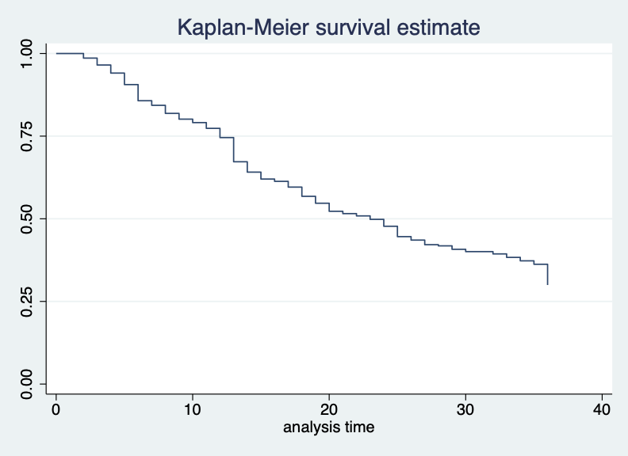

```{r setup, include=FALSE}
knitr::opts_chunk$set(echo = TRUE)
```

On May 4th, PMA and IPUMS PMA co-hosted a [Population Association of America 2021](https://www.populationassociation.org/paa-2021/home) virtual data workshop showcasing the new PMA [contraceptive calendar](https://pma.ipums.org/pma-action/variables/group?id=fem_cal) data available for these samples:

  * Burkina Faso 2020 
  * Congo (DR), Kinshasa 2019
  * Congo (DR), Kongo Central 2019
  * Kenya 2019
  * Nigeria, Kano 2019
  * Nigeria, Lagos 2019

These data represent contraceptive use, pregnancy, pregnancy termination, and birth information recalled by female respondents for each of several months preceding the PMA interview. Women sampled in Burkina Faso and Democratic Republic of the Congo were each asked to recall monthly information for up to 24 months, while women sampled from Kenya and Nigeria were asked to recall monthly information for up to 36 months. Their responses are recorded in a single comma delimited string, where information about each month is represented by one of the following codes: 

  * B = Birth
  * P = Pregnant
  * T = Pregnancy ended
  * 0 = No family planning method used
  * 1 = Female Sterilization
  * 2 = Male Sterilization
  * 3 = Implant
  * 4 = IUD
  * 5 = Injectables
  * 7 = Pill
  * 8 = Emergency Contraception
  * 9 = Male Condom
  * 10 = Female Condom
  * 11 = Diaphragm
  * 12 = Foam / Jelly
  * 13 = Standard Days / Cycle beads
  * 14 = LAM
  * 30 = Rhythm method
  * 31 = Withdrawal
  * 39 = Other traditional methods

In this video, PMA and IPUMS PMA explain the background behind contraceptive calendar data and show some of the ways you might consider using it in longitudinal analysis. We also give a conceptual overview of the steps **both R and Stata users** should take to reshape the data into a **long format**. After the overview, R and Stata users split into separate breakout sessions to work with a hands-on coding example using data from the Kenya 2019 sample; this example shows how to build a [Kaplan-Meier survival curve](https://en.wikipedia.org/wiki/Kaplan%E2%80%93Meier_estimator) for cohorts of women who were using the same family planning method in the first month of the contraceptive calendar.

<aside>
Check out our recent post on [migration recall data](../2021-04-15-migration-discovery/index.html) for information and practice with longitudinal data structures. The same 2019 and 2020 samples that contain contraceptive calendar data also include migration recall data.
</aside>

<br/>
<iframe src="https://www.youtube.com/embed/OkKVXspzH6k" height="315" title="YouTube video player" frameborder="0" allow="accelerometer; autoplay; clipboard-write; encrypted-media; gyroscope; picture-in-picture" allowfullscreen></iframe>
<br/>

<aside>
[Download Powerpoint slides here](event-materials/IPUMS_PMA_Webinar_Slides.pptx). A transcript of the chat from this session (including typed responses from the Q&A) is also available [here](event-materials/chat.txt) (participant names are redacted).
</aside>


# Breakout Session: R Users

R users can load a fixed-width IPUMS PMA data extract with help from the [ipumsr](http://tech.popdata.org/ipumsr/) package (if you're new to this blog, check out detailed instructions [here](file:///Users/Matt/R/pma-data-hub/docs/posts/2020-12-10-get-ipums-pma-data/index.html)). We also use packages from [tidyverse](https://tidyverse.tidyverse.org/) to reformat the data, as well as [survival](https://cran.r-project.org/web/packages/survival/index.html) and [ggfortify](https://cran.r-project.org/web/packages/ggfortify/index.html) for specific survival analysis functions. 

```{r, results='hide'}
library(ipumsr)
library(tidyverse)
library(survival)
library(ggfortify)
options(tibble.print_min = 20, tibble.min_extra_cols = 5)

dat <- read_ipums_micro(
  ddi = "data/pma_00001.xml",
  data = "data/pma_00001.dat.gz"
) 
```

<aside>
This code looks for my data file and DDI codebook in a folder called "data" inside of my R working directory. Make sure to change these paths as needed!
</aside>

When you open any IPUMS PMA data extract from the Household and Female Survey, you'll find the data organized with one respondent per row. Here, there are 9,549 rows each representing one female respondent (all other household members have been excluded):

```{r}
dat 
```

*For the purpose of this exercise only* we create a short identifying number for each respondent called `ID`. Then, we select only the variables `ID` and `CALENDARKE` (dropping all of the other variables pre-selected for every IPUMS PMA extract).

<aside>
In practice, you should use the variable `PERSONID` to track unique respondents; we use `ID` instead here only because it fits better on the screen. 
</aside>

```{r}
dat <- dat %>% 
  rowid_to_column("ID") %>% 
  select(ID, CALENDARKE)

dat
```

As you can see, `CALENDARKE` includes the response codes shown above, each separated by a comma. Each string contains 36 codes: these represent the 36 months from January 2017 through December 2019 (the last month in which Kenya 2019 samples were collected). The left-most code represents the *most recent available month*.

Some strings begin with a comma (i.e. the most recent month is blank). These are individuals who were interviewed in November 2019, rather than December. When we split the string into 36 columns, we must shift these individuals to the right, leaving a blank value in the left-most column (December 2019). For example, notice the blank value that appears in the new column `cal_ke36` for the person `ID == 2`. 

```{r}
dat <- dat %>% 
  separate(
    col = CALENDARKE,
    into = paste0("cal_ke", 36:1),
    fill = "left"
  ) 

dat
```

Let's now pivot the data from wide to long format so that we'll be able to mark *time* in a new column called `MONTH`. The argument `names_pattern` pulls the number from each variable starting with `cal_ke`, which we then put in the new column `MONTH`.

```{r}
options(tibble.print_min = 40)

dat <- dat %>% 
  pivot_longer(
    starts_with("cal_ke"),
    names_pattern = "cal_ke(.*)",
    names_to = "MONTH",
    values_to = "FP"
  ) 

dat
```

<aside>
Notice: each person `ID` now occupies 36 rows, so we increase the length of all printed dataframes to 40.
</aside>

We've now created a variable `FP` containing the original `CALENDARKE` variable codes. This variable will be much easier to work with if we 1) convert it into a factor, and 2) replace missing values with `NA` (e.g. month 36 for individuals interviewed in November 2018). We'll also coerce `MONTH` from a "character" to an "integer" class. 

```{r}
dat <- dat %>%
  mutate(
    MONTH = as.integer(MONTH),
    FP = FP %>%
      na_if("") %>%
      fct_recode(
        "Birth" = "B",
        "Pregnant" = "P",
        "Pregnancy ended" = "T",
        "No family planning method used" = "0",
        "Female Sterilization" = "1",
        "Male Sterilization" = "2",
        "Implant" = "3",
        "IUD" = "4",
        "Injectables" = "5",
        "Pill" = "7",
        "Emergency Contraception" = "8",
        "Male Condom" = "9",
        "Female Condom" = "10",
        "Diaphragm" = "11",
        "Foam / Jelly" = "12",
        "Standard Days / Cycle beads" = "13",
        "LAM" = "14",
        "Rhythm method" = "30",
        "Withdrawal" = "31",
        "Other traditional methods" = "39"
      )
  )

dat
```

We're now ready to begin our analysis. To keep our example simple, our survival curves will show the duration of **continuously used family planning methods** for cohorts of women who were using the same method in January 2017. These survival curves will *estimate the probability that an individual "survives" - or continues using - a given method at each of 36 months, assuming that she used it in month 1*. We'll exclude the duration of use after any break (for example, if a woman stopped using family planning to become pregnant, but then started again afterward). 

Let's begin with women who were using the contraceptive pill in January 2017. Remove all other women, saving those who remain as a sub-sample called `pills`:

```{r}
pills <- dat %>% 
  group_by(ID) %>% 
  mutate(use_m1 = case_when(FP == "Pill" & MONTH == 1 ~ TRUE) %>% any()) %>% 
  filter(use_m1)

pills 
```

The next several steps will help us remove every record for each woman *except for the last recorded month in which she used the pill*. For those whose last month is month 36, we will say she "survived" the full observation period.

To avoid re-entry cases (returning to use of the pill), we'll find the earliest month that a woman in this cohort was *not* using the pill. The month prior to this will be her `last_month` of using the pill. For the first person in this cohort `ID == 18`, for example, the `last_month` of use should be `MONTH == 24`.

```{r}
pills <- pills %>% 
  mutate(
    non_use_month = case_when(FP != "Pill" | is.na(FP) ~ MONTH),
    last_month = ifelse(
      all(is.na(non_use_month)),
      36,
      min(non_use_month, na.rm = T) - 1
    )
  ) 

pills
```

We must now identify whether the `last_month` represents cessation or right-censoring. Remember that a large number of women in our sample have missing values in the 36th month: they are *right-censored* at month 35 if they had been continuously using the pill until that time, so we cannot say that they ceased using at month 35! 

To make this easier, we'll create a logical variable `right_censored` that simply indicates whether each person is missing a value for `MONTH == 36`.

```{r}
pills <- pills %>% 
  mutate(right_censored = ifelse(MONTH == 36 & is.na(FP), T, F) %>% any())

pills 
```

We'll create another logical variable `ceased` to indicate whether each woman actually stopped using the pill at her `last_month`. If not (either because `last_month` is 36, or she is right-censored and `last_month` is 35), it will take the value `FALSE`.

```{r}
pills <- pills %>% 
  mutate(
    ceased = case_when(
      right_censored & last_month == 35 ~ F,
      last_month == 36 ~ F,
      last_month < 36 ~ T
    )
  ) %>% 
  select(ID, MONTH, FP, last_month, ceased)

pills
```

<aside>
For display purposes, we drop all variables except for `ID`, `MONTH`, `FP`, `last_month`, and `ceased`.
</aside>

Remove all rows except for the row containing each woman's `last_month`. The result will be a data frame where each woman in the `pills` cohort occupies *only one row*, which 1) shows her last month of recorded use and 2) indicates whether we know that she actually stopped using the pill in her last month.

```{r}
pills <- pills %>% filter(last_month == MONTH) 

pills
```

Let's now fit the Kaplan Meier estimator with `survfit`, which takes a survival object created by `Surv`. The function `summary` shows the survival probabilities at each month in a column called `survival`:

```{r}
pills <- survfit(Surv(last_month, ceased) ~ 1, data = pills)

summary(pills)
```

We can plot this with `autoplot`:

```{r, message=FALSE}
autoplot(
  pills,
  main = "Kaplan-Meier survival estimate: Pills",
  xlab = "Months",
  ylab = "Probability of Continuous Use",
  ylim = c(0, 1),
  censor = F
)
```

For additional examples using other family planning methods, [download the R Markdown script from this breakout session](event-materials/paa2021.Rmd). Video from the session is included below:

<br/>
<iframe width="560" height="315" src="https://www.youtube.com/embed/UZo_SfRr0sY" title="YouTube video player" frameborder="0" allow="accelerometer; autoplay; clipboard-write; encrypted-media; gyroscope; picture-in-picture" allowfullscreen></iframe>
<br/>

# Breakout Session: Stata Users

IPUMS PMA extracts for Stata should be decompressed before use and loaded with an appropriate filepath:

```
. clear
. use "[filepath]/pma_00001.dta"
. cd "[filepath]"
. set more off
```

<aside>
Remember to set your own filepath and change the name of your file to match your own data extract!
</aside>

As shown in the R example above, this dataset contains 9,549 rows where each row represents one respondent to the Female Questionnaire. You'll find a unique identification number for each respondent in `personid`, and their comma-separated contraceptive calendar strings in `calendarke`. We'll show these two variables for the first 3 respondents:

```
. list personid calendarke in 1/3

     +----------------------------------------------------------------------+
  1. |                                           personid                   |
     |                              404201900050442019002                   |
     |----------------------------------------------------------------------|
     | calendarke                                                           |
     |   0,0,B,P,P,P,P,P,P,P,P,0,0,0,0,0,0,0,0,0,0,0,0,3,3,3,3,3,3,3,3,3,.. |
     +----------------------------------------------------------------------+

     +----------------------------------------------------------------------+
  2. |                                           personid                   |
     |                              404201900009272019002                   |
     |----------------------------------------------------------------------|
     | calendarke                                                           |
     |   ,7,7,7,7,7,7,7,7,0,B,P,P,P,P,P,P,P,P,0,0,0,0,0,9,9,9,9,9,9,9,9,9.. |
     +----------------------------------------------------------------------+

     +----------------------------------------------------------------------+
  3. |                                           personid                   |
     |                              404201900099612019003                   |
     |----------------------------------------------------------------------|
     | calendarke                                                           |
     |   0,0,0,0,0,0,0,0,0,0,0,0,0,0,0,0,0,0,0,0,0,0,0,0,0,0,0,0,0,0,0,0,.. |
     +----------------------------------------------------------------------+
```

As you can see, `calendarke` includes the same contraceptive calendar codes shown above, each separated by a comma. Each string contains 36 codes: these represent the 36 months from January 2017 through December 2019 (the last month in which Kenya 2019 samples were collected). The left-most code represents the *most recent available month*. 

Notice the second listed person (`personid 404201900009272019002`); their `calendarke` string begins with a comma rather than a response code. This indicates a person who was interviewed in November 2019, rather than December. Because December 2019 would have been a future month for such a person, their first value is blank.

Split the `calendarke` string into 36 separate columns with the `split` function:

```
. split calendarke, p(,) gen(cal_ke)
variables created as string: 
cal_ke1   cal_ke7   cal_ke13  cal_ke19  cal_ke25  cal_ke31
cal_ke2   cal_ke8   cal_ke14  cal_ke20  cal_ke26  cal_ke32
cal_ke3   cal_ke9   cal_ke15  cal_ke21  cal_ke27  cal_ke33
cal_ke4   cal_ke10  cal_ke16  cal_ke22  cal_ke28  cal_ke34
cal_ke5   cal_ke11  cal_ke17  cal_ke23  cal_ke29  cal_ke35
cal_ke6   cal_ke12  cal_ke18  cal_ke24  cal_ke30  cal_ke36
```

Then, reshape the data from wide to long format as shown in the R example above. The index number for each month will pivot downward into a new column called `month`, and the woman's response code for each month will pivot downward into an adjacent column called `cal_ke`:

```
. reshape long cal_ke, i(personid) j(month)
(note: j = 1 2 3 4 5 6 7 8 9 10 11 12 13 14 15 16 17 18 19 20 21 22 23 24 25 
> 26 27 28 29 30 31 32 33 34 35 36)

Data                               wide   ->   long
-----------------------------------------------------------------------------
Number of obs.                     9549   ->  343764
Number of variables                  52   ->      18
j variable (36 values)                    ->   month
xij variables:
           cal_ke1 cal_ke2 ... cal_ke36   ->   cal_ke
-----------------------------------------------------------------------------
```

Notice that the dataset now has 343,764 rows, where each of our 9,549 respondents occupies 36 rows apiece (one for each `month`). 

By default, Stata numbered each month in increasing order from left to right. As we've discussed, however, the contraceptive calendar data are chronologically organized from right to left (the most recent month is stored in the first month of the `calendarke` string). We suggest renumbering the `cal_ke` variables here so that `cal_ke1` represents the first month, January 2017.

```
. replace month = 37 - month
(343,764 real changes made)
. sort personid month
```

You might also find it useful to create century month codes `cmc` for each month, beginning with 1405 for January 2017.

```
. gen cmc = month + 1404
```

As a final clean-up step, we create a numeric version of `cal_ke` called `numcal_ke` by changing the codes for pregnancy, pregnancy termination, and birth to `90`, `91`, and `92` respectively. We then provide labels to each of the values in `numcal_ke`.

```
. gen numcal_ke = cal_ke
(3,755 missing values generated)
. replace numcal_ke = "90" if numcal_ke == "P"
(24,364 real changes made)
. replace numcal_ke = "91" if numcal_ke == "T"
(341 real changes made)
. replace numcal_ke = "92" if numcal_ke == "B"
(2,934 real changes made)
. destring numcal_ke, replace
numcal_ke: all characters numeric; replaced as byte
(3755 missing values generated)

. label define calendar 92 "Birth" 90 "Pregnant" 91 "Pregnancy ended" 0 "No 
> family planning method used" 1 "Female Sterilization" 2 "Male Sterilization" 3 
> "Implant" 4 "IUD" 5 "Injectables" 7 "Pill" 8 "Emergency Contraception" 9 "Male 
> Condom" 10 "Female Condom" 11 "Diaphragm" 12 "Foam / Jelly" 13 "Standard Days / 
> Cycle beads" 14 "LAM" 30 "Rhythm method" 31 "Withdrawal" 39 "Other traditional 
> methods"

. label values numcal_ke calendar
```

Finally, we're ready to begin our analysis. As with the R example above, we'll create survival curves showing the duration of **continuously used family planning methods** for cohorts of women who were using the same method in January 2017. These curves will *estimate the probability that an individual "survives" - or continues using - a given method at each of 36 months, assuming that she used it in month 1*. We'll exclude the duration of use after any break (for example, if a woman stopped using family planning to become pregnant, but then started again afterward). 

Consider the cohort of women who were all using the contraceptive pill in January 2017 (month 1). We'll flag these cases and include all rows from those women in a sub-sample called `pill_sample`:

```
. recode numcal_ke (7=1) (else=0), gen(pill)
(162306 differences between numcal_ke and pill)
. gen pill_temp = 0 
. replace pill_temp = 1 if pill == 1 & month == 1
(287 real changes made)
. egen pill_sample = max(pill_temp), by(personid)
```

The function `stset` establishes the data in memory as "survival-time" data, where the variable `month` records time in months, the identification number for each person is provided by `id(personid)`, and cessation of use (i.e. `failure`) is marked by the first instance where `pill==0` for each person in the sub-sample.

```
. stset month, id(personid) failure(pill==0)

                id:  personid
     failure event:  pill == 0
obs. time interval:  (month[_n-1], month]
 exit on or before:  failure

-----------------------------------------------------------------------------
> -
    343,764  total observations
    328,001  observations begin on or after (first) failure
-----------------------------------------------------------------------------
> -
     15,763  observations remaining, representing
      9,549  subjects
      9,463  failures in single-failure-per-subject data
     15,763  total analysis time at risk and under observation
                                                at risk from t =         0
                                     earliest observed entry t =         0
                                          last observed exit t =        36
```

The function `sts list` produces a similar table to the one produced by `summary(pills)` in the R example above. The column `Survivor Function` estimates the probability of "surviving" - or continuously using - the pill at each month shown in the column `Time`. 


```
.  sts list if pill_sample == 1

         failure _d:  pill == 0
   analysis time _t:  month
                 id:  personid

           Beg.          Net            Survivor      Std.
  Time    Total   Fail   Lost           Function     Error     [95% Conf. Int.]
-------------------------------------------------------------------------------
     2      287      4      0             0.9861    0.0069     0.9633    0.9947
     3      283      6      0             0.9652    0.0108     0.9362    0.9811
     4      277      7      0             0.9408    0.0139     0.9064    0.9628
     5      270     10      0             0.9059    0.0172     0.8658    0.9345
     6      260     14      0             0.8571    0.0207     0.8111    0.8927
     7      246      4      0             0.8432    0.0215     0.7957    0.8805
     8      242      7      0             0.8188    0.0227     0.7692    0.8588
     9      235      5      0             0.8014    0.0235     0.7504    0.8431
    10      230      3      0             0.7909    0.0240     0.7392    0.8336
    11      227      5      0             0.7735    0.0247     0.7206    0.8177
    12      222      8      0             0.7456    0.0257     0.6911    0.7920
    13      214     21      0             0.6725    0.0277     0.6149    0.7234
    14      193      9      0             0.6411    0.0283     0.5827    0.6936
    15      184      6      0             0.6202    0.0286     0.5614    0.6735
    16      178      2      0             0.6132    0.0287     0.5543    0.6668
    17      176      5      0             0.5958    0.0290     0.5366    0.6500
    18      171      8      0             0.5679    0.0292     0.5085    0.6229
    19      163      6      0             0.5470    0.0294     0.4876    0.6025
    20      157      7      0             0.5226    0.0295     0.4633    0.5786
    21      150      2      0             0.5157    0.0295     0.4564    0.5717
    22      148      2      0             0.5087    0.0295     0.4495    0.5648
    23      146      3      0             0.4983    0.0295     0.4391    0.5545
    24      143      6      0             0.4774    0.0295     0.4185    0.5337
    25      137      9      0             0.4460    0.0293     0.3878    0.5024
    26      128      3      0             0.4355    0.0293     0.3776    0.4920
    27      125      4      0             0.4216    0.0291     0.3641    0.4779
    28      121      1      0             0.4181    0.0291     0.3607    0.4744
    29      120      3      0             0.4077    0.0290     0.3506    0.4639
    30      117      2      0             0.4007    0.0289     0.3438    0.4568
    32      115      2      0             0.3937    0.0288     0.3371    0.4498
    33      113      3      0             0.3833    0.0287     0.3271    0.4391
    34      110      3      0             0.3728    0.0285     0.3170    0.4285
    35      107      3      0             0.3624    0.0284     0.3070    0.4178
    36      104     18     86             0.2997    0.0270     0.2477    0.3532
-------------------------------------------------------------------------------
```

A survival curve representing this table can be made with:

```
sts graph if pill_sample == 1
```

```{r, echo=FALSE}

```

<aside>
This plot is similar to the one generated by `autoplot` in R, except that 1) it does not include a shaded 95% confidence interval, and 2) right-censored cases are not excluded, producing a sharp downward turn in month 36. 
</aside>

For additional examples using other family planning methods, [download the Stata .do file from this breakout session here](event-materials/paa_2021_side_event.do). Video from the session is included below:

<br/>
<iframe width="560" height="315" src="https://www.youtube.com/embed/g0RSRqPXx7Q" title="YouTube video player" frameborder="0" allow="accelerometer; autoplay; clipboard-write; encrypted-media; gyroscope; picture-in-picture" allowfullscreen></iframe>
<br/>

# Download Links

  * [Powerpoint Slides](event-materials/IPUMS_PMA_Webinar_Slides.pptx)
  * [R Markdown Script](event-materials/paa2021.Rmd)
  * [Stata .do File](event-materials/paa_2021_side_event.do)
  * [Chat Transcript](event-materials/chat.txt) (participant names are redacted)