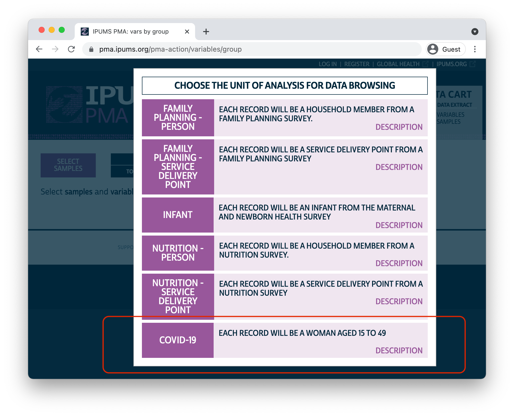
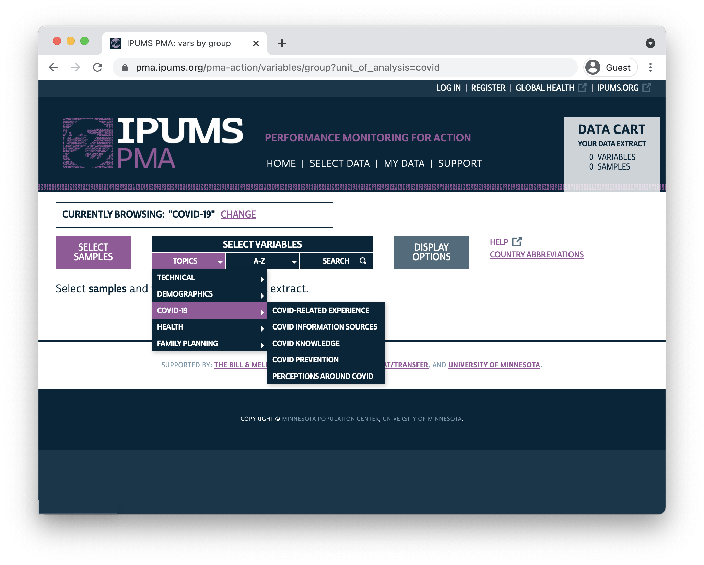

```{r hidden, include = FALSE}
knitr::opts_chunk$set(echo = TRUE)

v <- function(var){
  paste0("(https://pma.ipums.org/pma-action/variables/", substitute(var), ")")
}
```

The COVID-19 pandemic has strained healthcare systems across the globe, and researchers are already beginning to examine the short-term impacts of service disruption on family planning and reproductive health.^[For discussion, see [@Senderowicz2020-gj], [@Temmerman2021-ay], and [@Ferreira-Filho2020-ng].] This spring, IPUMS PMA released [COVID-19 survey data]`r v('group?unit_of_analysis=covid')` collected from reproductive age women between May and August 2020 in these countries:

  * Burkina Faso
  * Democratic Republic of Congo (DRC) 
  * Kenya
  * Nigeria 
  
<aside>
```{r, echo=F}
knitr::include_graphics("../../images/new_data.png")
```
</aside>

These women are participants in an **ongoing panel study** focused on core PMA topics in reproductive health. The baseline survey data for this study have already been released, and we will demonstrate how to link records between the baseline survey and the COVID-19 follow-up in an upcoming post [in this series](../../index.html#category:COVID-19). Subsequent waves of the panel study will help to show how **women's backgrounds and levels of knowledge, perceptions, and experiences with COVID-19 shape long-term family planning outcomes**. 

<aside>
[Click here](https://www.pmadata.org/technical-areas/covid-19) for more information on the COVID-19 Survey design, and to learn how it fits with the ongoing panel study.
</aside>

In this post, we'll cover the contents of the PMA COVID-19 survey. If you're a [registered IPUMS PMA user](https://pma.ipums.org/pma/register.shtml), you can obtain COVID-19 survey data by navigating to the new COVID-19 "Unit of Analysis".

```{r, echo = FALSE}

```

<aside>
[Click here](../2020-12-10-get-ipums-pma-data/index.html) for help creating, downloading, and importing an IPUMS PMA data extract into R.
</aside>

# Sample Design 

The PMA COVID-19 survey is a follow-up telephone survey administered to women who participated in an in-person baseline survey for a broader panel study. This baseline survey was collected between November 2019 and Februrary 2020 - prior to the appearance of COVID-19 in most countries. 

When the outbreak of COVID-19 grew into a global pandemic in the spring of 2020, PMA representatives partnered with the Ministries of Health in DRC, Kenya, Burkina Faso, and Nigeria to design a shorter - approximately 30 minute - survey responding directly to the effect of COVID-19 on women and their households. 

<aside>
Several countries participating in the new PMA panel study had not completed baseline sample collection by March 2020 (Uganda, India, Niger, Cote d'Ivoire). 
</aside>

Women were selected for the baseline survey if they were age 15-49 and resided in a household screened at random from a sample cluster represented by [EAID]`r v(EAID)`. All women surveyed at baseline where eligible to participate in the COVID-19 follow-up, provided that they 1) agreed to the interview, and 2) owned or had access to a telephone. 

<aside>
<br>A COVID-19 module was incorporated into their baseline surveys in late 2020, but these data have not yet been released.
</aside>

You'll find survey weights *adjusted for the probability that a given woman had access to a telephone* recorded in the new variable [CVQWEIGHT]`r v(CVQWEIGHT)`. This weight is normalized for the target population of each sample (note that two of the samples are not nationally representative):

  * Burkina Faso: nationally representative
  * Kenya: nationally representative
  * DRC: Kinshasa only  
  * Nigeria: Lagos and Kano only

You'll find more detail about the construction of PMA COVID-19 survey weights [here](https://pma.ipums.org/pma/resources/documentation/COVID_Survey_Weight_Construction_Memo.pdf). For information about response rates for each sample, check out sample-specific [Dataset Notes](https://pma.ipums.org/pma/enum_materials.shtml). 

# Topics

The COVID-19 survey included a number of questions that you'll also find in the baseline survey and in future rounds of the panel study. These include topics like [fertility preferences]`r v("group?id=fem_pref")`, [current or recent use of family planning]`r v("group?id=fem_fpuc")`, and core [demographic information]`r v("group?id=fem_coredem")`. You might use these variables, for example, to see if women who were using a particular contraceptive method at the time of the baseline survey had stopped using that method during the first few months of the COVID-19 outbreak.

Variables from the remainder of the COVID-19 questionnaire are organized on the IPUMS PMA website under 6 topic headings:

  1. [Healthcare Access]`r v("group?id=fem_hcacc")`
  2. [COVID-related Experience]`r v("group?id=fem_cvexp")`
  3. [COVID Information Sources]`r v("group?id=fem_cvinfo")`
  4. [COVID Knowledge]`r v("group?id=fem_cvk")`
  5. [COVID Prevention]`r v("group?id=fem_cvprev")`
  6. [Perceptions Around COVID]`r v("group?id=fem_cvperc")`
  
```{r, echo = FALSE}

```

## Healthcare Access 

All sampled women report whether they have needed to visit a health facility since COVID-19 restrictions began - including family planning visits - in [CVFACVISIT]`r v(CVFACVISIT)`. Additionally, all sampled women report whether they experienced any of the following **difficulties accessing healthcare services** during the same time period (select all that apply, or none):

  * [facility closed / no appointment available]`r v(HLTHCAREDIFFCLOSED)`
  * [not affordable]`r v(HLTHCAREDIFFCOST)`
  * [partner does not approve]`r v(HLTHCAREDIFFHUSOPP)`
  * [no available transportation]`r v(HLTHCAREDIFFNOTRANS)`
  * [government restrictions on movement]`r v(HLTHCAREDIFFRESTRICT)`
  * [fear of being infected with COVID-19 at healthcare facilities]`r v(HLTHCAREDIFFFEAR)`

Finally, women who *did* visit a healthcare facility since COVID-19 restrictions began report whether they successfully accessed needed services in [HCACCESS]`r v(HCACCESS)`.

## COVID-related Experience

In addition to their own experiences accessing healthcare during the outbreak, women who confirmed that [they had heard or read about COVID-19]`r v(COVIDINFO)` were also asked to report the impact of the virus on their **communities** and in their **households**.

Specifically, these women were asked to estimate whether most, some, few, or no [people in their community had been infected]`r v(COMMCOVID)`, and whether any [close relatives or friends]`r v(COVIDFAM)` had been infected. They were also asked to rate their [level on concern]`r v(COMMCOVIDWORRY)` about the spread of COVID-19 in their community. 

You'll find several measures related to household-level impacts, including indicators for whether anyone in the woman's household experienced [food insecurity]`r v(LACKFOODDAY)`, and whether the the household had experienced [income loss]`r v(HHINCOMELOSSAMT)`. Related questions measure changes in married / partnered women's autonomy during the outbreak, including whether they became [more or less reliant on their partner]`r v(CVECONDEP)` for basic needs (if at all), and whether they or their partner now makes [decisions about household purchases]`r v(CVBUYDECIDER)`.

## COVID Information Sources

Women who confirmed that [they had heard or read about COVID-19]`r v(COVIDINFO)` were also asked about several different sources of information about COVID-19. For each source of information, women were asked both: 

  1. whether they had **learned about** COVID-19 from the source, and
  2. whether they **trust** the source for accurate information about COVID-19
  
13 sources of information were listed (select all that apply, or none):

  1. Newspaper
  2. Radio
  3. Television
  4. Poster / billboard
  5. Town crier
  6. Phone message
  7. Family
  8. Friends / neighbors
  9. Community/religious leaders
  10. Social media (Twitter, Facebook, WhatsApp)
  11. Health personnel
  12. Messages from government or authorities
  13. School
  
<aside>
Notably, all four samples used the same list of information sources.
</aside>

You'll also find variables in this topic heading related to [awareness]`r v(KNOWCALLCENTER)`, [trust]`r v(TRUSTCALLCENTER)`, and [use]`r v(TRIEDCALLCENTER)` of an **emergency number or call center** for reporting suspected cases of COVID-19.

## COVID Knowledge

Women who confirmed that [they had heard or read about COVID-19]`r v(COVIDINFO)` were asked to identify **common symptoms** of COVID-19 from this list (select all that apply, or none):

  * [Fever]`r v(CVSYMFEVER)`
  * [Cough]`r v(CVSYMCOUGH)`
  * [Shortness of breath/difficulty breathing]`r v(CVSYMBREATH)`
  * [Chest pain]`r v(CVSYMCHESTPAIN)`
  * [Sore throat]`r v(CVSYMSORETHRT)`
  * [Runny or stuffy nose]`r v(CVSYMSTUFFNOSE)`
  * [Muscle or body aches]`r v(CVSYMACHE)`
  * [Headaches]`r v(CVSYMHEADACHE)`
  * [Fatigue (tiredness)]`r v(CVSYMFATIGUE)`
  * [Diarrhea]`r v(CVSYMDIAR)`
  * [Loss of taste]`r v(CVSYMTASTE)`
  * [Loss of smell]`r v(CVSYMSMELL)`
  * [Rash]`r v(CVSYMRASH)`
  * [Dizziness]`r v(CVSYMDIZZY)`
  * [Sneezing]`r v(CVSYMSNEEZE)`
  * [Other]`r v(CVSYMOTH)`

These women were also asked whether any of the following actions **could reduce the risk of being infected** (available responses are "yes", "no", or "do not know" for each action):

  * [Washing hands with soap and water frequently]`r v(PREVWASHHANDS)`
  * [Washing hands with hand sanitizer frequently]`r v(PREVSANITIZER)`
  * [Avoiding any close contact (2 meters) with people when you go out]`r v(PREVDISTANCE)`
  * [Staying in your home]`r v(PREVSTAYHOME)`
  * [Getting vaccinated]`r v(PREVVACC)`
  * [Traditional practices]`r v(PREVTRADITION)`
  * [Wearing something that covers your mouth and nose when you go out (a mask)]`r v(PREVMASK)`
  * [Avoiding shaking hands with others]`r v(PREVHANDSHAKE)`
  * [Coughing/sneezing into your elbow or tissue]`r v(PREVELBOWCGH)`
  * [Prayer]`r v(PREVPRAYER)`

## COVID Prevention

Women who confirmed that [they had heard or read about COVID-19]`r v(COVIDINFO)` were asked if they had [personally taken any action to prevent becoming infected]`r v(COVIDPREVENT)`. If so, they were asked which of the following **actions they had personally taken** (select all that apply):

  * [Washing hands with soap and water frequently]`r v(SELFWASHHANDS)`
  * [Washing hands with hand sanitizer frequently]`r v(SELFSANITIZER)`
  * [Avoiding any close contact (2 meters) with people when you go out]`r v(SELFDIST)`
  * [Staying in your home]`r v(SELFSTAYHOME)`
  * [Getting vaccinated]`r v(SELFVACC)`
  * [Traditional practices]`r v(SELFTRADITION)`
  * [Wearing something that covers your mouth and nose when you go out (a mask)]`r v(SELFMASK)`
  * [Avoiding shaking hands with others]`r v(SELFHANDSHAKE)`
  * [Coughing/sneezing into your elbow or tissue]`r v(SELFELBOWCH)`
  * [Prayer]`r v(SELFPRAYER)`
  * [Other]`r v(SELFOTH)`
  
Women who confirmed that [they had heard or read about COVID-19]`r v(COVIDINFO)` were also asked if they [were able to avoid contact with people outside of their own household]`r v(CANDISTANCE)`. If not, they were asked if any of the following reasons explained **why they might not be able to avoid contact** (select all that apply, or none): 

  * [My work or way of earning money requires me to leave the house]`r v(CANTDISTJOB)`
  * [I need to visit the market]`r v(CANTDISTSHOP)`
  * [I need to visit the water source / well]`r v(CANTDISTWATER)`
  * [My studies require me to leave the household]`r v(CANTDISTSCHOOL)`
  * [I need to attend funerals in the community]`r v(CANTDISTFUNERAL)`
  * [I need to attend religious services]`r v(CANTDISTCHURCH)`
  * [I need to visit my family/relatives]`r v(CANTDISTFAM)`
  * [To seek out health care]`r v(CANTDISTHEALTH)`

## Perceptions Around COVID

Women who confirmed that [they had heard or read about COVID-19]`r v(COVIDINFO)` were asked several questions about their overall level of concern about COVID-19, including how [concerned they were about getting infected]`r v(COVIDCONCERN)`, whether they were worried about the [impact of COVID-19 on their household's finances]`r v(INCOMELOSSWORRY)` in the future, and whether they would [conceal information about a family member's COVID-19 infection]`r v(FAMSICKSECRET)`.

These women were also asked whether each of the **following statements are true** about COVID-19 (available responses are "yes", "no", or "don't know" for each statement):

  * [Some people cannot be infected with Coronavirus (COVID-19)]`r v(CVIMMUNE)`
  * [Most people experience mild or no symptoms]`r v(CVMILDSYMP)`
  * [Most people develop serious illness requiring hospitalization]`r v(CVSERIOUSSYMP)`
  * [People can be infected and not have symptoms]`r v(CVNOSYMP)`
  * [Only people with symptoms are contagious]`r v(SPREADCVSYMP)`
  * [You can become infected by shaking hands with someone who is infected]`r v(CVHANDSHAKE)`
  * [You can become infected by close contact with infected people even if you are not touching]`r v(CVCLOSE)`
  * [People of all ages can become infected]`r v(CVALLAGES)`
  * [Coronavirus (COVID-19) is mostly a risk to rich people]`r v(COVIDRICH)`
   
   
# Next Steps

For the next two months, we'll be taking a deep dive into the PMA COVID-19 survey data. Along the way, we'll showcase several examples of R code you can use to create publication-ready tables and data visualizations, and we'll explore some of the research questions you might answer by linking COVID-19 data to the baseline survey. Check back [here](../../index.html#category:COVID-19) for a new post every two weeks!