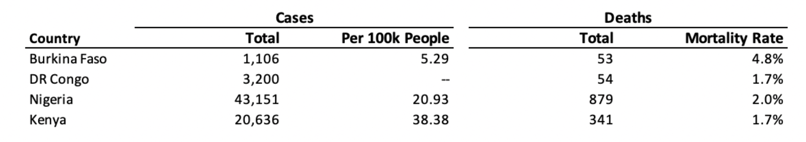

```{r setup, include=FALSE}
library(tidyverse)
library(ipumsr)
library(srvyr)
library(ggradar)

knitr::opts_chunk$set(echo = TRUE)

covid <- read_ipums_micro(
  ddi = "data/pma_00032.xml",
  dat = "data/pma_00032.dat.gz"
)

baseline <- read_ipums_micro(
  ddi = "data/pma_00033.xml",
  dat = "data/pma_00033.dat.gz"
)
``` 

# Which variables come from the same question?

```{r}
repeats <- list(
  # Thinks X
  thinks  = covid %>% 
    map(~ipums_var_label(.x)) %>% 
    keep(~grepl(.x, pattern = "Thinks")) %>% 
    names(),
  
  # Difficulty accessing healthcare 
  diff = covid %>% 
    select(starts_with("HLTHCAREDIFF")) %>% 
    names(),
  
  # Why unable to distance
  dist = covid %>% 
    select(starts_with("CANTDIST")) %>% 
    names(),
  
  # Self
  self = covid %>% 
    select(starts_with("SELF"), -SELFINCOMELOSSAMT) %>% 
    names(),
  
  # Can reduce Covid-19 risk by:
  reduce  = covid %>% 
    select(starts_with("PREV")) %>% 
    names(),
  
  # Common Covid-19 symptoms:
  symp = covid %>% 
    select(starts_with("CVSYM")) %>% 
    names(),
  
  # Trust
  trust  = covid %>% 
    select(starts_with("CVTRUST")) %>% 
    names(),
  
  # Source
  learn = covid %>% 
    select(starts_with("CVLEARN")) %>% 
    names(),
  
  # Current use of FP
  fpnow = covid %>% 
    select(starts_with("FPNOWUS")) %>% 
    names()
)

alones <- covid %>% 
  names() %>% 
  keep(~{!.x %in% unlist(repeats)})
```

# Can we link women from baseline?

```{r}
baseline %>% 
  select(PERSONIDORIG, FQINSTID, PERSONID)

covid %>% 
  select(FQINSTID)

covid %>% count(FQINSTID) %>% arrange(desc(n))
baseline %>% count(FQINSTID) %>% arrange(desc(n))
any(!covid$FQINSTID %in% baseline$FQINSTID)
any(!baseline$FQINSTID %in% covid$FQINSTID)
```

```{r}
spiders <- covid %>% 
  as_survey_design() %>% 
  group_by(group = as_factor(COUNTRY) %>% as.character) %>% 
  summarise(across(
    starts_with("CVTRUST"), 
    ~survey_mean(.x == 1, vartype = NULL)
  )) 

spiders %>% 
  ggradar( 
    plot.legend = T,
    grid.label.size = 3,
    legend.text.size = 5,
    axis.label.size = 2,
    group.point.size = 0, 
    group.line.width = 0.5, 
    base.size = 1
  ) 
  
```

# Draft

If you would like to use any of the code you find in this post, you'll need to install and load the packages [tidyverse](https://tidyverse.tidyverse.org/), [ipumsr](http://tech.popdata.org/ipumsr/), [srvyr](http://gdfe.co/srvyr/index.html), and [gtsummary](http://www.danieldsjoberg.com/gtsummary/index.html). Then, use `read_ipums_micro` to load the data extract you download from the IPUMS PMA website (be sure to change the file paths shown below):

```{r setup, results='hide'}
library(tidyverse)
library(ipumsr)
library(srvyr)
library(gtsummary)

covid <- read_ipums_micro(
  ddi = "data/pma_00032.xml",
  dat = "data/pma_00032.dat.gz"
)
``` 

For the purpose of generating helpful data visualizations in this post, we'll take two additional data processing steps: 

  1. We'll collapse all missing values as `NA` values
  2. We'll convert all `labelled` variables^[We make an exception for `AGE`, which will be treated as an integer without labels] into `factor` variables and drop unused labels
  
```{r}
covid <- covid %>% 
  mutate(
    AGE = zap_labels(AGE),
    across(
      where(is.labelled), 
      ~.x %>% 
        lbl_na_if(
          ~.lbl %in% c(
            "Not interviewed (female questionnaire)",
            "Don't know",
            "No response or missing",
            "NIU (not in universe)"
          )
        ) %>% 
        as_factor() %>% 
        fct_drop()
  ))
```

<aside>
R shows the *value* of each variable in graphics produced by `ggplot2`. By converting labelled variables into factor variables, we adopt each variable's *label* as its value.
</aside>

# Samples 

## Context and Demographics

The four countries represented in the PMA COVID-19 data each adopted various measures to prevent the spread of the virus *prior to the date of the interview*. In all four countries, the first lockdown measures were implemented in March 2020. Although the details of lockdown measures varied slightly, the measures included closing of schools and some workplaces, local requirements to not leave home with few exceptions, and nationwide banning of arrivals from all regions for about two to three months. Figure 1 indicates the number of reported COVID-19 cases and deaths in the four countries as of July 31, 2020. The number of COVID-19 cases differs by country, with Kenya having the highest number of cases per 100,000 people among the four countries. 

```{r, echo = FALSE, fig.cap="DOMO Coronovirus Tracker, 2021:  https://www.domo.com/covid19/data-explorer/all/ ", out.extra="class=external"}

```

Each of the four PMA COVID-19 samples were collected between May and August 2020. Women who had participated in the baseline panel survey (collected between November 2019 and February 2020) were interviewed by phone for the COVID-19 follow-up. All participants were between ages 15 and 49 at the time of baseline survey collection. 

Here, we use functions from the handy [gtsummary](http://www.danieldsjoberg.com/gtsummary/index.html) package to examine the age, marital status, education level, urban vs rural status, and total number of sampled women in each country:

```{r}
covid %>% 
  select(AGE, MARSTAT, EDUCATTGEN, URBAN, COUNTRY) %>% 
  mutate(N = 1) %>% 
  tbl_summary(
    by = COUNTRY,
    missing = "no",
    stat = list(
      all_continuous() ~ "{mean} ({sd})",
      all_categorical() ~"{p}",
      N ~ "{N}"
    ),
    label = list(
      AGE ~ "Mean Age (SD)",
      MARSTAT ~ "Marital status (%)",
      EDUCATTGEN ~ "Education (%)",
      URBAN ~ "Urban vs Rural Status (%)",
      N ~ "Observations"
    )
  ) %>% 
  modify_header(
    update = list(
      label ~ " ",
      stat_1 ~ "**Burkina Faso**",
      stat_2 ~ "**DR Congo**",
      stat_3 ~ "**Kenya**",
      stat_4 ~ "**Nigeria**"
    )
  ) %>% 
  modify_footnote(update = everything() ~ NA) %>% 
  italicize_labels()
```

In all countries except the Democratic Republic of Congo (DRC), the majority of the respondents were married or living with a man. In the DRC, the vast majority of respondents had higher secondary or more education (97%); by contrast, a majority of respondents in Burkina Faso had less than a secondary level of education (54%). This discrepancy may be the result of the country context of cell phone ownership.

## Survey Weights and Population Inference

Like the baseline survey, the COVID-19 survey contains a normalized survey weight representing the inverse probability that a woman from a given population would **1)** be selected for sampling in the baseline survey, and **2)** own or have access to a phone, and could therefore participate in the COVID-19 follow-up. You can read more about the construction of these weights [here](https://pma.ipums.org/pma/resources/documentation/COVID_Survey_Weight_Construction_Memo.pdf). 

The variable [CVQWEIGHT]`r v(CVQWEIGHT)` contains these calculated weights, and may be used to generate population-level proportions for each variable and in most modeling applications. We recommend use of the [survey](http://r-survey.r-forge.r-project.org/survey/) package - and its tidyverse aligned companion [srvyr](http://gdfe.co/srvyr/index.html) - for specifying weights and generating cluster-robust standard error estimates via [EAID]`r v(EAID)`. For example:

```{r}
covid %>% 
  as_survey_design(
    weights = CVQWEIGHT,
    id = EAID
  ) %>% 
  group_by(COUNTRY, COVIDCONCERN) %>% 
  summarise(POP_PROP = survey_mean())
```

<aside>
In this example, `POP_PROP` shows the estimated proportion for each response in the target population, while `POP_PROP_se` shows the cluster-robust standard error estimate for each proportion.
</aside>

**Note: only the Burkina Faso and Kenya samples are designed to be nationally representative!** Survey weights are normalized at the following administrative levels for the DRC and Nigeria samples:

  * Nigeria: Lagos and Kano only
  * DRC: Kinshasa only

# Survey Topics

The COVID-19 survey covers 5 substantive topics (presented by order of appearance on the questionnaire administered to all four samples):

  1. COVID-19 Information Sources
  2. COVID-19 Risk Perception
  3. COVID-19 Symptoms and Transmission
  4. COVID-19 Social Consequences
  5. COVID-19 and Family Planning

# COVID-19 Information Sources

Variables in the [COVID-19 Information Sources]`r v('group?id=fem_cvinfo')` group contain information related to: 

  * [how much]`r v(COVIDINFO)` each woman has heard or read about COVID-19
  * whether [she knows about]`r v(KNOWCALLCENTER)`, [has used]`r v(TRIEDCALLCENTER)`, and [trusts]`r v(TRUSTCALLCENTER)` an emergency number / call center for reporting suspected COVID-19 cases
  * whether she learned about COVID-19 from any of 13 sources
  * which of the same 13 sources she trusts for accurate information about COVID-19 

The same 13 sources of information were listed in all four countries. They range from more formal/official (e.g. radio and government authorities) to more informal/unofficial (e.g. family and friends/neighbors). Users might choose to explore relationships between types of information sources and trust in sources across or within countries.

Weighted percentages of women across the four countries who had heard or read about COVID-19 from each information source are displayed below. *Respondents could report more than one source of information.*

```{r temp}
knitr::opts_chunk$set(eval = FALSE)
```

```{r, layout="l-page"}
sources <- covid %>% 
  mutate(across(
    starts_with("CVLEARN") | starts_with("CVTRUST"),
    ~(.x == "Yes")
  )) %>% 
  as_survey_design(weight = CVQWEIGHT) %>%
  group_by(COUNTRY) %>% 
  summarise(across(
    starts_with("CVLEARN") | starts_with("CVTRUST"), 
      ~survey_mean(.x, vartype = NULL, na.rm = T)
  )) %>% 
  pivot_longer(
    !COUNTRY,
    names_pattern = "CV(LEARN|TRUST)(.*)",
    names_to = c("QUESTION", "SOURCE"),
    values_to = "PCT"
  ) %>% 
  mutate(across(is_character, ~as_factor(.x)))

sources %>% 
  filter(QUESTION == "LEARN") %>% 
  mutate(SOURCE = SOURCE %>% fct_reorder(PCT, mean)) %>%
  ggplot(aes(fill = COUNTRY, y = PCT, x = SOURCE)) + 
  geom_bar(position = "dodge", stat = "identity") + 
  ggtitle("How did you learn about COIVD-19?") + 
  scale_fill_viridis_d() + 
  theme_minimal() + 
  theme(
    plot.title = element_text(size = 14),
    text = element_text(size = 8),
    axis.text.x = element_text(angle=45,hjust=1)
  ) 

sources %>% 
  filter(QUESTION == "TRUST") %>% 
  mutate(SOURCE = SOURCE %>% fct_reorder(PCT, mean)) %>%
  ggplot(aes(fill = COUNTRY, y = PCT, x = SOURCE)) + 
  geom_bar(position = "dodge", stat = "identity") + 
  ggtitle("Which of these sources do you trust for accurate information about Coronavirus (COVID-19)?") + 
  scale_fill_viridis_d() + 
  theme_minimal() + 
  theme(
    plot.title = element_text(size = 14),
    text = element_text(size = 8),
    axis.text.x = element_text(angle=45,hjust=1)
  ) 
```

Radio and television were the most common sources of COVID-19 information overall. Perhaps surprisingly, only a small percentage of women in all countries reported hearing about COVID-19 through health personnel and government authorities. Compared to women in other countries, women in Burkina Faso reported receiving COVID-19 information from fewer sources overall and reported hearing about COVID-19 through the television much less than women in other countries. 

Weighted percentages of women across the four countries who trust each source for accurate COVID-19 information are displayed below. Note that women were asked how much they trusted each source regardless of whether they reported having received COVID-19 information from that source.

```{r, layout="l-page"}
covid %>% 
  mutate(across(
    starts_with("CVTRUST"), 
    ~lbl_collapse(.x, ~ifelse(.val == 2, 0, .val))
  ))  %>% 
  filter(CVTRUSTGOV < 90) %>% 
  as_survey_design(weight = CVQWEIGHT) %>% 
  group_by(COUNTRY) %>% 
  summarise(
    across(
      starts_with("CVTRUST"), # makes one for every CVTRUST variable
      ~survey_mean(.x, vartype = NULL)
    )
  ) %>% 
  pivot_longer(
    starts_with("CVTRUST"),
    names_pattern = "CVTRUST(.*)",
    names_to = "source",
    values_to = "percentage"
  ) %>%
  ungroup() %>%
  mutate(COUNTRY = as_factor(COUNTRY)) %>% 
  ggplot(aes(fill = COUNTRY, y = percentage, x = source)) + 
  ggtitle("Trust in Covid-19 Information Sources") +
  geom_bar(position = "dodge", stat = "identity") + 
  theme(
    text = element_text(size = 8),
    axis.text.x = element_text(angle=45,hjust=1)
  )

```

Along with being the most common sources of COVID-19 information, radio and television were also highly trusted sources. Despite government authorities and health personnel being less common sources of COVID-19 information, they were highly trusted sources--particularly in Burkina Faso. Women in Burkina Faso report more overall trust across sources as compared to women in other countries.

Users could dig deeper into relationships between information source variables and trust variables by including variables in other groups--such as Core Demographics or Perceptions around COVID--to glean insight into how other differences in characteristics like age, marital status, and level of concern about getting infected might mediate access to and trust in information sources. Users could also analyze relationships between information source variables and trust variables alongside each country’s COVID-19 case number and COVID-19 prevention policies to make assessments, comparisons, and predictions about the effectiveness of countries’ responses to COVID-19.


# 2- COVID-19 Risk Perception

You can find variables about women’s perceived risk of COVID-19 in the Perceptions around COVID variable group on the IPUMS PMA online data dissemination system. Although the degree of concern varies across countries, most respondents in each country expressed that they are very concerned about getting COVID-19 as well as the spread of the virus in their communities. Women in Nigeria expressed the most concern about being infected with COVID-19 and the virus spreading in their community, which was closely followed by women in Kenya. Both of these countries reported the highest number of COVID-19 cases per 100,000 people as of July 31, 2021 out of the four countries surveyed. 

```{r}
covid %>% 
  filter(COVIDCONCERN != "Currently / previously infected with COVID-19") %>%
  as_survey_design(weight = CVQWEIGHT) %>%
  group_by(COUNTRY, COVIDCONCERN) %>%
  summarise(prop = survey_mean()) %>%
  ggplot(aes(x = COUNTRY, fill = COVIDCONCERN, y = prop)) +
  geom_bar(position = "fill", stat = "identity") + 
  xlab("Country") + 
  ylab("Percent") + 
  ggtitle("Concern about getting infected for self") + 
  scale_fill_discrete(name="Self Covid Concern") + 
  scale_fill_viridis_d() + 
  theme_minimal()
```


```{r}
covid %>% 
  filter(!is.na(COMMCOVIDWORRY)) %>% 
  as_survey_design(weight = CVQWEIGHT) %>%
  group_by(COUNTRY, COMMCOVIDWORRY) %>%
  summarise(prop = survey_mean()) %>%
  ggplot(aes(x = COUNTRY, fill = COMMCOVIDWORRY, y = prop)) +
  geom_bar(position = "fill", stat = "identity") + 
  xlab("Country") + 
  ylab("Percent") + 
  ggtitle("Concern about spread of COVID-19 in community") + 
  scale_fill_discrete(name="Concern") 
```

# Knowledge

The COVID Knowledge variable group contains 26 new variables related to the women’s knowledge about the symptoms and preventive methods of COVID-19. Among the major three symptoms (fever, cough, and short breath) of COVID-19, more than 80% of women in all four countries acknowledged cough as a symptom of COVID-19. However, respondents were less aware of shortness of breath as a symptom of COVID-19. Especially in Burkina Faso, less than 30% of women answered that shortness of breath is a symptom of COVID-19.

```{r}
covid %>% 
  group_by(COUNTRY) %>% 
  filter(!is.na(CVSYMCOUGH)) %>% 
  as_survey_design(weight = CVQWEIGHT) %>% 
  summarise(
    # cvsymcough = survey_mean(CVSYMCOUGH, vartype = NULL),
    # cvsymfever = survey_mean(CVSYMFEVER, vartype = NULL),
    cvsymshortness_of_breath = survey_mean(CVSYMBREATH, vartype = NULL)
  ) 
  pivot_longer(
    starts_with("cvsym"),
    names_pattern = "cvsym(.*)",
    names_to = "SYMPTOM",
    values_to = "proportion"
  ) %>% 
  ggplot(aes(fill=COUNTRY, y=proportion, x=SYMPTOM)) + 
  geom_bar(position="dodge", stat="identity") + 
  xlab("Symptoms") + 
  ylab("Prevalence") + 
  ggtitle("Prevalence of knowledge of specific COVID-19 symptoms") +
  geom_col(position = "dodge") +
  geom_text(
    aes(label = round(proportion, 2)), 
    colour = "black", 
    size = 3, 
    vjust = 1.5, 
    position = position_dodge(.9)
  )
```


