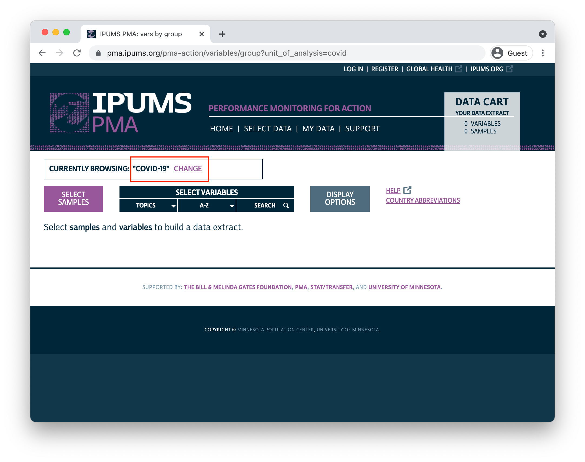
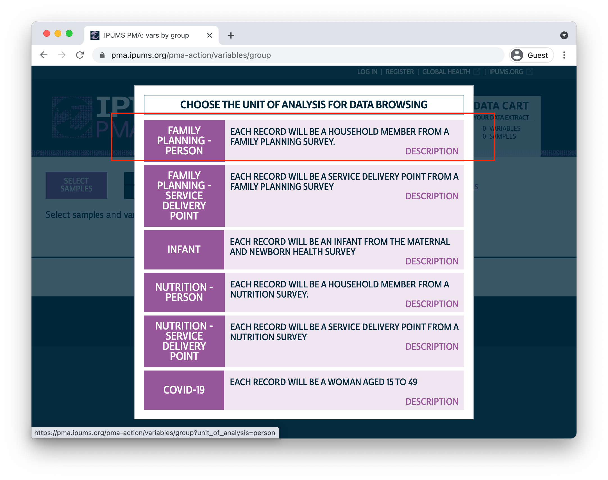

Throughout our [discussion of the PMA COVID-19 survey](../../index.html#category:COVID-19) this summer, we've mentioned that PMA COVID-19 data were collected in telephone interviews with women following a **baseline** survey as part of an ongoing **panel study** focused on family planning and reproductive health. 

While the scope of the COVID-19 survey is narrower than the baseline survey, it does contain several repeated questions designed to help researchers evaluate change over the first few months of the pandemic. For example, both surveys contain questions about women's financial independence and the dynamics of household decision-making. In the baseline survey, you'll find a variable called [HHDECDAILY](https://pma.ipums.org/pma-action/variables/HHDECDAILY) representing a question that asks:

<aside>
The **baseline** survey was administered in-person between November 2019 and February 2020. 

The **COVID-19 follow up** administered by telephone between May and August 2020.
</aside>

```
Who usually makes decisions about making household purchases for daily 
needs: you, your husband/partner, you and your husband/partner jointly, 
or someone else?

[] Respondent
[] Husband/partner
[] Respondent and husband/partner
[] Someone else
[] No response
```

In the `covid` survey, a nearly identical question asks women to reflect on changes that happened since COVID-19 restrictions began. Responses are recorded in [CVBUYDECIDER](https://pma.ipums.org/pma-action/variables/CVBUYDECIDER):

```
Since the Coronavirus (COVID-19) restrictions began, who usually makes
decisions about making household purchases for daily needs: you, your
husband/partner, you and your husband/partner jointly, or someone else?

[] Respondent
[] Husband/partner
[] Respondent and husband/partner
[] Someone else
[] No response
```

One way you might model change over time with these variables is to look at women's **net change in purchasing power** with a derived [factor](../2021-07-01-covid-tables/index.html#display-value-labels) that takes the value:

  * "More" if a woman has gained autonomy,
  * "Less" if she has lost autonomy,
  * "Same" if she experienced no change, or
  * `NA` if either `HHDECDAILY` or `CVBUYDECIDER` is not available

In this post, we'll demonstrate how to create and model this type of variable by merging the baseline and COVID-19 surveys together. We've modeled [continuous](../2021-02-19-analyzing-the-individual-in-context/#individual-factors-model-with-svyglm) and [binary](../2021-04-01-et-internal-migration/#regression-model) variables in previous posts, but we'll need a different approach for a dependent variable with **three** outcomes: in this case, we'll fit a **multinomial logit model** for the odds that a woman will experience the "Less" or "More" autonomy relative to maintaining the "Same" level of autonomy.  This task is complicated by two things:

<aside>
If you'd like to explore an **ordered logit model** for these outcomes, you can use the same tools we highlight in this post. Check out [this guide](https://stats.idre.ucla.edu/r/dae/ordinal-logistic-regression/) for testing the "proportional odds assumption" underlying ordered logit models.
</aside>

  1. Only around *half* of the women who participated in the in-person baseline survey were reached [by telephone](https://www.pmadata.org/technical-areas/covid-19) for the COVID-19 follow up. We'll show how changes in the sample design introduce bias to the merged data, and we'll explain how to mitigate that bias with a **sampling weight** called `CVQWEIGHT`.
  2. PMA screens households for reproductive age women within geographically defined **sampling clusters** represented by the variable `EAID`. Our multinomial model should include **cluster-robust standard error estimates** - in other words, we want to account for correlation between neighboring women who live in the same cluster. 
  
Until recently, [popular R packages for multinomial regression](https://cran.r-project.org/web/packages/nnet/index.html) had no built-in way to handle elements of complex survey design. Fortunately, the new [svyVGAM](https://cran.r-project.org/web/packages/svyVGAM/index.html) package offers a simple interface built on the very same [survey](http://r-survey.r-forge.r-project.org/survey/) package we've featured throughout this blog. We'll demonstrate fitting a multinomial model with  `CVQWEIGHT` and `EAID` here, but this package also provides a general interface to any generalized linear / additive model supported by the underlying [VGAM](https://www.stat.auckland.ac.nz/~yee/VGAM/) package.
 
# Setup

We've mentioned in previous posts that you'll find harmonized PMA COVID-19 data if you navigate to the [COVID-19 unit of analysis](https://pma.ipums.org/pma-action/extract_requests/clear?return_url=%2Fpma-action%2Fvariables%2Fgroup) on the IPUMS PMA website. 
In this post, we'll use an extract containing *all four* of the available COVID-19 samples (Female Respondents only): 

  * Burkina Faso 2020
  * Democratic Republic of Congo (DRC) 2020 - Kinshasa
  * Kenya 2020
  * Nigeria 2020 - Lagos and Kano

Data from the baseline surveys are located under the "Family Planning - Person" unit of analysis. **Because data extracts can only contain samples with the same unit of analysis, you'll need to create and download two separate extracts**. Once you've downloaded an extract containing COVID-19 data, switch units of analysis by clicking the "CHANGE" link in the "Currently Browsing" window at the top of your screen:

```{r}

```

Then, select the "Family Planning - Person" unit of analysis in this menu:

```{r}

```

You'll need to create an extract that contains these samples (again, Female Respondents only):

  * Burkina Faso 2020
  * Democratic Republic of Congo (DRC) 2019a - Kinshasa
  * Kenya
  * Nigeria 2019a - Kano 
  * Nigeria 2019b - Lagos

In the example workflow shown below, we've downloaded *both* extracts and saved them together in the "data" folder of our R working directory. We've also installed and loaded the following packages:

```{r}
knitr::opts_chunk$set(echo = TRUE)
options(tibble.print_min = 30)
```

```{r, results='hide'}
library(tidyverse)   # 1.3.1
library(broom)       # 0.7.6
library(ipumsr)      # 0.4.5
library(srvyr)       # 1.0.1
library(svyVGAM)     # 1.0
library(kableExtra)  # 1.3.4
library(ggalluvial)  # 0.12.3
library(dotwhisker)  # 0.6.0
```

Now, we'll load both of our data extracts into R. We'll create two separate dataframes named `covid` and `baseline` (we'll also edit the variable `COUNTRY` in each extract for additional clarity):

```{r, results='hide'}
covid <- read_ipums_micro(
  ddi = "data/pma_00032.xml",
  data_file = "data/pma_00032.dat.gz"
) %>% 
  mutate(COUNTRY = as_factor(COUNTRY %>% lbl_relabel(
    lbl(2, "DRC (Kinshasa)") ~ .val == 2, 
    lbl(9, "Nigeria (Lagos/Kano)") ~ .val == 9
  )))  

baseline <- read_ipums_micro(
  ddi = "data/pma_00039.xml",
  data_file = "data/pma_00039.dat.gz"
) %>% 
  mutate(COUNTRY = as_factor(COUNTRY %>% lbl_relabel(
    lbl(2, "DRC (Kinshasa)") ~ .val == 2, 
    lbl(9, "Nigeria (Lagos/Kano)") ~ .val == 9
  )))  
```

One last thing here: we'll be making several graphs to help illustrate our workflow in this post. We'll create a custom theme `theme_pma()` for those graphs so that the fonts, colors, and other design elements match the overall look of this blog.

```{r}
library(showtext)
font_add(
  family = "cabrito", 
  regular = "../../fonts/cabritosansnormregular-webfont.ttf"
)
showtext_auto()

theme_pma <- function(title, subtitle = NULL, x = NULL, legend.position){
  components <- list(
    theme_minimal() %+replace% 
      theme(
        text = element_text(family = "cabrito", size = 14), 
        plot.title = element_text(
          size = 18, color = "#00263A", margin = margin(b = 10)
        ), 
        plot.subtitle = element_text(
          size = 16, color = "#00263A", margin = margin(b = 5)
        ),
        legend.title = element_blank(),        
        legend.position = legend.position,
        strip.text.y = element_text(size = 12, angle = 0),
        panel.spacing = unit(2, "lines")
      ),
    scale_fill_manual(
      values = alpha(
        colour =  c(
          "#00263A",   # IPUMS Navy
          "#7A99AC",   # IPUMS Blue Grey
          "#BDD2DE",   # IPUMS Medium Grey
          "#98579B",   # PMA Pink
          "#CCBA72",   # Tan
          "#81A88D"    # Green
        )
      ),
      na.value = "#F0E6F0"
    ),
    scale_color_manual(
      values = alpha(
        alpha = .85,   # .85 creates bars that are 15% transparent
        colour = c(
          "#98579B",   # PMA Pink
          "#00263A"    # IPUMS Navy
        )
      )
    ),
    labs(
      title = toupper(title), 
      subtitle = subtitle, 
      x = x, 
      y = NULL, 
      fill = NULL
    ),
    guides(fill = guide_legend(reverse = TRUE, byrow = TRUE))
  )
}
```

<aside>
We discuss custom themes in detail [here](../2021-08-01-covid-batches/#plot-theme)
</aside>

# Sampling Weights

Remember that interviews for the `baseline` survey were administered in-person, but the `covid` interviews were administered via telephone. Suppose we ignored the sampling weight `CVQWEIGHT` completely: how might the requirement of **access to a telephone** bias the combined sample of women who participated in both surveys?

Let's take a look at a few of the demographic variables that appear in both `baseline` and `covid`. We'll use `imap_dfr()` build a data frame by iterating over both of the data extracts, and we'll use `summarise()` to create the following summary statistics:

  * `RESPONDENTS` - the total number of women in the sample
  * `MEAN AGE` - the mean age of women in the sample
  * `PCT URBAN` - the percentage of sampled women living in "urban" areas
  * `PCT NO SCHOOL` - the percentage of sampled women who "never attended" school
  * `PCT MARRIED` - the percentage of sampled women who are currently married

```{r}
samples_tbl <- list(baseline, covid) %>% 
  imap_dfr(
    ~.x %>% 
      group_by(COUNTRY) %>%
      summarise(
        SAMPLE = if_else(.y == 1, "baseline", "covid"),
        RESPONDENTS = n(),
        `MEAN AGE` = mean(AGE),
        `PCT URBAN` = 100 * mean(URBAN), 
        `PCT NO SCHOOL` = 100 * mean(EDUCATTGEN <= 2), 
        `PCT MARRIED` = 100 * mean(MARSTAT == 21) 
      ) 
  ) %>% 
  arrange(COUNTRY)
```

<aside>
The variable `URBAN` is not available for the DRC sample, which represents the Kinshasa region. We'll assume that all women in Kinshasa live in an "urban" area in our analysis below.
</aside>

```{r}
samples_tbl %>% kbl(digits = 1) 
```

Comparing the two samples for each country, we see that the `covid` follow up represents a sub-sample of the baseline participants that is generally **a bit older** (adjusting for the passage of time), **more urban**, **more educated**, and are **more likely to be currently married**. If we built a multinomial model *without* sample weights, our predictions would reflect these biases as well. 

Fortunately, the variable `CVQWEIGHT` corrects the baseline sample weight `FQWEIGHT` for predicted telephone access and other sources of loss to follow up. If we use the correct weights for each sample in our `imap_dfr()` function above, we should produce similar estimates for each sample's **target population**: 

<aside>
Read more about the construction of `CVQWEIGHT` [here](https://pma.ipums.org/pma/resources/documentation/COVID_Survey_Weight_Construction_Memo.pdf).
</aside>

```{r}
populations_tbl <- list(baseline, covid) %>% 
  imap_dfr(~{
    if("FQWEIGHT" %in% names(.x)){
      wt <- "FQWEIGHT"
    } else {
      wt <- "CVQWEIGHT"
    }
    .x %>% 
      as_survey_design(weights = !!wt, ids = EAID) %>% 
      group_by(COUNTRY) %>% 
      summarise(
        SAMPLE = if_else(.y == 1, "baseline", "covid"),
        `MEAN AGE` = survey_mean(AGE, vartype = NULL),
        `PCT URBAN` = 100 * survey_mean(URBAN, vartype = NULL), 
        `PCT NO SCHOOL` = 100 * survey_mean(EDUCATTGEN == 1, vartype = NULL), 
        `PCT MARRIED` = 100 * survey_mean(MARSTAT == 21, vartype = NULL)   
      ) 
  }) %>% 
  arrange(COUNTRY)
```

<aside>
**Tip:** If you would like to produce confidence intervals for each of these population-level estimates, use `vartype == "ci"`. Note that `EAID` has no impact on the point estimates we've shown.
</aside>

```{r}
populations_tbl %>% kbl(digits = 1) 
```

Here, we've used `as_survey_design()` to specify the correct weight `wt` in each iteration of `imap_dfr()`. Then, we used `survey_mean()` to estimate the mean / proportion for each sample's target population. Although you might observe some differences between the point estimates derived from `baseline` and `covid`, the *systematic* biases we identified in the samples are no longer present. This will be easier to see in a [faceted lollipop plot](../2021-08-01-covid-batches/#lollipop-chart) where we chart both summary tables side-by-side.

```{r, layout="l-page", fig.width=12, fig.height=6}
populations_tbl %>%  
  mutate(TBL = "weighted") %>% 
  rbind(
    samples_tbl %>% select(-RESPONDENTS) %>% mutate(TBL = "unweighted")
  ) %>% 
  pivot_longer(-c(COUNTRY, SAMPLE, TBL)) %>% 
  ggplot(aes(x = value, y = TBL, color = SAMPLE)) + 
  facet_grid(
    rows = vars(COUNTRY), 
    cols = vars(name),
    scale = "free_x",
    as.table = TRUE
  ) +
  geom_point(size = 3) + 
  geom_line(aes(group = TBL), alpha = .5, color = "#000000") + 
  theme_pma("Sample design: weighted vs unweighted", legend.position = "top")
```

In nearly every case, the gap between `baseline` and `covid` is narrower for the `weighted` population estimates than it is for the `unweighted` sample statistics. 

For example, consider the summary statistic `PCT URBAN`. 59.9% of the women in the Burkina Faso `baseline` sample reside in urban areas, compared to 74.7% of women in the `covid` sample. That's a 14.8% difference! With weights applied, we use `baseline` to estimate that only 22.8% of women in Burkina Faso actually live in urban areas; compare this to the 21.4% estimate produced from `covid`. The difference between the two population estimates is much smaller - just 1.4%. 

# Change in purchasing power

We'll now focus our attention only on the respondents who participated in both `baseline` and `covid` as we explore changes that occurred during the intervening months. We'll create a `merged` dataset that contains *one row per person* and drops anyone who didn't participate in the `covid` survey. We should also *preserve duplicate variables* - or variables that appear in both extracts; we'll need to change their names so that it's easy to determine which version came from which survey.

Either `left_join()` or `right_join()` from the [dplyr](https://dplyr.tidyverse.org/reference/join.html) package can be used here; the only difference is that `left_join()` discards rows from the data provided to "y", while `right_join()` discards rows from the data provided to "x" (we could put `baseline` in either position). We'll use `left_join()`. 

Each participant in `baseline` will have a unique identification code in `FQINSTID` that appears again in `covid`. So, we'll tell `left_join()` to merge rows connected by the same `FQINSTID` with `by = "FQINSTID"`

Finally, we'll use the `suffix` argument to handle variables that appear in both extracts. For example, `AGE` from `covid` will be renamed `AGE_CV`, while `AGE` from `baseline` will be renamed `AGE_BASE`.  

```{r}
merged <- left_join(
  x = covid,
  y = baseline,
  by = "FQINSTID",
  suffix = c("_CV", "_BASE")
) 
```

The variables we'll use to construct our model's dependent variable - `HHDECDAILY` and `CVBUYDECIDER` - will now appear together in the same row for each woman who participated in both surveys. For both variables, the universe is women who were currently married or living with male partner. Before we get started, let's take a quick look at an [alluvial plot](../2021-05-24-migration-data-analysis/#visualizing-migration-alluvial-plots) showing the general shifts from one variable to the other:

```{r, layout="l-page", fig.width=12, fig.height=4}
merged %>% 
  select(FQINSTID, HHDECDAILY, CVBUYDECIDER) %>% 
  pivot_longer(!FQINSTID) %>% 
  mutate(
    name = if_else(name == "HHDECDAILY", "Before COVID-19", "Summer 2020") %>% 
      as_factor() %>% 
      fct_rev(),
    value = value %>% 
      as_factor() %>% 
      fct_recode(
        "Resdponent" = "1", "Husband/partner" = "2", "Joint" = "3",
        "Someone else" = "4", "No response" = "98", "Not partnered" =  "99"
      ) %>% 
      fct_rev()
  ) %>% 
  ggplot(aes(
    x = name,
    stratum = value,
    fill = value,
    alluvium = FQINSTID
  )) + 
  geom_stratum(alpha = 0.7) + 
  geom_flow() +
  coord_flip() + 
  theme_pma(
    title = "Who usually makes decisions about \n household purchases for daily needs?",
    subtitle = "Female respondents to the PMA baseline and COVID-19 surveys",
    legend.position = "bottom"
  ) 
```

Here, we see that a majority of women who independently made purchasing decisions at `baseline` began either making decisions jointly or deferred to their husband/partner or someone else after COVID-19 restrictions began. At the same time, a sizable portion of the women who made decisions jointly at `baseline` no longer reported any role in the `covid` survey. We'll say that all of these women have "Less" purchasing power when we create our dependent variable. 

Some women experienced change in the opposite direction: these include women who gained some authority after having none at `baseline`, and also women who previously made decisions jointly, but now bear bear full responsibility. We'll say that these women have "More" purchasing power.

Finally, all other women will be said to have the "Same" level of purchasing power *unless* either variable contains "No response or missing" or "NIU (not in universe)". In the latter case, we'll use the value `NA`.  This means we will be analyzing a sample of women who were married or living with a male partner both before and during COVID-19 restrictions.  

```{r}
merged <- merged %>% 
   mutate(PURCHASE_PWR = factor(
     case_when(
       HHDECDAILY == 1 & CVBUYDECIDER %in% 2:4 ~ "Less",
       HHDECDAILY == 3 & CVBUYDECIDER %in% c(2, 4) ~  "Less",
       HHDECDAILY == 2 & CVBUYDECIDER %in% c(1, 3) ~ "More",
       HHDECDAILY == 3 & CVBUYDECIDER == 1 ~ "More",
       HHDECDAILY == 4 & CVBUYDECIDER %in% c(1, 3) ~ "More",
       HHDECDAILY < 90 & CVBUYDECIDER < 90 ~ "Same"
     ),
     levels = c( "Less", "Same", "More")
   ))
```

# Multinomial modeling 

Let's now see what our derived variable `PURCHASE_PWR` can tell us about each sample's **target population**. As shown above, we'll again specify the sampling weight `CVQWEIGHT` and the cluster IDs - this time using the COVID-19 version in `EAID_CV` - as survey design information; we'll then pass this information to a `survey_mean()` summary function to produce point-estimates and a cluster-robust 95% confidence interval for each level of `PURCHASE_POWER`. We'll plot these estimates in a [grouped bar chart](../2021-08-01-covid-batches/#bar-charts), omitting the percentage of women who are not married / cohabitating with a partner.

<aside>
Keep in mind: only the Burkina Faso and Kenya samples are **nationally representative**. The DRC and Nigeria samples represent **sub-national regions**.
</aside>

```{r, layout="l-page", fig.width=12, fig.height=4}
merged %>% 
  as_survey_design(
    weights = CVQWEIGHT,
    ids = EAID_CV
  ) %>% 
  group_by(COUNTRY_BASE, PURCHASE_PWR) %>% 
  summarise(est = 100 * survey_mean(vartype = "ci")) %>% 
  filter(!is.na(PURCHASE_PWR)) %>% 
  ggplot(aes(x = COUNTRY_BASE, y = est, fill = PURCHASE_PWR)) + 
  geom_bar(width = .6, position = position_dodge(0.6), stat = "identity") +
  geom_errorbar(
    aes(ymin = est_low, ymax = est_upp),
    width = 0.2,
    position = position_dodge(0.6),
    alpha = 0.5
  ) + 
  theme_pma(
    title = "Net change in purchasing power for daily needs",
    subtitle = "Estimated percentages for populations of women age 15-49",
    legend.position = "bottom"
  ) + 
  coord_flip()
```

The percentage of women in each population who gained "More" purchasing power after COVID-19 restrictions began is *significantly lower* than the percentage of women who maintained the "Same" or experienced "Less" purchasing power (we know this because the 95% confidence intervals do not overlap). The comparison between "Same" and "Less" is not so clear: while the point estimates suggest that there *may* be fewer women with "Less" purchasing power, the difference is not statistically significant (except in Kenya, where the two confidence intervals do not overlap). 

To demonstrate a multinomial model for these outcomes, we'll select a set of variables that describe demographic features and economic circumstances for each woman. As a reminder: for variables that appeared in both `baseline` and `covid`, we'll need to specify which to include in our model by appending the suffix `_BASE` or `_CV` - for the most part, we'll use the `baseline` version. We'll include these covariates (modifying / recoding as needed): 

  * [AGE_BASE](https://pma.ipums.org/pma-action/variables/AGE) - age at baseline
  * [URBAN_BASE](https://pma.ipums.org/pma-action/variables/URBAN) - lived in an urban area at baseline: TRUE or FALSE
  * [WEALTHT](https://pma.ipums.org/pma-action/variables/WEALTHT) - wealth score tertile: Highest, Middle, Lowest (reference group)
  * [RELIGION](https://pma.ipums.org/pma-action/variables/RELIGION) - religion *of the household head* recoded as Muslim, Christian, Other (reference group)
  * [PARTNERECON](https://pma.ipums.org/pma-action/variables/PARTNERECON) indicates whether married / partnered women said on the `covid` survey that there were "currently economically reliant" on their husband / partner for basic needs: TRUE or FALSE
  * [WORKWK](https://pma.ipums.org/pma-action/variables/WORKWK) indicates whether women indicated on the `baseline` survey that she had done any work outside the home in the past week: TRUE or FALSE
  
```{r}
merged <- merged %>% 
  mutate(
    RELIGION = factor(
      case_when(
        RELIGION == 100 ~ "Muslim",
        RELIGION %in% 200:300 ~ "Christian",
        RELIGION < 990 ~ "Other"
      ),
      levels = c("Other", "Muslim", "Christian")
    ),
    WEALTHT = as_factor(WEALTHT),
    URBAN_BASE = case_when(
      COUNTRY_BASE == "DRC (Kinshasa)" ~ TRUE,
      URBAN_BASE == 1 ~ TRUE,
      URBAN_BASE == 0 ~ FALSE
    ),
    across(c(PARTNERECON, WORKWK), ~case_when(
      .x == 1 ~ TRUE,
      .x == 0 ~ FALSE
    ))
  ) 
```
  
The `svyVGAM` package can interpret the very same call to `as_survey_design()` shown above. We'll use the generic modeling function `svy_vglm()` to build our model; it looks similar to the `svyglm` function we've used to build linear and binary logit models elsewhere, except that the argument `family` takes a function describing the type of model we want to fit. Use `multinomial(refLevel = "Same")` to specify a multinomial model with "Same" as a reference group:

<aside>
See [package documentation](https://cran.r-project.org/web/packages/svyVGAM/svyVGAM.pdf) for other supported modeling functions
</aside>

```{r}
pma_model <- merged %>%  
  as_survey_design(
    weights = CVQWEIGHT,
    id = EAID_CV
  ) %>% 
  svy_vglm(
    formula = PURCHASE_PWR ~ 
      AGE_BASE +
      RELIGION +
      WEALTHT +
      URBAN_BASE +
      PARTNERECON + 
      WORKWK + 
      COUNTRY_BASE,
    design = ., 
    family = multinomial(refLevel = "Same")
  ) 
```

One drawback here is that the output of a model created by `svyVGAM` (or by the `VGAM` package) cannot be handled by [broom::tidy()](https://broom.tidymodels.org/), which we normally use to clean and standardize model output. Fortunately, `broom` contains a non-exported function that's capable of handling something similar: the model output created by `svyglm()` from the sibling `survey` package! You'll find it in the `broom` namespace if you use `:::` like so:

```{r}
broom:::tidy.svyglm
```

We'll modify this function a bit, [creating our own tidy method](https://www.tidymodels.org/learn/develop/broom/) `tidy.svyVGAM()` (you may need to make modifications for general use):

```{r}
tidy.svyVGAM <- function(
  x, 
  conf.int = FALSE, 
  conf.level = 0.95,
  exponentiate = FALSE, 
  ...
){
  # Replace `summary(x)$coefficients` with `summary(x)$coeftable`
  ret <- as_tibble(summary(x)$coeftable, rownames = "term")
  
  # All of this stays the same:
  colnames(ret) <- c("term", "estimate", "std.error", "statistic", "p.value")
  coefs <- tibble::enframe(stats::coef(x), name = "term", value = "estimate")
  ret <- left_join(coefs, ret, by = c("term", "estimate"))
  if (conf.int){
    ci <- broom:::broom_confint_terms(x, level = conf.level, ...)
    ret <- dplyr::left_join(ret, ci, by = "term")
  }
  if (exponentiate){ret <- broom:::exponentiate(ret)}
  
  # This part only works for the multinomial case, and only if your covariates
  # have no ":" in their names - NOT FOR GENERAL USE
  ret %>% 
    separate(term, into = c("term", "y.level"), sep = ":") %>% 
    arrange(y.level) %>% 
    relocate(y.level, .before = term)
}
```

Now, let's look at our model results. We'll exponentiate our coefficients, add significance "stars", and label each `y.level` manually to make this table easier to read:

```{r}
tidy_pma_model <- tidy.svyVGAM(pma_model, exponentiate = TRUE, conf.int = TRUE)
```

```{r}
tidy_pma_model %>% 
  select(-y.level) %>% 
  rename(PURCHASE_PWR = term) %>% 
  mutate(sig = case_when(
    p.value < 0.001 ~ "\\*\\*\\*",
    p.value < 0.01 ~ "\\*\\*",
    p.value < 0.05 ~ "\\*",
    T ~ ""
  )) %>% 
  kbl(digits = 3) %>% 
  pack_rows("Less", 1, 12) %>% 
  pack_rows("More", 13, 24)
```

Once you've got the model output in a `tidy` format, you can also pass it to a `tidyverse` aligned graphing function, like the popular [dwplot](https://cran.r-project.org/web/packages/dotwhisker/vignettes/dotwhisker-vignette.html) from `dotwhisker`: 

```{r, layout="l-page", fig.width=12, fig.height=8}
tidy_pma_model %>% 
  mutate(
    model = if_else(
      y.level == 1, 
      "Less Purchasing Power",
      "More Purchasing Power", 
    ),
    sig = gtools::stars.pval(p.value)
  ) %>%
  relabel_predictors(c(
    AGE_BASE = "Age at baseline",
    RELIGIONMuslim = "Muslim Head of Household",
    RELIGIONChristian = "Christian Head of Household",
    `WEALTHTMiddle tertile` = "Middle Wealth Tertile",
    `WEALTHTHighest tertile` = "Highest Wealth Tertile",
    URBAN_BASETRUE = "Urban Residence",
    `COUNTRY_BASEDRC (Kinshasa)` = "DRC (Kinshasa)",
    COUNTRY_BASEKenya = "Kenya",
    `COUNTRY_BASENigeria (Lagos/Kano)` = "Nigeria (Lagos/Kano)",
    PARTNERECONTRUE = "Reliant on partner",
    WORKWKTRUE = "Work outside home"
  )) %>% 
  dotwhisker::dwplot(
    dodge_size = 0.3,
    vline = geom_vline(xintercept = 1, colour = "grey60", linetype = 2)
  ) + 
  guides(color = guide_legend(reverse = TRUE)) + 
  theme_pma(
    title = 
      "Which factors impact women's purchasing power during COVID-19?", 
    subtitle = 
      'Odds ratios relative to "no change" (95% CI)',
    legend.position = "top"
  ) 
```

Because we've exponentiated the coefficients produced by this model, each `estimate` shows how each covariate *changes the odds* of experiencing a given level of `PURCHASE_PWR` *relative to* the reference group of women who maintained the same level of autonomy since COVID-19 restrictions began. For example, an `estimate` of 1.0 would indicate *equal odds*, 2.0 would indicate *double odds*, and so on. 

Generally, the effects of demographic factors in our model are pretty limited. 
For example, notice the proximity of both `AGE_BASE` estimates to 1.0. Each additional year of *age at baseline* is estimated to change the odds that a woman would experience "Less" purchasing power by just 0.001 - or 0.1%; this is not a statistically significant difference from 1.0, as you'll notice that the 95% confidence interval includes values both above *and* below "equal odds". The "More" estimate for `AGE_BASE` tells a similar story: while we estimate that each year of *age at baseline* contributes to a 0.9% drop in the odds that a woman would gain "More" purchasing power, this difference is not sufficiently far enough from "equal odds" to indicate statistical significance. Perhaps surprisingly, neither of the variables `AGE_BASE`, `WEALTHT`, or `URBAN_BASE` are significant predictors for any outcome of `PURCHASE_PWR`. 

On the other hand, we see some evidence that `RELIGION` may have a more meaningful impact, particularly for women living with a Muslim head of household. The estimated odds that such a woman would *lose* purchasing power are just 60.2% of the estimated odds that she would maintain the same level. Meanwhile, her estimated odds for *gaining* power are 152.5% - or about one and a half times *higher* than - her odds of maintaining the same level. The former estimate includes a 95% confidence interval that includes no values above 1.0, but the interval for the latter estimate *just barely* overlaps with 1.0. Hence, only the estimate for "Less" purchasing power meets the formal requirement for statistical significance. 

Compared to demographic factors, the economic factors we've selected are much more powerful predictors for all levels of `PURCHASE_PWR`. Controlling for household wealth via `WEALTHT`, women who indicated on the COVID-19 survey that they were *currently economically reliant* on their husband/partner were both likely to have lost purchasing power, and unlikely to have gained it. Meanwhile, women who indicated on the baseline survey that they *recently worked outside the home* were somewhat likely to lose purchasing power, while they were unlikely to gain more. Three of the four estimates from these variables were statistically significant even at the 99.9% confidence threshold. 

How might these conclusions change if we hadn't bothered to include `CVQWEIGHT` and `EAID_CV`? Without `CVQWEIGHT`, the *point estimates* for each of our covariates would shift in a direction reflecting the sample biases in the COVID-19 survey. Sample cluster information specified by `EAID_CV` doesn't change those point estimates, but it does impact the estimated *standard error* for each point estimate; if we had omitted `EAID_CV`, we would have generally *underestimated* standard error, leading to confidence intervals that are *too narrow*. Fortunately, the new `svyVGAM` package made it incredibly easy to incorporate both survey design elements into our multinomial model. 

# Wrap-up
  
The four samples we've been examining throughout this summer-long [series on PMA COVID-19 data](../../index.html#category:COVID-19) are just *one part* of a larger panel study you'll find on the [IPUMS PMA](https://pma.ipums.org) website in the months and years ahead. You'll find information about samples from other countries and plans for additional follow-up surveys on the PMA [survey methodology](https://www.pmadata.org/data/survey-methodology) page.
  
Here at the PMA Data Analysis Hub, we plan to change gears in the coming weeks as we begin a new series on [PMA Nutrition Data](https://www.pmadata.org/technical-areas/nutrition). However, we'll continue to focus on COVID-19 data when new surveys become available. For updates, keep an eye on the [New Data](../../index.html#category:New_Data) tag or look for us on [Twitter](https://twitter.com/ipumsGH).
  
  