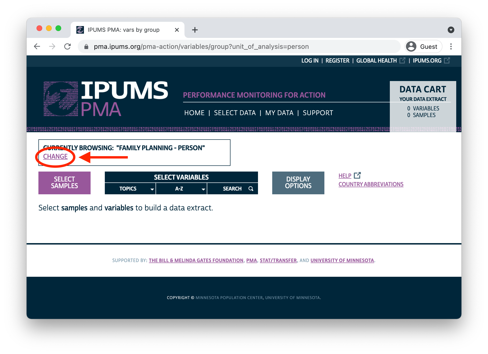
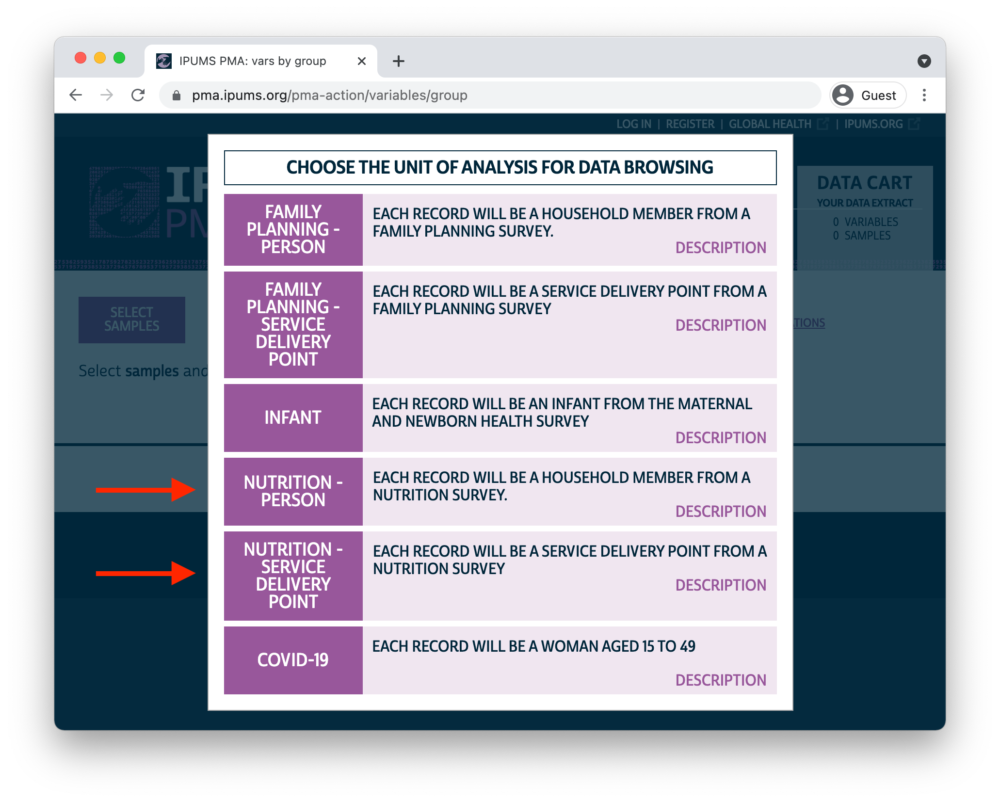

```{r, echo = F}
knitr::opts_chunk$set(echo = F, eval = T)
options(tibble.max_extra_cols = 5)
library(kableExtra)
```

Today, we're excited to launch a new series exploring nutrition surveys from [Performance Monitoring for Action](https://www.pmadata.org/)! Much like the [family planning](../2021-02-19-analyzing-the-individual-in-context/index.html) surveys we've discussed so far, PMA [nutrition surveys](https://www.pmadata.org/technical-areas/nutrition) feature contemporaneous samples of both **households** and **service delivery points** (SDPs). Several public use data series cover maternal and young child nutrition, but the inclusion of service delivery point data in PMA surveys gives researchers a unique opportunity to see how local service provision impacts the nutritional health of women and their households. 

PMA household nutrition surveys focus on **women aged 10-49** and **children up to age 5** living within geographically defined sample clusters - or [enumeration areas](../2021-01-26-sdp-data/index.html#sample-design) - in **Burkina Faso** and **Kenya**. Two rounds of nationally representative, cross-sectional samples were collected from each country: one in 2017, and another in 2018. 

Nutrition surveys for SDPs are designed to reflect the health service environment experienced by women and children in a corresponding household nutrition sample (SDP surveys are *not* nationally representative). PMA worked with officials in **Burkina Faso** and **Kenya** to obtain a census of public-sector facilities, and it sampled *all* public-sector facilities providing services to an enumeration area represented in the household nutrition sample. Additionally, PMA sampled *up to three* private-sector facilities that were located within the boundaries of any such enumeration area. 

IPUMS offers a **harmonized** version of all PMA nutrition surveys at no cost to [registered](https://pma.ipums.org/pma/register.shtml) users. At the household level, we've merged separate questionnaires administered to household heads, women age 10-49, and caregivers for children under age 5 in a process [described here](https://pma.ipums.org/pma/sample_notes.shtml#nut). We've also created integrated variable names, response codes, and documentation highlighting comparability issues between samples. 

Harmonized data from IPUMS PMA are designed to help you find and compare data from multiple PMA nutrition samples as quickly and easily as possible. In this post, we'll guide you through some of the topics and comparability issues you're likely to encounter. Then, in the coming weeks, we'll take a deeper dive into analytic topics like:

  * constructing assessment indicators for infant and young child feeding (IYCF) practices 
  * linking antenatal / postnatal interventions with child nutrition outcomes
  * contextualizing household nutrition with data from SDP surveys *and* external sources (e.g. livelihood zones and climate data)
  * recent publications featuring PMA nutrition data, and opportunities for additional analysis 

# Data Access 

You'll find nutrition data on the [IPUMS PMA website](https://pma.ipums.org) by clicking on the "CHANGE" link in the box where the current unit of analysis is shown:

```{r, echo=F, eval=T}

```

<aside>
Anyone can browse IPUMS PMA documentation, but you'll need to [register](https://pma.ipums.org/pma/register.shtml) for a free account before you can download data.
</aside>

As with family planning surveys, you'll find separate units of analysis for nutrition surveys collected from households and SDPs. If you intend to use both, you will need to download *two* extracts: one for SDPs and one for households. 

```{r, echo=F, eval=T}

```

Throughout this series, we'll use tools from [ipumsr](http://tech.popdata.org/ipumsr/) and the [tidyverse](https://tidyverse.tidyverse.org/) to work with IPUMS PMA nutrition data in R. Once you've downloaded extracts from one or both units of analysis, you can load them into R as follows (changing the file paths as needed):

```{r, echo = T, results='hide'}
library(tidyverse)
library(ipumsr)

# we'll call data from the SDP unit of analysis `sdp`
sdp <- read_ipums_micro(
  ddi = "data/pma_00001.xml",
  data = "data/pma_00001.dat.gz"
)

# we'll call data from the household unit of analysis `hh`
hh <- read_ipums_micro(
  ddi = "data/pma_00002.xml",
  data = "data/pma_00002.dat.gz"
)
```

# Household Nutrition Surveys 

There are nearly 1,000 variables available from the four household nutrition samples, so navigation can seem overwhelming at first. Fortunately, a large proportion of these come from **multiple response** questions repeated separately for women and each sampled child. 

Harmonized variable names repeat the same *stem* for variables that come from the same original question, and they have a specific *prefix* indicating whether the question was administered to a woman or a particular child. If the question was **multiple response**, a unique *suffix* was given to the binary indicator derived from each response. 

For example, a common question for both women and children deals with the *type of foods eaten yesterday*. Here is the text of the question administered to women in 2017 (both countries):

```
501. Now I'd like to ask you about foods and drinks that you ate or drank
yesterday during the day or night, whether you ate it at home or anywhere else.

I am interested in whether you had the food items I will mention even if they
were combined with other foods. For example, if you had a soup made with
carrots, potatoes and meat, you should reply "yes" for each of these
ingredients when I read you the list. However, if you consumed only the broth
of a soup, but not the meat or vegetable, do not say "yes" for the meat or
vegetable.

As I ask you about foods and drinks, please think of foods and drinks you had
as snacks or small meals as well as during any main meals. Please also remember
foods you may have eaten while preparing meals or preparing food for others.
Please do not include any food used in a small amount for seasoning or
condiments (like chilies, spices, herbs or fish powder). I will ask you about
those foods separately.

Cannot select 'no response' with other options.

  [] Any foods made from grains, like maize, rice, wheat, porridge, sorghum, 
     bread
  [] Any vegetables or roots that are orange or yellow inside like pumpkin,
     carrots, squash or yellow sweet potatoes
  [] Any white roots and tubers or plantains like Irish potatoes, yams, 
     cassava, white sweet potatoes
  [] Any dark green, leafy vegetables like sukumu wiki
  [] Any fruits that are dark yellow or orange inside like ripe mangoes, pawpaw
  [] Any other fruits
  [] Any other vegetables
  [] Any meat made from animal organs like liver, kidney, heart
  [] Any other meat, such as beef, pork, lamb, goat, chicken, duck, or dik dik
  [] Eggs
  [] Fresh or dried fish or shellfish
  [] Any foods made from beans, peas, lentils
  [] Any nuts and seeds like groundnut or groundnut paste
  [] Any milk or milk products like cheese or mala
  [] Any savory and fried snacks like fried chips, crisps, samosas, or other
     fried foods
  [] Sugary foods, jiggery (sukari nguru), mandaazi, donuts, cake, sweet
     biscuits or candies
  [] Any sugar-sweetened beverages like sweet fruit drinks, fizzy drinks, 
     sweet tea
  [] Any condiments and seasonings used in small amounts for flavor, like
     spices, herbs, fish powder, tomato paste
  [] Other beverages and foods like unsweetened tea or coffee, clear broth, 
     alcohol
  [] None of the above
  [] No response
```

<aside>
The format of questions included in each PMA household nutrition survey closely resembles nutrition questions found in other prominent global health surveys, including those you'll find at [IPUMS DHS](https://www.idhsdata.org/idhs-action/variables/group?id=hbehav_nutrition).
</aside>

Each one of these response options is represented as a binary indicator (with top-codes for different types of non-response). For variables where this question was administered to women, each indicator received the same *prefix* and *stem*:

  * `WN` (women) + `YEST` (yesterday)
  
Each response is represented by the addition of a *suffix* like:

  * [WNYESTGRAIN](https://pma.ipums.org/pma-action/variables/WNYESTGRAIN) - Woman consumed yesterday: grains
  * [WNYESTMEAT](https://pma.ipums.org/pma-action/variables/WNYESTMEAT) - Woman consumed yesterday: meats
  * [WNYESTFRIED](https://pma.ipums.org/pma-action/variables/WNYESTFRIED) - Woman consumed yesterday: savory and fried snacks
  
This question was also administered to caregivers responding on behalf of sampled children. The *prefix* for children can take one of several values associated with changes in **sample design** made between 2017 and 2018:

  * `INF` - a child under 24 months 
  * `YK` - the caregiver's youngest child aged 24-60 months (2017 samples only)
  * `OK` - the caregiver's other children aged 24-60 months (2017 samples only)
  * `K` - any child aged 24-60 months (2018 samples only)
  * `KID` - any child aged 0-60 months 
  
<aside>
See [ELIGTYPE](https://pma.ipums.org/pma-action/variables/ELIGTYPE) for more information on the use of each prefix.
</aside>
  
This results in several variables for differently sampled children, for example:

  * [INFYESTFRIED](https://pma.ipums.org/pma-action/variables/INFYESTFRIED) - Infant under 2 consumed yesterday: savory/fried snacks (all samples)
  * [YKYESTFRIED](https://pma.ipums.org/pma-action/variables/YKYESTFRIED) - Youngest child aged 2-5 consumed yesterday: savory/fried snacks (2017 samples only)
  * [OTKYESTFRIED](https://pma.ipums.org/pma-action/variables/OTKYESTFRIED) - Older child aged 2-5 consumed yesterday: savory/fried snacks (2017 samples only)
  * [KIDYESTFRIED](https://pma.ipums.org/pma-action/variables/KIDYESTFRIED) - Child under age 5 consumed yesterday: savory/fried snacks (2018 samples only)

Before we continue, let's dig a bit deeper into the changes made to **sample design** between the 2017 and 2018 surveys.

## 2017 Sample Design

Like all cross-sectional PMA surveys, the 2017 household nutrition survey features a **multi-stage stratified cluster sample** design. Officials in each country drew a sample of enumeration areas from urban/rural strata (83 enumeration areas for Burkina Faso, 151 for Kenya). Within each enumeration area, a set number of households were randomly selected for screening (89 households per enumeration area for Burkina Faso, 140 for Kenya). In preliminary screening, interviewers determined whether each household included *both*

<aside>
Full 2017 dataset notes for [Burkina Faso](https://pma.ipums.org/pma/resources/dataset_notes/nut/PMA2017_BF_NUT_R1_HHQFQ_DatasetNotes_v4_09May2019.pdf) and [Kenya](https://pma.ipums.org/pma/resources/dataset_notes/nut/PMA2017_KE_NUT_R1_HHQFQ_DatasetNotes_v2_3Dec2018.pdf)
</aside>

  1) at least one woman aged 10-49 (see [ELIGIBLEHHFEM](https://pma.ipums.org/pma-action/variables/ELIGIBLEHHFEM)), *and*
  2) at least one child under age 2 (see [ELIGIBLEHHKID](https://pma.ipums.org/pma-action/variables/ELIGIBLEHHKID)).
  
Households meeting both criteria (see [ELIGIBLEHH](https://pma.ipums.org/pma-action/variables/ELIGIBLEHH)) were given additional questions related to household [food security](https://pma.ipums.org/pma-action/variables/group?id=nut_hh), [wealth / assets](https://pma.ipums.org/pma-action/variables/group?id=hh_possess), [access to water](https://pma.ipums.org/pma-action/variables/group?id=water_watersource), [sanitation](https://pma.ipums.org/pma-action/variables/group?id=water_wash), and so forth. 

For example, consider the following household. In preliminary screening, the [RESPONDENT](https://pma.ipums.org/pma-action/variables/RESPONDENT) provided a roster of all persons living in the household, including each person's [AGEHQ](https://pma.ipums.org/pma-action/variables/AGEHQ) and [SEX](https://pma.ipums.org/pma-action/variables/SEX). Because the household contains *both* one woman aged 10-49 (row 1) and one child under age 2 (row 2), the `RESPONDENT` was asked to provide additional information about the household, including information used to determine [WEALTHT](https://pma.ipums.org/pma-action/variables/WEALTHT), [WATERDRINKMAIN](https://pma.ipums.org/pma-action/variables/WATERDRINKMAIN), and more. 

```{r}
hh %>% 
  filter(HHID == "04013000000041120171") %>% 
  select(RESPONDENT, AGEHQ, SEX, WEALTHT, WATERDRINKMAIN) %>% 
  arrange(desc(RESPONDENT), AGEHQ) %>% 
  mutate(across(.fns = as_factor)) %>% 
  kable() %>% 
  kable_styling() %>% 
  scroll_box(
    width = "100%", 
    box_css = "margin-bottom: 1em; border: 0px solid #ddd; padding: 5px;"
  )
```

The nutrition questionnaire was administered in a *second* stage, and only in households meeting both of the above criteria. This questionnaire was given separately to each woman age 10-49 in qualifying households:

  1) Each woman answered questions about [her own nutritional health](https://pma.ipums.org/pma-action/variables/group?id=nut_wn) (prefix `WN`), and specific questions about nutrition during her [current pregnancy](https://pma.ipums.org/pma-action/variables/group?id=nut_curpreg) (prefix `CP`) or [recent pregnancy](https://pma.ipums.org/pma-action/variables/group?id=nut_recpreg) (prefix `RP`) if applicable;
  2) Each woman then answered questions about the *youngest* child in her care. Women with [children under 24 months](https://pma.ipums.org/pma-action/variables/group?id=nut_infant) received certain questions related to *infant* nutrition (prefix `INF`). We found that, if a woman was the primary caregiver for more than one child under 24 months of age (e.g. twins), only infant feeding practices for *one* child were reported;
  3) If the *youngest* child under age 5 in the woman's care was [24 months or older](https://pma.ipums.org/pma-action/variables/group?id=nut_ykfood), women received certain questions related to *young child* nutrition (prefix `YK`). Note: these women live with a child under 2 (see sample design), but are not the primary caretaker for that child;
  4) All [other children](https://pma.ipums.org/pma-action/variables/group?id=nut_otkfood) under age 5 in the woman's care are represented by a subset of repeated questions related to *young child* nutrition (prefix `OTK`).
  
<aside>
There are additional restrictions on children represented by `YK` and `OTK` variables: they must also be *biological offspring* of the responding woman. Children represented by `INF` variables need only be the youngest child in her care.
</aside>

Each woman aged 10-49 living in the household would have received the nutrition questionnaire; in our example household, there is only one such woman. She answered nutrition-related questions for herself, and on behalf of each of her children under age 5. You'll see the *stem* for each qualifying woman and child in the variable `ELIGTYPE`; this will help you find the relevant nutrition variables for each person.

```{r, layout="l-page"}
hh %>% 
  filter(HHID == "04013000000041120171") %>% 
  arrange(desc(RESPONDENT), AGEHQ) %>% 
  select(
    AGEHQ, SEX, ELIGTYPE,
    WNYESTFRIED, INFYESTFRIED, YKYESTFRIED, OTKYESTFRIED, KIDYESTFRIED
  ) %>% 
  mutate(across(.fns = as_factor)) %>% 
  kable() %>% 
  kable_styling() %>% 
  scroll_box(
    width = "100%", 
    box_css = "margin-bottom: 1em; border: 0px solid #ddd; padding: 5px;"
  )
```

A few things to note here:

  * `ELIGTYPE` - Explains eligibility for nutrition questions associated with each *prefix*. Members of this household who were not eligible for the nutrition questionnaire are shown in rows 4 and 5 (you can exclude these cases from your extract by selecting only "Females and Children with Nutrition Information").
  * `WNYESTFRIED` - The 25 year old woman ate no fried food yesterday. All other household members are ineligible for this question.
  * `INFYESTFRIED` - The newborn child (age 0) ate no friend food yesterday. All other household members are ineligible for this question.
  * `YKYESTFRIED` - The woman's youngest child is already represented by `INFYESTFRID`, so no child is eligible for questions with the stem `YK`. All household members are ineligible for this question
  * `OTKYESTFRIED` - The woman has one other child under age 5. This child (age 3) ate no fried food yesterday. The final child (age 5) is too old the qualify for the nutrition questionnaire; he and all other household members are ineligible for this question.
  * `KIDYESTFRIED` - This variable is not available for 2017 samples, so it appears as the value `NA`.

## 2018 Sample Design

The 2018 household nutrition survey also features a **multi-stage stratified cluster sample** design. Officials in each country again drew a sample of enumeration areas from urban/rural strata (83 enumeration areas for Burkina Faso, 151 for Kenya). A set number of households were randomly selected for screening within each enumeration area (43 households per enumeration area for Burkina Faso, 56 for Kenya). 

<aside>
Full 2018 dataset notes for [Burkina Faso](https://pma.ipums.org/pma/resources/dataset_notes/nut/PMA2018_BF_NUT_R2_HHQFCQ_v3_DatasetNotes_09May2019.pdf) and [Kenya](https://pma.ipums.org/pma/resources/dataset_notes/nut/PMA2018_KE_NUT_R2_HHQFCQ_v2_DatasetNotes_12Apr2019.pdf)
</aside>

In contrast with the 2017 design, *all screened households* received questions about household [food security](https://pma.ipums.org/pma-action/variables/group?id=nut_hh), [wealth / assets](https://pma.ipums.org/pma-action/variables/group?id=hh_possess), [access to water](https://pma.ipums.org/pma-action/variables/group?id=water_watersource), [sanitation](https://pma.ipums.org/pma-action/variables/group?id=water_wash), and so forth. Related variables are available even if no members of the household were eligible for the nutrition questionnaire (see [ELIGIBLEHH](https://pma.ipums.org/pma-action/variables/ELIGIBLEHH)). 

The nutrition questionnaire was again administered in a *second* stage. This time, **all children under age 5** living in screened households were selected (see [ELIGIBLEKID](https://pma.ipums.org/pma-action/variables/ELIGIBLEKID)). Because the 2017 sampling criteria were changed, 2018 samples include children under 5 in households where no women were selected. For example:

```{r, layout="l-page"}
hh %>% 
  filter(HHID == "04000000000010120182") %>% 
  select(
    AGEHQ, SEX, ELIGTYPE,
    WNYESTFRIED, INFYESTFRIED, YKYESTFRIED, OTKYESTFRIED, KIDYESTFRIED
  ) %>% 
  mutate(across(.fns = as_factor)) %>% 
  arrange(AGEHQ) %>% 
  filter(!AGEHQ %in% 8:12) %>% 
  kable() %>% 
  kable_styling() %>% 
  scroll_box(
    width = "100%", 
    box_css = "margin-bottom: 1em; border: 0px solid #ddd; padding: 5px;"
  )
```

In this household, only one child (age 4) was represented in the nutrition sample. The variables `YKYESTFRIED` and `OTKYESTFRIED` are only available for 2017 samples, so nutrition data for the 4 year old is recorded in `KIDYESTFRIED` (there is no child under 2 in the household, so no household member is eligible for `INFYESTFRIED`). 

Notice that there are, in fact, two women in the household aged 10-49, but they were *not* included in the nutrition sample. Women were selected for the 2018 nutrition survey through a *separate sampling process*. A given proportion of households was randomly selected to screen for eligible women (45% of sampled households in Burkina Faso, 25% in Kenya); individuals living in selected households are indicated in [FQSELECTED](https://pma.ipums.org/pma-action/variables/FQSELECTED). Any woman aged 10-49 (see [ELIGIBLEFEM](https://pma.ipums.org/pma-action/variables/ELIGIBLEFEM)) residing in one of these randomly selected households would have been given questions about [her own nutritional health](https://pma.ipums.org/pma-action/variables/group?id=nut_wn) (prefix `WN`), and specific questions about nutrition during her [current pregnancy](https://pma.ipums.org/pma-action/variables/group?id=nut_curpreg) (prefix `CP`) or [recent pregnancy](https://pma.ipums.org/pma-action/variables/group?id=nut_recpreg) (prefix `RP`) if applicable.

In short: it is possible - but not necessary - for sampled women and children to reside in the same household. Moreover, the respondent answering on behalf of a child *may* be their mother, but other caretakers could respond if the mother was not available (see [RELATEKID](https://pma.ipums.org/pma-action/variables/RELATEKID)). In an upcoming post in [this series](../..//index.html#category:Nutrition), we'll explain how to link maternal and child records together (where possible), opening the possibility for analyses that track antenatal and postnatal interventions to child nutrition outcomes. 

# SDP Nutrition Surveys 

Unlike the household nutrition surveys, you'll find no differences in sample design between the 2017 and 2018 SDP nutrition surveys. In both rounds, PMA selected SDPs with the same set of enumeration areas used to select households (83 enumeration areas for Burkina Faso, 151 for Kenya). As mentioned above, SDP samples include:

  * *all* public-sector facilities whose service catchment area includes a selected enumeration area
  * *up to three* private-sector facilities located within the boundaries of a selected enumeration area 
  
By design, SDP samples represent the service environment experienced by women and children in a corresponding household sample (SDP samples are *not* nationally representative). We anticipate that most users will want to aggregate data collected from several facilities serving the same enumeration area. 

For example, let's take a look at a few of the facilities surveyed in Kenya 2017:

```{r, layout="l-page"}
sdp <- sdp %>% 
  filter(EASERVED1 == 4092, YEAR == 2017) %>% 
  select(
    FACILITYID,
    FACILITYTYPEGEN, AUTHORITY, EAID, 
    EASERVED1, EASERVED2, EASERVED3,
    # COMMNUT
    NUTFAC
  ) %>% 
  mutate(across(.fns = as_factor)) %>% 
  arrange(FACILITYID) %>% 
  slice(1:3) 

sdp %>% 
  kable() %>% 
  kable_styling() %>% 
  scroll_box(
    width = "100%", 
    box_css = "margin-bottom: 1em; border: 0px solid #ddd; padding: 5px;"
  )
```

All three of these facilities provide services to the enumeration area 4092, but only one - the private-sector pharmacy - is actually *located* there (see [EAID](https://pma.ipums.org/pma-action/variables/EAID)). The two public-sector hospitals serve multiple enumeration areas shown in variables sharing the stem `EASERVED` (some public-sector facilities serve up to 18 different enumeration areas listed in variables [EASERVED1](https://pma.ipums.org/pma-action/variables/EASERVED1) to [EASERVED18](https://pma.ipums.org/pma-action/variables/EASERVED18)).

<aside>
Private facilities will only list one `EASERVED` - it will always match the facility's `EAID`.

Public facilities may serve multiple `EASERVED`, usually including their own `EAID`.
</aside>

The last variable [NUTFAC](https://pma.ipums.org/pma-action/variables/NUTFAC) reports whether each SDP is a "nutritional facility", defined as a facility that "supervises, supports, or supplies community nutrition services provided either by paid staff or community health volunteers (CHVs)". A simple way to integrate SDP data with household data from the same country-year might be to *count* the number of "nutritional facilities" serving each enumeration area. We recommend using `pivot_longer()` to create one row for each `EASERVED` in every facility's catchment list:

```{r, echo = T, eval = F}
sdp <- sdp %>% 
  pivot_longer(
    starts_with("EASERVED"),
    values_to = "EASERVED",
    names_to = NULL
  )
```

<aside>
You'll find "nutritional facility" defined on the `NUTFAC` [description tab](https://pma.ipums.org/pma-action/variables/NUTFAC#description_section).
</aside>

```{r, layout="l-page"}
sdp <- sdp %>% 
  pivot_longer(
    starts_with("EASERVED"),
    values_to = "EASERVED",
    names_to = NULL
  ) %>% 
  mutate(EASERVED = as.character(EASERVED))
  
sdp %>% 
  kable() %>% 
  kable_styling() %>% 
  scroll_box(
    width = "100%", 
    box_css = "margin-bottom: 1em; border: 0px solid #ddd; padding: 5px;"
  )

hh <- hh %>% mutate(EAID = as.character(EAID)) %>% filter(YEAR == 2017)
```

Each of the three facilities in our example serves up to three enumeration areas shown in `EASERVED`; if a facility serves fewer than three, the remaining values are `NIU (not in universe)`. We're now able to count the number of "nutritional facilities" serving each enumeration area, and we can easily attach those counts to a household sample from the same year. Let's join a count of the "nutritional facilities" `N_NUTFAC` with a count of sampled household members `N_PERSONID` living in each service area represented by our three example facilities.

```{r, echo = T}
merged <- sdp %>% 
  filter(EASERVED != "NIU (not in universe)") %>% 
  group_by(EASERVED) %>% 
  summarise(N_NUTFAC = sum(NUTFAC == "Yes")) %>%
  left_join(hh %>% rename(EASERVED = EAID), by = "EASERVED") %>% 
  group_by(EASERVED, N_NUTFAC) %>% 
  summarise(
    .groups = "keep",
    N_PERSONID = n_distinct(PERSONID)
  )
```

```{r}
merged %>% 
  kable() %>% 
  kable_styling() %>% 
  scroll_box(
    width = "100%", 
    box_css = "margin-bottom: 1em; border: 0px solid #ddd; padding: 5px;"
  )
```

Counting the number of "nutritional facilities" is only the beginning - you'll find variables dealing with a range of service measures, like:

  * availability of [specific nutrition services](https://pma.ipums.org/pma-action/variables/group?id=health_nut)
  * [malnutrition](https://pma.ipums.org/pma-action/variables/group?id=sdp_malnut) monitoring and supplementary food assistance
  * [maternal](https://pma.ipums.org/pma-action/variables/group?id=health_mnh) and [pediatric](https://pma.ipums.org/pma-action/variables/group?id=health_pedcare) care
  * [staffing](https://pma.ipums.org/pma-action/variables/group?id=sdp_staff)  and [community health workers](https://pma.ipums.org/pma-action/variables/group?id=health_chw)
  * [medicines](https://pma.ipums.org/pma-action/variables/group?id=health_med) 
  * [fees](https://pma.ipums.org/pma-action/variables/group?id=fp_fees) 
  
# Next steps

In two weeks, we'll continue our discussion of PMA nutrition data as we dig into some of the common ways that researchers assess **infant and young child feeding** (IYCF) practices. Specifically, we'll show how to construct indicators for Minimum Dietary Diversity (MDD) and Minimum Meal Frequency (MMF) used by the World Health Organization (WHO). 

In the meantime, we hope you'll check out PMA nutrition data on the IPUMS PMA website and begin exploring variables to use in your own analysis projects. As always, leave a comment below or reach out to us [on Twitter](https://twitter.com/ipumsgh) with your questions.

