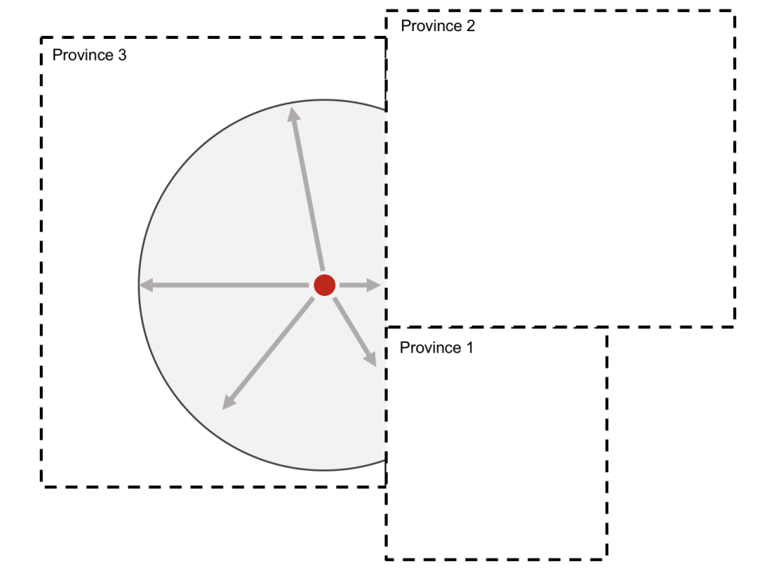
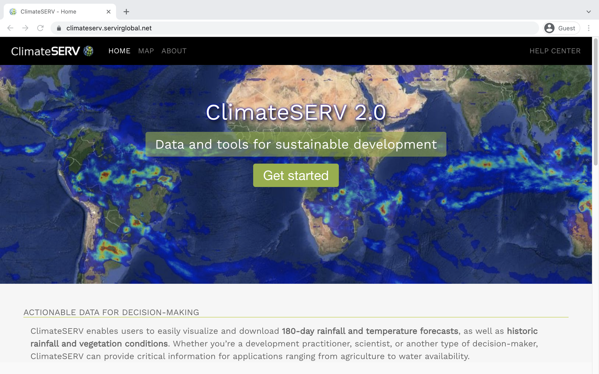

If you've been following along with [this series](../../index.html#category:Nutrition), you already know that [PMA nutrition surveys](https://www.pmadata.org/technical-areas/nutrition) offer researchers a unique opportunity to connect nutrition data for [women and young children](../2021-09-01-nutrition-discovery/index.html#household-nutrition-surveys) with data about their local [health and nutrition services](../2021-09-01-nutrition-discovery/index.html#sdp-nutrition-surveys) environment. PMA promotes this type of contextual research by cluster sampling both **households** and **service delivery points** within the same geographically-defined [enumeration areas](https://pma.ipums.org/pma-action/variables/EAID#description_section).

In this post, we'll take a look at *another* approach to studying contextual factors that impact nutrition. Specifically, we'll be laying the groundwork for our next post, where we'll dive into [a recent paper](https://iopscience.iop.org/article/10.1088/2515-7620/ac07f5/meta) published in *Environmental Research Communications* that explores the impact of **climate change** on rainfed agriculture in Burkina Faso. As we'll see, the authors use PMA nutrition data together with **local precipitation** measures from the [Climate Hazards center InfraRed Precipitation with Station dataset (CHIRPS)](https://www.chc.ucsb.edu/data/chirps) to show how spatial patterns of growing season quality impact the [quality and variety](../2021-10-01-nutrition-indicators/index.html) of foods available for women and young children. 

Research like this is made possible when we know the *approximate centroid location* for enumeration areas used in PMA nutrition surveys. PMA offers displaced GPS coordinates for all of its nutrition surveys [here](https://www.pmadata.org/data/request-access-datasets). In preparation for our next post, we'll show how to combine these GPS coordinates with an IPUMS PMA data extract and precipitation [raster data](https://rspatial.org/terra/spatial/4-rasterdata.html) downloaded from CHIRPS. 

# Setup 

To get started, we'll download a 2017 Burkina Faso nutrition data extract from [IPUMS PMA](https://pma.ipums.org/pma-action/variables/group?unit_of_analysis=person_nutrition) and load it into R. We've selected responses only for "Females and Children with Nutrition Information" (all other household members have been omitted). As usual, we'll save the "dat" file together with the "xml" codebook in our working directory, and we'll then load both into R with the [tidyverse](https://tidyverse.tidyverse.org/) and [ipumsr](http://tech.popdata.org/ipumsr/) packages. 

```{r, include=FALSE}
library(tidyverse)
library(ipumsr)
library(sf)
library(terra)
library(ggspatial)
dat <- read_rds("data/ipums.rds.gz")

knitr::opts_chunk$set(eval = TRUE, echo = TRUE)
```

```{r, eval=FALSE}
library(tidyverse)
library(ipumsr)

dat <- read_ipums_micro(
  ddi = "data/pma_00002.xml",
  data = "data/pma_00002.dat.gz"
)
```

Notably, IPUMS PMA *does not* disseminate the GPS coordinates we'll be using in this post. Instead, you'll need to [apply](https://www.pmadata.org/data/request-access-datasets) to download them directly from our partners at PMA. Once approved, you'll receive a CSV file containing the **displaced centroid** for every enumeration area represented in our data extract `dat`. You'll also receive complete [documentation](PMA_displacement.pdf) detailing the procedure PMA used to displace each centroid from its original location.

If you're new to spatial analysis in R, you might expect to begin by loading the CSV into R the [usual way](https://readr.tidyverse.org/reference/read_delim.html):

```{r}
gps <- read_csv("data/gps_bf.csv") %>% 
  select(EA_ID, GPSLONG, GPSLAT, DATUM)
gps 
```

Here, we see one row for each of the 83 enumeration areas included in the 2017 Burkina Faso sample. The column `EA_ID` corresponds to the variable [EAID](https://pma.ipums.org/pma-action/variables/EAID), and the displaced latitude and longitude points are displayed in `GPSLAT` and `GPSLONG`, respectively. The column `DATUM` shows the coordinate reference system for those points: "WGS84" for the World Geodetic System 1984.

In order to perform geometrical operations with these `gps` coordinates, we'll need to load the [sf package](https://r-spatial.github.io/sf/index.html) designed for manipulating [simple features](https://en.wikipedia.org/wiki/Simple_Features) used by geographic information systems. We've covered the basics of this package in previous posts [here](../2021-01-29-mapping-sdp-variables/) and [here](../2021-02-04-merging-external-spatial-data/), so we'll skip over some of the introductory details this time; however, it's crucial to know that `sf` requires three **operating system dependencies**: 

  * [GEOS](https://trac.osgeo.org/geos) for geometrical operations on projected coordinates
  * [PRØJ](http://proj.org/) for coordinate reference system conversion and transformation
  * [GDAL](http://www.gdal.org/) for driver options

Make sure to follow [these instructions](https://r-spatial.github.io/sf/index.html#installing) for installing `GEOS`, `PRØJ`, and `GDAL` on your operating system. You may also need to update R, and then run `install.packages("sf")`. 

## Simple features objects 

Once you've installed `sf`, load it into R and use [st_as_sf](https://r-spatial.github.io/sf/reference/st_as_sf.html) to coerce `gps` into the "simple features" object class. We'll tell `sf` that the coordinates data are stored in `GPSLONG` and `GPSLAT`, and that the points are modeled with the coordinate reference system (crs) `4326` (this is  the [EPSG](https://epsg.io/4326) code corresponding to the World Geodetic System 1984). 

<aside>
```{r, echo=F}
htmltools::a(
  href = "https://r-spatial.github.io/sf/index.html",
  htmltools::img(src = "../../images/hex/sf.png")
)
```
© ([GPLv2](http://www.gnu.org/licenses/old-licenses/gpl-2.0.html))
</aside>

```{r}
library(sf)
gps <- gps %>% 
  st_as_sf(
    coords = c("GPSLONG", "GPSLAT"), 
    crs = 4326
  )
gps 
```

The result of this transformation looks something like a [tibble](https://tibble.tidyverse.org/), except that it contains a header describing a **simple feature collection** with 83 "features" (one per enumeration area) and 2 "fields" (`EA_ID` and `DATUM`). The new column `geometry` replaces `GPSLONG` and `GPSLAT`, and it contains the latitude / longitude for each displaced centroid. 

There are several graphics packages available for mapping **simple feature collections**, but we'll focus here on [ggspatial](https://paleolimbot.github.io/ggspatial/index.html) - an extension of the [ggplot2](https://ggplot2.tidyverse.org/index.html) package we've introduced [elsewhere on this blog](../2021-07-15-covid-likert/). For example, we can now easily lay out the displaced centroid for each `EAID` as a point on a grid like so: 

<aside>
In this post, we'll be plotting `SpatRaster` objects from the [terra](https://rspatial.github.io/terra/index.html) package. Support for `terra` objects is provided in `ggspatial` version `1.1.5.9000` (currently available on [GitHub](https://github.com/paleolimbot/ggspatial)).
</aside>

```{r}
library(ggspatial)
ggplot() + layer_spatial(gps)
```

The `ggspatial` package comes with several base-map options, accessible via [annotation_map_tile](https://paleolimbot.github.io/ggspatial/reference/annotation_map_tile.html). However, we'll use a **shapefile** we've [downloaded from IPUMS PMA](https://pma.ipums.org/pma/gis_boundary_files.shtml) and saved in the "data" folder of our working directory. We'll use [sf::st_read](https://r-spatial.github.io/sf/reference/st_read.html) to load it as another **simple feature collection** (we'll also drop some columns that we won't be using in this post). 

```{r}
shape <- st_read("data/shape_bf") %>% select(ADMIN_NAME)
shape
```

With `ggspatial`, you can layer different **simple feature collections** together, much like you would layer multiple geometries on a bar chart or any other figure in `ggplot2`. We'll build a transparent layer for `shape` (by setting `alpha = 0`), and then we'll build a layer for `gps`.

```{r}
ggplot() + 
  layer_spatial(shape, alpha = 0) + # `alpha = 0` makes the shapes transparent
  layer_spatial(gps) 
```

## Plot theme 

In previous posts, we've shown how to [make a custom theme](../2021-08-01-covid-batches/#plot-theme) for plots made with `ggplot2`. Because `ggspatial` is a spatial extension of `ggplot2`, we'll do so again here to create `theme_pma_rainfall`. This theme builds on [theme_minimal](https://ggplot2.tidyverse.org/reference/ggtheme.html) by specifying a font, several label and color options, a few custom mapping options: 

  * `title` gives us a quick way to provide a title for our map 
  * `subtitle` provides an optional subtitle
  * `show_legend` allows us to show or hide a pre-designed legend describing the shapes we'll use to show urban and rural enumeration areas
  * `manual_grid` describes the coordinates of one particular enumeration area we'll be focusing on in an example below

```{r}
sysfonts::font_add(
  family = "cabrito", 
  regular = "../../fonts/cabritosansnormregular-webfont.ttf"
)
showtext::showtext_auto()

theme_pma_rainfall <- function(
  title, 
  subtitle = NULL, 
  show_legend = TRUE,
  manual_grid = FALSE
){
  components <- list(
    theme_minimal() %+replace% 
      theme(
        text = element_text(family = "cabrito", size = 10), 
        plot.title = element_text(
          hjust = 0,
          size = 18, 
          color = "#00263A", # IPUMS navy
          margin = margin(b = 5)
        ), 
        plot.subtitle = element_text(
          size = 12, 
          hjust = 0,
          margin = margin(b = 10)
        )
      ),
    labs(
      title = title, 
      subtitle = subtitle,
      fill = "Rainfall total (mm)",
      size = "EA displacement buffer",
      x = NULL,
      y = NULL
    ),
    guides(size = guide_legend(override.aes = list(alpha = 1))),
    annotation_scale(aes(style = "ticks", location = "br")),
    if(show_legend){c(
      geom_point(
        mapping = aes(size = URBAN + 1, x = 0, y = 14),
        data = gps,
        alpha = 0, 
        shape = 21, 
        fill = "white"
      ),
      scale_size(
        breaks = c(1, 2), 
        range = c(.75, 3), 
        labels = c("Urban (2 km)", "Rural (5 km)")
      )
    )},
    if(manual_grid){c(
      scale_x_continuous(breaks = seq(from = -0.4, to = -0.2, by = 0.025)),
      scale_y_continuous(breaks = seq(from = 13.4, to = 13.6, by = 0.025)),
      scale_fill_gradient2(high = "#BEC4CB")
    )}
  )
}
```

We'll be layering `theme_pma_rainfall` onto our `ggspatial` maps like so: 

```{r, layout="l-body-outset", fig.width=10, fig.height=8}
ggplot() + 
  layer_spatial(shape, alpha = 0) + 
  layer_spatial(gps) + 
  theme_pma_rainfall(
    title = "2017 Burkina Faso Nutrition Survey Enumeration Areas",
    subtitle = "Displaced centroid location for household sample clusters",
    show_legend = FALSE
  )
```

# Enumeration Area Buffers

We mentioned above that the `gps` coordinates downloaded from PMA are *not* the actual centroid locations for each EA. These coordinates are **randomly displaced** from the *actual* centroid, subject to certain rules:

  * urban EAs were displaced up to 2 kilometers in any direction
  * 99% of rural EAs were displaced up to 5 kilometers in any direction
  * 1% of rural EAs were discplaced up to 10 kilometers in any direction
  * displaced coordinates could *not* cross one of the administrative boundaries shown in our shape file 
  
```{r, fig.align='center', fig.cap="Image courtesy https://pmadata.org", echo=FALSE}

```

In order to better represent the *actual* centroid location for each EA, we'll use [sf::st_buffer](https://r-spatial.github.io/sf/reference/geos_unary.html) to create an appropriately sized **buffer zone** around the displaced `gps` coordinates for urban and rural areas. First, we'll need to [project](https://ipums.github.io/pma-data-hub/posts/2021-02-04-merging-external-spatial-data/#population-density-working-with-raster-data) both `gps` and `shape` with a coordinate reference system that uses **meters** rather than degrees of latitude / longitude. We'll use [EPSG code 32630](https://epsg.io/32630) to select an appropriate projection for Burkina Faso. Notice that the `geometry` column for each now describes a point in meters:

```{r}
# Project `gps` to meters 
gps <- gps %>% st_transform(crs = 32630)
gps

# Project `shape` to meters 
shape <- shape %>% st_transform(crs = 32630)
shape
```

Next, we'll need to identify which of the EAs in `gps` are located in urban areas. To do so, we'll use the `URBAN` indicator for each `EAID` in our data extract `dat`. 

```{r}
gps <- dat %>% 
  count(EAID, URBAN) %>% 
  select(EAID, URBAN) %>% 
  mutate(URBAN = if_else(URBAN == 1, TRUE, FALSE)) %>% 
  full_join(gps %>% rename(EAID = EA_ID), ., by = "EAID")
gps
```

The function [st_buffer](https://r-spatial.github.io/sf/reference/geos_unary.html) will draw a circle around each centroid. We'll specify that the radius of our circle should be 2000 meters if a particular EA is `URBAN`, and 5000 meters otherwise. We'll then bisect each circle with [st_intersection](https://r-spatial.github.io/sf/reference/geos_binary_ops.html) if it crosses an administrative boundary in `shape`, and we'll use [st_filter](https://r-spatial.github.io/sf/reference/st_join.html) to discard any resulting section that does not contain one of the original centroids in `gps`.

<aside>
We use a 5 km buffer for *all* rural EAs in our maps, but remember that an unknown 1% of rural EAs were actually displaced 10 km.
</aside>

```{r}
gps <- gps %>% 
  st_buffer(if_else(.$URBAN, 2000, 5000)) %>% 
  st_intersection(shape) %>% 
  st_filter(gps) 
gps 
```

Notice that the `geometry` column now describes a "polygon" rather than a "point". This polygon is defined by a series of latitude / longitude pairs that form the circumference of a **buffer zone**.

We're finished measuring distance in **meters**, so we'll revert *back* to degrees of latitude / longitude and plot the result. (This time, we'll use the argument `show_legend = TRUE` to adopt the custom legend we designed for `theme_pma_rainfall`).

```{r, layout="l-body-outset", fig.width=10, fig.height=8}
gps <- gps %>% st_transform(crs = 4326)
shape <- shape %>% st_transform(crs = 4326)

ggplot() + 
  layer_spatial(shape, alpha = 0) + 
  layer_spatial(gps, alpha = 0) + 
  theme_pma_rainfall(
    title = "2017 Burkina Faso Nutrition Survey Enumeration Areas",
    subtitle = "Displaced centroid location for household sample clusters",
    show_legend = TRUE
  )
```

Now that we've identified the **buffer zone** for each cluster of sampled households, we're ready to calculate a measure of local precipitation for each household with data from CHIRPS.

# CHIRPS data  

The complete CHIRPS precipitation data series can be downloaded directly from the [UCSB Climate Hazards Center](https://data.chc.ucsb.edu/products/CHIRPS-2.0/), but we imagine most users will want to select an area of interest through the CHIRPS API provider, [ClimateServ](https://climateserv.servirglobal.net/). If you're familiar with tools for downloading and saving **raster** files, you can submit a request to ClimateServ directly from R via the [chirps R package](https://docs.ropensci.org/chirps/index.html). Or, if you're more comfortable using a graphic user interface, you can simply navigate to the ClimateServ homepage in your browser:

```{r, fig.align='center', echo=FALSE}

```

The ClimateServ website allows us to simply select the country boundaries for Burkina Faso. We'll select "download raw data" to download **daily rainfall totals** for a roughly 30 year period from June 1, 2017 (nutrition interviews were conducted between June and August). 

```{r, echo=FALSE}
knitr::include_graphics("images/climateserv2.png")
```

Once your request has been processed, you'll receive a compressed folder containing one "tif" image for each day in the 30 year timespan: that's 10,959 files containing comprising potentially several gigabytes of raster data. We've previously shown how to use the [raster](https://rspatial.org/raster/index.html) package to handle this type of data, but we'll now introduce the [terra](https://rspatial.org/terra/index.html) package as a newer, faster alternative. 

## Raster data with terra 

If you've installed all of the dependencies needed for `sf` above, you'll be able to install `terra` with `install.packages("terra")` and then load it into R.

```{r}
library(terra)
```

The magic behind `terra` is that it *avoids reading every image into R at once*. Instead, it [reads metadata about each image](https://rspatial.github.io/terra/reference/rast.html) - information about its spatial extent, coordinate reference system, and pixel count. Let's take a look at the metadata for the image associated with a particularly rainy day in 1997:

```{r}
day1 <- rast("data/chirps_bf/19970301.tif")
day1
```

<aside>
```{r, echo=F, out.width="95%"}
htmltools::a(
  href = "https://rspatial.github.io/terra/index.html",
  htmltools::img(src = "../../images/hex/terra.png")
)
```
© ([GPLv3](https://www.gnu.org/licenses/gpl-3.0.en.html))
</aside>

As you can see, this image contains 115 rows and 159 columns of pixels. The value in each pixel represents the rainfall - in millimeters - for an area 0.05 degrees longitude by 0.05 degrees latitutde (shown in the "resolution" field). If you just want to preview the [values](https://rspatial.github.io/terra/reference/values.html) associated with each pixel, we recommend coercing the default `matrix` as a `tibble`:

```{r}
day1_vals <- values(day1, dataframe = TRUE) %>% tibble()
day1_vals
```

The result is a single column with precipitation totals for 18,285 pixels. This is the CHIRPS data we've obtained for *a single day* in our 30-year timespan. Alone, it's not a lot of data:

```{r}
object.size(day1_vals) %>% format("Mb")
```

If you'd like, you can plot the rainfall pixels from March 1, 1997 with the same `ggspatial` tools shown above. We'll also ensure that all pixels representing "0" rainfall are transparent (revealing the underlying coordinate grid). 

```{r, layout="l-body-outset", fig.width=10, fig.height=8}
ggplot() +
  layer_spatial(
    day1,
    alpha = if_else(values(day1) == 0, 0, 1) # makes 0 values transparent
  ) +
  layer_spatial(shape, alpha = 0) +
  layer_spatial(gps,  alpha = 0) +
  theme_pma_rainfall(
    title = "Burkina Faso Rainfall Totals: March 1, 1997",
    subtitle = paste(
      "National precipitation with displaced centroid locations for 2017 PMA",
      "Nutrition Survey enumeration areas"
    )
  ) +    
  scale_fill_gradient2(
    low = "#000000",   # white
    high = "#00263A"  # IPUMS navy
  )
```

## Raster layers 

Now, imagine working with data for each of the 10,959 days in our data series. Whereas the total size of the dataset from a single day was small - only about 0.1 megabytes - the amount of data required to represent 18,285 pixels from daily collection over a 30-year period could easily overwhelm the amount of memory available to R. Instead, we'll only read metadata for each image into a large list with [purrr::map](https://purrr.tidyverse.org/reference/map.html):

```{r, eval=FALSE}
chirps <- list.files("data/chirps", full.names = TRUE) %>%
  map(~rast(.x))
```

```{r, include=FALSE}
# The folder `data_local` at project root is not on GitHub (see .gitignore)
# This is because raster files take up too much space
# Please add your own copy of this dataset to a `data_local` folder there
chirps <- list.files(
    "../../data_local/chirps/nutrition/bf", 
    full.names = TRUE
  ) %>% 
  map(~rast(.x)) 
```

We can now "stack" all of the list-items in `chirps` as "layers" in a single metadata object:

```{r}
chirps <- rast(chirps)
chirps
```

Notice that the amount of data actually loaded into R is only about one *kilobyte*:

```{r}
object.size(chirps) %>% format("Kb")
```

The `terra` package contains several [summary methods](https://rspatial.github.io/terra/reference/summarize-generics.html) you can use to quickly explore summary statistics over all of the layers included in our 30-year timespan. For example, `terra::mean` computes the mean value for each pixel across every layer of `chirps`. This can be particularly helpful if you want to create a map showing the 30-year average rainfall for selected enumeration areas relative to neighboring areas:

```{r, eval = FALSE}
bf_means <- terra::mean(chirps) 
```

```{r, include = FALSE}
bf_means <- rast("../2021-11-01-nutrition-analysis/data/chirps_means.tif")
bf_means <- bf_means[[7:37]]
```

When we build a map for `bf_means` we'll use [mask](https://rspatial.github.io/terra/reference/mask.html) simply to hide any pixels outside the boundaries of our `shape` file:

```{r, layout="l-body-outset", fig.width=10, fig.height=8}
ggplot() +
  layer_spatial(mask(bf_means, vect(shape), touches = FALSE)) + 
  layer_spatial(shape, alpha = 0) +
  layer_spatial(gps,  alpha = 0) +
  theme_pma_rainfall(
    title = "Burkina Faso 30-year Average Daily Rainfall",
    subtitle = paste(
      "National precipitation with displaced centroid locations for 2017 PMA",
      "Nutrition Survey enumeration areas"
    )
  ) +
  scale_fill_continuous(
    low = "#FAEFD1BB", high = "#00263ABB", na.value = "transparent"
  ) + 
  labs(caption = paste(
    sep = "\n",
    "Climate Hazards Center InfraRed Precipitation with Station data (CHIRPS)",
    "06-01-1987 to 06-01-2017"
  ))
```

For most analytic purposes, you'll want to do more than simply *layer* summary data beneath a map of the PMA enumeration areas. Instead, we'll want to [extract](https://rspatial.github.io/terra/reference/extract.html) the pixels associated with the area covered by the buffer zones we created above. 

# Rainfall within Enumeration Areas

Let's start by zooming-in one of the enumeration areas listed in our `gps` dataset. This *rural* EA is located near the eastern border in the Boucle du Mouhoun region, so you'll notice that its 5 kilometer buffer zone is cropped by an administrative boundary. 

```{r, fig.width=8, fig.height=8}
ggplot() + 
  layer_spatial(gps %>% filter(EAID == 7003), alpha = 0) +
  theme_pma_rainfall(
    "Enumeration Area 7003", 
    "A rural sample cluster in the Boucle du Mouhoun region",
    show_legend = FALSE,
    manual_grid = TRUE
  )   
```

In our single-day map above, we plotted national rainfall totals for March 1, 1997. We'll plot rainfall from this date again, but this time we'll use the `crop` function to focus only on pixels in the immediate vicinity of `EAID == 7003`.

```{r, fig.width=8, fig.height=8, preview = TRUE}
day1_7003 <- crop(
  day1, 
  gps %>% filter(EAID == 7003), 
  snap = "out"
)

ggplot() + 
  layer_spatial(day1_7003) + 
  layer_spatial(gps %>% filter(EAID == 7003), alpha = 0) + 
  theme_pma_rainfall(
    title = "Rural EA Rainfall Total: March 1, 1997", 
    subtitle = "One daily total is reported for every 0.05 arc-degrees",
    show_legend = FALSE, 
    manual_grid = TRUE
  ) 
```

Interestingly, we see a range of rainfall totals across the 9 pixels in this area: trace amounts of rain were detected in the 6 western-most pixels, but not in the 3 pixels on the eastern side. *How should we summarise the rainfall experienced by a household in this enumeration area, given that its centroid might be located any one of several different pixels?* 

You might consider taking the mean daily total for all 9 pixels, but 2 pixels (top-right and bottom-right) are not included in the buffer zone at all.
Most of the remaining pixels only *partially* overlap with the buffer zone - you might reasonably conclude the centroid is more likely to fall within the bottom 2 rows of pixels than in the top row. 

Fortunately, the `terra` function `extract` gives both the rainfall total *and* the proportion of each pixel overlapping with buffer zone if we specify `weights = TRUE`. We'll need to use [vect](https://rspatial.github.io/terra/reference/vect.html) to coerce the `gps` object into the `SpatVector` class used by most `terra` functions. 

```{r}
day1_7003 <- extract(
  day1_7003, 
  gps %>% filter(EAID == 7003) %>% vect(), 
  weights = TRUE
)

day1_7003 
```

The result is a `data.frame` containing one row for each pixel that overlaps with our buffer (the top-right and bottom-right pixels are omitted). The column `19970301` gives the rainfall for each pixel, and the column `weight` shows the proportion of each pixel that falls within the buffer. We can think of these `weight` values as probabilities representing the likelihood that each pixel contains the real centroid location for `EA == 7003`. Let's calculate a `weighted.mean` using the probabilities represented by `weight`:

```{r}
day1_7003 %>% 
  summarise(
    EAID = 7003,
    wtd_mean = weighted.mean(`19970301`, weight)
  )
```

This represents the approximate *single-day rainfall total* for March 1, 1997 spatially averaged for all pixels overlapping with the buffer for `EA == 7003`. In order to produce the *30-year average daily rainfall* for this buffer, we'll simply repeat the same process for each day between June 1, 1987 and June 1, 2017 (the entire stack represented by `chirps`). We'll arrange the results in a `tibble`, and we'll replace the default `ID` column with the unique identifier for each `pixel` shown above.

```{r, eval=FALSE}
chirps30_7003 <- extract(
  chirps,
  gps %>% filter(EAID == 7003) %>% vect(),
  weights = TRUE
)

chirps30_7003 <- chirps30_7003 %>%
  tibble() %>%
  dplyr::select(-ID) %>%
  rowid_to_column("pixel") %>%
  relocate(weight, .after = pixel)

chirps30_7003
```

```{r, echo=FALSE}
chirps30_7003 <- read_rds("data/ea_one.gz") 
chirps30_7003
```

The rainfall total for each day is stored in one of 10,959 columns to the right of `pixel` and `weight`. We'll use `pivot_longer` to rearrange these data in rows, and then we'll calculate a simple `weighted.mean` to obtain the 30-year average daily rainfall. 

```{r}
chirps30_7003 <- chirps30_7003 %>% pivot_longer(-c(pixel, weight)) 
chirps30_7003   

chirps30_7003 %>% 
  summarise(
    EAID = 7003,
    MEAN_20YR = weighted.mean(value, weight)
  )
```

Now that we've developed a strategy for summarising all of the rainfall pixels for a *single* enumeration area, we'll see that it's easy to generalize our approach to *all* of the enumeration areas associated with the 2017 Burkina Faso sample. Although we'll save a great deal of time by focusing *only* on the CHIRPS pixels that fall within each of our 83 buffer zones, the `extract` procedure below will still require a few minutes of patience:

```{r, eval = FALSE}
chirps30_all <- chirps %>%
  extract(gps %>% vect(), weights = TRUE) %>%
  as.data.frame() %>%
  tibble()
chirps30_all
```

```{r, echo = FALSE}
chirps30_all <- read_rds("data/ea_all.gz")
chirps30_all 
```

The only difference here is that `ID` represents an index number for each of the 83 enumeration areas, and each enumeration area may include anywhere between 1 and 9 pixels. We haven't bothered assigning numbers to each pixel, but we'll need to find the correct `EAID` for each `ID`.

```{r}
chirps30_all <- gps %>% 
  rowid_to_column("ID") %>% 
  tibble() %>% 
  dplyr::select(ID, EAID) %>% 
  full_join(chirps30_all, by = "ID")
chirps30_all
```

Finally, we'll `pivot_longer` and calculate a separate `weighted.mean` for each `EAID`. The result can be merged directly to `gps` if we'd like to create a map:

```{r, layout="l-body-outset", fig.width=10, fig.height=8}
gps <- chirps30_all %>% 
  pivot_longer(-c(ID, EAID, weight)) %>% 
  group_by(EAID) %>% 
  summarise(CHIRPS_30 = weighted.mean(value, weight)) %>% 
  full_join(gps, by = "EAID")

ggplot() + 
  layer_spatial(shape, alpha = 0) + 
  layer_spatial(gps, aes(fill = CHIRPS_30, stroke = 0)) + 
  theme_pma_rainfall(
    title = "Burkina Faso 30-year Average Daily Rainfall", 
    subtitle = "PMA 2017 Nutrition Survey enumeration area centroid locations"
  ) + 
  scale_fill_steps(low = "#FAEFD1", high = "#00263A") +
  labs(caption = paste(sep = "\n",
    "Climate Hazards Center InfraRed Precipitation with Station data (CHIRPS)",
    "06-01-1987 to 06-01-2017"
  ))
```

We can also attach these local rainfall totals to the records for individual women and children in the 2017 Burkina Faso nutrition dataset `dat`. At this point, the **simple features collection** class is no longer necessary; we can simply join `CHIRPS_30` directly to `dat`.  

```{r}
gps %>% 
  select(EAID, CHIRPS_30) %>% 
  full_join(dat, by = "EAID") 
```

In our next post, we'll learn much more about the relationship between CHIRPS precipitation data and nutritional outcomes for the women and young children in this survey. Stay tuned! 