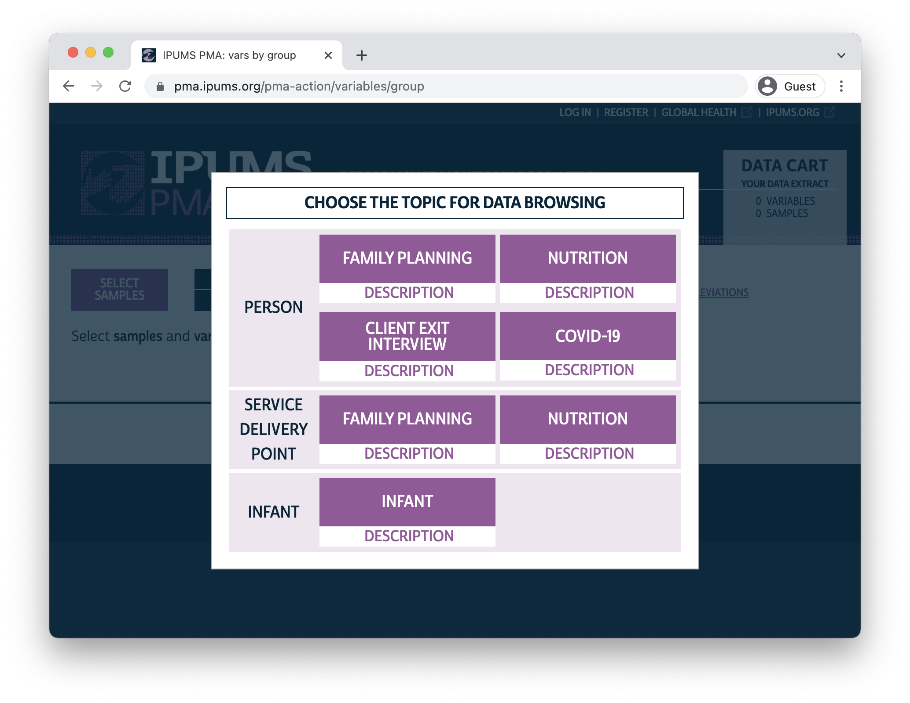
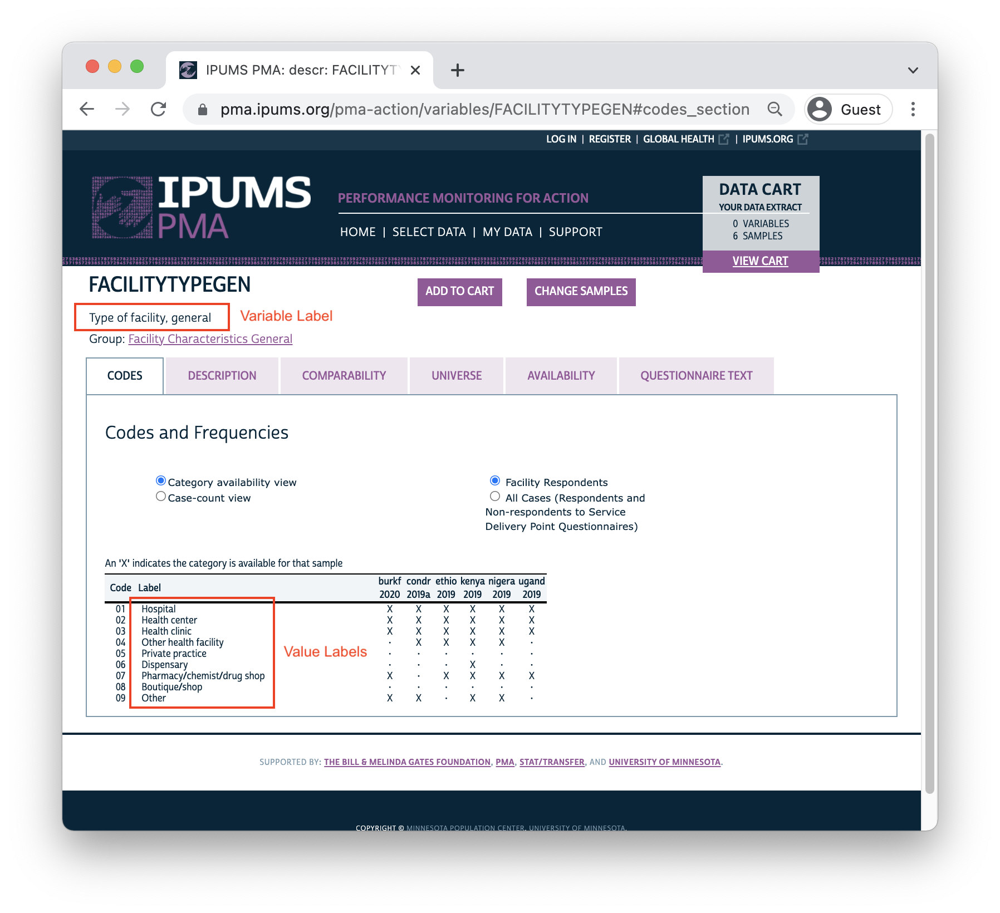
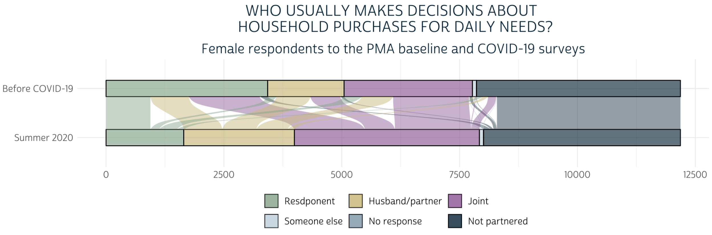

```{r, include=FALSE}
knitr::opts_chunk$set(echo = FALSE)
```

We launched the **IPUMS PMA Data Analysis Hub** one year ago this week, and we've covered a *lot* since then! As we're gearing up for new series exploring [Client Exit Interviews](https://pma.ipums.org/pma/sample_notes.shtml#client) and longitudinal analysis with [Round 2 Panel Data](https://www.pmadata.org/data/survey-methodology) in the coming months, we thought it might be a nice time to pause and take inventory of the important concepts we've covered in our first year. 

# Introduction Course

Looking for a place to start learning about IPUMS PMA data with coding examples in your preferred programming language? Check out our new [online introduction course](../../introduction.html)! This course is free and open to all registered IPUMS PMA data users. You'll learn all about PMA surveys, the IPUMS data extract system, and basic analysis tools for R or Stata.  

# Data Discovery 

Our [Data Discovery](../../index.html#category:Data_Discovery) posts are where you'll find announcements about [new data releases](../../index.html#category:New_Data) and deep-dives into available data for a featured topic. So far, we've explored:

  * [Service Delivery Point (SDP)](../2021-01-26-sdp-data/) surveys
  * [COVID-19](../2021-06-15-covid-discovery/) surveys 
  * [Nutrition](../2021-09-01-nutrition-discovery/) surveys for women and young children
  * [Migration](../2021-04-15-migration-discovery/) history data
  * External sources for [climate](../2021-10-15-nutrition-climate/), [population density](../2021-02-04-merging-external-spatial-data/#population-density-working-with-raster-data), and [infrastructure](../2021-02-04-merging-external-spatial-data/#road-networks-working-with-vector-data) data that complement PMA surveys

```{r}

```

<aside>
**Data Discovery** posts help you navigate the [IPUMS PMA](https://pma.ipums.org/) website to find the most important variables related to a particular topic.
</aside>

# Data Manipulation

A [Data Manipulation](../../index.html#category:Data_Manipulation) post typically showcases tips for recoding, reshaping, describing, or visualizing variables included in an IPUMS PMA data extract. Often, we'll feature tools from one or two of [our favorite R packages](../2020-12-10-get-r-and-packages/#r-packages); while we always recommend visiting package documentation websites, our goal here is to show why these tools are important specifically for working with data from IPUMS PMA. 

## IPUMS labelled data 

<div>
Almost every post uses the [ipumsr](http://tech.popdata.org/ipumsr/) package to import an IPUMS PMA data extract into R. Once loaded, you'll find that many IPUMS PMA variables are [labelled](http://tech.popdata.org/ipumsr/articles/value-labels.html); the `ipumsr` package contains functions for exploring and manipulating those labels. We've shown how to:

  * [load an IPUMS PMA data extract into R](../2020-12-10-get-ipums-pma-data/)
  * [recode or label NA values](https://ipums.github.io/pma-data-hub/posts/2021-01-28-across-sdp/#recoding-variables-with-ipumsr) for a particular variable
  * [convert labelled variables into factors](https://ipums.github.io/pma-data-hub/posts/2021-07-01-covid-tables/#display-value-labels) for tables and figures

```{r}

```
</div> 

<aside>
```{r, echo=F}
htmltools::a(
  href = "http://tech.popdata.org/ipumsr/",
  htmltools::img(src = "../../images/hex/ipumsr.png")
)
```
© IPUMS ([MPL 2.0](https://www.mozilla.org/en-US/MPL/2.0/))

<br>
<br>

The [ipumsr](http://tech.popdata.org/ipumsr/) package provides tools to access and manipulate **labels**.
</aside>

## Iteration with columns

When you want to apply changes to *several* IPUMS PMA variables, it's usually most efficient to leverage the [across]() function from [dplyr](). We use `across` all the time, but some of our best examples show how to:

  * [use tidy selection](../2021-08-01-covid-batches/index.html#using-dplyracross) to identify variables by location or a naming pattern
  * [recode or label NA values for several variables](..//2021-01-28-across-sdp/#introducing-dplyracross) with tools from `ipumsr`
  * check conditions for multiple variables with [if_any and if_all](../2021-10-01-nutrition-indicators/#mdd-minimum-dietary-diversity) 

## Iteration with rows 

<div> 
Many functions in R are [vectorized](https://adv-r.hadley.nz/perf-improve.html#vectorise): when you apply them to a column in your data frame, you typically get **one result for each row**. 

**Non-vectorized** functions instead return **one result summarizing the entire column**. For instance, the function [mean]() gives you one mean value derived from all rows in a given column. Tools from `dplyr` like [rowwise](https://dplyr.tidyverse.org/dev/articles/rowwise.html) and [group_by](https://dplyr.tidyverse.org/articles/grouping.html?q=group) allow us to apply non-vectorized functions to individual rows or groups of rows. We've used these functions to: 

  * summarize variables [within groups]((../2021-01-28-summarize-by-easerved/#summarise-by-easerved-and-sample))
  * summarize variables [within the same row](../2021-01-28-across-sdp/#summarize-variable-groups-by-facility) with  [c_across](https://dplyr.tidyverse.org/reference/c_across.html)
  * iterate through groups with help from  [cur_group](../2021-09-15-nutrition-linking/#identifying-the-current-group)
</div> 

<aside>
```{r, echo=F}
htmltools::a(
  href = "https://dplyr.tidyverse.org/",
  htmltools::img(src = "../../images/hex/dplyr.png")
)
```
© RStudio ([CC0 1.0](https://creativecommons.org/publicdomain/zero/1.0/))
</aside>
  
## Joining and Reshaping 

<div> 
All of the IPUMS PMA data extracts we've examined so far are **rectangular** in shape: each row represents one person or facility. Sometimes, it's necessary to change this structure: we might want to spread multiple observations of the same individual into separate rows, or we might want to leverage **hierarchical** data to situate a person within some larger context (like a household, a region, or a country). With help from data-structuring packages like [tidyr](https://tidyr.tidyverse.org/), we've shown how to: 

  * [merge summary SDP data](../2021-01-28-summarize-by-easerved/) to records for individual women
  * [merge baseline and COVID-19 follow up surveys](https://ipums.github.io/pma-data-hub/posts/2021-08-15-covid-analysis/#change-in-purchasing-power) for women in a panel study
  * pivot event-history data from a [wide to long format](../2021-04-15-migration-discovery/) and [back again](../2021-05-24-migration-data-analysis/#why-people-migrate) 
  * use [nested data structures](../2021-09-15-nutrition-linking/#identifying-the-current-group) for individuals grouped by household 
</div>
  
<aside>
```{r, echo=F}
htmltools::a(
  href = "https://tidyr.tidyverse.org",
  htmltools::img(src = "../../images/hex/tidyr.png")
)
```
© RStudio ([CC0 1.0](https://creativecommons.org/publicdomain/zero/1.0/))
</aside>

## Visualization

<div>
Whenever we summarize variables or model output on this blog, we like to make figures with [ggplot2](https://ggplot2.tidyverse.org/index.html) and tables with [gtsummary](http://www.danieldsjoberg.com/gtsummary/index.html). For maps, we've focused on [ggspatial](https://paleolimbot.github.io/ggspatial/index.html) - an extension of `ggplot2` that supports raster data from both the [raster](https://rspatial.github.io/raster/index.html) package and the [terra](https://rspatial.github.io/terra/index.html) package. Topics include:

  * [designing a theme](../2021-08-01-covid-batches/#plot-theme) for `ggplot2` (custom fonts, colors, and layout)  
  * [basic bar charts](../2021-07-15-covid-likert/#basic-bar-charts)
  * [grouped bar charts](../2021-07-15-covid-likert/#position) 
  * [divergent stacked bar charts](../2021-07-15-covid-likert/#divergent-stacked-bar-chart)
  * [faceted bar charts](../2021-07-15-covid-likert/#faceted-neutral-non-response)
  * [lollipop charts](../2021-08-01-covid-batches/#lollipop-chart)
  * [radar charts](..//2021-08-01-covid-batches/#radar-chart) 
  * [alluvial charts](../2021-05-24-migration-data-analysis/#visualizing-migration-alluvial-plots)
  * [dot and whisker charts](../2021-02-19-analyzing-the-individual-in-context/#regression-models)
  * [error bars and text annotation](../2021-07-15-covid-likert/#stat)
  * [maps](https://ipums.github.io/pma-data-hub/posts/2021-10-15-nutrition-climate/#simple-features-objects) with `ggspatial`
  * [descriptive tables](../2021-07-01-covid-tables/#descriptive-statistics-table) and [model summary tables](../2021-07-01-covid-tables/#model-summary-table) with `gtsummary`
</div>

<aside>
```{r, echo=F}
htmltools::a(
  href = "https://ggplot2.tidyverse.org/index.html",
  htmltools::img(src = "../../images/hex/ggplot2.png")
)
```
© RStudio ([CC0 1.0](https://creativecommons.org/publicdomain/zero/1.0/))
</aside>

```{r}

```

<aside>
**Data Manipulation** posts include tips for data wrangling,  exploration, and presentation.
</aside>

## Spatial data

<div>
Lastly, we've devoted several Data Manipulation posts to exploring external sources for spatial data. If you're new to spatial data - or if you're an ArcGIS user interested in learning more about R - we recommend checking out the free, open-source text [Geocomputation with R](https://geocompr.robinlovelace.net/). You'll be introduced to both of the major packages we use on this blog: [sf](https://r-spatial.github.io/sf/index.html) for vector data and [terra](https://rspatial.github.io/terra/index.html) for raster data. We're planning to cover *much more* spatial content in the coming months, but so far we've explained how to: 
 
  * find and use [PMA GPS coordinates](../2021-10-15-nutrition-climate/#setup) 
  * find and use [IPUMS PMA shapefiles](../2021-10-15-nutrition-climate/#simple-features-objects) 
  * create enumeration area [buffer zones](../2021-10-15-nutrition-climate/#enumeration-area-buffers)
  * understand and manipulate [coordinate reference systems](../2021-02-04-merging-external-spatial-data/#population-density-working-with-raster-data) 
  * merge external [vector data](../2021-02-04-merging-external-spatial-data/#road-networks-working-with-vector-data) with the `sf` package
  * merge external raster data with both the [raster package](../2021-02-04-merging-external-spatial-data/#population-density-working-with-raster-data) and the newer [terra package](../2021-10-15-nutrition-climate/#raster-data-with-terra)
</div>

<aside>
```{r, echo=F}
htmltools::a(
  href = "https://r-spatial.github.io/sf/index.html",
  htmltools::img(src = "../../images/hex/sf.png")
)
```
© Edzer Pebesma ([GPLv2](http://www.gnu.org/licenses/old-licenses/gpl-2.0.html))

```{r, echo=F}
htmltools::a(
  href = "https://rspatial.github.io/terra/index.html",
  htmltools::img(src = "../../images/hex/terra.png")
)
```
© Robert J. Hijmans et al. ([GPLv3](https://www.gnu.org/licenses/gpl-3.0.en.html))
</aside>

# Data Analysis 

We like to end every series with a [Data Analysis](../../index.html#category:Data_Analysis) post. Here, we use what we've learned in earlier posts to build a model and discuss important findings. Often, we'll use this as an opportunity to showcase new and exciting [published research](../../index.html#category:PMA_Publications) from authors working with PMA data. These posts discuss: 

<div>
  * [design elements for the household and female surveys](../2021-02-19-analyzing-the-individual-in-context/#individual-factors-model-with-svyglm) like sample weights and information about cluster sampling
  * [design elements for COVID-19 follow up surveys](../2021-08-15-covid-analysis/index.html#sampling-weights) 
  * [ordinary least squares regression](../2021-02-19-analyzing-the-individual-in-context/#individual-factors-model-with-glm)  
  * [binary logistic regression](../2021-04-01-et-internal-migration/#regression-model) 
  * [multinomial models](../2021-08-15-covid-analysis/#multinomial-modeling) 
  * [multi-level mixed effect models](../2021-11-01-nutrition-analysis/#multi-level-mixed-effects-models) 
  * [survival analysis](../2021-05-15-paa-2021/) 
  * [cluster robust standard error estimation](../2021-02-19-analyzing-the-individual-in-context/#individual-factors-model-with-svyglm)
  * [bootstrapped standard error estimation](../2021-04-01-et-internal-migration/#predicted-probabilities)
</div>
  
<aside>
```{r, echo=F}
htmltools::a(
  href = "http://gdfe.co/srvyr/index.html",
  htmltools::img(src = "../../images/hex/srvyr.png")
)
```
© Greg Freedman Ellis et al. ([GPL 2](https://www.gnu.org/licenses/old-licenses/gpl-2.0.en.html) | [GPL 3](https://www.gnu.org/licenses/gpl-3.0.html))
</aside>

```{r}
knitr::include_graphics("images/model.png")
```

<aside>
We walk through source code from recent publications with PMA data in a **Data Analysis** post.
</aside>

# Plans for 2022

We've been trilled to connect with so many of you - more than 2,000 readers in over 100 countries - in our first year! Coming in the months ahead, we'll continue providing bi-weekly blog posts covering the latest IPUMS PMA data releases as they become available. We've mentioned upcoming series planned for **Client Exit Interviews** and **Round 2 Panel Data**, and we'll also return to the **relationship between COVID-19 and family planning** in new samples. We plan to continue emphasizing **spatial analysis** made possible with external data sources, and we'd love to expand our coverage of **PMA publications** in collaboration with researchers using IPUMS PMA data in their own work. We're also planning a **new course on longitudinal analysis** using the first two rounds of PMA panel data; look for new announcements on this in the early spring. And, as always, we'll continue exploring free and powerful **tools for working with survey data in R** that we hope will make IPUMS PMA accessible to more researchers than ever before.

*Special thanks to all of our outstanding partners at the [Bill & Melinda Gates Foundation](https://www.gatesfoundation.org/), [Johns Hopkins University](https://www.pmadata.org/), and here at [IPUMS](https://www.ipums.org/) for tremendous support as we launched this new project in 2021!* 

*This blog would not be possible without brilliant insight and ongoing encouragement from the whole team at IPUMS PMA: professors Kathryn Grace, Elizabeth Heger Boyle, and Nina Brooks; project director Devon Kristiansen; post-doctoral associates Maya Luetke and Jiao Yu; and graduate research assistants Shelby Rutzick, Saeun Park, and Tayler Nelson who contributed posts this year - thanks to each of you!*