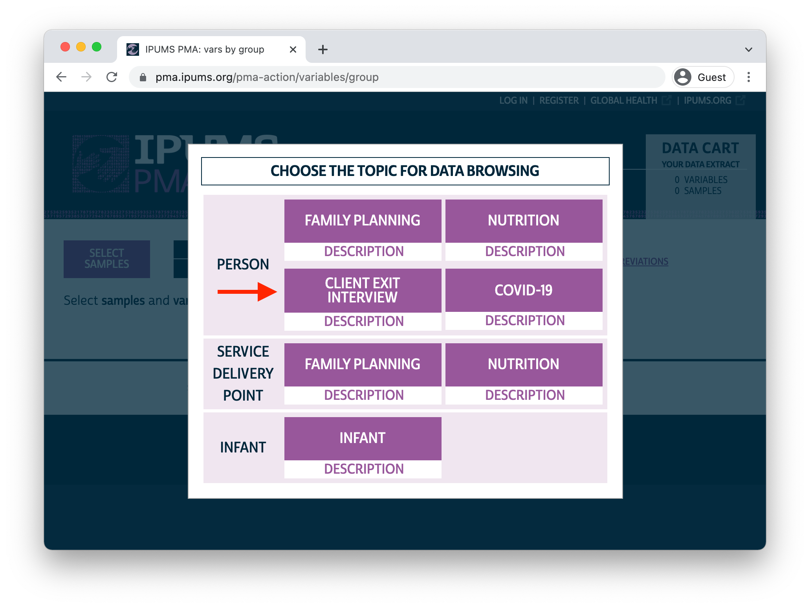

```{r, include=FALSE}
options(tibble.print_min = Inf)
```


This fall, IPUMS PMA released baseline data from a new study examining women's **assessment of care** received from providers of family planning services. [Previously](../2021-01-28-summarize-by-easerved), we've seen how PMA service delivery point (SDP) surveys can be combined with surveys of households and women sampled within the same geographically defined enumeration areas. These new **Client Exit Interview (CEI)** surveys represent women who have received care from a **specific provider** included in a contemporaneous SDP sample. 

Interviews for samples included in this release were conducted between December 2019 and November 2020. Women aged 15-49 receiving services at a participating SDP were approached by interviewers and asked to reflect on their visit. As we'll see, most questions were given only to women who received or discussed a family planning method with their provider. Questions address whether the woman received her preferred method, whether the advantages or disadvantages of certain methods were discussed, and how she felt about the overall experience. 

<aside>
A **convenience sample** of women leaving a facility that participated in the SDP survey
</aside>

Women who completed the baseline interview were invited to participate in a follow-up telephone interview six months afterward, but these follow-ups were canceled in most PMA countries because of disruptions caused by COVID-19. Coming this spring, IPUMS PMA plans to release data from a *second* round of baseline CEI interviews collected one year after the first round; from then onward, we expect to release six month follow-up interviews following each baseline survey. 

Today, we're launching a [new series](../../index.html#category:Client_Exit_Interviews) devoted to showcasing the first round of CEI baseline surveys. Let's see what's included in the release! 

# Sample Design 

CEI surveys are currently available from six PMA countries (more countries will be included in the second round planned for release in 2022): 

  * Burkina Faso 
  * Democratic Republic of Congo (DRC) - *Kinshasa and Kongo Central only*
  * India - *Rajasthan only*
  * Kenya 
  * Nigeria - *Kano and Lagos only* 
  * Uganda 

As we've discussed [elsewhere](../2021-01-26-sdp-data), up to three public-sector and three private-sector facilities are sampled for each enumeration area in a given SDP survey. Sampled SDPs were eligible to host client exit interviews only if their daily client volume was three or more. (We'll show how to link SDP and CEI data together in an upcoming post.)

CEI interviewers were present at eligible SDPs for two business days during which family planning services were offered to clients. They invited all female clients to participate in the survey; participants are those who agreed and affirmed that their age was between 15 and 49. Interviewers then asked participants whether they received or discussed a family planning method with their provider; this information is reported in the variable [FPINFOYN](https://pma.ipums.org/pma-action/variables/FPINFOYN):

<aside>
Family planning clients aged 15-49
</aside>

```
100. Did you receive any family planning information or a method during your 
visit today?

If no, thank her for her time and end the interview.

[] Yes
[] No
[] No response
```

## Missing data

Women who indicated that they did not receive or discuss a method in `FPINFOYN` were asked no further questions, but you'll find that these cases *are included* in all CEI data extracts. For all other variables derived from the CEI questionnaire (except for those that describe the facility and the woman's age), these cases will be labelled **NIU (not in universe)**. 

<aside>
PMA allows respondents to skip questions if they are deemed irrelevant based on answers to a previous question. Those cases will be marked  **NIU (not in universe)** as well.
</aside>

A small number of women declined consent to be interviewed. These cases are labelled **Not interviewed (female questionnaire)**, and they may be automatically excluded from your data extract by selecting "Female Respondents" rather than "All cases (Respondents and Non-respondents)" at checkout. 

If a woman declined to answer a particular question - but otherwise consented to the interview - her response will be labelled **No response or missing**. 

In many cases, you'll want to consolidate all types of "missing data" by marking them `NA` with help from the [ipumsr](http://tech.popdata.org/ipumsr/) package. For example, let's say you've downloaded the following data extract and placed it in the `data` folder of your working directory. 

```{r, results='hide'}
library(ipumsr)
library(tidyverse)

dat <- read_ipums_micro(
  ddi = "data/pma_00054.xml",
  data = "data/pma_00054.dat.gz"
)
```

Variables that you'd expect to be **binary** - with response options for "yes" or "no" - will have additional **top codes** for the three types of missing responses we've discussed. For example [DISCFPTODAY](https://pma.ipums.org/pma-action/variables/DISCFPTODAY) indicates whether the woman discussed family planning with her provider today:

```{r}
dat %>% count(DISCFPTODAY)
```

Notice that the **top codes** for missing data are numeric: 95, 98, and 99. These codes will will be the same for all **binary** variables, but not necessarily for **continuous** variables or variables with many response categories. For example, look at [FPMETHGIVEN](https://pma.ipums.org/pma-action/variables/FPMETHGIVEN), which describes the method or prescription given to the woman by her provider during the visit: 

```{r}
dat %>% count(FPMETHGIVEN)
```

Here, the **top codes** are left-padded to match the number of digits required for all of the response categories. They are now 995, 998, and 999. 

You'll find the value `NA` in some variables, but only if the associated question was excluded from one or more of the samples in your data extract. For instance, [GEOCD](https://pma.ipums.org/pma-action/variables/GEOCD) indicates whether respondents to the DRC sample were interviewed in Kinshasa or Konga Central; it's not included in the samples from other countries:

```{r}
dat %>% count(COUNTRY, GEOCD)
```

If you want to mark **all top codes** as `NA`, the easiest way to do so is to reference the *labels* rather than the numeric codes. We'll provide them to the `ipumsr` function [lbl_na_if](http://tech.popdata.org/ipumsr/reference/lbl_na_if.html) applied to all variables in our extract:

```{r}
dat <- dat %>% 
  mutate(across(everything(), ~lbl_na_if(.x,
    ~.lbl %in% c(
        "Not interviewed (female questionnaire)",
        "No response or missing",
        "NIU (not in universe)"
      )
  )))
```

<aside>
The value `NA` may be useful if, for example, you don't want to create **dummy variables** for missing values in an analytic model. R will usually drop `NA` cases by default.
</aside>

Now, missing responses for `DISCFPTODAY` and `FPMETHGIVEN` are simply `NA`. 

```{r}
dat %>% count(DISCFPTODAY)
dat %>% count(FPMETHGIVEN)
```

We encourage you to **use caution** when labelling values `NA`. You may find it useful to mark other values `NA` (e.g. "None of the above" or "Don't know"), but doing so may have unintended consequences for your analysis! 

## Sample weights 

Notably, **no sample weights** are available for CEI surveys: as we've discussed, PMA constructed  a *convenience sample* of women visiting eligible facilities over a two day period. Those facilities are, themselves, selected to reflect the service environment experienced by women in the **household and female sample** - neither CEI nor SDP samples are designed to be nationally or subnationally representative.  

# Topics  

You can browse an English version of the common CEI questionnaire [here](https://pma.ipums.org/pma/resources/questionnaires/sdp/PMA-Client-Exit-Interview-Questionnaire-English-2019.10.09.pdf), or you can find country-specific variations in both English and French (where appropriate) along with PMA **dataset notes** on [this page](https://pma.ipums.org/pma/enum_materials.shtml). 

IPUMS PMA **harmonizes** variables from all PMA samples to ensure that the same variable names, labels, and response options are used wherever possible. In this case, all six of the CEI samples are highly comparable, except that some variables are not available for all samples. 

You'll find CEI data on the IPUMS PMA website under the new "Client Exit Interview" [unit of analysis](https://pma.ipums.org/pma-action/extract_requests/clear?return_url=%2Fpma-action%2Fvariables%2Fgroup).

```{r, echo = FALSE}

```

Variables are arranged by topic, but you may also browse them alphabetically or search for a particular variable by name, label, value label, or description. We'll give a broad overview here. 

## Technical Variables 

As with all IPUMS PMA data, you'll find several **preselected** variables included automatically with your extract. The include "technical variables" reporting the [SAMPLE](https://pma.ipums.org/pma-action/variables/SAMPLE), [COUNTRY](https://pma.ipums.org/pma-action/variables/COUNTRY), [YEAR](https://pma.ipums.org/pma-action/variables/YEAR), and [ROUND](https://pma.ipums.org/pma-action/variables/ROUND) (all samples included in this release are "round 1"; data from "round 2" will be available next spring). 

Additionally, you'll find several unique identification numbers:

  * [EAID](https://pma.ipums.org/pma-action/variables/EAID) identifies each enumeration area
  * [FACILITYID](https://pma.ipums.org/pma-action/variables/FACILITYID) identifies each facility 
  * [ENUMID](https://pma.ipums.org/pma-action/variables/ENUMID) identifies each enumerator (interviewer)
  * [INTFQMON](https://pma.ipums.org/pma-action/variables/INTFQMON) identifies the month of the interview
  * [INTFQYEAR](https://pma.ipums.org/pma-action/variables/INTFQYEAR) identifies the year of the interview

The variable [CONSENTFQ](https://pma.ipums.org/pma-action/variables/CONSENTFQ) indicates whether the woman provided informed consent to participate in the interview, and [RESULTCQ](https://pma.ipums.org/pma-action/variables/RESULTCQ) provides details about whether the interview was completed. 

## Interview Location

As we've mentioned, CEI baseline interviews took place at facilities sampled in a contemporaneous SDP survey. In an upcoming post, we'll show how to use `FACILITYID` to obtain detailed information about each facility and attach it to a CEI data extract. However, CEI extracts do contain some basic information about the facility: 

  * [FACILITYTYPE](https://pma.ipums.org/pma-action/variables/FACILITYTYPE) and [FACILITYTYPEGEN](https://pma.ipums.org/pma-action/variables/FACILITYTYPEGEN) describe the facility type (hospital, health clinic, pharmacy, etc.)
  * [FACILITYADV](https://pma.ipums.org/pma-action/variables/FACILITYADV) indicates whether the service delivery point is an "advanced facility." Generally speaking, advanced facilities include hospitals, health centers, and clinics, whereas pharmacies and drug shops are not considered advanced facilities. This definition [varies across countries](https://pma.ipums.org/pma-action/variables/FACILITYADV#comparability_section).
  * [AUTHORITY](https://pma.ipums.org/pma-action/variables/AUTHORITY)	indicates whether the managing authority for the facility is government, private, an NGO, a faith-based organization, or "other".
  * [URBAN](https://pma.ipums.org/pma-action/variables/URBAN) indicates whether the facility is located in an urban enumeration area (not available for DRC, Nigeria, or Kenya).
  * [SUBNATIONAL](https://pma.ipums.org/pma-action/variables/SUBNATIONAL) identifies the subnational region in which the facility is located - variables starting with the prefix `GEO` provide the same information, but are country-specific. 

##  Background   

All women who received family planning information or a family planning method during their visit (see [FPINFOYN](https://pma.ipums.org/pma-action/variables/FPINFOYN)) are asked to provide their [AGE](https://pma.ipums.org/pma-action/variables/AGE), but women whose age is younger than 15 or older the 49 are excluded from the data file. All remaining women are asked to provide their: 

  * education level [EDUCATT](https://pma.ipums.org/pma-action/variables/EDUCATT) and [EDUCATTGEN](https://pma.ipums.org/pma-action/variables/EDUCATTGEN)
  * marital status [MARSTAT](https://pma.ipums.org/pma-action/variables/MARSTAT)
  * number of times given birth [BIRTHEVENT](https://pma.ipums.org/pma-action/variables/BIRTHEVENT)

Other important background information concerns each woman's experience using family planning before the visit. [PREVMETH](https://pma.ipums.org/pma-action/variables/PREVMETH) indicates whether the woman **ever used any family planning method** before; if so, [PREVMETHDUR](https://pma.ipums.org/pma-action/variables/PREVMETHDUR) and [PREVMETHDURVAL](https://pma.ipums.org/pma-action/variables/PREVMETHDURVAL) indicate how long she's been using her most recent method. For any woman who **received a method today**, [FPUSEPREV](https://pma.ipums.org/pma-action/variables/FPUSEPREV) indicates  whether she had previously used it; if so, [PREVMETHYR](https://pma.ipums.org/pma-action/variables/PREVMETHYR) indicates whether she'd used it in the previous 12 months. 

## Services & Information

[VISITREASON](https://pma.ipums.org/pma-action/variables/VISITREASON) gives the main reason for the woman's visit, and [VISITFPTODAY](https://pma.ipums.org/pma-action/variables/VISITFPTODAY) indicates whether the main reason included family planning. The availability of most other variables depends on whether the woman *received* a method or prescription [FPVISITGIVEN](https://pma.ipums.org/pma-action/variables/FPVISITGIVEN), or whether she *discussed* family planning during the visit [DISCFPTODAY](https://pma.ipums.org/pma-action/variables/DISCFPTODAY) . 

For women who received a method or prescription, [FPMETHGIVEN](https://pma.ipums.org/pma-action/variables/FPMETHGIVEN) describes the method that was given (if the method was injectable, [FPINJTYPETODAY](https://pma.ipums.org/pma-action/variables/FPINJTYPETODAY) gives the injectable type). You'll also find variables explaining the woman's expectations prior to the visit, and whether the method she was given met those expectations. These describe: 

  * which method she initially wanted [FP1STMETHWANT](https://pma.ipums.org/pma-action/variables/FP1STMETHWANT) 
  * whether she obtained the method she initially wanted [FPGETDESIREDTODAY](https://pma.ipums.org/pma-action/variables/FPGETDESIREDTODAY) 
  * the reason why she didn't receive the method she initially wanted [FPGETWHYTODAY](https://pma.ipums.org/pma-action/variables/FPGETWHYTODAY) 
  * who made the final decision about the method she ultimately received [FPDECIDEMETHOD](https://pma.ipums.org/pma-action/variables/FPDECIDEMETHOD)

Several variables describe what the provider told her about the method she was given. Specifically, did the provider:

  * explain how to use the method [TELLMETHUSE](https://pma.ipums.org/pma-action/variables/TELLMETHUSE)
  * explain possible side effects [TELLSIDEEFF](https://pma.ipums.org/pma-action/variables/TELLSIDEEFF)
  * tell her what to do if she experienced problems [TELLSEPROB](https://pma.ipums.org/pma-action/variables/TELLSEPROB)
  * tell her when to return for follow-up [TELLWHENRETURN](https://pma.ipums.org/pma-action/variables/TELLWHENRETURN)
  * tell her about methods other than the one she was given [DISCOTHFP](https://pma.ipums.org/pma-action/variables/DISCOTHFP)
  * talk about methods that protect against HIV/AIDs and STIs [DISCSTIPROTECT](https://pma.ipums.org/pma-action/variables/DISCSTIPROTECT)
  * ask about her preferred method [ASKFPPREF](https://pma.ipums.org/pma-action/variables/ASKFPPREF)
  * tell her she could switch methods in the future [TELLSWITCH](https://pma.ipums.org/pma-action/variables/TELLSWITCH)

Whether a woman *received* a method or only *discussed* family planning, the variable [DISCMETHPROCON](https://pma.ipums.org/pma-action/variables/DISCMETHPROCON) indicates whether the advantages and disadvantages of a particular method were discussed. If so, the woman was asked to report whether the discussion covered any of the following *advantages*: 

  * discrete [METHPRODISCRETE](https://pma.ipums.org/pma-action/variables/METHPRODISCRETE)
  * easy to use [METHPROEASY](https://pma.ipums.org/pma-action/variables/METHPROEASY)
  * effective [METHPROEFFECT](https://pma.ipums.org/pma-action/variables/METHPROEFFECT)
  * return to fertility [METHPROFERT](https://pma.ipums.org/pma-action/variables/METHPROFERT)
  * few side effects [METHPROFEWSE](https://pma.ipums.org/pma-action/variables/METHPROFEWSE)
  * less bleeding [METHPROLESSBLD](https://pma.ipums.org/pma-action/variables/METHPROLESSBLD) 
  * more regular bleeding [METHPROMOREBLD](https://pma.ipums.org/pma-action/variables/METHPROMOREBLD)
  * no hormones [METHPRONOHORMONE](https://pma.ipums.org/pma-action/variables/METHPRONOHORMONE)
  * long term protection [METHPROLONG](https://pma.ipums.org/pma-action/variables/METHPROLONG)
  * other advantages [METHPROOTH](https://pma.ipums.org/pma-action/variables/METHPROOTH)
  
Likewise, she was asked to report whether the discussion covered any of the following *disadvantages*:   
  
  * difficult to use [METHCONDIFF](https://pma.ipums.org/pma-action/variables/METHCONDIFF)
  * ineffective [METHCONNOTEFF](https://pma.ipums.org/pma-action/variables/METHCONNOTEFF)
  * more bleeding [METHCONMOREBLD](https://pma.ipums.org/pma-action/variables/METHCONMOREBLD)
  * irregular bleeding [METHCONIRRBLD](https://pma.ipums.org/pma-action/variables/METHCONIRRBLD)
  * cramping [METHCONCRAMP](https://pma.ipums.org/pma-action/variables/METHCONCRAMP)
  * headache [METHCONHEADACHE](https://pma.ipums.org/pma-action/variables/METHCONHEADACHE)
  * few / no periods [METHCONLESSPRD](https://pma.ipums.org/pma-action/variables/METHCONLESSPRD)
  * nausea [METHCONNAUS](https://pma.ipums.org/pma-action/variables/METHCONNAUS)
  * weight gain [METHCONWTGAIN](https://pma.ipums.org/pma-action/variables/METHCONWTGAIN)
  * other [METHCONOTH](https://pma.ipums.org/pma-action/variables/METHCONOTH)
  
Finally, women in the Kenya sample were also asked whether this discussion included any of the following methods, in particular:

  * standard days / cycle beads [METHCOUNBEADS](https://pma.ipums.org/pma-action/variables/METHCOUNBEADS)	
  * diaphragm [METHCOUNDIA](https://pma.ipums.org/pma-action/variables/METHCOUNDIA)
  * emergency contraception [METHCOUNEC](https://pma.ipums.org/pma-action/variables/METHCOUNEC)	
  * female condoms [METHCOUNFC](https://pma.ipums.org/pma-action/variables/METHCOUNFC)
  * foam / jelly [METHCOUNFOAM](https://pma.ipums.org/pma-action/variables/METHCOUNFOAM)
  * female sterilization [METHCOUNFSTER](https://pma.ipums.org/pma-action/variables/METHCOUNFSTER)
  * implants [METHCOUNIMP](https://pma.ipums.org/pma-action/variables/METHCOUNIMP)
  * injectables [METHCOUNINJ](https://pma.ipums.org/pma-action/variables/METHCOUNINJ)
  * IUD [METHCOUNIUD](https://pma.ipums.org/pma-action/variables/METHCOUNIUD)
  * LAM [METHCOUNLAM](https://pma.ipums.org/pma-action/variables/METHCOUNLAM)
  * male condom [METHCOUNMC](https://pma.ipums.org/pma-action/variables/METHCOUNMC)
  * male sterilization [METHCOUNMSTER](https://pma.ipums.org/pma-action/variables/METHCOUNMSTER)
  * pill [METHCOUNPILL](https://pma.ipums.org/pma-action/variables/METHCOUNPILL)
  * rhythm method [METHCOUNRHY](https://pma.ipums.org/pma-action/variables/METHCOUNRHY)
  * withdrawal [METHCOUNWD](https://pma.ipums.org/pma-action/variables/METHCOUNWD)
  * none of the above [METHCOUNNONE](https://pma.ipums.org/pma-action/variables/METHCOUNNONE)
  
## Assessment 

Women give an overall **rating** (5 point scale) of their satisfaction with services received during their visit [SERVSATIS](https://pma.ipums.org/pma-action/variables/SERVSATIS), the overall clarity of the information they received [FPINFOCLARITY](https://pma.ipums.org/pma-action/variables/FPINFOCLARITY), and the politeness of staff at the facility [POLITESTAFF](https://pma.ipums.org/pma-action/variables/POLITESTAFF). They're also asked to report whether they: 

  * would return to the facility [RETURNFAC](https://pma.ipums.org/pma-action/variables/RETURNFAC)
  * would refer the facility to a friend or relative [REFERFAC](https://pma.ipums.org/pma-action/variables/REFERFAC)
  * were given a change to ask questions [PROVLETQUESTION](https://pma.ipums.org/pma-action/variables/PROVLETQUESTION)
  * felt the provider answers all questions clearly [CLEARANSWERS](https://pma.ipums.org/pma-action/variables/CLEARANSWERS)

Other variables concern strains on the woman's **time** or **financial resources**. [FPPAYTODAY](https://pma.ipums.org/pma-action/variables/FPPAYTODAY) indicates whether she paid for family planning services received during the visit (some samples include [FPINSTODAY](https://pma.ipums.org/pma-action/variables/FPINSTODAY) indicating whether those services were covered by insurance). [FACTRAVELHR](https://pma.ipums.org/pma-action/variables/FACTRAVELHR) and [FACTRAVELMIN](https://pma.ipums.org/pma-action/variables/FACTRAVELMIN) describe the total travel time needed to reach the facility, while [TRANSPORT](https://pma.ipums.org/pma-action/variables/TRANSPORT) gives the mode of transportation; the related variable [FACNEAREST](https://pma.ipums.org/pma-action/variables/FACNEAREST) indicates whether this facility was the option nearest to the woman's home, and - if not - [NOTNEARESTWHY](https://pma.ipums.org/pma-action/variables/NOTNEARESTWHY) explains why she did not visit the nearest facility. Finally, [TODAYWAITHR](https://pma.ipums.org/pma-action/variables/TODAYWAITHR) together with [TODAYWAITMIN](https://pma.ipums.org/pma-action/variables/TODAYWAITMIN) gives the total wait time the woman experienced before seeing her provider during the visit. 


```{r, include=FALSE, eval = FALSE}
dat <- read_rds("data/cei.rds")

# GPS 
gps_path <- file.path("../../data_local/gps")

gps_files <- list(
  bf = file.path(gps_path, "burkina_faso", "PMA_BF_GPS_v1_21Dec2020.csv"), 
  cd = file.path(gps_path, "dr_congo", "PMA_CD_GPS_v1_21Dec2020.csv"), 
  ia = file.path(gps_path, "india", "PMA_RJ_GPS_v1_02July2021.csv"), 
  ke = file.path(gps_path, "kenya", "PMA_KE_GPS_v1_21Dec2020.csv"), 
  ug = file.path(gps_path, "uganda", "PMA_UG_GPS_v1_19May2021.csv") 
)

gps <- map_df(gps_files, read_csv) %>% 
  rename(EAID = EA_ID, COUNTRYSTR = PMACC) %>% 
  mutate(COUNTRYSTR = if_else(COUNTRYSTR == "RJ", "IN", COUNTRYSTR))

# Check for EAID is gps 
dat <- left_join(dat, gps, by = c("EAID", "COUNTRYSTR")) 

# GPS crds for Nigeria are not available 
# GPS crds for EAID 404211026 in Kenya are not available 
dat %>% 
  count(SAMPLE, EAID, test = is.na(GPSLONG)) %>% 
  filter(test == TRUE) %>% 
  count(SAMPLE, EAID) 
```
  
# Next Steps

Over the coming weeks, we'll be exploring some of the exciting research questions you might explore with CEI surveys (particularly when combined with SDP surveys and external spatial data). In the meantime, reach out to us on [Twitter](https://twitter.com/ipumsGH) and let us know what excites you most about this incredible new data series from PMA. 