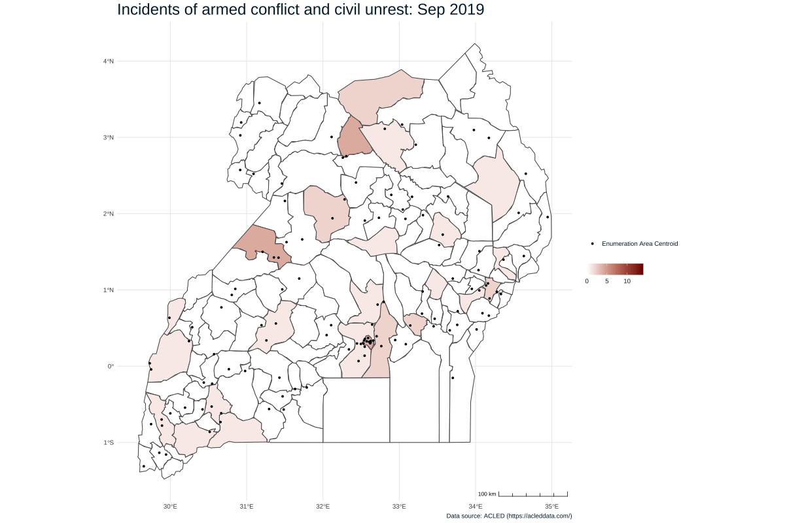

When we introduced the new PMA Client Exit Interview (CEI) surveys in our [last post](../2021-12-01-cei-discovery/), we mentioned several variables that describe some of the barriers that women face when accessing care at a particular facility. Some of these deal with **transportation**, in particular: 

  * [FACNEAREST](https://pma.ipums.org/pma-action/variables/FACNEAREST) indicates whether the woman visited the facility nearest to her home today.
  * For women who did not visit the nearest facility, [NOTNEARESTWHY](https://pma.ipums.org/pma-action/variables/NOTNEARESTWHY) explains why.  
  * [FACTRAVELHR](https://pma.ipums.org/pma-action/variables/FACTRAVELHR) and [FACTRAVELMIN](https://pma.ipums.org/pma-action/variables/FACTRAVELMIN) describe the total amount of time required to reach the facility.
  * [TRANSPORT](https://pma.ipums.org/pma-action/variables/TRANSPORT) describes the mode of transportation she used to get to the facility
  
<aside>
**Client Exit Interview (CEI)** surveys are a convenience sample of women receiving family planning services at a facility included in a contemporaneous **Service Delivery Point (SDP)** survey.
</aside>
  
Transportation challenges can make it difficult or impossible for women to access family planning services, and they can be rooted in multiple intersecting factors that may not be visible without additional context. In some places, for example, the presence of nearby or recent **armed conflict** can disrupt public transportation, cause destruction to transportation infrastructure (e.g., roads, bridges), make certain types of travel unsafe, or even discourage movement altogether. In this post, we will show you how to download, aggregate, and match externally sourced conflict data with a 2020 CEI survey from Uganda. We'll see how the proximity and timing of armed conflict influences CEI transportation measures, and we'll demonstrate how to map monthly conflict statistics with an animated plot built with the [gganimate](https://gganimate.com/) package. 

# Setup

Let's begin by downloading a CEI data extract from the [IPUMS PMA website](https://pma.ipums.org/). We'll select the Uganda 2020 sample and the five variables listed above; a number of **pre-selected** variables will also be included automatically. 

We've downloaded our data extract and saved it in the "data" subfolder of our working directory. We'll load it here, along with a few key packages:

```{r hide-me, include=FALSE}
library(sysfonts)
library(showtext)

sysfonts::font_add(
  family = "cabrito", 
  regular = "../../fonts/cabritosansnormregular-webfont.ttf"
)
showtext::showtext_auto()
```

```{r, results='hide'}
library(ipumsr)
library(tidyverse)

cei <- read_ipums_micro(
  ddi = "data/pma_00058.xml",
  data = "data/pma_00058.dat.gz"
) 
```

The variables `FACNEAREST`, `NOTNEARESTWHY`, and `TRANSPORT` are [labelled integers](https://tech.popdata.org/ipumsr/articles/value-labels.html), but we'll change them into **factors** in order to make our summary tables easier to read. In the process, we'll also replace the top-code "NIU (not in universe)" with the label `NA` and drop any zero-frequency response options.

```{r}
cei <- cei %>% 
  mutate(across(
    c(COUNTRY, FACNEAREST, TRANSPORT, NOTNEARESTWHY, FACILITYTYPEGEN), 
    ~.x %>% 
      lbl_na_if(~.lbl == "NIU (not in universe)") %>%
      as_factor() %>% 
      fct_drop()
  ))
```

Next, we'll want to combine `FACTRAVELHR` and `FACTRAVELMIN` together. These variables come from a combined question intended to solicit both hours and minutes: 

```
109. How much time did it take you to travel here today?
Enter -88 for do not know in both, -99 for no response in both.
Minutes ___
Please verify the time entered

Hours ___
Please verify the time entered
```

Notably, however, some respondents appear to have provided the same time in both hours *and* minutes (e.g. `3` hours and `180` minutes). While you might decide to use these responses in your own analysis, we'll exercise an abundance of caution here: we'll drop any responses where `FACTRAVELHR > 0`, but the number of minutes  in `FACTRAVELMIN` is longer than one hour. We'll also drop cases where the number of hours in `FACTRAVELHR` exceeds one full day (24 hours). With the remaining cases, we'll calculate `FACTRAVEL` as the sum of `FACTRAVELMIN` and `60 * FACTRAVELHR`. 

```{r}
cei <- cei %>% 
  filter(FACTRAVELHR < 24 & (FACTRAVELHR == 0 | FACTRAVELMIN < 60)) %>% 
  mutate(FACTRAVEL = 60*FACTRAVELHR + FACTRAVELMIN)
```

Now that we've finished processing the CEI data extract, let's take a look at a [gtsummary](https://www.danieldsjoberg.com/gtsummary/) table containing our key transportation variables.

```{r}
library(gtsummary)

cei %>% 
  select(FACNEAREST, NOTNEARESTWHY, TRANSPORT, FACTRAVEL) %>% 
  tbl_summary(
    label = list(
      FACNEAREST ~ "Facility is nearest to residence",
      NOTNEARESTWHY ~ "Reason for not visiting nearest facility",
      TRANSPORT ~ "Mode of transportation taken to facility",
      FACTRAVEL ~ "Total travel time to facility (minutes)"),
    statistic = list(
      all_continuous() ~ "{median} ({p25}, {p75})", 
      all_categorical() ~ "{n} ({p}%)"
    ),
    digits = list(everything() ~ 0),       
    missing = "no"
  ) %>% 
  modify_spanning_header(
    everything() ~ "# Client Exit Interview Transportation Summary"
  ) %>% 
  modify_header(update = list(label ~ " ")) %>% 
  bold_labels() %>%
  italicize_labels() 
```

<aside>
```{r, echo = FALSE}
htmltools::a(
  href = "https://www.danieldsjoberg.com/gtsummary/index.html",
  htmltools::img(src = "../../images/hex/gtsummary.png")
)
```
</aside>

While 80% of sampled women visited the facility nearest to their home, 20% went elsewhere. For the latter group, a plurality of women visited a different facility because of cost (27%), while the second most important reason is "other" (21%). A majority of women (59%) traveled to the facility on foot ("Walking"), and the median travel time for all women is half an hour (the IQR shows that 50% of women spent between 20 and 60 minutes traveling). 

Before we dig into these variables a bit more, consider how each of these might be impacted by armed conflict. It may prevent women from visiting the nearest healthcare facility, particularly if there is localized violent conflict occurring between their home and the facility, and thus also increase travel times to facilities to avoid conflict-ridden areas. It may also increase wait times at the facilities and limit the stocks of available medicines, contraceptives, and other medical supplies at facilities if supply-chains are interrupted by violence. To test these effects, we'll need to choose and download a dataset describing the location and timing of armed conflict events in Uganda. 

## Armed conflict data

There are several sources of publicly available conflict data. Two notable and frequently used databases are [The Armed Conflict Location & Event Data Project (ACLED)](https://acleddata.com/#/dashboard) and [Uppsala Conflict Data Program (UCDP)](https://ucdp.uu.se/). Some researchers also argue for the integration of such databases into a more comprehensive dataset. If you are interested in learning more about this technique, please refer to the R package, [meltt](https://cran.r-project.org/web/packages/meltt/meltt.pdf). However, for the sake of this blog post, we will use the ACLED dataset.

In order to get access to the ACLED data and be able to download an extract of the data, you must first register for an account on the [ACLED website](https://developer.acleddata.com/). 

```{r, fig.align='center', fig.cap="Image from https://acleddata.com/#/dashboard", echo=FALSE}
knitr::include_graphics("images/ACLED1.png")
```

After verifying your email by clicking the link in the email sent to you from ACLED, you must agree to ACLED's Terms of Use in the dashboard of your account. Next, you must request an "access key" (a string of upper and lower case letters and numbers) by clicking the "Add new key" button in the dashboard of your account. 

```{r, fig.align='center', fig.cap="Image from https://developer.acleddata.com/dashboard/main/", echo=FALSE}

```

*Be sure to copy and save this access key as you will need it later and will not be able to view it again* (though you can revoke the key and request another one if you do misplace it). 

After these steps, you can use the access key to request data through the ACLED's [Data Export Tool](https://acleddata.com/data-export-tool/). To request the dataset, enter the access key, dates of interest, and country or region of interest. We'll examine **one year** (September 1, 2019 to August 31, 2020) of conflict data prior to the beginning of CEI data collection in Uganda in September 2020. 

```{r, fig.align='center', fig.cap="Image from https://acleddata.com/data-export-tool/", echo=FALSE}

```

The ACLED dataset you'll receive is a simple CSV file with 31 columns: we'll select a handful that we'll need in our analysis.

```{r, layout="l-body-outset", fig.width=8, fig.height=8, preview = TRUE}
conflict <- read_csv("data/2019-09-01-2020-08-31-Uganda.csv") %>% 
  select(
    event_id_cnty, event_type, sub_event_type, event_date, 
    time_precision, latitude, longitude, admin2, geo_precision
  )

conflict
```

You'll notice that there are 515 rows in our `conflict` dataset - each representing a specific event with a unique `event_id_cnty` number. The variables `event_type` and `sub_event_type` describe different types of recorded events. We'll use the [kableExtra](https://github.com/haozhu233/kableExtra) package to create an easy-to-read table showing the frequency of each event type.

```{r}
library(kableExtra)

conflict %>% 
  count(event_type, sub_event_type) %>% 
  mutate(pct = 100*prop.table(n) %>% round(3)) %>% 
  kbl() 
```

<aside>
```{r, echo = FALSE}
htmltools::a(
  href = "https://github.com/haozhu233/kableExtra",
  htmltools::img(src = "../../images/hex/kableExtra.png")
)
```
</aside>

As you can see from the table above, there are a number of different types and subtypes of events in the ACLED dataset. In this analysis, we're interested in events that may cause transportation disruptions or otherwise impede access to health facilities, so we'll exclude events in the category `Strategic developments`. Events in the categories `Protests` and `Riots` are not necessarily "armed conflict", but we'll retain them in our analysis because of their potential to impede access to facilities. 

```{r}
conflict <- conflict %>% filter(event_type != "Strategic developments")
```

Each event is associated with a particular `event_date` and a set of `latitude` and `longitude` coordinates. These are subject to different degrees of precision represented in `time_precision` and `geo_precision`, respectively, on a scale ranging from 1 (most precise) to 3 (least precise). The specific meaning for each value is described in the [ACLED codebook](https://www.acleddata.com/wp-content/uploads/dlm_uploads/2017/10/ACLED_Codebook_2019FINAL_pbl.pdf), but we'll summarize here.

The degrees of `time_precision` are:

  1. The listed `event_date` matches the date of the event
  2. The listed `event_date` is the middle date of an event that happened during a specified *week or weekend*
  3. The listed `event_date` is the middle date of an event that happened during a specified *month*
  
```{r}
conflict %>% 
  count(time_precision) %>%
  kbl()
```
  
To keep things simple, we'll recode `event_date` to the least precise level in `time_precision` - the *month* and *year* in which an event happened. We'll use the [lubridate](https://lubridate.tidyverse.org/) package to create a [century month code (cmc)](../2021-10-01-nutrition-indicators/#minimum-age-with-century-month-codes) for each month, and we'll then recode `event_date` as a string containing the month and year for each event. 

```{r}
library(lubridate)

conflict <-conflict %>% 
  mutate(
    event_date = event_date %>% as_date(format = '%d %B %Y'),
    event_month = month(event_date),
    event_year = year(event_date),
    event_cmc = 12*(event_year - 1900) + event_month
  ) %>% 
  arrange(event_cmc) %>% 
  mutate(
    event_date = month(event_month, label = TRUE) %>% 
      paste(event_year) %>% 
      as_factor()
  )
```

<aside>
```{r, echo = FALSE}
htmltools::a(
  href = "https://lubridate.tidyverse.org/",
  htmltools::img(src = "../../images/hex/lubridate.png")
)
```
</aside>

The degrees of `geo_precision` are:

  1. The listed coordinates are the centroid of a town where the event happened
  2. The listed coordinates are the centroid of a town in the district in which the event happened (the nearest town is used if possible)
  3. The listed coordinates are represent a natural location (e.g. "border area", "forest", or "sea") or a provincial capital located in a "larger region" in which the event happened
  
Most locations are specifically geo-referenced within a particular town (`geo_precision == 1`), but we'll need to decide how to handle those locations that are less precise:

```{r}
conflict %>% 
  count(geo_precision) %>%
  kbl()
```

Because all but 12 events are geo-referenced to towns within the same district, we'll drop events where `geo-precision == 3` and aggregate the others by districts represented in the variable `admin2` (admin level 2).

```{r}
conflict <- conflict %>% filter(geo_precision < 3)
```

Doing so will allow us to build a cloropleth map showing the number of conflicts in each district in each month. But first, we'll need to locate an appropriate **shapefile**. 

## Shapefile

IPUMS PMA offers [shapefiles](https://pma.ipums.org/pma/gis_boundary_files.shtml) for each sampled country at the same administrative level shown in the variable [SUBNATIONAL](https://pma.ipums.org/pma-action/variables/SUBNATIONAL). For Uganda, the boundaries of 10 **regions** are included (admin level 1). 

As we've seen, the ACLED conflict data are more precise: all of the events remaining in `conflict` are geo-referenced to the nearest town within the same district, which is recorded in the column `admin2` (admin level 2). 

```{r}
conflict %>% count(admin2)
```

In order to map these events, we'll need to locate a shapefile from a different source that contains boundaries for all of the **districts** in Uganda. We'll find the shapefile we need from [The Humanitarian Data Exchange](https://data.humdata.org/dataset/uganda-administrative-boundaries-admin-1-admin-3) and save it in the "data" subfolder of our working directory. We'll load it into R with the [sf](https://r-spatial.github.io/sf/) package and, for the sake of improved processing speed, we'll apply a small amount of smoothing to the boundaries with [st_simplify](https://r-spatial.github.io/sf/reference/geos_unary.html). 

```{r, results='hide'}
library(sf)

shapefile <- st_read("data/uga_admbnda_ubos_20200824_shp") %>% 
  rename(admin2 = ADM2_EN) %>% 
  count(admin2) %>% 
  select(-n) %>% 
  st_make_valid() %>% 
  st_simplify(dTolerance = 1000) 
```

<aside>
```{r, echo = FALSE}
htmltools::a(
  href = "https://r-spatial.github.io/sf/index.html",
  htmltools::img(src = "../../images/hex/sf.png")
)
```
</aside>

```{r}
shapefile
```

## Facility GPS coordinates 

The final source of data we'll use in this post are the *displaced GPS coordinates* for each of the enumeration areas used to select facilities for the CEI sample. IPUMS PMA does not disseminate these coordinates, so you’ll need to [apply](https://www.pmadata.org/data/request-access-datasets) to download them directly from our partners at PMA. Once approved, you’ll receive a CSV file - we've saved a copy of this file into the "data" subfolder of our working directory. 

```{r}
gps <- read_csv("data/PMA_UG_GPS_v1_19May2021.csv") %>%
  select(EAID = EA_ID, GPSLONG, GPSLAT, DATUM) %>%
  st_as_sf(
    coords = c("GPSLONG", "GPSLAT"), 
    crs = 4326
  )

gps
```

# Mapping conflict in Uganda

Next, we'll want to think about the best way to visualize monthly changes in the amount of conflict in each district. Previously, we've shown how to create a [faceted plot](../2021-07-15-covid-likert/#faceted-neutral-non-response), where you might arrange maps for each month in a grid. This works well in some cases, but here - where we'll build one map for each of 12 months - this would easily overwhelm the available space on our page. Instead, we'll create an animated image - specifically, a **gif** - that cycles through each month in sequence. 

To get started, we'll first need to count the monthly total number of events in each district. We'll do this simply by counting the number of distinct `event_id_cnty` codes for each district in each month. We'll call this summary table `conflict_summary`.  

```{r}
conflict_summary <- conflict %>% 
  group_by(admin2, event_date) %>% 
  summarise(events = n_distinct(event_id_cnty), .groups = "keep") %>% 
  ungroup() 

conflict_summary
```

Notice the first district, Abim, has recorded `events` in only 5 of the 12 months in our timeline; in each of the remaining 7 months, there were no reported events in the database. We'll want to fill these gaps with `0`, and the easiest way to do this is to [pivot_wider](https://tidyr.tidyverse.org/reference/pivot_wider.html), placing each of the 12 months into a separate column. Any district with *no recorded events* in a particular month will show `NA` in that column. 

<aside>
```{r, echo = FALSE}
htmltools::a(
  href = "https://tidyr.tidyverse.org/",
  htmltools::img(src = "../../images/hex/tidyr.png")
)
```
</aside>

```{r}
conflict_summary <- conflict_summary %>% 
  arrange(event_date) %>% 
  pivot_wider(
    admin2,
    names_from = event_date,
    values_from = events
  ) %>% 
  arrange(admin2)

conflict_summary
```

Now, the complete monthly event totals for each district are stored in a single row. At this point, we'll want to merge `conflict_summary` with our `shapefile`.

```{r}
conflict_summary <- shapefile %>% full_join(conflict_summary, by = "admin2")
```

Finally, we'll [pivot_longer](https://tidyr.tidyverse.org/reference/pivot_longer.html) so that each row contains one month again, except that missing months will be represented with the value `NA`. We'll replace these values with `0`. (We'll also need to transform `event_date` back into a **factor** with levels set in chronological order - these were removed when the dates were used as column names above).

```{r}
conflict_summary <- conflict_summary %>% 
  pivot_longer(
    cols = contains(" "), 
    names_to = "event_date",
    values_to = "events"
  ) %>% 
  mutate(event_date = factor(
    event_date, 
    levels = levels(conflict$event_date)
  )) %>% 
  select(admin2, events, event_date) %>% 
  mutate(events = ifelse(is.na(events), 0, events))

conflict_summary
```

You could now easily build a static map for any *single* month. We'll build an example for August 2020 with our favorite `ggplot`-aligned package for spatial data, [ggspatial](https://paleolimbot.github.io/ggspatial/). 

```{r, layout="l-body-outset", fig.width=12, fig.height=8, preview = TRUE}
library(ggspatial)

ggplot() + 
  layer_spatial(
    conflict_summary %>% filter(event_date == "Aug 2020"), 
    aes(fill = events)
  ) + 
  layer_spatial(gps, aes(shape = "Enumeration Area Centroid")) + 
  theme_minimal() + 
  theme(
    text = element_text(family = "cabrito", size = 12, color = "#00263A"),
    plot.title = element_text(size = 24),
    legend.direction = "horizontal"
  ) + 
  annotation_scale(aes(style = "ticks", location = "br")) +
  scale_fill_gradient(low = "#FFFFFF", high = "#7F0000") + 
  guides(
    shape = guide_legend(title = element_blank()),
    fill = guide_colorbar(title = element_blank())
  ) + 
  labs(
    title = "Incidents of armed conflict and civil unrest: August 2020", 
    caption = "Data source: ACLED (https://acleddata.com/)"
  ) 
```

## Animation 

To build an animated version of this map that shows the number of armed conflicts for *each* month in sequence, we'll use the [gganimate](https://gganimate.com) package. This code will look almost exactly like the code we used to create a static map for August 2020, except that we'll use the function [transition_states](https://gganimate.com/reference/transition_states.html) to cycle through each `event_date`, and [animate](https://gganimate.com/reference/animate.html) to render the animation over a 24 second period (two seconds per month). Also notice the `title`, where we use the variable `{closest_state}` to import the correct `event_date` for each month.

<aside>
```{r, echo = FALSE}
htmltools::a(
  href = "https://gganimate.com/",
  htmltools::img(src = "../../images/hex/gganimate.png")
)
```
</aside>

```{r, eval = FALSE}
library(gganimate) 

dynamic_map <- ggplot() + 
  layer_spatial(conflict_summary, aes(fill = events)) + 
  layer_spatial(gps, aes(shape = "Enumeration Area Centroid")) + 
  theme_minimal() + 
  theme(
    text = element_text(size = 12, color = "#00263A"),
    plot.title = element_text(size = 24),
    legend.direction = "horizontal"
  ) + 
  annotation_scale(aes(style = "ticks", location = "br")) +
  scale_fill_gradient(low = "#FFFFFF", high = "#7F0000") + 
  guides(
    shape = guide_legend(title = element_blank()),
    fill = guide_colorbar(title = element_blank())
  ) + 
  labs(
    title = "Incidents of armed conflict and civil unrest: {closest_state}", 
    caption = "Data source: ACLED (https://acleddata.com/)"
  ) + 
  transition_states(event_date, transition_length = 0, state_length = 1)

animate(
  dynamic_map, 
  width = 1200, 
  height = 800,
  duration = 24 # 2 seconds per month (12 months)
)
```

```{r, layout="l-body-outset", fig.width=12, fig.height=8, echo=FALSE}

```

# Merge with CEI data

As a final processing step, we'll now use `conflict_summary` to find the number of recent distict-level conflicts for each facility in the CEI survey. We'll focus here on the 3 months prior to the first month of CEI data collection: June, July, and August 2020. 

For comparison's sake, let's divide the 135 districts into two groups: "low" and "high" levels of recent conflict. We'll define `HIGH_CONFLICT` districts as those with a three-month event total in the upper-most tertile relative to all district totals. 

```{r}
conflict_summary <- conflict_summary %>% 
  group_by(admin2) %>% 
  slice(10:12) %>% # most recent 3 months
  summarise(conflict_events_3mo = sum(events)) %>% 
  ungroup() %>% 
  transmute(HIGH_CONFLICT = ntile(conflict_events_3mo, 3) > 2) 

conflict_summary
```

Now, we'll need to identify the correct district for every enumeration area. The GPS coordinates for each enumeration area are stored in `gps`, so we'll  use [st_intersection](https://r-spatial.github.io/sf/reference/geos_binary_ops.html) to place them within the district boundaries shown in `conflict_summary`. In the rare event that the `gps` coordinates sit directly on a district boundary, we'll label the enumeration area "high" conflict if either one of the districts is labelled "high". 

```{r}
conflict_summary <- gps %>% 
  st_intersection(conflict_summary) %>% 
  st_drop_geometry() %>% 
  group_by(EAID) %>% 
  summarise(HIGH_CONFLICT = any(HIGH_CONFLICT))

conflict_summary
```

Finally, we'll attach `conflict_summary` to the original `cei` data extract by `EAID`. 

```{r}
cei <- cei %>% left_join(conflict_summary, by = "EAID")
```

# Results 

Now we will look at the variables in the CEI data that we think might be impacted by localized conflict. We mentioned these at the beginning of this post but to remind you, they are:

  * [FACNEAREST](https://pma.ipums.org/pma-action/variables/FACNEAREST)
  * [TRANSPORT](https://pma.ipums.org/pma-action/variables/TRANSPORT)
  * [FACTRAVELHR](https://pma.ipums.org/pma-action/variables/FACTRAVELHR) and [FACTRAVELMIN](https://pma.ipums.org/pma-action/variables/FACTRAVELMIN)
  * [NOTNEARESTWHY](https://pma.ipums.org/pma-action/variables/NOTNEARESTWHY)
  
To examine these variables and their relationship to conflict, we will again build a [gtsummary](https://www.danieldsjoberg.com/gtsummary/) table, but this time we will stratify this table by `HIGH_CONFLICT`.

```{r}
cei %>% 
  select(HIGH_CONFLICT, FACNEAREST, NOTNEARESTWHY, TRANSPORT, FACTRAVEL) %>%
  tbl_summary(
    by = HIGH_CONFLICT, 
    label = list(
      FACNEAREST ~ "Facility is nearest to residence",
      NOTNEARESTWHY ~ "Reason for not visiting nearest facility",
      TRANSPORT ~ "Mode of transportation taken to facility",
      FACTRAVEL ~ "Total travel time to facility (minutes)"
    ),
    statistic = list(
      all_continuous() ~ "{median} ({p25}, {p75})", 
      all_categorical() ~ "{n} ({p}%)"
    ),
    digits = list(everything() ~ 0),       
    missing = "no"
  ) %>% 
  add_p(test = list(
    all_continuous() ~ "t.test", 
    c("TRANSPORT","NOTNEARESTWHY") ~ "fisher.test",
    c("FACNEAREST") ~ "chisq.test"
  )) %>% 
  bold_p() %>%
  modify_spanning_header(update = list(
   everything() ~ "# **Client Exit Interview Transportation Summary**"
  )) %>%
  modify_header(update = list(
    label ~ " ",
    stat_1 ~ "**Low/Moderate Conflict** <br> N = {n}",
    stat_2 ~ "**High Conflict** <br> N = {n}",
    p.value ~ "**p-value**"
  )) %>%
  bold_labels() %>% 
  italicize_labels() 
```

As you can see in the table above, there are some significant differences between the respondents that have experienced `High` conflict in their area compared to those that experienced `Low/Moderate` conflict. More respondents in the high conflict areas did not visit the facility nearest to their residence compared to those in the low/moderate conflict areas. Overall, there were no significant differences in the reasons for not visiting the nearest facility. However, it may be notable that there are no possible responses that inquire about conflict as a possible reason and the closest one that might estimate this is `less convenient location`, which is demonstrably more prevalent among the  `High` conflict group compared to the `Low/Moderate` group. We also see significant differences in the mode of transportation between the two groups, with less respondents in the `High` conflict area walking and biking to the clinic/facility and more taking a motor vehicle compared to respondents in the `Low/Moderate` area. Finally, the travel time to facility is also significantly different between respondents living in `High` conflict versus `Low/Moderate` conflict areas. The trend appears to be in an unexpected direction, with those in `Low/Moderate` conflict settings having greater travel times compared to those in `High` conflict settings. A possible explanation for this trend may be that women in the `Low/Moderate` conflict group are more likely to walk or bicycle to the facility and less likely to use motor vehicle transport compared to the women in the `High` conflict group.

Taken together, the results of this analysis seem to indicate that conflict does indeed impact women’s ability to access family planning services. Importantly, it may be more expensive or even unaffordable for women to obtain a motor vehicle ride to a healthcare facility. Since the CEI data were collected from women at healthcare facilities, we do not know the magnitude of women who were unable to visit a healthcare facility due to the direct threat of localized violence or indirect cost of longer travel or the necessity of a motor vehicle in order to visit a healthcare facility and avoid local conflict.