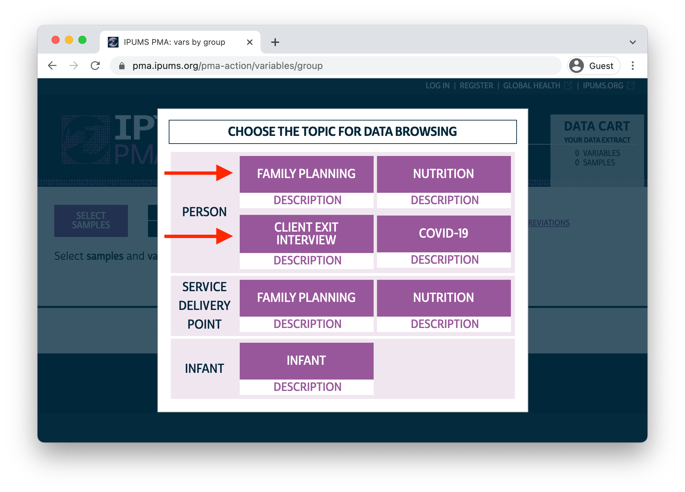
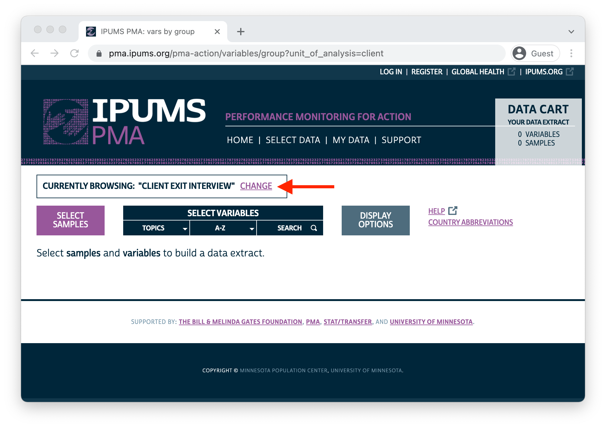

```{r postpath, eval=FALSE, echo=FALSE}
library(here)
postpath <- file.path(here(), "_posts/2022-02-01-cei-fp")
if(getwd() != postpath){setwd(postpath)}
```

```{r libraries, include = FALSE}
library(ipumsr)
library(tidyverse)
library(kableExtra)
```

[Client Exit Interview (CEI)](../../index.html#category:Client_Exit_Interviews) surveys from PMA capture the service experience of female family planning clients immediately following a visit to a health facility sampled in a contemporaneous [Service Delivery Point (SDP)](../../index.html#category:Service_Delivery_Points) survey. In [previous posts](../2021-12-01-cei-discovery/index.html#sample-design), we've explained that CEI surveys use *non-random* convenience sampling to select reproductive aged women visiting a facility during a particular two-day observation period. 

This type of sampling is useful because it maximizes the number of available CEI survey participants within a set time frame, but it also introduces potential sources of sample bias against the broader population of female family planning clients in each country or region (both the observation period and the underlying [SDP sampling frame](../../2021-01-26-sdp-data/index.html#sample-design) are non-random). CEI surveys offer a snapshot of client perspectives at a certain time and place, but they are not intended for population-level inference.

In contrast to CEI surveys, PMA [Family Planning (FP)](../../index.html#category:Individuals_in_Context) surveys *are* randomly sampled, and there are a number of questions about family planning service quality that are common to both. In FP surveys, women who were currently using a modern family planning method - or had used one in the past 12 months - were asked about their service experience with the provider where they obtained the method (regardless of whether the provider was a facility sampled in an SDP survey). These questions are nearly identical to some of the questions you'll find in a CEI survey collected in the same time and place, except that women in the FP survey were asked to recall family planning visits that happened potentially several months in the past. 

<aside>
In this context, a "modern method" refers to any of [these methods](https://pma.ipums.org/pma-action/source_documents/enum_form_bf2019a_f_tag.xml#190) other than LAM, withdrawal, rhythm, or "other traditional" methods. 
</aside>

In this post, we'll guide you through **all of the variables you'll find in contemporaneous FP and CEI surveys**. We'll also compare descriptive statistics for each CEI sample with population-level estimates derived from a corresponding FP survey. This will give us some sense of **how CEI samples compare with a broader population** of female family planning clients in each country or region. As of this writing, [IPUMS PMA](https://pma.ipums.org) offers FP surveys from the following places that were collected contemporaneously with CEI surveys (these FP surveys are nationally representative, or regionally representative as noted): 

  * Burkina Faso 
  * Kenya 
  * DRC - Kongo Central
  * DRC - Kinshasa 
  * Nigeria - Lagos 
  * Nigeria - Kano

To follow along, you'll need to create two separate data extracts from the IPUMS PMA website containing these samples - one for the **Client Exit Interview** unit of analysis, and another for the **Family Planning** unit of analysis.

```{r, echo = FALSE}

```

To switch from one unit of analysis to the other, click the [CHANGE](https://pma.ipums.org/pma-action/extract_requests/clear?return_url=%2Fpma-action%2Fvariables%2Fgroup) button at the top of your screen: 

```{r, echo = FALSE}

```

# Comparable survey questions

Let's take a look at the questions you'll find repeated in both the CEI and FP surveys. While a particular question may be identical - or nearly identical - on both surveys, you may find it listed under different variable names. The table below shows all of the questions that appear on both surveys (excluding automatically generated [technical](https://pma.ipums.org/pma-action/variables/group?id=tech_techvar) and [geographic](https://pma.ipums.org/pma-action/variables/group?id=hh_geo) variables), and it gives the variable name you'll need to include in each of your data extracts. 

For this post, we'll also include [GEOCD](https://pma.ipums.org/pma-action/variables/GEOCD) and [GEONG](https://pma.ipums.org/pma-action/variables/GEONG) (survey regions for DRC and Nigeria), as well as [FQWEIGHT](https://pma.ipums.org/pma-action/variables/FQWEIGHT) (the FP sampling weight - no such weight is available for CEI surveys). 

```{r, echo = FALSE, layout="l-page"}
comparability <- read_csv("data/comparability.csv") 

comparability %>% 
  mutate(across(
    c(`Client Exit Interview`, `Family Planning Survey`), 
    ~ifelse(.x == "--", "--", .x %>% cell_spec("html", link = paste0(
        "https://pma.ipums.org/pma-action/variables/", .x
    )))
  )) %>% 
  kbl("html", escape = FALSE) %>% 
  kable_styling() %>% 
  scroll_box(
    width = "100%", 
    box_css = paste(
      sep = "; ",
      "margin-bottom: 1em",
      "margin-top: 1em",
      "border: 0px solid #ddd",
      "padding: 5px"
    )
  )
```

Once you've downloaded both extracts, place them into the "data" folder in your working directory. Load them into R as separate data frames for the moment - we'll call ours `cei` and `fp`. 

```{r, results='hide'}
library(ipumsr)
library(tidyverse)

cei <- read_ipums_micro(
  ddi = "data/pma_00001.xml",
  data = "data/pma_00001.dat.gz"
) 

fp <- read_ipums_micro(
  ddi = "data/pma_00002.xml",
  data = "data/pma_00002.dat.gz"
)
```

<aside>
```{r, echo=F}
htmltools::a(
  href = "http://tech.popdata.org/ipumsr/",
  htmltools::img(src = "../../images/hex/ipumsr.png")
)
```
© IPUMS ([MPL 2.0](https://www.mozilla.org/en-US/MPL/2.0/))
</aside>

# Family planning clients

We'll only be examining a subset of the respondents from both surveys in this post. From the CEI survey, we'll restrict our analysis to women who received family planning information or a family planning method during their visit (most of the questions on the CEI survey were skipped otherwise). You'll find this information in the variable [FPINFOYN](https://pma.ipums.org/pma-action/variables/FPINFOYN). 

```{r}
cei <- cei %>% filter(FPINFOYN == 1)
```

From the FP survey, we'll only include those women who were asked questions about a recent family planning visit. If a woman in the FP sample did *not* answer these questions (either because she had not recently used a modern method, or because she obtained it from somewhere other than a health provider) her response to those questions will be coded `99` for `NIU (not in universe)`. We'll drop those cases using the variable [FPPROVIDERETURN](https://pma.ipums.org/pma-action/variables/FPPROVIDERETURN#universe_section):

```{r}
fp <- fp %>% filter(FPPROVIDERETURN < 99)
```

# Merge CEI and FP data

Now that both of our data frames only contain records for women who recently experienced a family planning visit with their provider, we'll want to merge them together into a single data frame. First, we'll create a new variable `SURVEY` indicating whether a particular record originated in the `cei` or `fp` data extract, and we'll then change variable names as needed in `fp` to match the corresponding variable in `cei` (use the above table for reference).  

```{r}
cei <- cei %>% 
  mutate(SURVEY = "CEI")

fp <- fp %>% 
  mutate(SURVEY = "FP") %>% 
  rename(
    FACILITYTYPE = FPPROVIDER,
    FACILITYTYPEGEN = FPPROVIDER,
    AUTHORITY = FPPROVIDERGEN,
    REFERFAC = FPPROVIDEREFER,
    RETURNFAC = FPPROVIDERETURN,
    FPGETDESIREDTODAY = FPGETDESIRED,
    FPGETWHYTODAY = FPGETDESIREDWHY,
    FPDECIDEMETHOD = FPDECIDEMETHOD,
    TELLSWITCH = FPTOLDSWITCH,
    DISCOTHFP = FPCUROM,
    TELLSIDEEFF = FPCUREFF,
    TELLSEPROB = FPCURDEAL
  )
```

Finally, we'll use [bind_rows](https://dplyr.tidyverse.org/reference/bind.html) to create a single data frame called `dat`. All of the variables appearing under the same name in both `cei` and `fp` will be merged together automatically. Variables that only appear in one of the original data frames will be preserved as-is, except that rows from the opposite data frame will be automatically populated with the value `NA`. 

```{r}
dat <- bind_rows(cei, fp)
```

For example, [INTFQMON](https://pma.ipums.org/pma-action/variables/INTFQMON) and [INTFQYEAR](https://pma.ipums.org/pma-action/variables/INTFQYEAR) appeared in both `cei` and `fp` - they describe the month and year in which the interview was conducted. If we now [group_by](https://dplyr.tidyverse.org/reference/group_by.html) the `SURVEY` variable we created, we'll see that that this information has been merged into a single set of variables.

```{r}
dat %>% 
  group_by(SURVEY) %>% 
  count(INTFQMON, INTFQYEAR)
```

<aside>
Interviews for this round of CEI surveys were completed between December 2019 and February 2020. Interviews for these FP surveys were completed as part of a new [PMA panel study](../2021-06-15-covid-discovery/index.html) at the same time: between November 2019 and February 2020. 
</aside>

On the other hand, variables like [FPINFOYN](https://pma.ipums.org/pma-action/variables/FPINFOYN) appear only on the CEI survey. If we group by `SURVEY` and count `FPINFOYN` cases, we'll see that all women interviewed for the FP survey are coded `NA`. 

```{r}
dat %>% 
  group_by(SURVEY) %>% 
  count(FPINFOYN)
```

# Survey Design Elements  

Like `FPINFOYN`, the variable representing FP sampling weights [FQWEIGHT](https://pma.ipums.org/pma-action/variables/FQWEIGHT) takes the value `NA` for all of CEI records in our merged dataset. 

```{r}
dat %>% 
  group_by(SURVEY) %>% 
  count(is.na(FQWEIGHT))
```

Because we want to derive population-level estimates from the FP survey, we'll need to specify `FQWEIGHT` as a weight with help from the [srvyr](http://gdfe.co/srvyr) package we've used [elsewhere on this blog](file:///Users/Matt/R/pma-data-hub/docs/posts/2021-02-19-analyzing-the-individual-in-context/#individual-factors-model-with-svyglm). This would be simple if we only included cases from the FP survey. For example, to compare the mean `AGE` of family planning clients in the FP sample to the estimated mean `AGE` of family planning clients in the population for each `COUNTRY`:

```{r}
library(srvyr)

# `FQWEIGHT` is the sampling weight for the FP survey
dat %>% 
  filter(SURVEY == "FP") %>% 
  as_survey_design(weights = FQWEIGHT) %>% 
  group_by(SURVEY, COUNTRY) %>% 
  summarise(
    sample_mean = mean(AGE, na.rm = TRUE),
    pop_mean = survey_mean(AGE, na.rm = TRUE, vartype = NULL)
  )
```

<aside>
```{r, echo=F}
htmltools::a(
  href = "http://gdfe.co/srvyr/index.html",
  htmltools::img(src = "../../images/hex/srvyr.png")
)
```
© Greg Freedman Ellis et al. ([GPL 2](https://www.gnu.org/licenses/old-licenses/gpl-2.0.en.html) | [GPL 3](https://www.gnu.org/licenses/gpl-3.0.html))
</aside>

Unfortunately, this same code produces an error if we try to include all of the CEI cases as well. The problem here is that our `weights` argument cannot include `NA` values:

```{r, error=TRUE}
# `FQWEIGHT` is `NA` for CEI records
dat %>% 
  as_survey_design(weights = FQWEIGHT) %>% 
  group_by(SURVEY, COUNTRY) %>% 
  summarise(
    sample_mean = mean(AGE, na.rm = TRUE),
    pop_mean = survey_mean(AGE, na.rm = TRUE, vartype = NULL)
  )
```

To solve this problem, we'll create a copy of `FQWEIGHT` called `DATWEIGHT`, except that `DATWEIGHT` **will take the value 1 for all CEI records**. As a result, population estimates derived from functions like `survey_mean` will be identical to the sample statistics for CEI surveys.  

```{r}
dat <- dat %>% mutate(DATWEIGHT = if_else(SURVEY == "FP", FQWEIGHT, 1))

# `sample_mean` == `pop_mean` for CEI, but not for FP
dat %>% 
  as_survey_design(weights = DATWEIGHT) %>% 
  group_by(SURVEY, COUNTRY) %>% 
  summarise(
    sample_mean = mean(AGE, na.rm = TRUE),
    pop_mean = survey_mean(AGE, na.rm = TRUE, vartype = NULL)
  )
```

You might also recall from [previous posts](../2021-08-15-covid-analysis/index.html#sampling-weights) that FP surveys are sampled within geographic clusters identified by the variable [EAID](https://pma.ipums.org/pma-action/variables/EAID). When we report population-level estimates from the FP survey, we'll want to generate **cluster-robust standard errors** represented in 95% confidence intervals for each point estimate. Sample clusters can be specified with the `id` argument in `as_survey_design` like so: 

```{r}
# Use `id = EAID` for cluster-robust standard errors 
dat %>% 
  as_survey_design(weights = DATWEIGHT, id = EAID) %>% 
  group_by(SURVEY, COUNTRY) %>% 
  summarise(
    sample_mean = mean(AGE, na.rm = TRUE),
    pop_mean = survey_mean(
      AGE, 
      na.rm = TRUE, 
      vartype = "ci" # produces 95% confidence interval be default
    )
  )
```

Note: because we're only reporting *sample statistics* for the non-representative CEI surveys, we'll need to manually suppress CEI confidence intervals in our tables and figures. More on that in a moment.

# Variable Recoding 

All of the binary variables in our dataset should be recoded as **logicals**, and all categorical variables with *more* than two responses should be recoded as **factors** (we recommend creating levels for each factor that look exactly as you want them to appear in final tables and figures). 

As a first step, we'll want to recode all of the IPUMS PMA top-codes for different types of non-response. We'll use [across](https://dplyr.tidyverse.org/reference/across.html) to replace codes for the following [value labels](https://tech.popdata.org/ipumsr/articles/value-labels.html) with `NA` in all variables. 

```{r}
dat <- dat %>% 
  mutate(across(everything(), ~lbl_na_if(.x, ~.lbl %in% c(
    "Don't know", 
    "No response",
    "Logical edit - missing",
    "No response or missing",
    "NIU (not in universe)",
    # Special codes for `FPGETDESIREDTODAY`
    "Neither, follow-up visit only",
    "Did not have a preference",
    "Neither, did not obtain"
  )))) 
```

<aside>
[FPGETDESIREDTODAY](https://pma.ipums.org/pma-action/variables/FPGETDESIREDTODAY) is a binary indicator with additional response options describing reasons why the client did not obtain her desired family planning method: she may have had no preference, or she may not have obtained a new method during a follow-up visit. We'll code these responses `NA` (as if they were NIU). 
</aside>

There are three variables that require additional recoding. First, we'll want to replace the existing [SAMPLE](https://pma.ipums.org/pma-action/variables/SAMPLE) variable with a factor containing concise, readable labels. We'll also use [GEOCD](https://pma.ipums.org/pma-action/variables/GEOCD) and [GEONG](https://pma.ipums.org/pma-action/variables/GEONG) to parse the regional sampling frames used for DRC and Nigeria. 

```{r}
dat <- dat %>% 
  mutate(
    COUNTRY = COUNTRY %>% 
      as_factor() %>% 
      fct_recode("DRC" = "Congo, Democratic Republic") %>% 
      as.character(),
    GEO = case_when(
       !is.na(GEOCD) ~ GEOCD %>% as_factor() %>% as.character(),
       !is.na(GEONG) ~ GEONG %>% as_factor() %>% as.character()
    ),
    SAMPLE = if_else(!is.na(GEO), paste0(COUNTRY, " - ", GEO), COUNTRY),
    SAMPLE = as_factor(SAMPLE)
  ) 
```

As a result, our new `SAMPLE` variable looks exactly as we'll want it to appear on the page:

```{r}
dat %>% count(SURVEY, SAMPLE)
```

We'll also collapse categories in [EDUCATTGEN](https://pma.ipums.org/pma-action/variables/EDUCATTGEN) and [MARSTAT](https://pma.ipums.org/pma-action/variables/MARSTAT), creating new binary **logicals** `EDUCAT2` (more than primary/middle school education) and `MARSTAT2` (either married or living with a partner). 

```{r}
dat <- dat %>% 
  mutate(
    EDUCAT2 = EDUCATTGEN > 2,
    MARSTAT2 = MARSTAT == 21 | MARSTAT == 22
  )

# Compare `EDUCAT2` with `EDUCATTGEN`
dat %>% count(EDUCAT2, EDUCATTGEN)

# Compare `MARSTAT2` with `MARSTAT`
dat %>% count(MARSTAT2, MARSTAT)
```

Finally, we'll recode all of the remaining binary variables as **logicals** and all of the categorical variables as **factors** (using the existing IPUMS PMA value labels as levels).
  
```{r}
dat <- dat %>% 
  mutate(
    # Create Logicals: `TRUE` if the original variable equals `1`
    across(
      c(FPGETDESIREDTODAY, REFERFAC, RETURNFAC, FPGETDESIREDTODAY,
        TELLSWITCH, DISCOTHFP, TELLSIDEEFF, TELLSEPROB),
      ~.x == 1
    ),
    # Create Factors: each level is an IPUMS value label
    across(c(FPGETWHYTODAY, FPDECIDEMETHOD), as_factor)
  ) 
```

# Graphics theme 

One last setup item: we'll specify a custom **theme** for figures made with [ggplot2](https://ggplot2.tidyverse.org). This allows us to generally specify the font, legend, and colors used in all of the graphics created below. We'll create a function called `theme_pma` that applies those formatting options, and we'll also give it two arguments for a plot `title` and (optionally) a `subtitle`.

<aside>
You'll find more details about creating custom themes in [this post](https://tech.popdata.org/pma-data-hub/posts/2021-08-01-covid-batches/#plot-theme), or on [this documentation page](https://ggplot2.tidyverse.org/articles/ggplot2-in-packages.html?q=theme%20replace#creating-a-new-theme-1). 
</aside>

```{r}
library(sysfonts)
library(showtext)

sysfonts::font_add(
  family = "cabrito", 
  regular = "../../fonts/cabritosansnormregular-webfont.ttf"
)
showtext::showtext_auto()
options(tibble.print_min = 20)

theme_pma <- theme_pma <- function(
  title, 
  subtitle = NULL
){
  components <- list(
    theme_minimal() %+replace% 
      theme(
        text = element_text(family = "cabrito", size = 13),
        plot.title = element_text(
          size = 22, color = "#00263A", hjust = 0, margin = margin(b = 5)
        ),
        plot.subtitle = element_text(
          size = 16, hjust = 0, margin = margin(b = 10)
        ),
        legend.position = "bottom",
        strip.background = element_blank(),
        strip.text.y = element_text(size = 16, angle = 0),
        panel.spacing = unit(1, "lines"),
        axis.text.y = element_blank()
      ),
    guides(fill = guide_legend(reverse = TRUE)),
    scale_fill_manual(values = list("#00263AD9", "#98579BD9")),
    labs(
      title = title,
      subtitle = subtitle,
      x = NULL,
      y = NULL,
      fill = NULL
    )
  )
}
```

<aside>
```{r, echo=F}
htmltools::a(
  href = "https://ggplot2.tidyverse.org/index.html",
  htmltools::img(src = "../../images/hex/ggplot2.png")
)
```
© RStudio ([CC0 1.0](https://creativecommons.org/publicdomain/zero/1.0/))
</aside>

# Demographics 

```{r, echo=FALSE}
options(tibble.print_min = 10)
```

We're now ready to see how CEI samples compare with population estimates derived from representative FP surveys. First, we'll consider the demographic composition of our samples. There are four main demographic variables appearing in both the CEI and FP surveys. They represent the woman's 

  * age (in years)
  * marital status (recoded as `MARSTAT2` above)
  * education level (recoded as `EDUCAT2` above)
  * number of live birth events (excluding stillbirths)
  
We'll use [summarise](https://dplyr.tidyverse.org/reference/summarise.html) to calculate summary demographic statistics for each `SAMPLE` separately for the CEI and FP `SURVEY`, and we'll store the result in a table called `demographics`. You can use [survey_mean](http://gdfe.co/srvyr/reference/survey_mean.html) for all four variables here: we'll calculate a simple average for both `AGE` and `BIRTHEVENT`, and we'll use the optional argument `proportion = TRUE` to calculate proportions for `MARSTAT2` and `EDUCAT2` (multiplying by 100 creates percentages).

<aside>
The argument `proportion = TRUE` ensures the the standard error estimates for  `MARSTAT2` and `EDUCAT2` are within the range 0 to 1 (see also [prop_method](http://gdfe.co/srvyr/reference/survey_mean.html)). 
</aside>

```{r}
demographics <- dat %>% 
  as_survey_design(weights = DATWEIGHT, id = EAID) %>% 
  group_by(SURVEY, SAMPLE) %>% 
  summarise(
    across(
      c(AGE, BIRTHEVENT),
      ~survey_mean(.x, na.rm = TRUE, vartype = "ci"),
      .names = "{.col}_est"
    ),
    across(
      c(EDUCAT2, MARSTAT2),
      ~100 * survey_mean(.x, na.rm = TRUE, vartype = "ci", proportion = TRUE),
      .names = "{.col}_est"
    )
  ) 

demographics
```

<aside>
The `.names` argument in [across](https://dplyr.tidyverse.org/reference/across.html) allows you to use the pronoun `{.col}` together with a suffix like `_est` that you'll like to append to each of the original column names. We do this so we can easily organize the point estimates separately from confidence intervals in `pivot_longer` below. 
</aside>

The results here are awkwardly shaped. Because we specified `vartype = "ci"`, we've created three columns for each variable: the suffix `_est` shows the point-estimate, while `_est_upp` and `_est_low` respectively show the upper and lower bounds of a 95% confidence interval. 

Let's reshape `demographics` so that we see only one point-estimate and confidence interval per row. This will slim-down our table to just six columns: 

  * `SURVEY`
  * `SAMPLE` 
  * `VAR` - the name of the demographic variable 
  * `EST` - the point estimate calculated by `survey_mean` 
  * `LOW` - the 95% confidence interval lower limit 
  * `UPP` - the 95% confidence interval upper limit 
  
```{r}
demographics <- demographics %>% 
  rename_with(~str_remove(.x, "_est"), matches("low|upp")) %>% 
  pivot_longer(
    -c(SAMPLE, SURVEY),
    names_sep = "_",
    names_to = c("VAR", "STAT"),
    values_to = "VALUE"
  ) %>% 
  pivot_wider(names_from = STAT, values_from = VALUE) %>% 
  rename_with(toupper, everything())

demographics
```

Remember that we purposefully coded `DATWEIGHT == 1` for CEI records above so that `survey_mean` would only produce *sample means* for those surveys. As a result, the confidence intervals you see for CEI statistics here are **not valid**. We'll only want to keep the values in `LOW` and `UP` if the value in `SURVEY` is "FP". 

```{r}
demographics <- demographics %>% 
  mutate(across(c(LOW, UPP), ~case_when(SURVEY == "FP" ~ .x)))

# `LOW` and `UPP` are now `NA` if `SURVEY == "CEI"`
demographics %>% arrange(VAR, SAMPLE)
```

Finally, we also recommend creating two more columns containing labels for variables (`VARLBL`) and each survey (`SURVLBL`) that look *exactly* as you'd like them to appear on your plot.

```{r}
demographics <- demographics %>% 
  mutate(
    VARLBL = case_when(
      VAR == "EDUCAT2" ~ "More than primary education (%)",
      VAR == "AGE" ~ "Mean age",
      VAR == "BIRTHEVENT" ~ "Mean birth count",
      VAR == "MARSTAT2" ~ "Married or living with partner (%)"
    ),
    SURVLBL = case_when(
      SURVEY == "FP" ~ "FP Population Estimate (95% CI)",
      SURVEY == "CEI" ~ "CEI Sample"
    )
  )  
```

## Faceted bar blot 

Let's plot the results! Because we want to compare CEI sample statistics directly with population estimates derived from the FP survey, [grouped bar charts](https://tech.popdata.org/pma-data-hub/posts/2021-07-15-covid-likert/#basic-bar-charts) are a nice choice here. We'll align two bars (one for each survey), and we'll use `UPP` and `LOW` to plot confidence intervals for the FP population estimates (`NA` values for the CEI surveys will simply be ignored).  

First, consider a layout for just one sample (`Kenya`) and one variable (`AGE`). We'll plot `EST` on the x-axis, and we'll plot `SURVEY` on the y-axis. We'll assign each of the colors specified by `theme_pma` (created above) with `fill = SURVLBL` - this also generates a legend with the survey labels we created. Finally, we'll plot the upper and lower bounds of our population confidence interval with `xmin = LOW` and `xmax = UPP`. 

```{r, layout="l-body-outset", fig.width=12, fig.height=4}
demographics %>% 
  filter(SAMPLE == "Kenya", VAR == "AGE") %>% 
  ggplot(aes(y = SURVEY, x = EST, fill = SURVLBL, xmin = LOW, xmax = UPP)) + 
  geom_bar(stat = "identity") + 
  geom_errorbar(width = 0.4, color = "#00263A") +
  theme_pma(
    "Mean Age of Family Planning Clients in Kenya",
    "CEI survey vs population estimated from a contemporaneous FP survey"
  ) 
```

If we arrange one pair of bar charts for each sample in a column, we'll be able to simultaneously compare the differences across surveys *and* samples. We'll use `facet_grid` to plot one `SAMPLE` per row.

```{r, layout="l-body-outset", fig.width=12, fig.height=6}
demographics %>% 
  filter(VAR == "AGE") %>% 
  ggplot(aes(y = SURVEY, x = EST, fill = SURVLBL, xmin = LOW, xmax = UPP)) + 
  geom_bar(stat = "identity") + 
  facet_grid(rows = vars(SAMPLE)) + # plot one `SAMPLE` per row 
  geom_errorbar(width = 0.4, color = "#00263A") +
  theme_pma(
    "Mean Age of Family Planning Clients",
    "CEI surveys vs population estimates from contemporaneous FP surveys"
  )
```

We can also **combine all four demographic variables** into a single figure if we plot each `VARLBL` in a separate column (and allow the x-axis to vary based in the range of each `VAR` with `scales = "free"`).

```{r, layout="l-body-outset", fig.width=12, fig.height=8}
demographics %>% 
  ggplot(aes(y = SURVEY, x = EST, fill = SURVLBL, xmin = LOW, xmax = UPP)) + 
  geom_bar(stat = "identity") + 
  facet_grid(
    rows = vars(SAMPLE), # plot one `SAMPLE` per row 
    cols = vars(VARLBL), # plot one `VARLBL` per column
    scales = "free"      # fit one x-axis range per `VAR`
  ) + 
  geom_errorbar(width = 0.4, color = "#00263A") +
  theme_pma(
    "Family Planning Client Demographics",
    "CEI surveys vs population estimates from contemporaneous FP surveys"
  ) 
  
```

**What do we learn from this graphic?** For the most part, CEI samples share a similar demographic profile with the broader population of female family planning clients in each place. In most cases, the mean age and birth count of women in a particular CEI sample falls within - or very close to - the range we'd expect to see in the population. Similarly, the percentage of partnered women and women with more than primary education in the CEI sample mirrors the population very closely. Let's see if these similarities extend beyond demographics into variables that directly measure family planning service experience. 

# Service Experience 

We'll recycle this same workflow as we explore additional variables related to the quality of service experienced by women in each survey. These variables describe three general aspects of service experience, and we'll make one plot for each: 

  * Method information 
  * Client autonomy 
  * Client satisfaction 

## Method Information

CEI and FP surveys each contain four common questions related to the quality of **information about family planning methods** provided to clients during their visit. They ask the respondent to recall whether their provider mentioned:

<div>

  1. other family planning methods they might use
  2. side effects or problems they might have with the method 
  3. what to do about those side effects or problems 
  4. that they could switch methods in the future 

These questions are regularly included in global health surveys, and you'll often find them indexed together as the [Method Information Index PLUS (MII+)](https://www.ghspjournal.org/content/7/2/289?__hstc=175320440.fd936511e708224446205fce3ee1fa84.1641404567268.1642714914543.1643405800847.4&__hssc=175320440.1.1643405800847&__hsfp=1757511887). This index is simple to calculate, so we'll demonstrate it here: a client meets the criteria for MII+ if she responds positively to *all four component questions*. 

</div>

<aside>
You'll find questions 1-3 included many global health surveys, including [IPUMS DHS](https://www.idhsdata.org/) samples dating back to 1997. They constitute the original Method Information Index (MII). The fourth question was added to create MII+ more recently. [Learn more here](https://knowledgesuccess.org/2019/11/19/what-is-the-method-information-index-mii/).
</aside>

```{r}
dat <- dat %>% 
  mutate(MIIplus = if_all(c(TELLSWITCH, DISCOTHFP, TELLSEPROB, TELLSIDEEFF)))
```

As shown above, we'll again create summary proportions for the four source variables along with our new variable `MIIplus`. The only difference here is that we'll create `VARLBL` as a factor with levels sorted in the order we want them to appear on our plot (the index `MII+` should appear last).

```{r, layout="l-body-outset", fig.width=12, fig.height=8}
meth_info <- dat %>% 
  mutate(MIIplus = if_all(c(TELLSWITCH, DISCOTHFP, TELLSEPROB, TELLSIDEEFF))) %>%
  as_survey_design(weights = DATWEIGHT, id = EAID) %>% 
  group_by(SURVEY, SAMPLE) %>% 
  summarise(across(
    c(TELLSWITCH, DISCOTHFP, TELLSEPROB, TELLSIDEEFF, MIIplus),
    ~100 * survey_mean(.x, na.rm = TRUE, vartype = "ci", proportion = TRUE),
    .names = "{.col}_est"
  )) %>% 
  rename_with(~str_remove(.x, "_est"), matches("low|upp")) %>% 
  pivot_longer(
    -c(SAMPLE, SURVEY),
    names_sep = "_",
    names_to = c("VAR", "STAT"),
    values_to = "VALUE"
  ) %>% 
  pivot_wider(names_from = STAT, values_from = VALUE) %>% 
  rename_with(toupper, everything()) %>% 
  mutate(
    across(c(LOW, UPP), ~case_when(SURVEY == "FP" ~ .x)),
    VARLBL = VAR %>% 
      fct_relevel("DISCOTHFP", "TELLSWITCH", "TELLSIDEEFF", "TELLSEPROB") %>% 
      fct_recode(
        "about other methods \nshe could use?" = "DISCOTHFP",
        "that she could switch \nmethods in the future?" = "TELLSWITCH",
        "aobut any side effects or \nproblems she might have?" = "TELLSIDEEFF", 
        "what to do about side \neffects or problems?" = "TELLSEPROB",
        "All of the above \n (MII+)" = "MIIplus"
      ),
    SURVLBL = case_when(
      SURVEY == "FP" ~ "FP Population Estimate (95% CI)",
      SURVEY == "CEI" ~ "CEI Sample"
    )
  ) 
```

Our plotting function is also nearly identical to the one we used above, except that we'll use `scales = "fixed"` to assign the same x-axis range to each column. 

```{r, layout="l-body-outset", fig.width=12, fig.height=8, preview=TRUE}
meth_info %>% 
  ggplot(aes(y = SURVEY, x = EST, fill = SURVLBL, xmin = LOW, xmax = UPP)) + 
  geom_bar(stat = "identity") + 
  facet_grid(
    rows = vars(SAMPLE),  # plot one `SAMPLE` per row 
    cols = vars(VARLBL),  # plot one `VARLBL` per column
    scales = "fixed"      # fit one x-axis range per `VAR`
  ) + 
  geom_errorbar(width = 0.4, color = "#00263A") +
  theme_pma(
    "Componenents of Method Information Index PLUS",
    paste(
      "During her family planning visit, did the client's provider tell her..."
    )
  ) 
```

Given that CEI sample participants provided responses *immediately* following a family planning visit, while FP participants were asked to reflect on these matters potentially *several months* after theirs, you might expect to find some artifact of [recency bias](https://en.wikipedia.org/wiki/Recency_bias) at work in the way that provider conversations are remembered over time. 

In fact, we don't see consistent evidence of recency bias in these results. For example, the proportion of women in the Burkina Faso CEI sample responding positively to each component of MII+ is *significantly lower* than the percentage we'd expect to see in the population. The opposite is true for the Lagos and Konga Central CEI samples, where the proportion of women responding positively to each MII+ component is *higher* (or statistically the same) compared to the population. In our simple analysis, it seems that differences across countries and regions tell a more consistent story than differences in the recency of the family planning visit - but there's certainly more to explore here! 

## Client autonomy 

A second aspect of service experience covered in both surveys describes whether the client autonomously decided which family planning method she received during her visit, or whether that decision was made with or by someone else. 

This time, we're only working with one variable, `FPDECIDEMETHOD`, so there's no need to use `across` in our summary function. We won't need to plot multiple questions in columns, either; instead, we'll use columns to show the proportion associated with each response. 

```{r, layout="l-body-outset", fig.width=12, fig.height=8}
decider <- dat %>% 
  as_survey_design(weights = DATWEIGHT, id = EAID) %>% 
  filter(!is.na(FPDECIDEMETHOD)) %>% 
  group_by(SURVEY, SAMPLE, FPDECIDEMETHOD) %>% 
  summarise(FPDECIDEMETHOD_EST = 100*survey_mean(vartype = "ci", propo = T)) %>% 
  rename(EST = matches("est$"), LOW = matches("low"), UPP = matches("upp")) %>% 
  mutate(
    across(matches("low|upp"), ~case_when(SURVEY == "FP" ~ .x)),
    SURVLBL = case_when(
      SURVEY == "FP" ~ "FP Population Estimate (95% CI)",
      SURVEY == "CEI" ~ "CEI Sample"
    ),
    FPDECIDEMETHOD = FPDECIDEMETHOD %>% 
      str_replace("and", "&\n") %>% 
      fct_relevel(
        "Respondent alone", "Respondent &\n provider", "Respondent &\n partner",  
        "Provider", "Partner", "Other"                                    
      )
  ) 

decider %>% 
  ggplot(aes(y = SURVEY, x = EST, fill = SURVLBL, xmin = LOW, xmax = UPP)) + 
  geom_bar(stat = "identity", position = "dodge") + 
  facet_grid(
    rows = vars(SAMPLE),  
    cols = vars(FPDECIDEMETHOD),  # this time, response options in columns
    scales = "fixed"      
  ) + 
  geom_errorbar(width = 0.4, color = "#00263A") +
  theme_pma(
    "Who made the ultimate decision about which method the client received?",
    "CEI surveys vs population estimates from contemporaneous FP surveys"
  )
```

Overall, a plurality of women in every survey indicated that *they alone* made the ultimate decision about the method they received (this includes a majority of cases in every CEI sample, except for those collected in Nigeria). Partners also contributed to the decision in many cases, but the decision was more commonly shared than made by the partner alone. The proportion for each response in the CEI survey falls within - or very close to - the 95% confidence interval for nearly every population.  

## Client Satisfaction 

The final aspect of service experience you'll find covered in both CEI and FP surveys deals with the client's satisfaction with her provider. These questions indicate whether the client: 

  * obtained her preferred family planning method (if she was seeking one and had a preference) 
  * would return to the same provider again 
  * would recommend the provider to a friend or relative 
  
Because all three variables are binary, we'll again calculate summary proportions representing positive responses to each.  

```{r, layout="l-body-outset", fig.width=12, fig.height=8}
satisf <- dat %>% 
  as_survey_design(weights = DATWEIGHT, id = EAID) %>% 
  group_by(SURVEY, SAMPLE) %>%
  summarise(across(
    c(REFERFAC, RETURNFAC, FPGETDESIREDTODAY),
    ~100 * survey_mean(.x, na.rm = TRUE, vartype = "ci", proportion = TRUE),
    .names = "{.col}_est"
  )) %>% 
  rename_with(~str_remove(.x, "_est"), matches("low|upp")) %>% 
  pivot_longer(
    -c(SAMPLE, SURVEY),
    names_sep = "_",
    names_to = c("VAR", "STAT"),
    values_to = "VALUE"
  ) %>% 
  pivot_wider(names_from = STAT, values_from = VALUE) %>% 
  rename_with(toupper, everything()) %>% 
  mutate(
    across(c(LOW, UPP), ~case_when(SURVEY == "FP" ~ .x)),
    VARLBL = VAR %>% 
      fct_relevel("FPGETDESIREDTODAY", "RETURNFAC", "REFERFAC") %>% 
      fct_recode(
        "Obtained her preferred method" = "FPGETDESIREDTODAY",
        "Would return to this provider" = "RETURNFAC",
        "Would refer this provider \n to a friend or relative" = "REFERFAC"
      ),
    SURVLBL = case_when(
      SURVEY == "FP" ~ "FP Population Estimate (95% CI)",
      SURVEY == "CEI" ~ "CEI Sample"
    )
  )

satisf %>% 
  ggplot(aes(y = SURVEY, x = EST, fill = SURVLBL, xmin = LOW, xmax = UPP)) + 
  geom_bar(stat = "identity") + 
  facet_grid(
    rows = vars(SAMPLE),  # plot one `SAMPLE` per row 
    cols = vars(VARLBL),  # plot one `VARLBL` per column
    scales = "fixed"      # fit one x-axis range per `VAR`
  ) + 
  geom_errorbar(width = 0.4, color = "#00263A") +
  theme_pma(
    "Family Planning Client Satisfaction",
    "CEI surveys vs population estimates from contemporaneous FP surveys"
  ) 
```

All three measures of client satisfaction were positively rated by nearly all women in every sample, with the curious exception of the two FP surveys fielded in DRC (both DRC CEI samples resemble samples from other places more closely than they resemble DRC FP samples - we're not sure why this might be!) Otherwise, we see no major differences across samples *or* surveys; there are several instances where the proportion of women in a CEI sample who said they would "return to this provider" or "refer this provider to a friend or relative" is *higher than* the upper-limit of a 95% confidence interval for the corresponding population. However, we hesitate to suggest that this is a "statistically significant" difference: because no more than 100% of the population can answer affirmatively, these confidence intervals may be distorted slightly downward (and subject to methodological choices - see [survey_mean](http://gdfe.co/srvyr/reference/survey_mean.html) for details). 

# Wrap-up 

There's no way to concisely describe the relationship between Client Exit Interview samples and population estimates we've derived from contemporaneous 
Family Planning samples. With respect the age, education level, marital status, and the birth history of respondents, CEI samples don't look very different from larger populations of family planning clients. Likewise, we've seen that women in both surveys consistently report high-levels of **autonomy** when choosing a family planning method, and high-levels of **satisfaction** with their provider. However, we saw mixed results regarding the **quality of information** provided about family planning methods (indexed as MII+). 

These findings are expected, of course, because CEI surveys aren't designed to represent larger populations of family planning clients - they reflect client perspectives collected only in a specific place and time. Still, we hope it's helpful to have a general sense of the way that specific variables from CEI surveys resemble similar variables in FP surveys that *are* randomly sampled. 