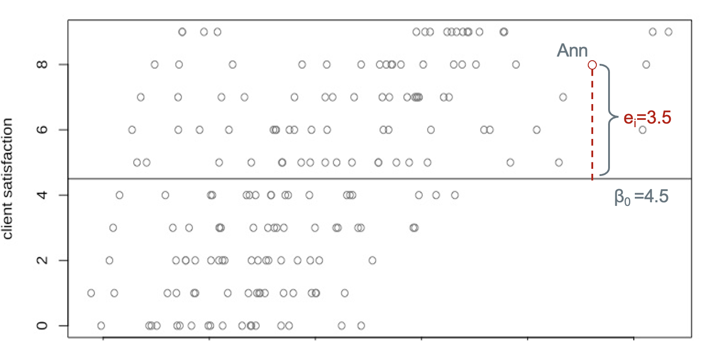
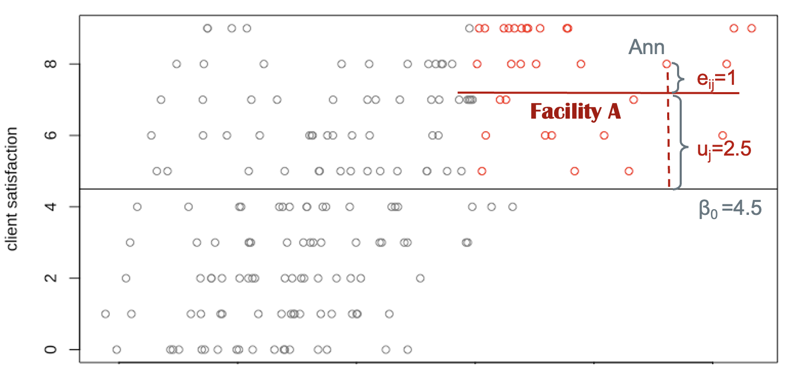

Throughout this series, we’ve been looking at PMA [Client Exit Interview (CEI)](../../index.html#category:Client_Exit_Interviews) surveys as a resource for understanding women’s assessments of care received from providers of family planning services. In a previous [post](../2022-02-01-cei-fp/#method-information), we explained how family planning researchers aggregate multiple dimensions of client assessment together in [key indicators](https://www.data4impactproject.org/prh/family-planning/) like the [Method Information Index Plus](https://knowledgesuccess.org/2019/11/19/what-is-the-method-information-index-mii/). We've also shown how to incorporate CEI data together with data collected about each facilty in PMA [Service Delivery Point (SDP)](../../index.html#category:Service_Delivery_Points) surveys.

Here, we'll wrap up this series with an example analysis that uses both cllient *and* facility data together while addressing the hierarchical structure of CEI sample design. Specifically, we’ll examine *factors related to client satisfaction for women who received a family planning method or prescription from their provider*. Our hypothesis is that the determinants of client satisfaction are multidimensional, including both individual client characteristics and certain features specific to each facility (like the range of family planning methods available). 

As we explore this question, we'll be building on the data cleaning steps outlined in our [last post](../2022-02-01-cei-fp/#method-information) so that we can focus our attention on analytic design. As we'll see, **ordinary least squares** regression may not be a good match for CEI data, which come from a convenience sample of female clients visiting a non-representative sample of facilities. Instead, we'll model unobserved differneces between facilities as **random effects** in a **mulitlevel model**. 

# Why "Multilevel"?

In general, we use multilevel models when data have a nested or clustered structure - meaning that smaller levels of analysis (family planning clients) are contained within larger grouping units (facilities). Readers might recall that we've briefly covered multilevel modeling before, where we modeled similarities between PMA [households within sample clusters](../2021-11-01-nutrition-analysis/index.html#multi-level-mixed-effects-models) as **random effects**. In general, multilevel models are often appropriate when data are collected in a spatial, temporal, or otherwise grouped structure. You may wonder *why should we care about data structure*? The short answer is that we should select an optimal statistical model based on the data we intend to analyze. But there are more factors to consider. 

## Theory 

In most social science research, model selection should be theory-driven. The best model choice is one that has a sound theoretical rationale. When thinking about social phenomena, we often ignore how social context plays a role in an individual’s life. By looking at data collected from individuals, we are focusing on the micro-level effects of specific characteristics on outcomes of interest, but these micro-level effects may vary across larger social contexts at the macro-level^[We recommend readers to check out Karen Robson and David Pevalin (2016) book, *Multilevel modeling in plain language* for a thorough discussion of the theoretical rationale of multilevel modeling].  

A frequently cited example is from education research examining children’s academic achievement. Any given child’s performance in school may primarily depend on their parents’ education and socioeconomic background. But teacher characteristics and the abilities of other children in their classroom are also likely to influence the child's performance. Because of these classroom effects, we would expect that a child’s test score is the result of both their individual characteristics and the features of their classroom, which are shared amongst their classmates. In a study where multpile students from the same classroom are sampled, we would need a statistical approach that explicitly address both individual and classroom effects.

## Statistical rationale 

More importantly, the reason we choose **multilevel models** over **ordinary least squares (OLS)** is that failing to recognize a multilevel data structure may violate key assumptions in the OLS approach. One of these assumptions is the *independence of observations*. This assumption posits that observations in a regression should be independent of one another. 

When individuals are sampled within groups, individuals from the same group may be more alike than individuals selected from different groups. This is especially true in cases where physical proximity is a strong predictor of group membership: we've shown in a previous [post](../2021-12-15-cei-conflict) that sampled women in CEI surveys mainly visit facilities that are close to their homes, and that civic unrest may disrupt transportation and access to those facilities. As a result, similarities between clients sampled at the same facility may be attributed to more than the facility itself - it could be that those women face similar access issues, live in similar neighborhoods, or share similar personal and occupational characteristics that we can't observe directly. If we ignore the spatial organization of our data, we risk *underestimating the standard errors* of our model [@gelman2006]. 

Fortunately, **multilevel modeling** gives us a way to simultaneously analyze data collected about both individual clients and the facilities where they were interviewed. In general, this approach enables us to link individuals to their social contexts and estimate the extent of group effects on individual outcomes. Moreover, it handles differences in number of women sampled at each facility - an important feature given that CEI data only include family planning clients who happened to visit each facility during a two day observation period [@mcelreath2020].

<aside>
Multilevel models go by many different names. The most common synonyms for multilevel models are hierarchical linear models, mixed effects models, and random effects models. People may use them all interchangeably.
</aside>

# How it works

Before we dive in, let’s revisit the simpler OLS appraoch, where all clients would be modeled with a single linear function. Consider a model where we estimate *only the intercept*:

$$
y_i = \beta_0 + e_i 
$$
Here, $y_i$ represents an outcome: in our case, this will be a particular client's satisfaction with family planning services after receiving a family planning method or prescription. $\beta_0$ is the regression intercept - it is the mean satisfaction score for all clients in the sample of all facilities. $e_i$ is the "error" term - also called the "residual" - and it measures the difference between an individual's *actual* satisfaction score and the score *predicted* for them by our model. Let’s take a look at a hypothetical sample.

```{r, fig.align='center', echo=FALSE}

```

This plot demonstrates an OLS regression line for client satisfaction with no predictors. The horizontal line corresponds to the overall mean satisfaction, which is also the intercept $\beta_0$=4.5. The distance from Ann’s score to the mean is the level-1 (individual level) residual $e_i$=3.5. Ann’s evaluation of services can be calculated as the sum of two parts: the overall mean and her residual, i.e. 4.5+3.5=8.

As we have mentioned, the OLS regression model only captures average relationships in the data and it can not address variations in the relationship between variables across units or groups. The average score of satisfaction across all facilities is 4.5, whereas the effect that any particular facility has on the client satisfaction is unknown. It is possible that Facility A’s rating is way better than the rating of other facilities, but that pattern would be totally ignored under the OLS framework. Fortunately, we have other options.

## Fixed effects

Instead of employing a simple OLS regression, we could address differences between facilities via a **fixed effects** approach, where we create dummy variables for each facility identified by [FACILITYID](https://pma.ipums.org/pma-action/variables/FACILITYID) within the same OLS framework. Suppose we have 200 facilities in our sample. We choose one facility as the reference and include indicators for the remaining 199  facilities as dummy variables. This approach is advantageous if you intend to compare service qualities across different facilities. Yet, the limitation is obvious: when the number of facilities is is too large compared to the number of clients, we experience a high risk of overfitting our model to the particular facilities we happend to sample. Another drawback in this approach is that it does not allow models to include facility-level explanatory variables - like the number of family planning methods available - since facility-level variables will have the same value for each dummy variable.  

## Variance decomposition

Now, let’s move on to the multilevel model. Again, we consider an intercept-only model. We will rewrite our model as:

$$
y_{ij} = \beta_0 + u_j+e_{ij} 
$$
Compare this to the OLS regression equation. First, we include a subscript $j$ to represent the facility identification. Now $y_{ij}$ represents the satisfaction score of woman $i$ who receives services from facility $j$. Second, a new term $u_j$ is included in the model, which represents the difference between a facility’s mean score and the overall mean. $\beta_0$ is again the average satisfaction and $e_{ij}$ is individual $i$’s deviation to the mean satisfaction score of her facility.

Let’s turn to our hypothetical data. We found Ann receives family planning services from Facility A and her rating of services is based on her experiences at that facility. Of course, our sample includes several women that also visited Facility A: we'll use the color red to mark these women on our plot. We can easily calculate the mean satisfaction score for Facility A by averaging the values of the red points. This facility mean is represented by a horizontal red line. Now, the distance of Ann's score to the overall mean score is decomposed into two parts (or in statistical terms, two variance components):  one is the distance from the facility mean to the overall mean. This corresponds to $u_j$. The other is the distance from her score to the facility's mean score, $e_{ij}$. To calculate Ann’s satisfaction, we sum up the overall mean (intercept), the group level deviation, and the individual residual, 4.5+2.5+1=8. Technically, We can repeat this process to find out all facility means, the group-level residuals ($u_{j, \ where \ j=1, 2…n}$), and individual-level residuals ($e_{ij,\ where  \ i=1, 2…k, \ j=1, 2… n}$). 

```{r, fig.align='center', echo=FALSE}

```

If there are 200 facilities in our sample, we can draw 200 regression lines for each of the facilities. Unlike the fixed overall mean $\beta_0$, these group-level means (group-level intercepts) vary across facilities. That is to say, each facility has its own intercept and the distance from the intercepts to the overall mean is represented by $u_j$. Statistically, to gauge these variations, we've assumed that group-level residuals follow a normal distribution in order to estimate their variance after fitting the model. Intuitively, the estimated variance of $u_j$ indicates the extent to which the group-level intercept, on average, varies by facilities/groups/units. Similarly, the estimated variance $e_{ij}$ represents the variance of individual scores around their affiliated group-level average (the group-level intercept).  

<aside>
The term fixed effects are not used in a consistent way. Fixed effects can be defined as varying coefficients that are not themselves modeled, such as dummy variables. It also refers to the coefficients that do not vary by group, just as the overall mean score in our example. See [Gelman and Hill (2006)](http://www.stat.columbia.edu/~gelman/arm/) for a discussion.
</aside>

The varying coefficients in a multilevel model are called **random effects**. The term **fixed effects** refers to coefficients that do not vary by group. In our case, the fixed effect is the estimated coefficient of the overall mean satisfaction score ($\beta_0$). The random effects are the coefficients of group-level residuals ($u_j$) and individual-level residuals ($e_{ij}$).
 
## Random intercept model

A basic multilevel model is a random intercept model. Random intercept models estimate unique lines for each group, where each line is parallel to the overall average line (just as we have shown in our intercept-only model above). Facility A’s regression line is parallel to the horizontal line of the mean satisfaction scores. The regression line for Facility B will be parallel to the line of the overall mean as well. When adding an explanatory variable to the model, we would be able to estimate the slope of the explanatory variable $\beta_1$. The parallel property remains the same, even as we add multiple dimensions to our model from multiple facility-level and client-level variables. The reason we call this a **random intercept model** is because the regression lines for any two facilities will always be parallel: the difference between facilities is captured by a unique intercept term. 

<aside>
It's worth noting that the terminology in statistical literature is confusing and inconsistent in terms of random intercept. Sometimes $\beta_0+u_j$ is called the random intercept while other people regard $u_i$ as the random intercept. 
</aside>

As we'll see, multilevel model interpretation will be familiar to those who are already familiar with ordinary least squares. $\beta_0$ is the average of the outcome when all $x$ variables are equal to zero. $\beta_1$ is the increase in the outcome for one unit increase in $x$. The main differnece is that we'll also need to interpret a random effects term: this will be the estimated variance (or standard deviation) of $u_j$ and $e_{ij}$. These represent the unexplained dispersion of client satistifaction scores at the facility level and at the individual level, respectively. 

<aside>
The random *intercept* model assumes that the strength of the relationship between $x$ and $y$ is the same across groups. Other multilevel models - like the random *slope* model - are preferred when the effect of $x$ on $y$ varies by group. 
</aside>

# Setup 

Let's now turn to a specific example using CEI and SDP data from the 2019 sample from Kenya. To keep setup simple, we'll restrict our analysis to a number of variables we've covered in [previous posts](../../index.html#category:Client_Exit_Interviews) in this series - there's a lot more that you might include in your own analysis! Specifically, we'll need these variables from the 2019 Kenya CEI survey: 

  * Three measures of client satisfaction that we'll index as our **dependent variable**
    - [FPGETDESIREDTODAY](https://pma.ipums.org/pma-action/variables/FPGETDESIREDTODAY): obtained her preferred family planning method
    - [RETURNFAC](https://pma.ipums.org/pma-action/variables/RETURNFAC): would return to the same provider again
    - [REFERFAC](https://pma.ipums.org/pma-action/variables/REFERFAC): would recommend the provider to a friend or relative
  * Demographic variables for each client 
    - [AGE](https://pma.ipums.org/pma-action/variables/AGE): age in years
    - [MARSTAT](https://pma.ipums.org/pma-action/variables/MARSTAT): marital status
    - [EDUCATTGEN](https://pma.ipums.org/pma-action/variables/EDUCATTGEN): education (4 categories)
    - [BIRTHEVENT](https://pma.ipums.org/pma-action/variables/BIRTHEVENT): number of birth events
  * Variables describing the quality of information provided about the method each client received, which we'll [again](../2022-02-01-cei-fp/#method-information) index as **Method Information Index Plus (MII+)**. They ask the client to recall whether their provider mentioned: 
    - [DISCOTHFP](https://pma.ipums.org/pma-action/variables/DISCOTHFP): other family planning methods they might use
    - [TELLSIDEEFF](https://pma.ipums.org/pma-action/variables/TELLSIDEEFF): side effects or problems they might have with the method
    - [TELLSEPROB](https://pma.ipums.org/pma-action/variables/TELLSEPROB): what to do about those side effects or problems
    - [TELLSWITCH](https://pma.ipums.org/pma-action/variables/TELLSWITCH): that they could switch methods in the future

Additionally, we'll merge several facility variables from the 2019 Kenya SDP survey. For the sake of simplicity, we'll consider variables indicating whether a facility **provides** a specific family planning method (variables with names ending with `PROV`, e.g. [IUDPROV](https://pma.ipums.org/pma-action/variables/IUDPROV)). See [this post](../2021-01-28-across-sdp/#summarize-variable-groups-by-facility) for tips when working with several method-specific variables generated from the same multiple response question. We'll simply count the total number of methods provided at each facility. 

You'll need to [create separate data extracts for the CEI and SDP surveys](../2022-02-01-cei-fp/index.html). Once you've downloaded them, load each into R along with the [tidyverse](https://tidyverse.tidyverse.org/) and [ipumsr](https://tech.popdata.org/ipumsr) packages as follows: 

```{r postpath, eval=FALSE, echo=FALSE}
library(here)
postpath <- file.path(here(), "_posts/2022-02-15-cei-analysis")
if(getwd() != postpath){setwd(postpath)}
options(tibble.print_min = 10)
```

```{r, results='hide'}
library(ipumsr)
library(tidyverse)

cei <- read_ipums_micro(
  ddi = "data/pma_00001.xml",
  data = "data/pma_00001.dat.gz"
) 

sdp <- read_ipums_micro(
  ddi = "data/pma_0002.xml",
  data = "data/pma_0002.dat.gz"
)
```

```{r, echo = FALSE}
cei <- cei %>% filter(COUNTRY == 7)
```

[As we've discussed](../2021-12-01-cei-discovery/index.html#missing-data), it's often useful to filter CEI data using [FPINFOYN](https://pma.ipums.org/pma-action/variables/FPINFOYN): clients who received neither family planning information nor a method were not given further questions, so they'll appear as `NIU (not in universe)` in most variables. Dropping these cases will eliminate most of the values we'd otherwise label `NA` below. 

```{r}
cei <- cei %>% filter(FPINFOYN == 1)
```

Next, we'll link women from the `cei` data extract together with data from the corresponding facility in the `sdp` data extract. We'll use [left_join](https://dplyr.tidyverse.org/reference/mutate-joins.html), thereby preserving all rows in `cei` while duplicating rows from `sdp` to match every woman sampled at a particular facility (this also drops any facility where no client exit interviews were conducted). 

```{r}
dat <- left_join(
  cei, 
  sdp, 
  by = "FACILITYID", 
  suffix = c("_CEI", "_SDP")
) 
```

# Variable recoding

The service quality measure MII+ discussed in our [previous post](../2022-02-01-cei-fp/index.html#method-information) describes the depth of information given by a provider to a woman who *received a family planning method or prescription* during her visit. If a woman did *not* receive a method or prescription - or if she did not respond to one of the component questions of MII+ - we'll want to exclude her from our analysis. Similarly, we'll drop cases where `FPGETDESIREDTODAY` shows that the woman obtained no method because she was only seeking follow-up care. Finally, we'll exclude any woman who declined to answer or responded "don't know" to any of our key questions of interest. 

We'll mark all of these cases `NA` so that they'll be dropped automatically from our analysis.

```{r}
dat <- dat %>% 
  select(
    FACILITYID, AGE, BIRTHEVENT,
    REFERFAC, RETURNFAC, 
    FPGETDESIREDTODAY, 
    TELLSWITCH, DISCOTHFP, TELLSIDEEFF, TELLSEPROB, 
    EDUCATTGEN, MARSTAT,
    ends_with("PROV")
  ) %>% 
  mutate(across(
    everything(), 
    ~.x %>% 
      lbl_na_if(~.lbl %in% c(
        "Don't know", 
        "No response or missing",
        "NIU (not in universe)",
        "Neither, did not obtain"
      )) %>% 
      zap_labels()
  )) 
```

Next, we'll recode every binary variable as a **logical** taking the value `TRUE` for affirmative responses, and `FALSE` for negative responses (all other values are coded `NA`). As in our [last post](../2022-02-01-cei-fp/index.html), this will include binary recodings for [EDUCATTGEN](https://pma.ipums.org/pma-action/variables/EDUCATTGEN) and [MARSTAT](https://pma.ipums.org/pma-action/variables/MARSTAT) as `EDUCAT2` (more than primary/middle school education) and `MARSTAT2` (either married or living with a partner). 

```{r}
dat <- dat %>% 
  mutate(
    EDUCAT2 = EDUCATTGEN > 2,
    MARSTAT2 = MARSTAT == 21 | MARSTAT == 22,
    across(-c(FACILITYID, AGE, BIRTHEVENT), as.logical)
  ) %>% 
  select(-c(EDUCATTGEN, MARSTAT))
```

Lastly, we'll create three aggregate measures to summarise most of the **logical** variables we've just created. 

  1. `SATIS`, our dependent variable, will be the sum of `TRUE` values in `FPGETDESIREDTODAY`, `RETURNFAC`, and  `REFERFAC`
  2. `NUM_METHODS_PROV` will count the number of methods provided at each client's facility (variables ending with `PROV`)
  3. `MIIplus` will be `TRUE` if all four components of **MII+** are `TRUE`

We'll use `transmute` here to build all three while *dropping* each of their component variables. We also preserve `FACILITYID`, `AGE`, `BIRTHEVENT`, `EDUCAT2`, and `MARSTAT2` by including them as-is. Finally, we'll use `drop_na` to drop any cases with `NA` values in any of our variables of interest. 

```{r, echo = FALSE}
# FYI: `rowSums` is vectorized, so this approach renders MUCH faster!
# It makes sense to show the version using `rowwise` b/c it's more readable;
# however, for Knitting the blog post, you might want to use this one 
# in the background (`echo = FALSE` here, and `eval = FALSE` there)
dat <- dat %>% 
  transmute(
    FACILITYID,
    AGE,
    BIRTHEVENT,
    EDUCAT2, 
    MARSTAT2,
    SATIS = cur_data() %>% 
      select(c(REFERFAC, RETURNFAC, FPGETDESIREDTODAY)) %>% 
      rowSums(na.rm = TRUE),
    NUM_METHODS_PROV = cur_data() %>% 
      select(ends_with("PROV")) %>% 
      rowSums(na.rm = TRUE),
    MIIplus = if_all(c(TELLSWITCH, DISCOTHFP, TELLSEPROB, TELLSIDEEFF))
  ) %>% 
  drop_na()
```

```{r, eval = FALSE}
dat <- dat %>%
  rowwise() %>% 
  transmute(
    FACILITYID, AGE, BIRTHEVENT, EDUCAT2, MARSTAT2,
    SATIS = sum(REFERFAC, RETURNFAC, FPGETDESIREDTODAY, na.rm = TRUE),
    NUM_METHODS_PROV = sum(c_across(ends_with("PROV")), na.rm = TRUE),
    MIIplus = if_all(c(TELLSWITCH, DISCOTHFP, TELLSEPROB, TELLSIDEEFF))
  ) %>% 
  ungroup()
```

As a last step, we'll create new **variable labels** for each measure that we'll use in all figures that follow. 

```{r}
dat <- dat %>% 
  labelled::set_variable_labels(
    SATIS = "Client satisfaction index",
    MIIplus = "Method Information Index PLUS (MII+)",
    NUM_METHODS_PROV = "Number of methods provided by facility",
    BIRTHEVENT = "Birth count",
    EDUCAT2 = "Education: more than primary/middle school",
    MARSTAT2 = "Married or living with partner",
    AGE = "Age"
  )
```

# Summary table

Now that we’ve finished data cleaning, let's take a look at the distribution of these variables in a [gtsummary](https://www.danieldsjoberg.com/gtsummary/) table. When creating the table, we'll specify a specific summary statistic for `FACILITYID` so that the total number of sampled facilities is shown via `n_distinct`; we'll use the default summary statistics for all other variables.

```{r}
library(gtsummary)

dat %>% 
  tbl_summary(
    digits = list(everything() ~ 0),       
    missing = "no",
    statistic = list(FACILITYID ~ "{n_distinct}"),
    label = list(FACILITYID ~ "Number of sampled facilities")
  ) %>% 
  modify_table_body(
    ~.x %>% 
      mutate(variable = variable %>% fct_relevel(
        "AGE", "BIRTHEVENT", "EDUCAT2", "MARSTAT2", "MIIplus", "FACILITYID", 
        "NUM_METHODS_PROV", "SATIS"
      )) %>% 
      arrange(variable)
  ) %>% 
  modify_spanning_header(everything() ~ "# Descriptive Statistics") %>% 
  modify_header(update = list(label ~ " ")) %>% 
  italicize_labels() 
```

At the bottom of this table, we display the frequency and percentage of scores on our dependent variable, `SATIS`. As you can see, a strong majority (90%) of sampled clients provided affirmative responses for all three component survey questions captured by this "client satisfaction index". Among the remaining cases, only about 1% provided affirmative responses to fewer than two questions. 

Our **integer** independent variables are summarised by median (and IQR), while our **logical** (binary) independent variables are summarised by frequency (and percent). Notably: only a slim majority of clients receiving a family planning method met the criteria for `MII+` (57%). Meanwhile, we see that 50% of sampled facilities provide between 6 and 8 different family planning methods (among 13 methods listed on the SDP questionnaire). Our final sample includes 3,749 clients sampled at 438 facilities. 

# Models

Multilevel models can easily be estimated in R using the package [lme4](https://github.com/lme4/lme4). Because the `lme4` package does not include *p* values by default, we also load the [lmerTest](https://github.com/runehaubo/lmerTestR) to generate significance levels for each of our coefficients. Finally, we'll need [broom.mixed](https://github.com/bbolker/broom.mixed) to import `tidy` methods used to display model output. 

```{r}
library(lme4)
library(lmerTest)
library(broom.mixed)
```

As you can see in the code chunk below, the code for a multilevel model is similar to an OLS model. The only difference is an additional group component or facility effect. The `(1 | FACILITYID)` is included at the end of the model, which means that we allow the intercept, represented by 1, to vary by facilities. Let's first estimate an intercept-only model without including any explanatory variables; we'll call this model `m1`, and we'll display the results in a `gtsummary` table.

```{r}
# Model
m1 <- lmer(SATIS ~ 1 + (1 | FACILITYID), data = dat) 

# Table 
m1 %>% 
  gtsummary::tbl_regression(
    conf.int = TRUE, 
    intercept = TRUE,
    tidy_fun = broom.mixed::tidy,
    label = list(
      `(Intercept)` = "Intercept",
      `FACILITYID.sd__(Intercept)` = "Random Effects: facility (SD)",
      `Residual.sd__Observation` = "Random Effects: client residual (SD)"
    )
  ) %>% 
  modify_spanning_header(everything() ~ "# Model 1: Intercept-only Model") %>% 
  modify_header(update = list(label ~ " ")) %>% 
  add_significance_stars()
```

Notice that there are three estimated terms here (we've customized their labels to make the output easier to read). The overall `Intercept` is listed first: it stands for average satisfaction score for all women in the sample. It represents the mean satisfaction score in the complete Kenya 2019 sample (if you recall the plot, the intercept corresponds to the horizontal line $\beta_0$):

```{r}
dat %>% summarise(mean_SATIS = mean(SATIS) %>% round(1))
```

There are also two terms for this model's **random effects**. The first shows the estimated standard deviation of facility intercepts. If needed, you can find the intercepts generated for each sampled facility with the `coef` function like so:

```{r}
m1_coef <- coef(m1)$FACILITYID %>% 
  rownames_to_column("FACILITYID") %>% 
  tibble() 

m1_coef
```

The final term is the estimated standard deviation for individual clients (`SD`$e_{ij}$). Predicted values for clients can be obtained with the `predict` function and attached to `dat` for comparison with each individual's actual `SATIS` score:  

```{r}
predict(m1) %>% 
  tibble() %>% 
  bind_cols(dat) %>% 
  select(SATIS, PREDICTED = ".")
```

Next, we'll include all of our explanatory variables in a second model and save the model estimates to `m2`

```{r}
m2 <- lmer(
  SATIS ~ MIIplus + NUM_METHODS_PROV + AGE +
    BIRTHEVENT + EDUCAT2 + MARSTAT2 + (1 | FACILITYID), 
  data = dat
) 

m2 %>% 
  gtsummary::tbl_regression(
    conf.int = TRUE, 
    show_single_row = where(is.logical),
    tidy_fun = broom.mixed::tidy,
    label = list(
      `FACILITYID.sd__(Intercept)` = "Random Effects: facility (SD)",
      `Residual.sd__Observation` = "Random Effects: client residual (SD)"
    )
  ) %>% 
  modify_spanning_header(everything() ~ "# Model 2: Mixed Effects Model") %>% 
  modify_header(update = list(label ~ " ")) %>% 
  add_significance_stars()
```

The predicted standard deviation for both **random effects** is nearly unchanged, but the model now includes coefficient estimates for each explanatory variable - our **fixed effects**. The interpretation for fixed effects is similar to the interpretation for the results of an OLS model; for example, clients who meet the criteria for *MII+* are estimated to score 0.05 points higher on our satisfaction index compared to those who do not (although this effect is quite small, it is significant at `p < 0.001`). None of the other effects are statistically significant. 

Suppose you wanted to review the estimated slopes for each facility with `coef` as we did above. The key difference between **random effects** and **fixed effects** is that the estimated slope for every **fixed effect** is *the same for every facility*; only the **random effects** will vary. 

```{r}
m2_coef <- coef(m2)$FACILITYID %>% 
  rownames_to_column("FACILITYID") %>% 
  tibble()

m2_coef
```

## Visualization

In [previous posts](../2021-07-15-covid-likert/#faceted-neutral-non-response), we've explored **faceted graphics** as a way to compare descriptive statistics across samples or countries - in fact, they're also a handy way to visualize mixed effect models. 

Consider, for example, a simple version of our model with only one fixed effect: we'll use `AGE` here. 

```{r}
m3 <- lmer(SATIS ~ AGE + (1 | FACILITYID), data = dat)
```

In a faceted display, we could compare the different regression models produced by facility-specific random effects: let's look at the facilities with the 3 *highest* and 3 *lowest* intercept terms. 

```{r}
m3_coefs <- coef(m3)$FACILITYID %>% 
  rownames_to_column("FACILITYID") %>% 
  tibble() 

m3_coefs <- bind_rows(
  slice_max(m3_coefs, `(Intercept)`, n = 3),
  slice_min(m3_coefs, `(Intercept)`, n = 3)
)

m3_coefs 
```

First, let's plot the `AGE` and `SATIS` reported for each client in these facilities. We'll `filter` our data to include only women who visited one of the facilities in `m3_coefs`, and we'll arrange `FACILITYID` as a factor with levels sorted from the lowest to highest mean satisfaction score.

```{r}
dat_m3 <- dat %>%
  filter(FACILITYID %in% m3_coefs$FACILITYID) %>% 
  group_by(FACILITYID) %>% 
  mutate(FACSAT = mean(SATIS)) %>% 
  ungroup() %>% 
  mutate(FACILITYID = FACILITYID %>% as_factor %>% fct_reorder(FACSAT))
```

Next, we'll plot actual `AGE` and `SATIS` for each client. We'll use `FACILITYID` to place responses from clients at the lowest ranking facilities in the top row, whereas clients at the highest ranking facilities will be in the bottom row. Notice that the mode in the top row is 2, while facilities in the bottom row unanimously received perfect 3 rankings.

```{r}
# graphics theme
source("theme_pma.R")

plot_m3 <- dat_m3 %>% 
  ggplot(aes(x = AGE, y = SATIS)) + 
  geom_point() + 
  theme_pma(
    "Client Satisfaction by Age and Facility",
    "The three lowest and highest rated facilities in Kenya 2019 are shown"
  ) + 
  labs(
    x = "Age",
    y = "Satisfaction Score"
  ) + 
  facet_wrap(vars(FACILITYID), dir = "h", ncol = 3)
```

<aside>
The function `theme_pma` is defined in sourced script you'll find in [the folder for this post on GitHub](https://github.com/ipums/pma-data-hub/tree/master/_posts/2022-02-15-cei-analysis). Learn more about custom `ggplot2` themes [here](https://ggplot2.tidyverse.org/articles/ggplot2-in-packages.html?q=theme%20replace#creating-a-new-theme-1).
</aside>

```{r, layout="l-body-outset", fig.width=12, fig.height=5}
plot_m3
```

Finally, we'll plot the predicted linear model with unique intercepts for each facility. 

```{r, layout="l-body-outset", fig.width=12, fig.height=5, preview=TRUE}
m3_coefs %>% 
  rename(INT = `(Intercept)`, SLOPE = AGE) %>% 
  left_join(dat_m3, by = "FACILITYID") %>% 
  group_by(FACILITYID) %>% 
  mutate(FACSAT = mean(SATIS)) %>% 
  ungroup() %>% 
  mutate(FACILITYID = FACILITYID %>% as_factor %>% fct_reorder(FACSAT)) %>% 
  ggplot(aes(x = AGE, y = SATIS)) + 
  geom_point() + 
  geom_abline(aes(intercept = INT, slope = SLOPE)) +
  theme_pma(
    "Client Satisfaction by Age with Facility Random Effects",
    "The three lowest and highest rated facilities in Kenya 2019 are shown"
  ) + 
  labs(
    x = "Age",
    y = "Satisfaction Score"
  ) + 
  facet_wrap(vars(FACILITYID), dir = "h", ncol = 3) 
```

Here, we can see the idea of "random intercepts" more clearly. While the slope of all 6 lines is identical (and very nearly zero), each facility has a unique intercept on the y-axis. This reflects the higher client satisfaction in the bottom three facilities compared to those in the top row. Taken together, the  effect of age client satisfaction with family planning services is trivial,  although the significance is borderline. Results from model `m2` indicate a more prominent effect of `MIIplus` on client satisfaction (this suggests that facility features matter!) 

This post is also an introduction to the motivation, application, and interpretation of basic multilevel models. We've focused on the random intercept model, which is applied to achieve better estimates of baseline differences when we intend to analyze hierarchical data. It is advantageous compared to regular OLS regression because it simultaneously models group-level variation and individual-level differences. For PMA Client Exit Interview data - where clients are sampled at facilities participating on a contemporaneous Serivice Delivery Point survey - multilevel models are a great way to incorporate both facility and client characteristics into your analysis. 


