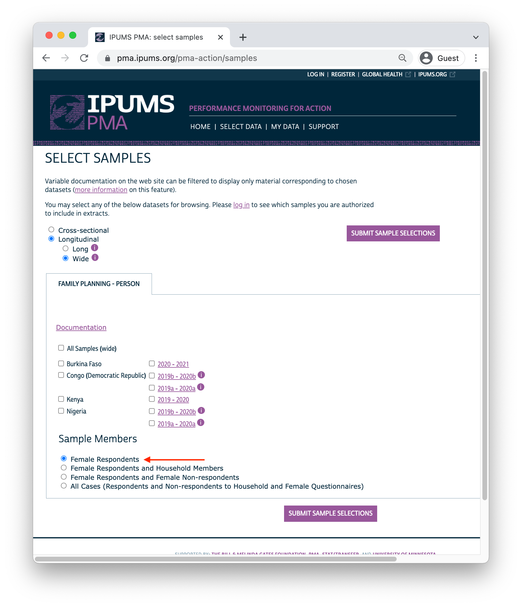

```{r setup, echo=FALSE, results='hide'}
source(here::here("r/utilities.r"))
set_postpath("2022-03-01-phase2-discovery")

widef <- read_ipums_micro(
  ddi = "data/pma_00079.xml",
  data = "data/pma_00079.dat.gz"
)

knitr::opts_chunk$set(echo = FALSE)
```

This month, IPUMS is excited to announce the release of **harmonized panel data** focused on the reproductive and sexual health of women surveyed by our partners at [Performance Monitoring for Action](https://www.pmadata.org/) (PMA). Participating women will be interviewed up to three times over three years, so we've made big changes to our [data extract system](https://pma.ipums.org/) making it easy to compare an individual's responses across multiple rounds of data collection. Cross-sectional samples of women, households, and service delivery points remain available as before, but we've also streamlined navigation for users interested in longitudinal analysis with these new panel surveys. 

Here on the IPUMS PMA blog, today marks the beginning of a [new series](../../index.html#category:Panel_Data) in which we'll be using R to: 

  * import and explore the structure of IPUMS PMA panel data
  * understand key sample design and follow-up issues 
  * build indicators measuring change in contraceptive use status and family planning outcomes
  * analyze monthly recall data from the included [contraceptive calendar](../../index.html#category:Contraceptive_Calendar) 

Additionally, we're also developing a second **online course** for newcomers to longitudinal analysis that will complement our existing [Introduction to IPUMS PMA Data Analysis](../../introduction.html). Later this year, we also plan to release a PDF **longitudinal handbook** adapted from this blog that will include examples in **both R and Stata**. Stay tuned for further announcements here and [on Twitter](https://twitter.com/ipumsGH) in the coming weeks.

<aside>
PMA has also published a **cross-sectional handbook** in both [English](https://www.pmadata.org/media/1243/download?attachment) and [French](https://www.pmadata.org/media/1244/download?attachment).
</aside>

# Background

Dating back to 2013, the original PMA survey design included high-frequency, **cross-sectional** samples of women and service delivery points collected from eleven countries participating in [Family Planning 2020](http://progress.familyplanning2020.org/) (FP2020) - a global partnership that supports the rights of women and girls to decide for themselves whether, when, and how many children they want to have. These surveys were designed to monitor annual progress towards [FP2020 goals](http://progress.familyplanning2020.org/measurement) via population-level estimates for several [core indicators](http://www.track20.org/pages/data_analysis/core_indicators/overview.php). 

Beginning in 2019, PMA surveys were redesigned under a renewed partnership called [Family Planning 2030](https://fp2030.org/) (FP2030). These new surveys have been refocused on reproductive and sexual health indicators, and they feature a **longitudinal panel** of women of childbearing age. This design will allow researchers to measure contraceptive dynamics and changes in women’s fertility intentions over a **three year period** via annual in-person interviews.^[In addition to these three in-person surveys, PMA also conducted telephone interviews with panel members focused on emerging issues related to the COVID-19 pandemic in 2020. These telephone surveys are already available for several countries - see our series on [PMA COVID-19 surveys](../../index.html#category:COVID-19) for details.] 

Questions on the redesigned survey cover topics like:

  * awareness, perception, knowledge, and use of contraceptive methods
  * perceived quality and side effects of contraceptive methods among current users
  * birth history and fertility intentions 
  * aspects of health service provision 
  * domains of empowerment 
  
# Sampling 

PMA panel data includes a mixture of **nationally representative** and **sub-nationally representative** samples from eight participating countries. The panel study consists of three data collection phases, each spaced one year apart. IPUMS PMA has released data from the first *two* phases for countries where Phase 1 data collection began in 2019; we have released data from only the *first* phase for countries where Phase 1 data collection began in August or September 2020. Phase 3 data collection and processing is currently underway. 

```{r, layout="l-body-outset"}
library(kableExtra)
options(knitr.kable.NA = '')

avail <- read_csv("data/sample_avail.csv") 
names(avail)[2] <- paste0(
  names(avail)[2], 
  footnote_marker_symbol(1)
)

avail %>%   
  arrange(Sample) %>% 
  kable(escape = FALSE, format = "html", table.attr = "style='width:100%;'") %>% 
  kable_styling() %>% 
  add_header_above(c(" " = 2, "Now Available from IPUMS PMA" = 3)) %>% 
  scroll_box(
    width = "100%", 
    box_css = paste(
      sep = "; ",
      "margin-bottom: 1em",
      "margin-top: 0em",
      "border: 0px solid #ddd",
      "padding: 5px"
    )
  ) %>%
  footnote(
    symbol = "<em>Each data collection phase is spaced one year apart</em>", 
    escape = FALSE
  )

```

<div>
PMA uses a multi-stage clustered sample design, with stratification at the urban-rural level or by sub-region. Geographically defined sample clusters - called [enumeration areas](https://pma.ipums.org/pma-action/variables/EAID#description_section) (EAs) -- are provided by the national statistics agency in each country.^[[Displaced GPS coordinates](https://tech.popdata.org/pma-data-hub/posts/2021-10-15-nutrition-climate/PMA_displacement.pdf) for the centroid of each EA are available for most samples [by request](https://www.pmadata.org/data/request-access-datasets) from PMA. IPUMS PMA provides shapefiles for PMA countries [here](https://internal.pma.ipums.org/pma/gis_boundary_files.shtml).] These EAs are sampled using a *probability proportional to size* (PPS) method relative to the population distribution in each stratum.

At Phase 1, 35 household dwellings were selected at random within each EA. Resident enumerators visited each dwelling and invited one household member to complete a [Household Questionnaire](https://pma.ipums.org/pma/resources/questionnaires/hhf/PMA-Household-Questionnaire-English-2019.10.09.pdf)^[Questionnaires administered in each country may vary from this **Core Household Questionnaire** - [click here](https://pma.ipums.org/pma/enum_materials.shtml) for details.] that includes a census of all household members and visitors who stayed there during the night before the interview. Female household members and visitors aged 15-49 were then invited to complete a subsequent Phase 1 [Female Questionnaire](https://pma.ipums.org/pma/resources/questionnaires/hhf/PMA-Female-Questionnaire-English-2019.10.09.pdf).^[Questionnaires administered in each country may vary from this **Core Female Questionnaire** - [click here](https://pma.ipums.org/pma/enum_materials.shtml) for details.]
</div>

<aside>
Questionnaires are administered in-person by **resident enumerators** visiting selected households in each EA. These are typically women over age 21 living in (or near) each EA and who hold at least a high school diploma.
</aside>

One year later, resident enumerators visited the same dwellings and administered a Phase 2 Household Questionnaire. A panel member in Phase 2 is any woman still age 15-49 who could be reached for a second Female Questionnaire, either because:

  * she still lived there, or
  * she had moved elsewhere within the study area,^[The "study area" is area within which resident enumerators should attempt to find panel women that have moved out of their Phase 1 dwelling. This may extend beyond the woman's original EA as determined by in-country administrators - see [PMA Phase 2 and Phase 3 Survey Protocol](https://www.pmadata.org/data/survey-methodology) for details.] but at least one member of the Phase 1 household remained and could help resident enumerators locate her new dwelling.^[In cases where no Phase 1 household members remained in the dwelling at Phase 2, women from the household are considered lost to follow-up (LTFU). A panel member is also considered LTFU if a Phase 2 Household Questionnaire was not completed, if she declined to participate, or if she was deceased or otherwise unavailable.]
  
<aside>
`r varlink(SAMEDWELLING)` indicates whether a Phase 2 female respondent resided in her Phase 1 dwelling or a new one. 
</aside>
  
Additionally, resident enumerators administered the Phase 2 Female Questionnaire to *new* women in sampled households who:

  * reached age 15 after Phase 1
  * joined the household after Phase 1
  * declined the Female Questionnaire at Phase 1, but agreed to complete it at Phase 2
  
<aside>
`r varlink(PANELWOMAN)` indicates whether a Phase 2 household member completed the Phase 1 Female Questionnaire.  
</aside>

When you select the new **Longitudinal** sample option at checkout, you'll be able to include responses from every available phase of the study. These samples are available in either "long" format (responses from each phase will be organized in separate rows) or "wide" format (responses from each phase will be organized in columns). 

```{r}
knitr::include_graphics("images/long_radio.png")
```

In addition to following up with women in the panel over time, PMA also adjusted sampling so that a cross-sectional sample could be produced concurrently with each data collection phase. These samples mainly overlap with the data you'll obtain for a particular phase in the longitudinal sample, except that replacement households were drawn from each EA where more than 10% of households from the previous phase were no longer there. Conversely, panel members who were located in a new dwelling at Phase 2 will not be represented in the cross-sectional sample drawn from that EA. These adjustments ensure that population-level indicators may be derived from cross-sectional samples in a given year, even if panel members move or are lost to follow-up. 

<aside>
`r varlink(CROSS_SECTION)` indicates whether a household member in a longitudinal sample is also included in the cross-sectional sample for a given year (every person in a cross-sectional sample is included in the longitudinal sample). 

We'll cover **sample composition** in much greater detail in an upcoming post.
</aside>

You'll find PMA cross-sectional samples dating back to 2013 if you select the **Cross-sectional** sample option at checkout. 

```{r}
knitr::include_graphics("images/cross_radio.png")
```

# Weights and Clusters

Whether you intend to work with a new **Longitudinal** or **Cross-sectional** data extract, you'll find the same set of sampling weights available for all PMA Family Planning surveys dating back to 2013. 

  * `r varlink(HQWEIGHT, description)` can be used to generate cross-sectional population estimates from questions on the Household Questionnaire.^[`HQWEIGHT` reflects the [calculated selection probability](https://internal.pma.ipums.org/pma/resources/documentation/weighting_memo.pdf) for a household in an EA, normalized at the population-level. Users intending to estimate population-level indicators for *households* should restrict their sample to one person per household via `r varlink(LINENO, description)` - see [household weighting guide](https://internal.pma.ipums.org/pma/weightguide.shtml#hh) for details.]
  * `r varlink(FQWEIGHT, description)` can be used to to generate cross-sectional population estimates from questions on the Female Questionnaire.^[`FQWEIGHT` adjusts `HQWEIGHT` for female non-response within the EA, normalized at the population-level - see [female weighting guide](https://internal.pma.ipums.org/pma/weightguide.shtml#female) for details.]
  * `r varlink(EAWEIGHT, description)` can be used to compare the selection probability of a particular household with that of its EA. 
  
<aside>
A fourth Family Planning survey weight, `r varlink(POPWT, description)`, is currently available only for **Cross-sectional** data extracts and Phase 1 panel data.^[`POPWT` can be used to estimate population-level *counts* - [click here](https://internal.pma.ipums.org/pma/population_weights.shtml) or check out [this video](https://www.youtube.com/watch?v=GnCq26t4zgM) for details.] 
</aside>

Additionally, PMA created a new weight, `r varlink(PANELWEIGHT, description)`, 
which should be used in longitudinal analyses spanning multiple phases, as it adjusts for loss to follow-up. `PANELWEIGHT` is available only for **Longitudinal** data extracts. 

In upcoming posts, we'll use the [srvyr](http://gdfe.co/srvyr/index.html) package to weight longitudinal indicators with `PANELWEIGHT`.^[The `srvyr` package is a [tidy](https://tidyverse.tidyverse.org/) implementation of the popular [survey](http://r-survey.r-forge.r-project.org/survey/) package for R, authored by Dr. Thomas Lumley. For thorough discussion of the types of weights available in both R and Stata, we recommend [this blog post](https://notstatschat.rbind.io/2020/08/04/weights-in-statistics/) by Dr. Lumley.] For example, suppose we wanted to estimate the proportion of reproductive age women in Burkina Faso who were using contraception at the time of data collection for both Phase 1 and Phase 2. In a "wide" longitudinal extract, you'll find responses from this survey question recorded in `CP_1` for Phase 1, and in `CP_2` for Phase 2. 

<aside>
Variable names in a "wide" extract have a numeric suffix corresponding with a data collection phase. `CP_1` is the Phase 1 version of `r varlink(CP)`, while `CP_2` comes from Phase 2. 
</aside>

```{r, echo = FALSE}
# n = 5491 (checked with flowchart)
dat <- widef %>% 
  filter(SAMPLE_1 == 85409) %>% 
  filter(RESULTFQ_1 %in% c(1,5)) %>%
  filter(AGEHQ_1 < 49) %>% 
  filter(SURVEYWILLING_1 == 1) %>%  # 6532 women aged and agreed
  filter(RESULTHQ_2 %in% 1) %>%  # completed HQ
  filter(RESULTFQ_2 %in% 1) # completed FQ

# Target: n=5207 (final report)  
# drop du jure (usual member, slept away last night), n = 5212
dat <- dat %>% 
  filter(RESIDENT_1 != 21) %>% 
  filter(RESIDENT_2 != 21 & RESIDENT_2 != 31)

# dropping NIU in CP, we get n = 5207
knitr::opts_chunk$set(echo = TRUE)
```

```{r}
dat %>% count(CP_1, CP_2)
```

The `srvyr` package provides two functions we'll need to obtain our population estimate. The first, [as_survey_design](http://gdfe.co/srvyr/reference/as_survey_design.html), allows us to specify `PANELWEIGHT` as a sampling weight. The second, [survey_mean](http://gdfe.co/srvyr/reference/survey_mean.html), uses that weight in an estimating function; in this case, we'll get the estimated proportion where `CP_1` and `CP_2` both have the value `1 [Yes]` after removing missing / NIU responses with `CP_1 != 99`.

```{r}
library(srvyr)

dat %>% 
  as_survey_design(weight = PANELWEIGHT) %>% 
  filter(CP_1 != 99) %>% 
  summarize(survey_mean(CP_1 * CP_2))
```

<aside>
`coef` shows the estimated population proportion

`_se` shows the standard error for this estimate
</aside>

This estimate suggests that 18.8% of all reproductive age women in Burkina Faso would have been using contraception when both Phase 1 and Phase 2 data were collected. The standard error 0.00733 is shown by default, but we can choose a confidence interval "ci" for a specified confidence level if desired. 

```{r}
dat %>% 
  as_survey_design(weight = PANELWEIGHT) %>% 
  filter(CP_1 != 99) %>% 
  summarize(
    survey_mean(
      CP_1 * CP_2,
      vartype = "ci",
      level = 0.99
    )
  )
```

<aside>
`_low` and `_upp` show the lower and upper bounds of a 99% confidence interval
</aside>

For binary variables where the estimated proportion approaches 0% or 100%, it's often useful to obtain an asymmetric confidence interval that cannot exceed those values. Consider, for example, the proportion of women who were pregnant at Phase 1 and again just 12 months later at Phase 2 (excluding women who were unsure or did not respond in either phase): 

```{r}
dat %>% 
  filter(PREGNANT_1 < 90, PREGNANT_2 < 90) %>% 
  count(PREGNANT_1, PREGNANT_2)
```

Only 11 such women were found in the Burkina Faso sample, so we should expect the population estimate to be very close to 0%. 

```{r}
dat %>% 
  filter(PREGNANT_1 < 90, PREGNANT_2 < 90) %>% 
  as_survey_design(weight = PANELWEIGHT) %>% 
  summarize(
    survey_mean(
      PREGNANT_1 * PREGNANT_2,
      vartype = "ci",
      level = 0.99
    )
  )
```

<aside>
`_low` shows a negative value: our confidence interval should not include values below 0%
</aside>

The `survey_mean` function accepts several methods for setting a lower limit on `_low`. We'll use `proportion = TRUE` to employ a method selected by `prop_method`. The "logit" method calculates a Wald-type confidence interval on the log-odds scale; Stata users will notice that it reproduces results obtained with `svy: prop`.^[See [svyciprop](https://rdrr.io/pkg/survey/man/svyciprop.html) for additional methods.]

```{r}
dat %>% 
  as_survey_design(weight = PANELWEIGHT) %>% 
  filter(PREGNANT_1 < 90, PREGNANT_2 < 90) %>% 
  summarize(
    survey_mean(
      PREGNANT_1 * PREGNANT_2,
      vartype = "ci",
      level = 0.99,
      proportion = TRUE,
      prop_method = "logit"
    )
  )
```

Compared with the non-adjusted standard error, the Wald-type confidence interval contains only values between 0% and 100%. Also notice that the interval is asymmetrical for values close to these limits.

```{r, echo = FALSE, layout="l-page", fig.height=5, fig.width=12}
library(sysfonts)
library(showtext)

sysfonts::font_add(
  family = "cabrito", 
  regular = "../../fonts/cabritosansnormregular-webfont.ttf"
)
showtext::showtext_auto()

no <- dat %>% 
  as_survey_design(weight = PANELWEIGHT) %>% 
  filter(PREGNANT_1 < 90, PREGNANT_2 < 90) %>% 
  summarize(
    100*survey_mean(
      PREGNANT_1 * PREGNANT_2,
      vartype = "ci",
      level = 0.99
    )
  ) %>% 
  mutate(CLUSTERED = "Non-adjusted \nStandard Error")

yes <- dat %>% 
  as_survey_design(weight = PANELWEIGHT) %>% 
  filter(PREGNANT_1 < 90, PREGNANT_2 < 90) %>% 
  summarize(
    100*survey_mean(
      PREGNANT_1 * PREGNANT_2,
      vartype = "ci",
      level = 0.99,
      proportion = TRUE,
      prop_method = "logit"
    )
  ) %>% 
  mutate(CLUSTERED = "Wald-type \nStandard Error")

out <- bind_rows(no, yes) %>% 
  mutate(CLUSTERED = as_factor(CLUSTERED) %>% forcats::fct_rev())

out %>% 
  ggplot(aes(x = coef, xmin = `_low`, xmax = `_upp`, y = CLUSTERED)) + 
  geom_errorbarh(aes(height = 0.2), color = "#00263A") + 
  geom_point() + 
  geom_text(nudge_y = 0.2, aes(label = paste0(round(coef, 1), "%"))) + 
  xlim(-1, 1) + 
  theme_minimal() + 
  labs(
    title = "Adjusted Standard Errors for Proportions",
    subtitle = paste(
      "The predicted percentage of women age 15-49 who were pregnant at both",
      "Phase 1 and Phase 2",
      "in \nBurkina Faso is close to zero. Without adjustment, our 99%",
      "confidence interval would include \nnegative values."
    ),
    x = paste(sep = "\n",
      "Percent women age 15-49 pregnant both at Phase 1 and at Phase 2",
      "Weighted estimate (99% Confidence Interval)"
    ),
    y = NULL
  ) + 
  theme(
    text = element_text(family = "cabrito", size = 14, color =  "#00263A"),
    plot.title = element_text(hjust = 0, size = 22),
    plot.subtitle = element_text(hjust = 0, size = 16),
  ) 
```

You can also provide information about sample clusters via [as_survey_design](http://gdfe.co/srvyr/reference/as_survey_design.html). In general, we expect households selected from the same EA to share certain characteristics, such that some degree of variation seen in a variable of interest may be non-random at the EA-level. To compensate, you may wish the expand the standard errors produced by `survey_mean` by providing EA identifiers in `r varlink(EAID)`.

```{r}
dat %>% 
  as_survey_design(weight = PANELWEIGHT, id = EAID_2) %>% 
  filter(CP_1 != 99) %>% 
  summarize(survey_mean(CP_1 * CP_2))
```

Compared with our original estimate, notice that the 99% confidence interval for our contraceptive use estimate is *wider* when we provide information about the clustered sample design - these are "cluster-robust" standard errors.

```{r, echo = FALSE, layout="l-page", fig.height=5, fig.width=12}
no <- dat %>% 
  as_survey_design(weight = PANELWEIGHT) %>% 
  filter(CP_1 != 99) %>% 
  summarize(100*survey_mean(CP_1 * CP_2, vartype = "ci", level = 0.99)) %>% 
  mutate(CLUSTERED = "Non-clustered \nStandard Error")

yes <- dat %>% 
  as_survey_design(weight = PANELWEIGHT, id = EAID_2) %>% 
  filter(CP_1 != 99) %>% 
  summarize(100*survey_mean(CP_1 * CP_2, vartype = "ci", level = 0.99)) %>% 
  mutate(CLUSTERED = "Cluster-robust \nStandard Error")

bind_rows(no, yes) %>% 
  ggplot(aes(x = coef, xmin = `_low`, xmax = `_upp`, y = CLUSTERED)) + 
  geom_errorbarh(aes(height = 0.2), color = "#00263A") + 
  geom_point() + 
  geom_text(nudge_y = 0.2, aes(label = paste0(round(coef, 1), "%"))) + 
  xlim(0, 25) + 
  theme_minimal() + 
  labs(
    title = "Cluster-robust Standard Errors",
    subtitle = paste(
      "Because households in the same enumeration area share certain",
      "similarities, a",
      "cluster-robust \nstandard error produces a wider confidence interval",
      "(reflecting less statistical certainty)."
    ),
    x = paste(sep = "\n",
      "Percent women age 15-49 using family planning at Phase 1 and at Phase 2",
      "Weighted estimate (99% Confidence Interval)"
    ),
    y = NULL
  ) + 
  theme(
    text = element_text(family = "cabrito", size = 14, color =  "#00263A"),
    plot.title = element_text(hjust = 0, size = 22),
    plot.subtitle = element_text(hjust = 0, size = 16),
  ) 
```

# Inclusion Criteria for Analysis 

In the remainder of [this series](../../index.html#category:Panel_Data), we'll be showcasing code you can use to reproduce key indicators included in the **PMA Longitudinal Brief** for each sample. In many cases, you'll find separate reports available in English and French, and for both national and sub-national summaries. For reference, here are the highest-level population summaries available in English for each sample where Phase 2 IPUMS PMA data is currently available:

  * [Burkina Faso](https://www.pmadata.org/sites/default/files/data_product_results/Burkina%20National_Phase%202_Panel_Results%20Brief_English_Final.pdf)
  * [DRC - Kinshasa](https://www.pmadata.org/sites/default/files/data_product_results/DRC%20Kinshasa_%20Phase%202%20Panel%20Results%20Brief_English_Final.pdf)
  * [DRC - Kongo Central](https://www.pmadata.org/sites/default/files/data_product_results/DRC%20Kongo%20Central_%20Phase%202%20Panel%20Results%20Brief_English_Final.pdf)
  * [Kenya](https://www.pmadata.org/sites/default/files/data_product_results/Kenya%20National_Phase%202_Panel%20Results%20Brief_Final.pdf)
  * [Nigeria - Kano](https://www.pmadata.org/sites/default/files/data_product_results/Nigeria%20KANO_Phase%202_Panel_Results%20Brief_Final.pdf)
  * [Nigeria - Lagos](https://www.pmadata.org/sites/default/files/data_product_results/Nigeria%20LAGOS_Phase%202_Panel_Results%20Brief_Final.pdf) 

Panel data in these reports is limited to the *de facto* population of women who completed the Female Questionnaire in both Phase 1 and Phase 2. This includes women who slept in the household during the night before the interview for the Household Questionnaire. The *de jure* population includes women who are usual household members, but who slept elsewhere that night. We'll remove *de jure* cases recorded in the variable `r varlink(RESIDENT)`. 

For example, returning to our "wide" data extract for Burkina Faso, you can see the number of women who slept in the household before the Household Questionnaire for each phase reported in `RESIDENT_1` and `RESIDENT_2`: 

```{r, echo = FALSE}
# n = 5491 (checked with flowchart)
dat <- widef %>% 
  filter(SAMPLE_1 == 85409)
```  

```{r}
dat %>% count(RESIDENT_1)
dat %>% count(RESIDENT_2)
```

<aside>
`NA` cases in `RESIDENT_2` represent women who were lost to follow-up in Phase 2. In Stata, these cases will be represented by blank values.
</aside>

The *de facto* population is represented in codes 11 and 22. We'll use `filter` to include only those cases. 

```{r}
dat_2 <- dat %>% 
  filter(
    RESIDENT_1 == 11 | RESIDENT_1 == 22, 
    RESIDENT_2 == 11 | RESIDENT_2 == 22
  ) 

dat_2 %>% count(RESIDENT_1, RESIDENT_2)
```

Additionally, these reports only include women who completed (or partially completed) both Female Questionnaires. This information is reported in `r varlink(RESULTFQ)`. In our "wide" extract, this information appears in `RESULTFQ_1` and `RESULTFQ_2`: if you select the "Female Respondents" option at checkout, only women who completed (or partially completed) the Phase 1 Female Questionnaire will be included in your extract. 

```{r, echo = FALSE}

```

We'll further restrict our sample by selecting only cases where `RESULTFQ_2` shows that the woman also completed the Phase 2 questionnaire. Notice that, in addition to each of the value 1 through 10, there are several **non-response codes** numbered 90 through 99. You'll see similar values repeated across all IPUMS PMA variables, except that they will be left-padded to match the maximum width of a particular variable (e.g. `9999` is used for `r varlink(INTFQYEAR)`, which represents a 4-digit year for the Female Interview). 

```{r}
dat %>% count(RESULTFQ_2)
```

Possible **non-response codes** include: 

  * `95` Not interviewed (female questionnaire)
  * `96` Not interviewed (household questionnaire)
  * `97` Don't know
  * `98` No response or missing 
  * `99` NIU (not in universe)

The value `NA` in an IPUMS extract indicates that a particular variable is not provided for a selected sample. In a "wide" **Longitudinal** extract, it may also signify that a particular person was not included in the data from a particular phase. Here, an `NA` appearing in `RESULTFQ_2` indicates that a Female Respondent from Phase 1 was not found in Phase 2.

You can drop incomplete Phase 2 female responses as follows: 

```{r}
dat_3 <- dat %>% filter(RESULTFQ_2 == 1) 

dat_3 %>% count(RESULTFQ_1, RESULTFQ_2)
```

Generally, we will combine both filtering steps together in a single function like so:

```{r}
dat <- dat %>% 
  filter(
    RESIDENT_1 == 11 | RESIDENT_1 == 22, 
    RESIDENT_2 == 11 | RESIDENT_2 == 22,
    RESULTFQ_2 == 1
  ) 
```

In upcoming posts, we'll use the remaining cases to show how PMA generates key indicators for **contraceptive use status** and **family planning intentions and outcomes**. The summary report for each country includes measures disaggregated by demographic variables like:

  * `r varlink(MARSTAT)` - marital status 
  * `r varlink(EDUCATT)` and `r varlink(EDUCATTGEN)` - highest attended level of education^[Levels in `EDUCATT` may vary by country; `EDUCATTGEN` recodes country-specific levels in four general categories.] 
  * `r varlink(AGE)` - age^[Ages are frequently reported in five-year groups: 15-19, 20-24, 25-29, 30-34, 35-39, 40-44, and 45-49.] 
  * `r varlink(WEALTHQ)` and `r varlink(WEALTHT)` - household wealth quintile or tertile^[Households are divided into quintiles/tertiles relative to the distribution of an asset `r varlink(SCORE, description)` weighted for all sampled households. For subnationally-representative samples (DRC and Nigeria), separate wealth distributions are calculated for each sampled region.]
  * `r varlink(URBAN)` and `r varlink(SUBNATIONAL)` - geographic location^[`SUBNATIONAL` includes subnational regions for all sampled countries; country-specific variables are also available on the [household - geography](https://pma.ipums.org/pma-action/variables/group?id=hh_geo) page.]

We'll be releasing a new blog post in this series **every two weeks**, but you can also get regular updates from the [IPUMS Global Health Twitter](https://twitter.com/ipumsGH) page. Join us again on March 15 for a full rundown of both "wide" and "long" data extract options available from IPUMS PMA.  