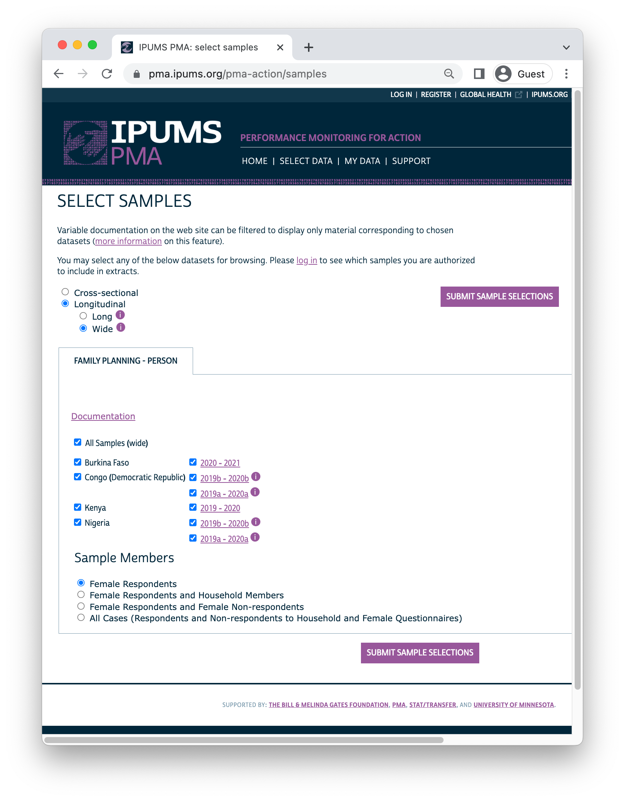
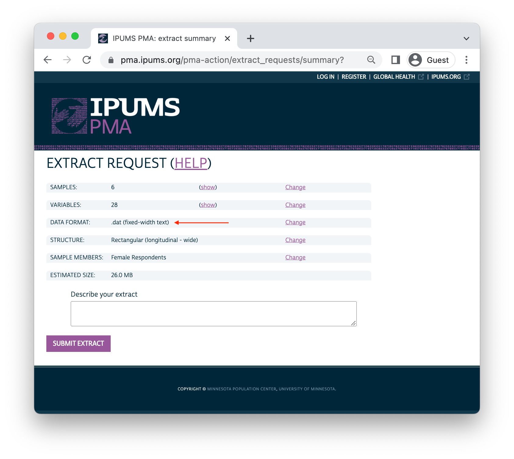

```{r setup, echo=FALSE, results='hide'}
# knitr options 
knitr::opts_chunk$set(
  echo = TRUE, 
  eval = T,
  layout="l-page", 
  fig.width = 12,
  fig.height = 8,
  R.options = list(width = 100)
)

# tibble options 
options(tibble.print_min = 30)

# load utils 
source(here::here("r/utilities.r"))
set_postpath("2022-04-15-phase2-indicators")

# load dat 
dat <- read_ipums_micro(
  ddi = "data/pma_00106.xml",
  data = "data/pma_00106.dat.gz"
) 
```

We've mentioned in previous posts in [this series](../../#category:Panel_Data) that data from the new [PMA panel study](../2022-03-01-phase2-discovery/index.html) gives researchers an important tool for understanding how women's family planning demand and utilization changes over time. In particular, PMA surveys cover topics like: 

  * pregnancy intentions and outcomes
  * current use of long-acting, short-acting, and traditional contraceptives
  * discontinuation of family planning 
  * intentions for future use of family planning 
  * unmet need for family planning 
  * partner's support for use of family planning 

IPUMS PMA recently released **harmonized data** from four of the participating countries where the first two phases of data collection in this three-year panel study have already been completed. In this post, we'll demonstrate how to use an [IPUMS PMA data extract](../2022-03-15-phase2-formats/) to calculate and compare key family planning indicators across multiple samples.

Our partners at PMA have published indicators for each of these samples, individually. Phase 2 panel results summaries are available for: 

  * [Burkina Faso](https://www.pmadata.org/sites/default/files/data_product_results/Burkina%20National_Phase%202_Panel_Results%20Brief_English_Final.pdf)
  * [DRC - Kinshasa](https://www.pmadata.org/sites/default/files/data_product_results/DRC%20Kinshasa_%20Phase%202%20Panel%20Results%20Brief_English_Final.pdf)
  * [DRC - Kongo Central](https://www.pmadata.org/sites/default/files/data_product_results/DRC%20Kongo%20Central_%20Phase%202%20Panel%20Results%20Brief_English_Final.pdf)
  * [Kenya](https://www.pmadata.org/sites/default/files/data_product_results/Kenya%20National_Phase%202_Panel%20Results%20Brief_Final.pdf)
  * [Nigeria - Kano](https://www.pmadata.org/sites/default/files/data_product_results/Nigeria%20KANO_Phase%202_Panel_Results%20Brief_Final.pdf)
  * [Nigeria - Lagos](https://www.pmadata.org/sites/default/files/data_product_results/Nigeria%20LAGOS_Phase%202_Panel_Results%20Brief_Final.pdf) 

<aside>
Interested in building the **alluvial plots** seen in these reports? Join us again in two weeks, when we'll dig into the [ggalluvial](https://corybrunson.github.io/ggalluvial/index.html) package!
</aside>

Here, we'll share code you can use to reproduce the findings in each report, and we'll demonstrate one simple approach to visualizing indicators across samples with [ggplot2](https://ggplot2.tidyverse.org/index.html), a popular graphics package included in the [tidyverse](https://tidyverse.tidyverse.org/index.html) toolkit for R.  

# Setup 

To get started, you'll need to load three main packages: 

  * [tidyverse](https://tidyverse.tidyverse.org/index.html), which includes [ggplot2](https://ggplot2.tidyverse.org/index.html) and other data manipulation tools 
  * [ipumsr](https://tech.popdata.org/ipumsr/) for working with IPUMS data 
  * [srvyr](http://gdfe.co/srvyr/index.html) for use of survey design information (survey weights and sample cluster IDs) 
  
<aside>
[srvyr](http://gdfe.co/srvyr/index.html) brings [tidyverse](https://tidyverse.tidyverse.org/index.html) syntax to the popular [survey](http://r-survey.r-forge.r-project.org/survey/) package. 
</aside> 

```{r}
library(tidyverse)
library(ipumsr)
library(srvyr)
```

We'll feature data organized in **wide format** for each of the six samples currently available from IPUMS PMA. You'll find the "wide" option under the "Longitudinal" sample button on our [Select Samples](https://pma.ipums.org/pma-action/samples) page. 

<aside>
IPUMS PMA also publishes panel data in **long format**. Check out our complete [guide to longitudinal data extracts](../2022-03-15-phase2-formats/) for details. 
</aside>

```{r, echo = FALSE, eval = TRUE, layout="l-body"}

```

Notice that, under "Sample Members", we've selected the button for "Female Respondents". This excludes records for all household members who are not, themselves, members of the panel study. You'll find one row for each woman who completed all or part of the Female Questionnaire for at least one phase of the study. 

<aside>
For details on panel enrollment and loss to follow-up, see our [panel membership](../2022-04-01-phase2-members/) guide. 
</aside>

Add the following variables to you Data Cart, then click the [View Cart](https://pma.ipums.org/pma-action/extract_requests/variables) button to begin checkout ([preselected](https://pma.ipums.org/pma-action/faq#ques28) variables are added automatically).

  * `r varlink(RESULTFQ)` - Result of female questionnaire
  * `r varlink(PANELWEIGHT)` - Phase 2 female panel weight
  * `r varlink(RESIDENT)` - Household residence / membership
  * `r varlink(AGE)` - Age in female questionnaire
  * `r varlink(PREGNANT)` - Pregnancy status
  * `r varlink(BIRTHEVENT)` - Number of birth events
  * `r varlink(EDUCATTGEN)` - Highest level of school attended (4 categories)
  * `r varlink(MARSTAT)` - Marital status 
  * `r varlink(GEOCD)` - Province, DRC
  * `r varlink(GEONG)` - State, Nigeria
  * `r varlink(CP)` - Contraceptive user
  * `r varlink(FPCURREFFMETHRC)` - Most effective current FP method 
  * `r varlink(UNMETYN)` - Total unmet need
  * `r varlink(FPPARTSUPPORT)` - Husband / partner would be supportive of FP use
  * `r varlink(FPPLANVAL)` - When will start using FP method in the future - value
  * `r varlink(FPPLANWHEN)` - When will start using FP method in the future - unit
  * `r varlink(COUNTRY)` - PMA country (preselected)
  * `r varlink(EAID)` - Enumeration area (preselected)

Before completing checkout, make sure that you've selected the `dat` data format (fixed-width text). 

```{r, echo = FALSE, eval = TRUE, layout="l-body"}

```

Finally, you'll need to download 2 files: an `xml` metadata file and a `dat.gz` compressed data file. We've saved both of these files in the "data" folder in R's working directory, so we'll import both to create a dataframe called `dat`: 

```{r, eval = FALSE}
dat <- read_ipums_micro(
  ddi = "data/pma_00106.xml",
  data = "data/pma_00106.dat.gz"
)
```

# Populations of Interest 

We've mentioned in previous posts that PMA samples are only valid for the [de facto](../2022-03-01-phase2-discovery/#inclusion-criteria-for-analysis) population: these are women who slept in the household during the night before the interview for the Household Questionnaire in both phases. These women are coded either `11` or `22` in both `RESIDENT_1` and `RESIDENT_2`. 

```{r}
dat <- dat %>% filter(RESIDENT_1 %in% c(11, 22) & RESIDENT_2 %in% c(11, 22))
```

We also mentioned in our [sample membership guide](../2022-04-01-phase2-members/) that women who completed the Phase 1 Female Questionnaire may have been **lost to follow-up** at Phase 2. As a reminder, we'll need to drop any cases where `RESULTFQ_2` is not coded `1` for "completed". 

```{r}
dat <- dat %>% filter(RESULTFQ_2 == 1)
```

Additionally, a small number of women in each sample elected not to respond to key questions regarding current use of contraceptives. These cases are coded `90` and above, as shown on the `r varlink(CP)` Codes tab. In a **wide** extract, these cases can be identified with `CP_1` and `CP_2`. 

```{r}
dat <- dat %>% filter(CP_1 < 90, CP_2 < 90) 
```

Finally, recall that only the Burkina Faso and Kenya samples are **nationally representative**. Samples from DRC represent regions identified by `r varlink(GEOCD)`, while samples from Nigeria represent regions identified by `r varlink(GEONG)`. In order to distinguish each population of interest, we'll define a custom variable `POP` that shows each sample's `r varlink(COUNTRY)` label concatenated with each of these regions where appropriate. 

  * `POP` - Population of interest 

```{r}
dat <- dat %>% 
  mutate(POP = case_when(
    !is.na(GEOCD) ~ paste("DRC -", as_factor(GEOCD)),
    !is.na(GEONG) ~ paste("Nigeria -", as_factor(GEONG)),
    TRUE ~ as_factor(COUNTRY) %>% as.character()
  ))
```

The remaining sample size for each population of interest is simply a [count](https://dplyr.tidyverse.org/reference/count.html) of each level in `POP`. 

```{r}
dat %>% count(POP)
```

# Population Inference

We'll use the [srvyr](http://gdfe.co/srvyr/index.html) package to incorporate survey design information into each of the population estimates calculated below. This includes `r varlink(PANELWEIGHT)`, which represents the calculated inverse selection probability for all panel members, adjusted for loss to follow-up. 

You might remember from [earlier posts](../2022-03-01-phase2-discovery/#survey-design-elements) that PMA surveys are collected within spatially-defined **sample clusters**. We'll also include identifying numbers for each cluster as survey design information via `r varlink(EAID)`. Here, we'll use clusters identified in `EAID_1`.^[Because women are considered "lost to follow-up" if they moved outside the study area, `EAID_1` and `EAID_2` are identical for all panel members: you can use either one to identify sample clusters.]

Most PMA samples are also collected within separate strata indicated by `r varlink(STRATA)`. We've [previously noted](../2022-03-01-phase2-discovery/#survey-design-elements) that `STRATA` is *not available* for samples collected from DRC - Kinshasa and DRC - Kongo Central, so we demonstrated how to create placeholder codes for those samples in a variable we called `STRATA_RECODE`. To review: `STRATA_RECODE` uses unique numeric codes from `STRATA`, except that it also includes unique identifiers for each sampled region in `GEOCD`.

```{r}
dat <- dat %>% 
  mutate(
    STRATA_RECODE = if_else(
      is.na(GEOCD), 
      as.numeric(STRATA_1), 
      as.numeric(GEOCD)
    )
  ) 

dat %>% count(STRATA_1, GEOCD, STRATA_RECODE) 
```

The [srvyr](http://gdfe.co/srvyr/index.html) function [as_survey_design](http://gdfe.co/srvyr/reference/as_survey_design.html) allows us to pass the information in `PANELWEIGHT`, `EAID_1`, and `STRATA_RECODE` to other package functions like [survey_mean](http://gdfe.co/srvyr/reference/survey_mean.html). We'll also demonstrate how to use this information in formal significance tests within each sample via [svychisq](http://gdfe.co/srvyr/reference/svychisq.html).

<aside>
Check out [this post](../2022-03-01-phase2-discovery/#survey-design-elements) for more information on PMA survey design and the [srvyr](http://gdfe.co/srvyr/index.html) package.
</aside>

Let's begin with a simple example. The variable `r varlink(CP)` indicates whether a woman was currently using any family planning method. The variables `CP_1` and `CP_2` in our **wide** extract represent responses collected at Phase 1 and Phase 2, respectively. With help from [srvyr](http://gdfe.co/srvyr/index.html), we'll obtain a population-level estimate of the proportion of women who were using a method at Phase 2, given their status at Phase 1. 

```{r}
cp_tbl <- dat %>% 
  group_by(POP) %>% 
  summarise(
    .groups = "keep",
    cur_data() %>% 
      as_survey_design(weight = PANELWEIGHT, id = EAID_1, strata = STRATA_RECODE) %>% 
      group_by(CP_1, CP_2) %>% 
      summarise(survey_mean(vartype = "ci", prop = TRUE, prop_method = "logit"))
  )

cp_tbl
```

Here, we first use [group_by](http://gdfe.co/srvyr/reference/group_by.html) to divide the data extract into individual samples defined by `POP`. We then reference each of these samples as [cur_data](https://dplyr.tidyverse.org/reference/context.html) inside a summary function defined by [summarise](http://gdfe.co/srvyr/reference/summarise.html) - this ensures that the population estimates obtained from our combined data extract are identical to those you would obtain if you downloaded one extract for each sample and analyzed them separately. 

Within [summarise](http://gdfe.co/srvyr/reference/summarise.html), we use [as_survey_design](http://gdfe.co/srvyr/reference/as_survey_design.html) to specify information about the design of each sample, and we then use a second [group_by](http://gdfe.co/srvyr/reference/group_by.html) to identify each of our variables of interest, `CP_1` and `CP_2`. Finally, we use a second [summarise](http://gdfe.co/srvyr/reference/summarise.html) function to calculate a [srvyr](http://gdfe.co/srvyr/index.html) summary statistic: in this case, we use [survey_mean](http://gdfe.co/srvyr/reference/survey_mean.html) to estimate proportions in the population. 

The population estimate for each row appears in the column `_coef`. Looking at row 1, we would estimate that 79% of women aged 15-49 in Burkina Faso used *no method* both at Phase 1 and again at Phase 2. The columns `_low` and `_upp` report the limits of a 95% confidence interval: 76.3% and 81.5%.

<aside>
You may change the confidence interval to, for example, 99% by setting `level = 0.99` in [survey_mean](http://gdfe.co/srvyr/reference/survey_mean.html).
</aside>

Comparing these confidence intervals gives us an informal, conservative way to test for a significant difference between outcomes for each `POP`: if the intervals for any pair of outcomes in the same sample include no common values, we'll say that a significant difference exists. *Formal testing may also reveal significant differences between pairs of outcomes where these intervals overlap only slightly.* Our approach is well suited for data visualization, but it should not replace formal testing. Fortunately, you can adapt our code to replace (or complement) the output from [survey_mean](http://gdfe.co/srvyr/reference/survey_mean.html). 

For example, here we demonstrate how to calculate a Rao-Scott chi-square test for significant differences between the estimated population proportions for each `POP` and the proportions we would *expect* to observe if Phase 2 outcomes were statistically independent from Phase 1 conditions.^[The Rao-Scott second-order correction to Pearson's chi-square test is used to incorporate survey design information from [as_survey_design](http://gdfe.co/srvyr/reference/as_survey_design.html), reflecting weighted population estimates. Wald-type chi-square tests are also available: see [svychisq](https://rdrr.io/cran/survey/man/svychisq.html) for details.] Because we're interested in just one summary statistic per sample, we no longer need to [group_by](http://gdfe.co/srvyr/reference/group_by.html) `CP_1` and `CP_2`; instead, we'll use the formula `~CP_1 + CP_2` in the function [svychisq](https://rdrr.io/cran/survey/man/svychisq.html).

```{r}
rao_tbl <- dat %>% 
  group_by(POP) %>% 
  summarise(
    .groups = "keep",
    cur_data() %>% 
      as_survey_design(weight = PANELWEIGHT, id = EAID_1,  strata = STRATA_RECODE) %>% 
      summarise(rao = svychisq(~CP_1 + CP_2, design = .) %>% list)
  )

rao_tbl
```

Our new summary column `rao` contains output for each sample's test in a [list](https://www.rdocumentation.org/packages/base/versions/3.6.2/topics/list). From here, you can extract output elements [rowwise](https://dplyr.tidyverse.org/articles/rowwise.html) by name like so: 

```{r}
rao_tbl %>% 
  rowwise() %>% 
  mutate(
    `F` = rao$statistic, 
    p.value = rao$p.value,
    sig95 = p.value < 0.05
  )
```

# Visualization 

We'll use simple **grouped bar charts** to show population estimates for each proportion below. A grouped bar chart differs from the **stacked bar charts** shown in PMA reports in that each response is plotted along an axis (rather than stacked together in a single bar). We'll show **grouped bar charts** here so that we can also include **error bars** representing a 95% confidence interval for each proportion.

For example, let's plot the estimates created in `cp_tbl` above. As a preliminary step, we'll recode `CP_1` and `CP_2` with [as_factor](https://forcats.tidyverse.org/reference/as_factor.html) and sort their levels with [fct_relevel](https://forcats.tidyverse.org/reference/fct_relevel.html). This ensures that the *value labels* for each variable will be printed on our plot.

```{r}
cp_tbl <- cp_tbl %>% 
  mutate(
    across(
      c(CP_1, CP_2),
      ~as_factor(.x) %>% fct_relevel("No", "Yes")
    )
  )
```

Next, we'll use [ggplot2](https://ggplot2.tidyverse.org/reference/ggplot.html) to build the plot. Because our data includes multiple samples, we'll use [facet_grid](https://ggplot2.tidyverse.org/reference/facet_grid.html) to plot all summary data in multiple panels. The functions [geom_bar](https://ggplot2.tidyverse.org/reference/geom_bar.html) and [geom_errorbar](https://ggplot2.tidyverse.org/reference/geom_linerange.html) plot the grouped bars and error bars, respectively. A baseline plot should look something like this:   

```{r, layout = "l-body", fig.height=5}
cp_tbl %>% 
  ggplot(aes(x = coef, y = CP_2)) + 
  facet_grid(rows = vars(POP), cols = vars(CP_1)) + 
  geom_bar(stat = "identity") + 
  geom_errorbar(aes(xmin = `_low`, xmax = `_upp`), width = 0.2)
```

One of the powerful features of [ggplot2](https://ggplot2.tidyverse.org/reference/ggplot.html) is that you can use [pre-built themes](https://ggplot2.tidyverse.org/reference/ggtheme.html) to customize this baseline layout. We'll build on [theme_minimal](https://ggplot2.tidyverse.org/reference/ggtheme.html) to create our own `theme_pma` (with custom fonts incorporated by the [sysfonts](https://cran.r-project.org/package=sysfonts) and [showtext](https://cran.rstudio.com/web/packages/showtext/vignettes/introduction.html) packages). **Feel free to use our theme, or tweak it to create your own!** 

```{r}
library(showtext)

sysfonts::font_add(
  family = "cabrito", 
  regular = "../../fonts/cabritosansnormregular-webfont.ttf"
)
showtext::showtext_auto()

theme_pma <- theme_minimal() %+replace% 
  theme(
    text = element_text(family = "cabrito", size = 13),
    plot.title = element_text(size = 22, color = "#00263A", 
                              hjust = 0, margin = margin(b = 5)),
    plot.subtitle = element_text(hjust = 0, margin = margin(b = 10)),
    strip.background = element_blank(),
    strip.text.y = element_text(size = 16, angle = 0),
    panel.spacing = unit(1, "lines"),
    axis.title.y = element_text(angle = 0, margin = margin(r = 10))
  )
```

Throughout this post, we'll be repeating the same functions to create grouped bars, error bars, and labels for our plot. In order to avoid repeating ourselves each time, we'll combine these functions together with `theme_pma` in a single function called `pma_bars`.

```{r}
pma_bars <- function(
  title = NULL,     # an optional title 
  subtitle = NULL,  # an optional subtitle 
  xaxis = NULL,     # an optional label for the x-axis (displayed above)
  yaxis = NULL      # an optional label for the y-axis (displayed left)
){
  components <- list(
    if(exists("theme_pma")){theme_pma},
    labs(
      title = title,
      subtitle = subtitle,
      y = str_wrap(yaxis, 10),
      x = NULL,
      fill = NULL
    ),
    scale_x_continuous(
      position = 'bottom',
      sec.axis = sec_axis(trans = ~., name = xaxis, breaks = NULL),
      labels = scales::label_percent()
    ),
    scale_y_discrete(limits = rev),
    geom_bar(stat = "identity", fill = "#98579BB0"),
    geom_errorbar(
      aes(xmin = `_low`, xmax = `_upp`), 
      width = 0.2, 
      color = "#00263A"
    )
  )
}
```

Going forward, we'll incorporate `pma_bars` together with a [ggplot](https://ggplot2.tidyverse.org/reference/ggplot.html) and [facet](https://ggplot2.tidyverse.org/reference/index.html#facetting) function for a given set of variables like so:

```{r, fig.height=6}
cp_tbl %>% 
  ggplot(aes(x = coef, y = CP_2)) + 
  facet_grid(rows = vars(POP), cols = vars(CP_1)) + 
  pma_bars(
    title = "Change in Contracptive Use Status",
    subtitle = "A grouped bar chart, faceted by population of interest",
    xaxis = "Phase 1",
    yaxis = "Phase 2"
  )
```

# Key Indicators 

## Contraceptive Use or Non-Use

Let's continue our examination of `r varlink(CP)`. In the PMA reports for each sample linked above, you'll notice that women who were pregnant at either phase are distinguished from women who reported use or non-use in `CP_1` or `CP_2`. We'll identify these women in the variable `r varlink(PREGNANT)`, and then we'll create a combined indicator called `FPSTATUS`. 

  * `FPSTATUS` - Pregnant, using contraception, or using no contraception 

```{r}
dat <- dat %>% 
  mutate(
    FPSTATUS_1 = case_when(
      PREGNANT_1 == 1 ~ "Pregnant",
      CP_1 == 1 ~ "Using FP",
      CP_1 == 0 ~ "Not Using FP"
    ), 
    FPSTATUS_2 = case_when(
      PREGNANT_2 == 1 ~ "Pregnant",
      CP_2 == 1 ~ "Using FP",
      CP_2 == 0 ~ "Not Using FP"
    ),
    across(
      c(FPSTATUS_1, FPSTATUS_2),
      ~.x %>% fct_relevel("Pregnant", "Not Using FP", "Using FP")
    )
  )
```

We'll now revise `cp_tbl` to include information from `FPSTATUS_1` and `FPSTATUS_2`. This will help us answer key questions like: 

  * Are women who were pregnant at Phase 1 more likely to use or not use family planning at Phase 2? 
  * Are women who were using (or not using) contraception at Phase 1 likely to maintain the same status at Phase 2? 
  
```{r}
cp_tbl <- dat %>% 
  group_by(POP) %>% 
  summarise(
    .groups = "keep",
    cur_data() %>% 
      as_survey_design(weight = PANELWEIGHT, id = EAID_1, strata = STRATA_RECODE) %>% 
      group_by(FPSTATUS_1, FPSTATUS_2) %>% 
      summarise(survey_mean(vartype = "ci", prop = TRUE, prop_method = "logit"))
  )
```

Next, we'll plot `cp_tbl` with `pma_bars`:

```{r, preview = TRUE}
cp_tbl %>% 
  ggplot(aes(x = coef, y = FPSTATUS_2)) + 
  facet_grid(cols = vars(FPSTATUS_1), rows = vars(POP)) + 
  pma_bars(
    "CHANGE IN CONTRACEPTIVE USE OR NON-USE",
    "Percent women age 15-49 who changed contraceptive use status",
    xaxis = "Phase 1 Status",
    yaxis = "Phase 2 Status"
  )
```

To reiterate: comparing the error bars within each of these 18 panels gives us a informal, but conservative test for significant difference. We'll say that a significant difference occurs where two pairs of error bars **do not overlap** (but additional testing may be necessary to determine whether a significant difference occurs where error bars overlap only slightly). A few observations: 

   * For women who were pregnant at Phase 1, there is usually no apparent difference between using and not using family planning at Phase 2. Kenya and Nigeria - Kano are the exception: in Kenya, pregnant women at Phase 1 were appear more likely to be using FP at Phase 2, while the opposite is true in Kano.  
  * Overall, non-pregnant women at Phase 1 appeared more likely to maintain the same status (use or non-use) at Phase 2 than they were to switch or become pregnant. 
  
## Contraceptive Method Type 

PMA surveys also ask contraceptive users to indicate which method they are currently using at each phase of the study. If a woman reports using more than one method, `r varlink(FPCURREFFMETH)` shows her most *effective* currently used method. These responses are combined with detailed information about use of the lactational amenorrhea method (LAM), emergency contraception, or injectable type in  `r varlink(FPCURREFFMETHRC)`. PMA reports use `r varlink(FPCURREFFMETHRC)` to determine whether each woman's most effective current method is a short-acting, long-acting, or traditional method. 

Long-acting methods include:

  * IUDs
  * implants
  * male sterilization 
  * female sterilization
  
Short-acting methods include: 

  * injectables (intramuscular and subcutaneous) 
  * the pill
  * emergency contraception 
  * male condoms
  * female condoms
  * LAM
  * diaphragm
  * foam/jelly
  * standard days method

Traditional methods include: 

   * rhythm 
   * withdrawal 
   * other traditional 

These methods are coded sequentially by group in `r varlink(FPCURREFFMETHRC)`. Women who are "NIU (not in universe)" were using no method. 

```{r}
dat %>% count(FPCURREFFMETHRC_1)
```

We'll use [across](https://dplyr.tidyverse.org/reference/across.html) to recode the Phase 1 and Phase 2 versions of `r varlink(FPCURREFFMETHRC)` simultaneously. We'll also attach the prefix `CAT` to each variable, indicating that we've created "categorized" versions of each. 

  * `CAT_FPSFPCURREFFMETHRC_1` - Phase 1 contraceptive method type 
  * `CAT_FPSFPCURREFFMETHRC_2` - Phase 2 contraceptive method type 

```{r}
dat <- dat %>% 
  mutate(
    across(
      c(FPCURREFFMETHRC_1, FPCURREFFMETHRC_2),
      ~case_when(
        .x < 120 ~ "long-acting",
        .x < 200 ~ "short-acting",
        .x < 900 ~ "traditional",
        TRUE ~ "none") %>% 
        fct_relevel( "long-acting", "short-acting", "traditional", "none"),
      .names = "CAT_{.col}"
    )
  ) 
```

Next, we'll generate population estimates for our derived variables, `CAT_FPCURREFFMETHRC_1` and `CAT_FPCURREFFMETHRC_2`. 

```{r}
meth_tbl <- dat %>% 
  group_by(POP) %>% 
  summarise(
    .groups = "keep",
    cur_data() %>% 
      as_survey_design(weight = PANELWEIGHT, id = EAID_1, strata = STRATA_RECODE) %>% 
      group_by(CAT_FPCURREFFMETHRC_1, CAT_FPCURREFFMETHRC_2) %>% 
      summarise(survey_mean(vartype = "ci", prop = TRUE, prop_method = "logit"))
  )
```

We'll again use `pma_bars` to plot the results. 

```{r}
meth_tbl %>% 
  ggplot(aes(x = coef, y = CAT_FPCURREFFMETHRC_2)) + 
  facet_grid(cols = vars(CAT_FPCURREFFMETHRC_1), rows = vars(POP)) + 
  pma_bars(
    "CHANGE IN CONTRACEPTIVE METHOD TYPE",
    "Percent of women age 15-49 who changed contraceptive method or use status",
    xaxis = "Phase 1 Method",
    yaxis = "Phase 2 Method"
  )
```

What do we learn from this plot? Let's consider each column in turn:

  * Users of "long-acting" methods at Phase 1 appear more likely to have used "long-acting" methods at Phase 2 than to have changed status (except perhaps in Kano, where the intervals for "long-acting" and "none" overlap at Phase 2). 
  * Users of "short-acting" methods at Phase 1 appeared generally likely to use them again at Phase 2, but some samples show that women are equally likely to be using "none" at Phase 2. A difference between these two outcomes is visually apparent only in Kinshasa, Kenya, and Lagos (where women were more likely to be using "short-acting" methods than "none"). 
  * The status of Phase 1 "traditional" users is generally unclear at Phase 2. In Kinshasa, Kongo Central, and Lagos, these women seem most likely to remain "traditional" users at Phase 2. Elsewhere, there are no clear trends. 
  * Users of "none" at Phase 1 were clearly most likely to remain as such at Phase 2.
  
## Contraceptive Dynamics by Subgroup

We can also use `r varlink(FPCURREFFMETHRC)` to see whether women switched methods, stopped using any method, started using any method, or made no changes. Let's summarize this information as `CHG_FPCURR`:

  * `CHG_FPCURR` - Change in contraceptive use between Phase 1 and Phase 2

```{r}
dat <- dat %>% 
  mutate(
    CHG_FPCURR = case_when(
      FPCURREFFMETHRC_1 > 900 & FPCURREFFMETHRC_2 > 900 ~ "Continued non-use",
      FPCURREFFMETHRC_1 > 900 ~ "Started using",
      FPCURREFFMETHRC_2 > 900 ~ "Stopped using",
      FPCURREFFMETHRC_1 != FPCURREFFMETHRC_2 ~ "Changed methods",
      FPCURREFFMETHRC_1 == FPCURREFFMETHRC_2 ~ "Continued method"
    )
  ) 
```

PMA reports disaggregate the outcomes captured in `CHG_FPCURR` by age, marital status, education level, and parity (number of live childbirths). 

### Age

We'll use PMA's categorization of `AGE_2` to examine differences between women in three categories. 

  * `CAT_AGE_2` - Phase 2 age (3 categories)

```{r}
dat <- dat %>% 
  mutate(
    CAT_AGE_2 = case_when(
      AGE_2 < 20 ~ "15-19",
      AGE_2 < 25 ~ "20-24",
      TRUE ~ "25-49"
    )
  ) 
```

Plotting `CAT_AGE_2` on the y-axis allows us to compare confidence intervals across age groups. For example, notice that women aged 15-19 in every population seem more likely to continue non-use than women who are aged 20-24 or 25-49 (column 3). 

```{r}
dat %>% 
  group_by(POP) %>% 
  summarise(
    .groups = "keep",
    cur_data() %>% 
      as_survey_design(weight = PANELWEIGHT, id = EAID_1, strata = STRATA_RECODE) %>% 
      group_by(CAT_AGE_2, CHG_FPCURR) %>% 
      summarise(survey_mean(vartype = "ci", prop = TRUE, prop_method = "logit"))
  ) %>% 
  ggplot(aes(x = coef, y = CAT_AGE_2)) + 
  facet_grid(cols = vars(CHG_FPCURR), rows = vars(POP)) + 
  pma_bars(
    "CHANGE IN CONTRACEPTIVEUSE STATUS, BY AGE",
    yaxis = "Phase 2 Age"
  )
```

### Education level

The variable `r varlink(EDUCATTGEN)` standardizes educational categories across countries (see `r varlink(EDUCATT)` for country-specific codes). To match PMA reports, we'll recode `r varlink(EDUCATTGEN)` into just three groups: 

  * `CAT_EDUCATTGEN_2` - Phase 2 education level (3 categories)
  
```{r}
dat <- dat %>% 
  mutate(
    CAT_EDUCATTGEN_2 = case_when(
      EDUCATTGEN_2 < 3 ~ "None / Primary",
      EDUCATTGEN_2 == 3 ~ "Secondary",
      EDUCATTGEN_2 == 4 ~ "Tertiary"
    )
  ) 
```

As with age, we'll plot `CAT_EDUCATTGEN_2` on the y-axis. There aren't many clear takeaways here: confidence intervals overlap in each column for almost every education level, so visual inspection reveals no clear significant differences: 

```{r}
dat %>% 
  filter(EDUCATTGEN_2 < 90) %>% # drop if missing 
  group_by(POP) %>% 
  summarise(
    .groups = "keep",
    cur_data() %>% 
      as_survey_design(weight = PANELWEIGHT, id = EAID_1, strata = STRATA_RECODE) %>% 
      group_by(CAT_EDUCATTGEN_2, CHG_FPCURR) %>% 
      summarise(survey_mean(vartype = "ci", prop = TRUE, prop_method = "logit"))
  ) %>% 
  ggplot(aes(x = coef, y = CAT_EDUCATTGEN_2)) + 
  facet_grid(cols = vars(CHG_FPCURR), rows = vars(POP)) + 
  pma_bars(
    "CHANGE IN CONTRACEPTIVEUSE STATUS, BY EDUCATION LEVEL",
    yaxis = "Phase 2 Education Level"
  )
```

### Marital status

The variable `r varlink(MARSTAT)` indicates each woman's marital / partnership status. PMA considers women "in union" to be those who are currently married (code `21`) or currently living with their partner (code `22`). Otherwise, women who were never married, divorced / separated, or widowed are considered "not in union". 

  * `CAT_MARSTAT_2` - Phase 2 marital status (2 categories)

```{r}
dat <- dat %>% 
  mutate(
    CAT_MARSTAT_2 = case_when(
      MARSTAT_2 %in% 21:22 ~ "In union",
      TRUE ~ "Not in union"
    )
  ) 
```

Here, we see that women who were *not* in a union at Phase 2 were significantly more likely to continue non-use of contraception compared to married / partnered women in each population. On the other hand, women who *were* in a union mainly appeared more likely to continue using the same method, or perhaps to change methods (most clearly in Kenya). 

```{r}
dat %>% 
  group_by(POP) %>% 
  summarise(
    .groups = "keep",
    cur_data() %>% 
      as_survey_design(weight = PANELWEIGHT, id = EAID_1, strata = STRATA_RECODE) %>% 
      group_by(CAT_MARSTAT_2, CHG_FPCURR) %>% 
      summarise(survey_mean(vartype = "ci", prop = TRUE, prop_method = "logit"))
  ) %>% 
  ggplot(aes(x = coef, y = CAT_MARSTAT_2)) + 
  facet_grid(cols = vars(CHG_FPCURR), rows = vars(POP)) + 
  pma_bars(
    "CHANGE IN CONTRACEPTIVE METHOD TYPE, BY MARITAL STATUS",
    yaxis = "Phase 2 Marital Status"
  )
```

### Parity

Parity refers to the number of times a women has given live birth (excluding stillbirths). This information is recorded in the IPUMS variable `r varlink(BIRTHEVENT)`, in which the values `0` and `99` (not in universe) can both be interpreted as "none". 

  * `CAT_BIRTHEVENT_2` - Phase 2 number of live births (4 categories)

```{r}
dat <- dat %>% 
  mutate(
    CAT_BIRTHEVENT_2 = case_when(
      BIRTHEVENT_2 %in% c(0, 99) ~ "None",
      BIRTHEVENT_2 %in% c(1, 2) ~ "One-two",
      BIRTHEVENT_2 %in% c(3, 4) ~ "Three-four",
      BIRTHEVENT_2 >= 5 ~ "Five +") %>% 
      fct_relevel("None", "One-two", "Three-four", "Five +")
  ) 
```

There are few clear patterns related to parity, except that women who have never given birth are also more likely to continue non-use of contraception between phases. 

```{r}
dat %>% 
  filter(BIRTHEVENT_2 != 98) %>% # drops 2 missing cases (code 98)
  group_by(POP) %>% 
  summarise(
    .groups = "keep",
    cur_data() %>% 
      as_survey_design(weight = PANELWEIGHT, id = EAID_1, strata = STRATA_RECODE) %>% 
      group_by(CAT_BIRTHEVENT_2, CHG_FPCURR) %>% 
      summarise(survey_mean(vartype = "ci", prop = TRUE, prop_method = "logit"))) %>% 
  ggplot(aes(x = coef, y = CAT_BIRTHEVENT_2)) + 
  facet_grid(cols = vars(CHG_FPCURR), rows = vars(POP)) + 
  pma_bars(
    "CHANGE IN CONTRACEPTIVE METHOD TYPE, BY PARITY",
    yaxis = "Phase 2 Childbirths"
  )
```

## Other Panel Dynamics

The final page in each PMA report covers family planning dynamics related to unmet need, partner support, and plans for future use of family planning methods. In each case, we'll be focusing on women who were *not* using any method at Phase 1. We'll show how each of these dynamics impacts the likelihood that Phase 1 non-users would have adopted any family planning method at Phase 2. 

```{r}
dat <- dat %>% filter(CP_1 == 0)
```

### Unmet need 

PMA defines unmet need for family planning according to each woman's fertility preferences, current use of family planning methods, and risk factors for pregnancy. Women may have "unmet need" for birth spacing (e.g. pregnant women whose pregnancy was mistimed) or for limiting births (e.g. pregnant women whose pregnancy was unwanted), while women are considered "not at risk" if they are not sexually active or cannot become pregnant. The variable `r varlink(UNMETNEED)` provides detailed information on types of need for each woman, and on related variables that were used to calculate unmet need. 

The binary variable `r varlink(UNMETYN)` recodes `r varlink(UNMETNEED)` as either "Unmet need", or "No unmet need". We'll reword these labels only slightly to minimize the amount of repeated text on our plot: 

```{r, fig.height=5}
dat %>% 
  mutate(UNMETYN_1 = if_else(UNMETYN_1 == 1, "Yes", "No")) %>% 
  group_by(POP) %>% 
  summarise(
    .groups = "keep",
    cur_data() %>% 
      as_survey_design(weight = PANELWEIGHT, id = EAID_1, strata = STRATA_RECODE) %>% 
      group_by(UNMETYN_1, CP_2) %>% 
      summarise(survey_mean(vartype = "ci", prop = TRUE, prop_method = "logit"))
  ) %>% 
  filter(CP_2 == 1) %>% 
  ggplot(aes(x = coef, y = UNMETYN_1)) + 
  facet_grid(rows = vars(POP)) + 
  pma_bars(
    "UNMET NEED FOR FAMILY PLANNING",
    "Percent of women age 15-49 who were not using a method at Phase 1",
    xaxis = "Phase 2: Adopted a method",
    yaxis = "Phase 1: Unmet Need"
  )
```

Overall, these results suggest that non-users with unmet need for family planning at Phase 1 were more likely to adopt a method at Phase 2 compared to non-users who had none (e.g. women who were not sexually active, could not become pregnant, etc.). However, formal testing is needed to determine whether these trends were statistically significant in Burkina Faso and Nigeria - Lagos. 

### Partner support 

Women who were not using family planning and not pregnant at Phase 1 were asked whether they thought their husband / partner would be supportive of use of family planning in the future. These results are recorded in `r varlink(FPPARTSUPPORT)`. We'll exclude non-partnered women here, as they are "NIU (not in universe)".  

```{r, fig.height=6}
dat %>% 
  filter(FPPARTSUPPORT_1 %in% c(0, 1, 97)) %>% 
  mutate(FPPARTSUPPORT_1 = FPPARTSUPPORT_1 %>% as_factor) %>% 
  group_by(POP) %>% 
  summarise(
    .groups = "keep",
    cur_data() %>% 
      as_survey_design(weight = PANELWEIGHT, id = EAID_1, strata = STRATA_RECODE) %>% 
      group_by(FPPARTSUPPORT_1, CP_2) %>% 
      summarise(survey_mean(vartype = "ci", prop = TRUE, prop_method = "logit"))
  ) %>% 
  filter(CP_2 == 1) %>% 
  ggplot(aes(x = coef, y = FPPARTSUPPORT_1)) + 
  facet_grid(rows = vars(POP)) + 
  pma_bars(
    "PARTNER SUPPORT FOR FAMILY PLANNING",
    "Percent of women age 15-49 who were not using a method at Phase 1",
    xaxis = "Phase 2: Adopted a method",
    yaxis = "Phase 1: Partner would support FP"
  )
```

We've included responses for women who were unsure whether their partner would or would not support future use of FP ("Dont know"), but Phase 2 outcomes for these women were usually not visually distinct from those who answered "Yes" or "No". Formal testing is needed to determine whether any significant differences exist.

Meanwhile, women with Phase 1 partner support in DRC - Kongo Central and Kenya were more likely to adopt a method than not. Outcomes for women in other populations are not visibly different based on partner support, one way or the other (again, formal testing may prove otherwise). 

### Intentions

Lastly, we'll demonstrate the impact of women's plans for future family planning use at Phase 1. The variable `r varlink(FPUSPLAN)` indicates whether women had plans for future use *at any point* in the future, but here we'll consider whether women had plans to adopt a method *within the next year* to correspond with the timing of Phase 2 surveys. 

There are two variables that describe the approximate time when women said they would adopt a family planning method (if at all). `r varlink(FPPLANVAL)` contains a raw number that should be matched with a *unit* of time (months, years) or a categorical response ("soon / now", "after the birth of this child") in `r varlink(FPPLANWHEN)`:

```{r}
dat %>% count(FPPLANWHEN_1)
```

We'll create `FPPLANYR_1` to indicate whether each woman planned to use family planning within a year's time at Phase 1. 

  * `FPPLANYR_1` - Phase 1 plans to use FP within one year 

```{r}
dat <- dat %>% 
  mutate(
    FPPLANYR_1 = case_when(
      FPPLANWHEN_1 == 1 & FPPLANVAL_1 <= 12 ~ "Yes", # Within 12 months 
      FPPLANWHEN_1 == 2 & FPPLANVAL_1 == 1 ~ "Yes", # Within 1 year
      FPPLANWHEN_1 %in% c(3, 4) ~ "Yes", # Soon / now or after current pregnancy
      TRUE ~ "No" # Includes date unknown, no response, or no intention (FPUSPLAN)
    )
  )
```

Our final plot shows the difference in FP adoption between women who planned to do so within the year, compared with women with no such plans. 

```{r, fig.height=5}
dat %>% 
  group_by(POP) %>% 
  summarise(
    .groups = "keep",
    cur_data() %>% 
      as_survey_design(weight = PANELWEIGHT, id = EAID_1, strata = STRATA_RECODE) %>% 
      group_by(FPPLANYR_1, CP_2) %>% 
      summarise(survey_mean(vartype = "ci", prop = TRUE, prop_method = "logit"))
  ) %>% 
  filter(CP_2 == 1) %>% 
  ggplot(aes(x = coef, y = FPPLANYR_1)) + 
  facet_grid(rows = vars(POP)) + 
  pma_bars(
    "INTENTION TO USE FAMIILY PLANNING WITHIN ONE YEAR",
    "Percent of women age 15-49 who were not using a method at Phase 1",
    xaxis = "Phase 2: Adopted a method",
    yaxis = "Phase 1: Plan to use FP"
  )
```

In every population, Phase 1 non-users who planned to adopt a method by Phase 2 were significantly more likely to do so. However, a significant *majority* of Phase 1 non-users with plans to adopt a method actually did so only in Kenya, where the 95% confidence interval for "Yes" responses includes only proportions greater than the 50% threshold. In fact, women who adopted a method at Phase 2 represent a significant *minority* of Phase 1 non-users who planned to do so in Burkina Faso, DRC - Kongo Central, and Nigeria - Kano. 

# Wrap-up 

As we've seen, **grouped bar charts** give us a simple way to identify clear differences between Phase 2 outcomes for subgroups defined by baseline family planning conditions or key demographic features. Additionally, when we **facet** populations of interest on the same axis, we can easily compare differences between subgroups for many samples in a single figure. 

One drawback to this approach is that it's more conservative than formal statistical tests. We are not able to easily spot differences near the conventional 95% certainty threshold. However, we demonstrated how you can adapt our code to conduct formal hypothesis tests like the [Rao-Scott chi-square test](https://rdrr.io/cran/survey/man/svychisq.html) for weighted proportions.

Another drawback to this approach is that we've been unable to showcase estimates for the proportion of responses at any *one* phase of the study. For example, in our last figure, we estimated that about 35% of women who *planned to use* contraception within the year at Phase 1 did so at Phase 2; our figure does not show how many women planned to use contraception within the year *as a share of the Phase 1 population*. 

To better understand the change over time relative to the size of each subgroup in our analysis, we'll turn to a slightly more complicated data visualization method. In our next post, we'll show how to create **alluvial plots**, like those shown in the first two pages of each PMA report. 