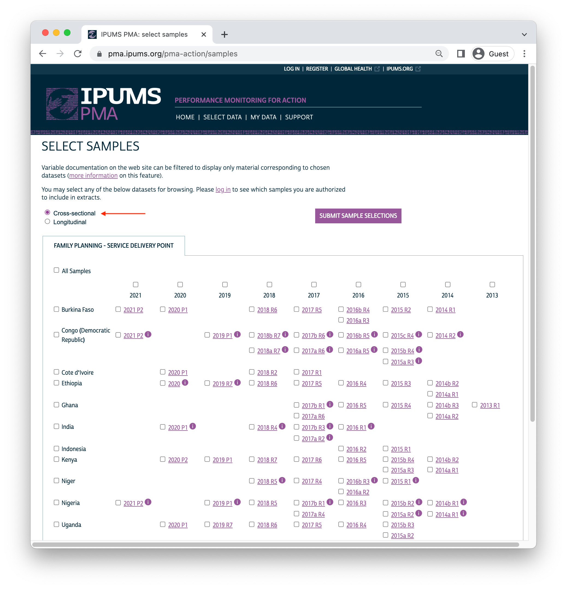
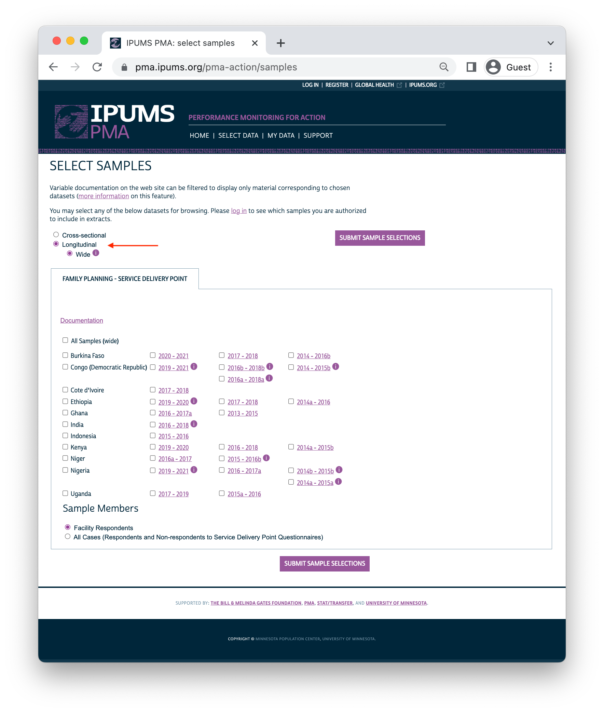
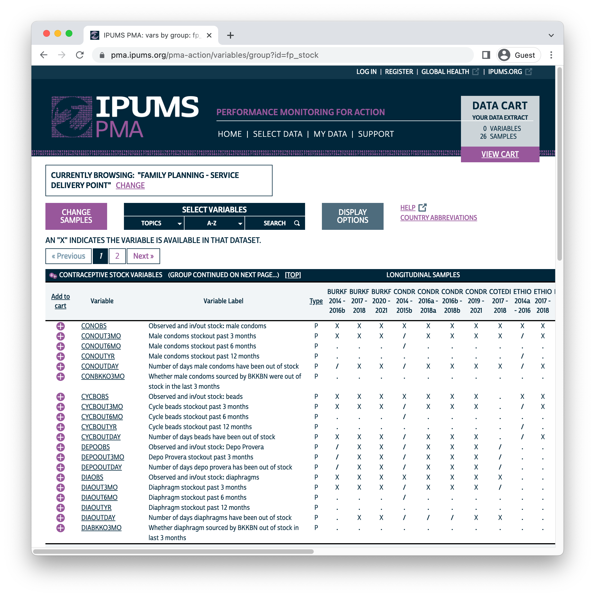
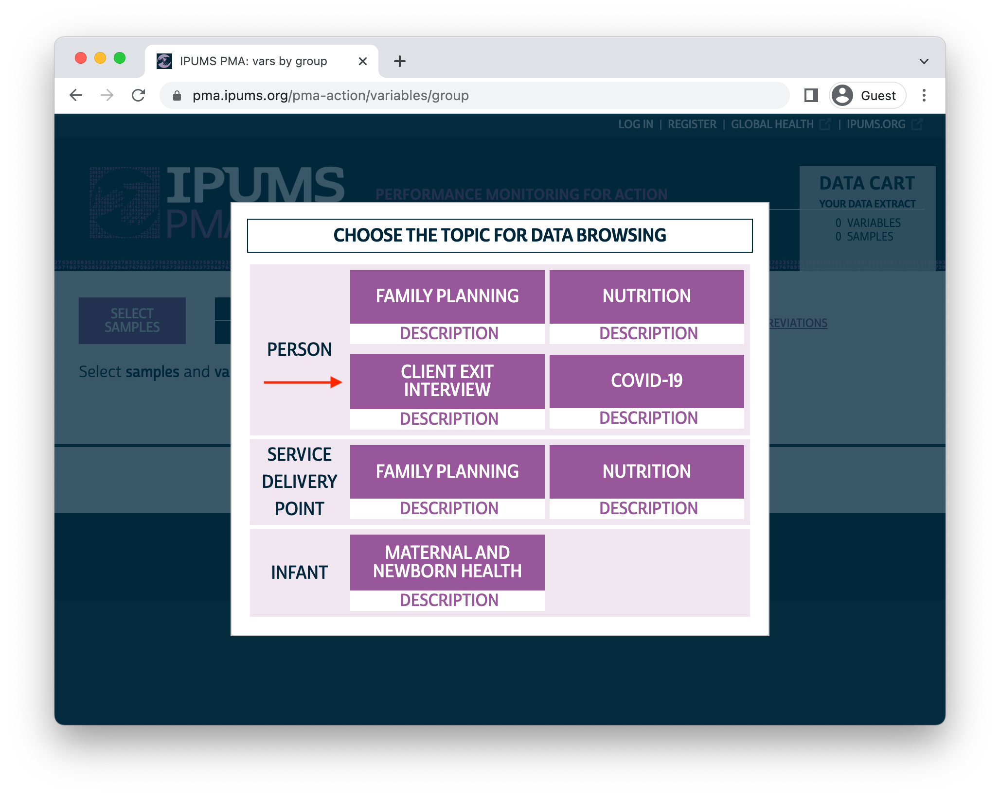
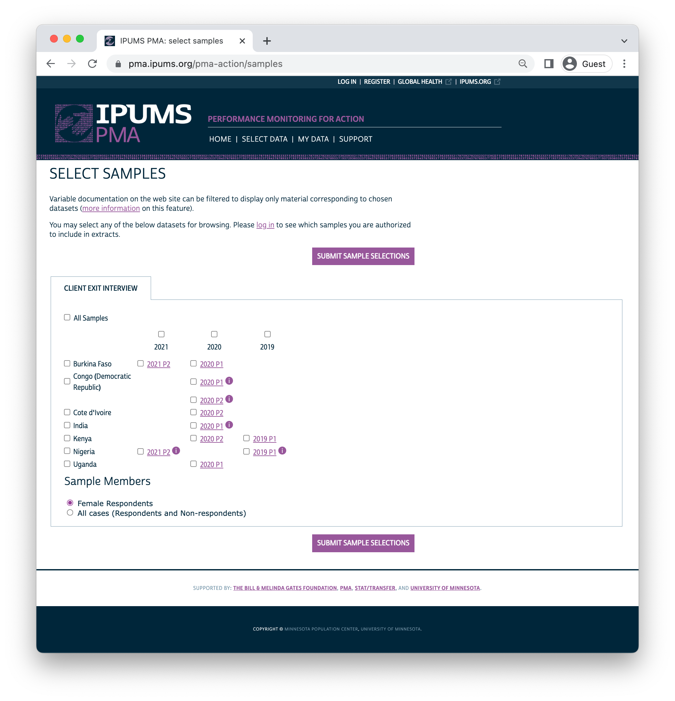

```{r setup, echo=FALSE, results='hide'}
source(here::here("r/utilities.r"))
set_postpath("2022-06-01-sdp-panel-release")
knitr::opts_chunk$set(echo = FALSE)
```

In addition to the release of new samples from the [service delivery point](https://pma.ipums.org/pma/sample_notes.shtml#sdp) (SDP) and [client exit interview](https://pma.ipums.org/pma/sample_notes.shtml#client) (CEI) data series, this month [IPUMS PMA](https://pma.ipums.org/pma/index.shtml) is excited to announce a new feature designed to help researchers study health facilities over time. 

Much like the [family planning](https://pma.ipums.org/pma/sample_notes.shtml#hhf) (FP) panel surveys released earlier this year, SDP data are now available in **longitudinal format**. That means we've matched responses from the same facility if it was sampled in multiple rounds of data collection. These responses are organized together in columns numbered separately for up to four rounds - in other words, longitudinal SDP data are organized with **one row per facility** whether it was sampled once or multiple times.

Let's cover the new SDP data first, and then we'll highlight new additions to the companion CEI data series. 

# New SDP samples 

This month's release includes new SDP samples from eight countries collected between 2020 and 2021. As always, SDP sampling is conducted **contemporaneously** and in the **same enumeration areas** used to identify women in households sampled by FP surveys. IPUMS PMA released the contemporaneous FP surveys for each country (except Ethiopia) [earlier this year](../2022-03-01-phase2-discovery/index.html). The new SDP surveys are designed to provide contextual information about the health service environment experienced by women in a corresponding FP sample; later, we will discuss how to match women with nearby facilities via `r varlink(EAID)`.

| Country                        | SDP Data Collection | FP Data Collection  |
| ------------------------------ | ------------------- | ------------------- |
| Burkina Faso                   | Feb 2021 - Mar 2021 | Dec 2020 - Apr 2021 |   
| Cote d'Ivoire                  | Oct 2020 - Nov 2020 | Sep 2020 - Nov 2020 |
| DRC (Kinshasa & Kongo Central) | Jan 2021 - Mar 2021 | Dec 2020 - Mar 2021 |
| Ethiopia                       | Nov 2020 - Jan 2021 | --                  |
| India (Rajasthan)              | Aug 2020 - Nov 2020 | Aug 2020 - Oct 2020 |
| Kenya                          | Nov 2020 - Feb 2021 | Nov 2020 - Dec 2020 |
| Nigeria (Kano & Lagos)         | Dec 2020 - Jan 2021 | Dec 2020 - Jan 2021 |
| Uganda                         | Sep 2020 - Oct 2020 | Sep 2020 - Oct 2020 | 

<aside>
**Reminder:** SDP samples are *not representative*. They are intended to describe the environment experienced by women in corresponding FP samples. 

For more information, check out our [guide to SDP data](../2021-01-26-sdp-data/index.html).
</aside>

Depending on your needs, you can still download these SDP samples in **cross-sectional** format. In that case, you'll find each SDP interview in its own unique row. 

```{r}

```

With the exception of Ethiopia, all of these new SDP samples are labelled `P1` or `P2` to help users match them to a corresponding "phase" from the ongoing family planning [panel study](../../index.html#category:Panel_Data). Data collection for the third and final phase of the panel study is currently underway. 

# Longitudinal SDP data

If you select the new **longitudinal** format, you'll find SDP samples organized by cohorts, each including up to four rounds of data collection. The same enumeration areas are used in every round within any given cohort, such that the same facility might be sampled from the same enumeration area up to four times in four years. 

```{r}

```

## Format

When you download a longitudinal data extract, you'll find one unique `r varlink(FACILITYID)` in each row, regardless of whether the facility was sampled once or multiple times. Here, we've created an extract containing all available samples, with "Facility Respondents" only.^[Alternatively, you may request an extract containing "All Cases", which includes records for facilities where SDP respondent declined or was unable to complete all or part of the interview.] This selects facilities where the SDP interview was fully or partly completed in *at least one* round of data collection. The first ten records from the first country, Burkina Faso, are shown: 

```{r}
knitr::opts_chunk$set(echo = TRUE)
```

```{r, results='hide'}
library(ipumsr)
library(tidyverse)

sdp <- read_ipums_micro(
  ddi = "data/pma_00129.xml",
  data = "data/pma_00129.dat.gz"
)

# Use labels as factor levels for the following variables (for readability)
sdp <- sdp %>% 
  mutate(
    COUNTRY = as_factor(COUNTRY),
    across(starts_with("RESULT"), as_factor)
  )

```
```{r}
sdp %>% select(COUNTRY, FACILITYID, starts_with("RESULT"))
```

The variable `r varlink(RESULTSQ)` shows the result of the interview for each round of data collection (numbered `_1` through `_4`). Nine of the first ten facilities were interviewed four times, but the facility numbered `7837` was only interviewed in rounds 1 and 2. We know that there is *no record* for that facility in rounds 3 and 4 because  `r varlink(RESULTSQ)` contains the value `NA`. 

Each round of data collection is numbered chronologically, beginning with the earliest round for the cohort. You'll find the interview year for each round in `r varlink(INTSQYEAR)`.

```{r}
sdp %>% select(COUNTRY, FACILITYID, starts_with("INTSQYEAR")) 
```

<aside>
In some cases, the end of one round may occur in the same calendar year as the beginning of a subsequent round. This explains why you see 2016 in both `INTSQYEAR_3` and `INTSQYEAR_4`. 

The variable `r varlink(INTSQMON)` gives the month for each interview.
</aside>

Each of these ten facilities are members of the same cohort from Burkina Faso, representing samples collected between 2014 and early 2017. IPUMS has created a unique ID for each cohort in the new variable `r varlink(SDPCOHORT)`. You can obtain a [count](https://dplyr.tidyverse.org/reference/count.html) of the total number of facilities included across *all* rounds for each cohort like so: 

```{r}
sdp %>% count(COUNTRY, SDPCOHORT)
```

Or, you can [group_by](https://dplyr.tidyverse.org/reference/group_by.html) these variables and use [summarise](https://dplyr.tidyverse.org/reference/summarise.html) to obtain the total number of facilities interviewed for *each* round:

```{r}
sdp %>% 
  group_by(COUNTRY, SDPCOHORT) %>% 
  summarise(across(
    starts_with("RESULTSQ"), 
    ~sum(!is.na(.x))
  )) 
```

<aside>
Each cohort contains a **maximum** of four rounds, but some cohorts contain fewer rounds. 

For example, the second Burkina Faso cohort `85402` contains only two rounds (sample years 2017-2018). 
</aside>

Individual facilities may enter or exit their cohort any number of times. For example, it is possible that a facility might complete the SDP interview once in round one, skip round two, and then re-enter the same cohort again in round three:

```{r}
sdp %>% 
  select(COUNTRY, SDPCOHORT, FACILITYID, starts_with("RESULTSQ")) %>% 
  filter(!is.na(RESULTSQ_1) & is.na(RESULTSQ_2) & !is.na(RESULTSQ_3))
```

<aside>
**Open Design:** these facilities were sampled in rounds one and three. They were not included in round two.
</aside>

Also, a facility may enter the cohort *after* round one. 

```{r}
sdp %>% 
  select(COUNTRY, SDPCOHORT, FACILITYID, starts_with("RESULTSQ")) %>% 
  filter(is.na(RESULTSQ_1) & !is.na(RESULTSQ_2))
```

<aside>
**Delayed entry:** these facilities were sampled beginning in round two. They were not included in round one.
</aside>

However, each `r varlink(FACILITYID)` appears in only *one* cohort. In the event that a facility is randomly selected into multiple cohorts, it would receive a new `r varlink(FACILITYID)`. It is not possible to reliably match these facilities across cohorts. 

```{r}
sdp %>% 
  group_by(FACILITYID) %>% 
  count(SDPCOHORT) %>% 
  ungroup() %>% 
  count(cohort_appearences = n)
```

<aside>
Each `r varlink(FACILITYID)` appears in only one `r varlink(SDPCOHORT)`.
</aside>

Lastly, users should note that in some instances, the same `r varlink(FACILITYID)` was listed in a different enumeration area in one or more rounds. This occurs in less than 4% of cases across cohorts. 

```{r}
sdp %>% 
  select(COUNTRY, SDPCOHORT, FACILITYID, starts_with("EAID")) %>% 
  pivot_longer(starts_with("EAID"), values_to = "EAID") %>% 
  group_by(COUNTRY, SDPCOHORT, FACILITYID) %>%
  summarise(ea_count = n_distinct(EAID, na.rm = TRUE), .groups = "keep") %>% 
  ungroup() %>% 
  count(ea_count > 1) %>% 
  mutate(prop = prop.table(n))
```

<aside>
More than 96% of facilities are located in the same `r varlink(EAID)` across rounds. 

Fewer than 4% of facilities switched enumeration areas between rounds.
</aside>

## Data Availability 

We've seen that the value `NA` is used to represent facilities that were interviewed *fewer* than four times in the same cohort: if, for example, no interview data exists for round 4, all variables named with the suffix `_4` are marked `NA`. 

However, there is is second reason why you might see `NA` values in a longitudinal data extract. These represent cases where the question associated with a particular variable was changed or omitted between rounds. For example, let's take a look at [contraceptive stock](https://pma.ipums.org/pma-action/variables/group?id=fp_stock) variable group:

```{r, echo=FALSE, layout="l-body-outset"}

```

Certain contraceptive methods are included in every questionnaire ever administered across SDP samples, and every sample includes a question asking whether certain methods were **in-stock and observed** by the interviewer. So, you'll always find the following variables available across samples: 

  * `r varlink(CONOBS)` - male condoms 
  * `r varlink(EMRGOBS)` - emergency contraception
  * `r varlink(FCOBS)` - female condoms
  * `r varlink(IMPOBS)` - contraceptive implants
  * `r varlink(IUDOBS)` - IUDs
  * `r varlink(PILLOBS)` - contraceptive pills
  
<aside>
Every SDP questionnaire asks whether these six methods were **in-stock**.

Usually, the interviewer also reported whether they **observed** the stock. See our [comparability](https://pma.ipums.org/pma-action/variables/CONOBS#comparability_section) note for details.
</aside>
  
However, some questionnaires ask about the availability of additional contraceptive methods. As a result, some samples contain additional variables like: 

  * `r varlink(CYCBOBS)` - Standard Days / Cycle Beads
  * `r varlink(DEPOOBS)` - Depo Provera
  * `r varlink(DIAOBS)` - diaphragms
  * `r varlink(FJOBS)` - contraceptive foam / jelly
  * `r varlink(INJ1OBS)` - 1 month injectables
  * `r varlink(INJ3OBS)` - 3 month injectables
  * `r varlink(MIFEOBS)` - mifepristone
  * `r varlink(MISOBS)` - misoprostol
  * `r varlink(NTABOBS)` - N-tablets
  * `r varlink(OTHEROBS)` - other methods
  * `r varlink(PROPILLOBS)` - Progestin pills
  * `r varlink(SAYOBS)` - Sayana Press

<aside>
These variables are available for some samples, but not others. If not available, they will be labelled `NA`. 
</aside>

When you download an extract containing multiple samples, these variables will contain `NA` values for samples that did not ask about the availability of these additional methods. 

Fortunately, in a longitudinal extract you'll find that the same `OBS` variables are always available for *all rounds within the same cohort*. PMA might add or drop contraceptive methods from the questionnaire administered in a particular country, but *only* during a redesign period before the selection of a new cohort. 

You'll can see this for yourself if you count the number of responses to all of the `OBS` variables and compare this to the number of facilities that completed all or part of the interview across rounds. We'll use [pivot_longer](https://tidyr.tidyverse.org/reference/pivot_longer.html) to showcase these counts in separate rows for each round:

```{r}
sdp %>% 
  group_by(COUNTRY, SDPCOHORT) %>% 
  summarise(
    across(matches("OBS") | matches("RESULT"), ~sum(!is.na(.x))),
    .groups = "keep"
  ) %>% 
  pivot_longer(
    -c(COUNTRY, SDPCOHORT),
    names_pattern = "(.*)_(.*)",
    names_to = c(".value", "ROUND")
  ) %>% 
  relocate(RESULTSQ, .after = ROUND) %>% 
  filter(RESULTSQ != 0) 
```

Again, let's focus our attention on the first cohort numbered `85401` from Burkina Faso, which includes data collected in four rounds. In the first round, 106 facilities completed all or part of the questionnaire (`r varlink(RESULTSQ)`), and every one of those facilities answered a question about contraceptive stock. That question included male condoms (`r varlink(CONOBS)`), beads (`r varlink(CYCBOBS)`), diaphragms (`r varlink(DEPOOBS)`), and more. However, it did not ask about Depo Provera, which is why `r varlink(DEPOOBS)` shows zero non-`NA` values. 

Moving downward, you see that `r varlink(DEPOOBS)` shows zero non-`NA` values *in every round* for cohort `85401`. That's because the associated question was not modified until the redesign period following round four. 

Then, a new cohort numbered `85402` was drawn from a new set of enumeration areas, and the questionnaire was adjusted to include Depo Provera. No further adjustments were made after round one was completed for cohort `85402`: Depo Provera appears again in the second and final round. 

If you were to continue exploring this table, you would find that the value `0` appears consistently for all variables in all rounds for any given cohort. 

## Applications 

In the coming weeks, we'll continue exploring longitudinal SDP data as a way to understand how facilities adapt in response to shifting markets, policies, and even climate conditions. However, we urge users to remember that SDP surveys are **not** collected through random sampling: they should not be used to estimate population-level statistics for health service providers on a national or sub-national scale. 

Instead, we'll show how to use SDP data as contextual information for women and households sampled in PMA family planning surveys. That's because SDP samples are constructed to include up to three public-sector and three private-sector facilities serving each enumeration area included in a contemporaneous family planning sample. SDP data are intended to represent the health service environment experienced by the women included in these samples.

# New CEI data 

CEI surveys are a relatively new addition to PMA, so you'll find samples available from 2020 onward. They represent interviews with actual clients visiting facilities included in a contemporaneous SDP sample. These clients are women from the community who sought family planning services or products at the facility during a two-day data collection period. 

<aside>
Check out our complete [introduction to CEI surveys](../2021-12-01-cei-discovery/index.html) published earlier this year.
</aside>

This data release includes CEI samples corresponding with many of the same SDP samples we mentioned above: 

| Country                        | SDP Data Collection | CEI Data Collection |
| ------------------------------ | ------------------- | ------------------- |
| Burkina Faso                   | Feb 2021 - Mar 2021 | Feb 2021 - Mar 2021 |   
| Cote d'Ivoire                  | Oct 2020 - Nov 2020 | Oct 2020 - Nov 2020 |
| DRC (Kinshasa & Kongo Central) | Jan 2021 - Mar 2021 | Feb 2021 - Mar 2021 |
| Ethiopia                       | Nov 2020 - Jan 2021 | --                  |
| India (Rajasthan)              | Aug 2020 - Nov 2020 | --                  |
| Kenya                          | Nov 2020 - Feb 2021 | Dec 2020 - Mar 2021 |
| Nigeria (Kano & Lagos)         | Dec 2020 - Jan 2021 | Dec 2020 - Jan 2021 |
| Uganda                         | Sep 2020 - Oct 2020 | --                  | 

You'll find CEI data on the IPUMS PMA website if select **Client Exit Interview** in the [unit of analysis](https://pma.ipums.org/pma-action/extract_requests/clear?return_url=%2Fpma-action%2Fvariables%2Fgroup) menu. 

```{r, echo = FALSE}

```

For now, CEI surveys are only available in cross-sectional format. However, we'll demonstrate how to link them together with longitudinal SDP data in an upcoming post. 

```{r, echo = FALSE}

```

As we'll see in the coming weeks, CEI surveys offer an important way to measure whether and how facilities meet family planning needs for women in the communities they serve. In turn, both surveys help to describe the health service environment experienced by women in FP surveys, including those participating the new PMA [panel study](../../index.html#category:Panel_Data) we've been describing in our most recent series on this blog. We'll be focusing much more on ways to integrate all three of these surveys together throughout this summer. 