```{r setup, echo=FALSE, results='hide'}
source(here::here("r/utilities.r"))
set_postpath("2022-06-15-phase2-webinar")
knitr::opts_chunk$set(echo = TRUE)
```

Last month, PMA and IPUMS PMA co-hosted a webinar introducing both R and Stata users to the new [family planning panel survey](../../index.html#category:Panel_Data) we've been covering recently here on the blog. In our example analysis, we used interviews with women aged 15-49 in Burkina Faso and Kenya to examine how COVID-19 impacted both adoption and discontinuation of contraceptives between Phase 1 and Phase 2 of the study.

Below you'll find a video recording of the complete webinar, beginning with an overview of the PMA panel study design. Attendees were invited to create their own data extract through the IPUMS PMA website, and to try replicating our analysis with downloadable R or Stata code.

<iframe width="560" height="315" src="https://www.youtube.com/embed/9aS4DF0DsKA" title="YouTube video player" frameborder="0" allow="accelerometer; autoplay; clipboard-write; encrypted-media; gyroscope; picture-in-picture" allowfullscreen></iframe><br>

In the breakout sessions, we walked R and Stata users through a few of the key data cleaning, visualization, and modeling steps we use in our analysis. You can download executable scripts from both the [R session](https://pma.ipums.org/pma/resources/other/r-breakout.Rmd) and the [Stata session](https://pma.ipums.org/pma/resources/other/workshop_2022.do), or follow along with our example code shown below. 

# R-users Breakout Session

<iframe width="560" height="315" src="https://www.youtube.com/embed/KYS-YnmYCyU" title="YouTube video player" frameborder="0" allow="accelerometer; autoplay; clipboard-write; encrypted-media; gyroscope; picture-in-picture" allowfullscreen></iframe><br>

## Setup

R users should always select a **.dat (fixed-width text)** data format on the IPUMS PMA website.   

You'll receive a compressed **dat.gz** file - no need to decompress! 

Save both of those files in the "data" folder of your working directory.

<center>
```{r, echo = FALSE}
knitr::include_graphics("images/download.png", dpi = 150)
```
</center>

You'll need the [ipumsr](https://tech.popdata.org/ipumsr/index.html) package to load them. If not installed, you can download from CRAN.

```{r, eval = FALSE}
install.packages("ipumsr")
```

Each session, load the `ipumsr` library before you import data.

```{r, results='hide', message=FALSE, warning=FALSE}
library(ipumsr)

# Load data into R with `ipumsr`
dat <- read_ipums_micro(
  ddi = "data/pma_00093.xml",
  data = "data/pma_00093.dat.gz"
)
```

<aside>
```{r, echo = FALSE}
hex("ipumsr")
```
</aside>

Other useful packages for IPUMS data: 

```{r, results='hide', message=FALSE, warning=FALSE}
# General toolkit 
library(tidyverse)

# For label manipulation: 
library(labelled)

# For survey analysis: 
library(survey) 
library(srvyr) 
```

<aside>
```{r, echo = FALSE}
hex("tidyverse")
```
</aside>

## Analytic Sample 

PMA uses an **open panel design** - women may enter the panel after Phase 1, and they may be lost to follow-up after any phase (see [RESULTFQ](https://pma.ipums.org/pma-action/variables/RESULTFQ)).

Women who enter the panel at Phase 2 are `NA` for all variables at Phase 1.

```{r}
dat %>% count(RESULTFQ_1)
```

Women whose households were not found again after Phase 1 are `NA` for all variables at Phase 2. 

```{r}
dat %>% count(RESULTFQ_2)
```

We will only include women who were available and completed the Female Questionnaire for *both* Phase 1 and Phase 2. 

```{r}
dat <- dat %>% filter(RESULTFQ_1 == 1 & RESULTFQ_2 == 1)

dat %>% count(RESULTFQ_1, RESULTFQ_2)
```

Additionally, PMA samples are only valid for the *de facto* population: women who slept in the household the night before the Household interview (see [RESIDENT](https://pma.ipums.org/pma-action/variables/RESIDENT)).

```{r}
dat %>% count(RESIDENT_1)
```

We'll also drop cases where the woman was not part of the *de facto* population in either Phase 1 or Phase 2. 

```{r}
dat <- dat %>% filter(RESIDENT_1 %in% c(11, 22) & RESIDENT_2 %in% c(11, 22))
```

How many cases remain? 

```{r}
dat %>% count(COUNTRY)
```

## Recoding Independent variables 

PMA surveys contain many **categorical** variables. These are usually represented as **factors** in R. 

In an IPUMS data extract, you won't see factors! 

Instead, we generate [labelled](https://larmarange.github.io/labelled/) numeric variables (note the label in brackets). 

```{r}
dat %>% ipums_var_label(CVINCOMELOSS_2)

dat %>% count(CVINCOMELOSS_2)
```

The [ipumsr](https://tech.popdata.org/ipumsr/index.html) package contains tools for working with labelled IPUMS data.

Usually, we handle codes like `99 [NIU (not in universe)]` before transforming other missing data to `NA`. 

```{r}
dat %>% count(CVINCOMELOSS_2, HHINCOMELOSSAMT_2)
```

```{r, echo = FALSE}
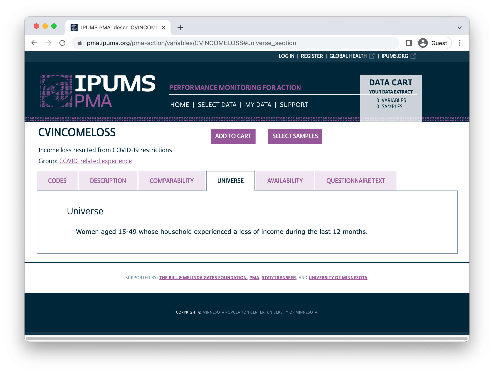
```

<aside>
Information on the code `NIU (not in universe)` can always be found on a variable's [universe tab](https://pma.ipums.org/pma-action/variables/CVINCOMELOSS#universe_section).
</aside>

For [CVINCOMELOSS_2](https://pma.ipums.org/pma-action/variables/CVINCOMELOSS), `99 [NIU (not in universe)]` may indicate that the household experienced *no income loss in the last year*, or it may indicate that [HHINCOMELOSSAMT_2](https://pma.ipums.org/pma-action/variables/HHINCOMELOSSAMT) is `98 [No response or missing]`. 

We should treat the `NIU` women from households without *any* income loss as "No" in [CVINCOMELOSS_2](https://pma.ipums.org/pma-action/variables/CVINCOMELOSS). 

```{r}
dat <- dat %>% 
  mutate(
    CVINCOMELOSS_2 = CVINCOMELOSS_2 %>% 
      labelled::recode_if(HHINCOMELOSSAMT_2 == 1, 0)
  )

dat %>% count(CVINCOMELOSS_2, HHINCOMELOSSAMT_2)
```

Next, we'll use `NA` to represent the remaining values above `90`: 

  * `97 [Don't know] ` and 
  * remaining cases marked `99 [NIU (not in universe)]` 

```{r}
dat <- dat %>% 
  mutate(
    CVINCOMELOSS_2 = CVINCOMELOSS_2 %>% 
      lbl_na_if(~.val > 90)
  )  

dat %>% count(CVINCOMELOSS_2, HHINCOMELOSSAMT_2)
```

Once you're done with labels, we recommend transforming key variables into **factors** with [forcats::as_factor](https://forcats.tidyverse.org/reference/as_factor.html). 

```{r}
dat <- dat %>% mutate(CVINCOMELOSS_2 = as_factor(CVINCOMELOSS_2))

dat %>% count(CVINCOMELOSS_2)
```

<aside>
The [forcats](https://forcats.tidyverse.org) package is included when you load `library(tidyverse)`.
</aside>

This will make categorical variables easier to use in data visualization and as "dummy" variables in regression analysis. 

Likert-style questions can be treated as factors, too. 

```{r}
dat %>% ipums_var_label(COVIDCONCERN_2)

dat %>% count(COVIDCONCERN_2)
```

This time we'll treat codes `5` and above as `NA`. 

```{r}
dat <- dat %>% 
  mutate(
    COVIDCONCERN_2 = COVIDCONCERN_2 %>% 
      lbl_na_if(~.val >= 5) %>% 
      as_factor()
  )

dat %>% count(COVIDCONCERN_2)
```

You can apply the same transformation to several variables with help from [dplyr::across](https://dplyr.tidyverse.org/reference/across.html). 

```{r}
dat <- dat %>% 
  mutate(
    across(
      c(COUNTRY, URBAN, WEALTHT_2, EDUCATTGEN_2),
      ~.x %>% lbl_na_if(~.val >= 90) %>% as_factor()
    )
  )
```

<aside>
[dplyr](https://dplyr.tidyverse.org/index.html) is another package included when you load `library(tidyverse)`.
</aside>

Often, it's important to set a **reference group** against which all dummy variables will be compared. 

You can manually specify a **refernece group** when you set factor "levels" with a function like [forcats::fct_relevel](https://forcats.tidyverse.org/reference/fct_relevel.html). 

```{r}
dat <- dat %>% 
  mutate(
    AGE_2 = case_when(
      AGE_2 < 25 ~ "15-24",
      AGE_2 < 35 ~ "25-34",
      AGE_2 < 50 ~ "35-49"
    ),
    AGE_2 = AGE_2 %>% fct_relevel("15-24", "25-34", "35-49")
  ) 
```

## Dependent variables

We'll use our recoded variables to model the likelihood of contraceptive method **adoption** and **discontinuation** between phases (see [CP](https://pma.ipums.org/pma-action/variables/CVINCOMELOSS)).

```{r}
dat <- dat %>% filter(CP_1 < 90 & CP_2 < 90)

dat %>% count(CP_1, CP_2)
```

A woman has **adopted** a method if she was *not* using one at Phase 1, but then reported using one at Phase 2.

She has **discontinued** a method if she *did* use one at Phase 1, but no longer uses one at Phase 2. 

```{r}
dat <- dat %>% 
  mutate(
    FPSTATUS = case_when(
      CP_1 == 1 & CP_2 == 1 ~ "User",
      CP_1 == 0 & CP_2 == 0 ~ "Non-user",
      CP_1 == 1 & CP_2 == 0 ~ "Discontinued",
      CP_1 == 0 & CP_2 == 1 ~ "Adopted"
    ),
    FPSTATUS = fct_infreq(FPSTATUS)
  )
```

Un-weighted sample proportions for `FPSTATUS` can be found with [count](https://dplyr.tidyverse.org/reference/count.html) and [prop.table](https://www.rdocumentation.org/packages/base/versions/3.6.2/topics/prop.table):

```{r}
dat_nowt <- dat %>% 
  group_by(COUNTRY) %>% 
  count(FPSTATUS) %>% 
  mutate(prop = prop.table(n))

dat_nowt
```

We'll plot this table with [ggplot2](https://ggplot2.tidyverse.org/index.html).

```{r, fig.height=4, fig.width=10}
dat_nowt %>% 
  ggplot(aes(x = prop, y = FPSTATUS, fill = FPSTATUS)) +  
  geom_bar(stat = "identity") +
  facet_wrap(~COUNTRY) + theme_minimal() + 
  theme(axis.title = element_blank(), legend.position = "none") + 
  scale_x_continuous(labels = scales::label_percent())
```

<aside>
[ggplot2](https://ggplot2.tidyverse.org/index.html) is another package included when you load `library(tidyverse)`.
</aside>

For *weighted* population estimates, use [as_survey_design](http://gdfe.co/srvyr/reference/as_survey_design.html) and [survey_mean](http://gdfe.co/srvyr/reference/survey_mean.html) from the [srvyr](http://gdfe.co/srvyr/index.html) package. 

Use `prop = TRUE` to adjust standard errors near 0% or 100% for proportions.

```{r}
dat_wtd <- dat %>% 
  as_survey_design(weight = PANELWEIGHT, id = EAID_1, strata = STRATA_1) %>%
  group_by(COUNTRY, FPSTATUS) %>% 
  summarise(survey_mean(prop = TRUE, prop_method = "logit", vartype = "ci"))

dat_wtd
```

<aside>
```{r, echo = FALSE}
hex("srvyr")
```
</aside>

```{r, fig.height=4, fig.width=10}
dat_wtd %>% 
  ggplot(aes(x = coef, y = FPSTATUS, fill = FPSTATUS)) +  
  geom_bar(stat = "identity") +
  geom_errorbar(aes(xmin = `_low`, xmax = `_upp`), width = 0.2, alpha = 0.5) +
  facet_wrap(~COUNTRY) + theme_minimal() + 
  theme(axis.title = element_blank(), legend.position = "none") + 
  scale_x_continuous(labels = scales::label_percent())
```

## Analysis

The same [srvyr](http://gdfe.co/srvyr/index.html) toolkit can be used to model our dependent variables with [survey::svyglm](http://r-survey.r-forge.r-project.org/survey/). 

Consider women who were *not* using a method at Phase 1: 

```{r}
adopt_glm <- dat %>% 
  filter(CP_1 == 0) %>%
  mutate(adopt = FPSTATUS == "Adopted") %>% 
  group_by(COUNTRY) %>%
  summarise(
    adopt = cur_data() %>% 
      as_survey_design(weight = PANELWEIGHT, id = EAID_1, strata = STRATA_1) %>% 
      svyglm(
        adopt ~ CVINCOMELOSS_2 + COVIDCONCERN_2 + URBAN + WEALTHT_2 + EDUCATTGEN_2 + AGE_2,
        family = "quasibinomial", design = .
      ) %>% 
      broom::tidy(exp = TRUE) %>% 
      mutate(sig = gtools::stars.pval(p.value)) %>% 
      list()
  )

adopt_glm
```

For Phase 1 non-users in Burkina Faso, **very high** levels of concern about becoming infected with COVID-19 are significantly associated with higher chances of adopting a contraceptive method (relative to women who had no such concern).

Lesser levels of concern are not statistically significant, nor is household income loss from COVID-19. 

```{r}
adopt_glm %>% 
  filter(COUNTRY == "Burkina Faso") %>% 
  unnest(adopt) 
```

In Kenya, neither of these measures are significantly predictive of adoption among non-users.

```{r}
adopt_glm %>% 
  filter(COUNTRY == "Kenya") %>% 
  unnest(adopt) 
```

What about method **dicontinuation** for women who *were* using a method at Phase 1? 

```{r}
stop_glm <- dat %>% 
  filter(CP_1 == 1) %>% 
  mutate(stop = FPSTATUS == "Discontinued") %>% 
  group_by(COUNTRY) %>%
  summarise(
    stop = cur_data() %>% 
      as_survey_design(weight = PANELWEIGHT, id = EAID_1, strata = STRATA_1) %>% 
      svyglm(
        stop ~ CVINCOMELOSS_2 + COVIDCONCERN_2 + URBAN + WEALTHT_2 + EDUCATTGEN_2 + AGE_2,
        family = "quasibinomial", design = .
      ) %>% 
      broom::tidy(exp = TRUE) %>% 
      mutate(sig = gtools::stars.pval(p.value)) %>% 
      list()
  )

stop_glm
```

This time, neither of the COVID-19 measures are significantly associated with **discontinuation** for Phase 1 contraceptive users in Burkina Faso.

```{r}
stop_glm %>% 
  filter(COUNTRY == "Burkina Faso") %>% 
  unnest(stop) 
```

However, higher levels concern with becoming infected with COVID-19 *are* significantly associated with higher odds of discontinuation for Phase 1 contraceptive users in Kenya. 

```{r}
stop_glm %>% 
  filter(COUNTRY == "Kenya") %>% 
  unnest(stop) 
```

# Stata-users Breakout Session 

<iframe width="560" height="315" src="https://www.youtube.com/embed/ijifgQDGS8A" title="YouTube video player" frameborder="0" allow="accelerometer; autoplay; clipboard-write; encrypted-media; gyroscope; picture-in-picture" allowfullscreen></iframe><br>


## Setup

Stata users should select a `.dta` file from the IPUMS PMA website. 

```
. cd "Z:\pma\admin\presentations\workshop2022"
Z:\pma\admin\presentations\workshop2022

. use workshop_2022.dta
```

Result of the Female Questionnaire in Phase 1 vs Phase 2:

```
. tab resultfq_2 resultfq_1, miss

     result of female |  result of female questionnaire
        questionnaire | completed  partly co          . |     Total
----------------------+---------------------------------+----------
            completed |    12,501          8      4,506 |    17,015 
          not at home |       106          0          0 |       106 
            postponed |        24          0          0 |        24 
              refused |        87          0          0 |        87 
     partly completed |        14          0          8 |        22 
     respondent moved |        18          0          0 |        18 
        incapacitated |        24          0          0 |        24 
not interviewed (fema |         4          0          0 |         4 
not interviewed (hous |       197          0          0 |       197 
niu (not in universe) |     1,352          1          0 |     1,353 
                    . |     1,987         25          0 |     2,012 
----------------------+---------------------------------+----------
                Total |    16,314         34      4,514 |    20,862 

```

## Analytic Sample

Dropping women who did not complete a survey in both surveys:

```
. keep if resultfq_1 == 1
(4,548 observations deleted)

. keep if resultfq_2 == 1
(3,813 observations deleted)
```

Dropping women who were not part of the *de facto* population:

```
. keep if (resident_1 == 11 | resident_1 == 22) & (resident_2 == 11 | resident_2 == 22)
(358 observations deleted)
```

## Dependent variables

We'll call our dependent variable `category`.

```
> gen category = .
(12,143 missing values generated)

. replace category = 1 if cp_1 == 0 & cp_2 == 0
(5,107 real changes made)

. replace category = 2 if cp_1 == 1 & cp_2 == 1
(3,917 real changes made)

. replace category = 3 if cp_1 == 0 & cp_2 == 1
(1,939 real changes made)

. replace category = 4 if cp_1 == 1 & cp_2 == 0
(1,178 real changes made)

```

"Non-users" were not using a method at the time of *both* of their interviews.

"Users" were using a method at the time of *both* of their interviews.

```
. label define categorical 1 "Non-user" 2 "User" 3 "Adopted FP" 4 "Discontinued FP" 

. label values category categorical

. tab category, gen(cat_)

       category |      Freq.     Percent        Cum.
----------------+-----------------------------------
       Non-user |      5,107       42.06       42.06
           User |      3,917       32.26       74.33
     Adopted FP |      1,939       15.97       90.30
Discontinued FP |      1,178        9.70      100.00
----------------+-----------------------------------
          Total |     12,141      100.00

```

## Data Visualization

Our first graph uses counts of interviewed women

```
. graph bar (sum) cat_1-cat_4, over(country) legend(label(1 "Non-user") 
label(2 "User") label(3 "Adopted FP") label(4 "Discontinued FP"))
```

```{r, echo = FALSE, fig.align='center'}
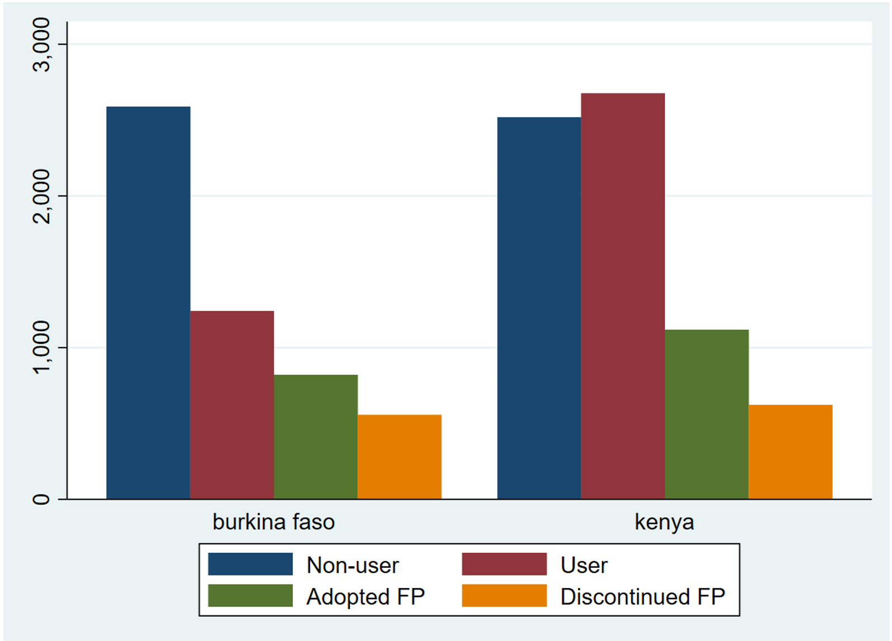
```

Our second graph uses proportions, so the visualization isn't biased by a difference in sample sizes

```
. graph bar cat_1-cat_4, over(country) legend(label(1 "Non-user") label(2 "User")
label(3 "Adopted FP") label(4 "Discontinued FP"))
```

```{r, echo = FALSE, fig.align='center'}
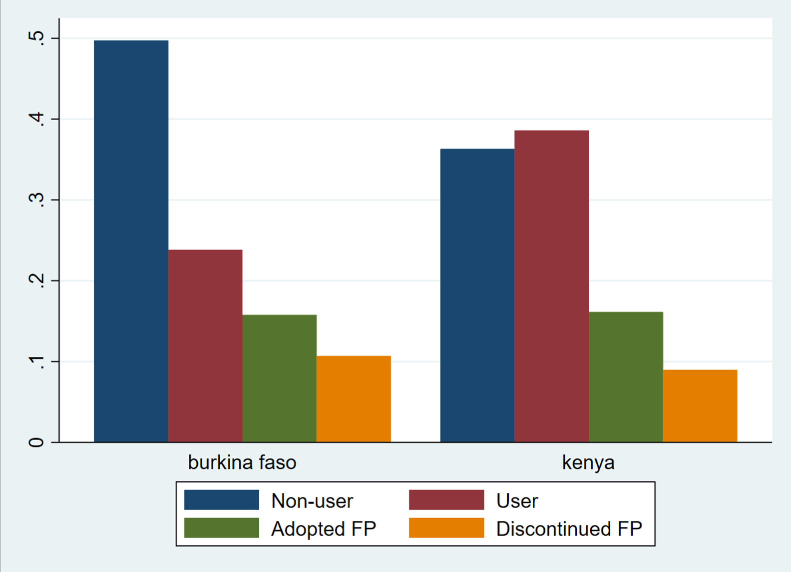
```

## Data Analysis

Rename outcome variable

```
. rename cat_3 adoption

. rename cat_4 discontinue

```

Explanatory variables

```
. tab cvincomeloss_2, miss

     income loss resulted from covid-19 |
                           restrictions |      Freq.     Percent        Cum.
----------------------------------------+-----------------------------------
                                     no |        658        5.42        5.42
                                    yes |      7,566       62.31       67.73
                             don't know |          2        0.02       67.74
                  niu (not in universe) |      3,917       32.26      100.00
----------------------------------------+-----------------------------------
                                  Total |     12,143      100.00

```

Use `r varlink(hhincomelossamt)` to understand who did not lose income in ` r varlink(cvincomeloss)`

```
. tab cvincomeloss_2 hhincomelossamt_2

 income loss resulted |    household income loss since covid-19
        from covid-19 |                restrictions
         restrictions |      none    partial   complete  no respon |     Total
----------------------+--------------------------------------------+----------
                   no |         0        547        111          0 |       658 
                  yes |         0      5,449      2,117          0 |     7,566 
           don't know |         0          2          0          0 |         2 
niu (not in universe) |     3,904          0          0         13 |     3,917 
----------------------+--------------------------------------------+----------
                Total |     3,904      5,998      2,228         13 |    12,143 

. replace cvincomeloss_2 = 0 if hhincomelossamt_2 == 1
(3,904 real changes made)
```

Look at the other explanatory variable

```
. tab country covidconcern_2, row

             |            concerned about getting infected
 pma country | not conce  a little   concerned  very conc  currently |     Total
-------------+-------------------------------------------------------+----------
burkina faso |       212        461        955      3,576          1 |     5,208 
             |      4.07       8.85      18.34      68.66       0.02 |    100.00 
-------------+-------------------------------------------------------+----------
       kenya |       162        216      1,515      5,034          8 |     6,935 
             |      2.34       3.11      21.85      72.59       0.12 |    100.00 
-------------+-------------------------------------------------------+----------
       Total |       374        677      2,470      8,610          9 |    12,143 
             |      3.08       5.58      20.34      70.91       0.07 |    100.00 

             | concerned
             |   about
             |  getting
             |  infected
 pma country | no respon |     Total
-------------+-----------+----------
burkina faso |         3 |     5,208 
             |      0.06 |    100.00 
-------------+-----------+----------
       kenya |         0 |     6,935 
             |      0.00 |    100.00 
-------------+-----------+----------
       Total |         3 |    12,143 
             |      0.02 |    100.00 
                      
```

Replace NIU to missing

```
. forvalues i = 1/2 {
  foreach var in age marstat educattgen cvincomeloss covidconcern 
  hhincomelossamt wealtht cp {
    replace `var'_`i' = . if `var'_`i' > 90
  }
}
(0 real changes made)
(1 real change made, 1 to missing)
(2 real changes made, 2 to missing)
(0 real changes made)
(0 real changes made)
(0 real changes made)
(2 real changes made, 2 to missing)
(2 real changes made, 2 to missing)
(0 real changes made)
(0 real changes made)
(1 real change made, 1 to missing)
(15 real changes made, 15 to missing)
(3 real changes made, 3 to missing)
(13 real changes made, 13 to missing)
(993 real changes made, 993 to missing)
(0 real changes made)

```

Establishing the survey weight settings

```
. svyset [pw=panelweight], psu(eaid_1) strata(strata_1)

      pweight: panelweight
          VCE: linearized
  Single unit: missing
     Strata 1: strata_1
         SU 1: eaid_1
        FPC 1: <zero>

. 

```

Demonstrating weighted proportions

```
. tab country adoption, row

                      | category==Adopted FP
          pma country |         0          1 |     Total
----------------------+----------------------+----------
         burkina faso |     4,386        821 |     5,207 
                      |     84.23      15.77 |    100.00 
----------------------+----------------------+----------
                kenya |     5,816      1,118 |     6,934 
                      |     83.88      16.12 |    100.00 
----------------------+----------------------+----------
                Total |    10,202      1,939 |    12,141 
                      |     84.03      15.97 |    100.00 

```


```
. svy: tab country adoption, row
(running tabulate on estimation sample)

Number of strata   =        23                  Number of obs     =     12,141
Number of PSUs     =       474                  Population size   = 12,134.981
                                                Design df         =        451

-------------------------------
pma       |category==Adopted FP
country   |     0      1  Total
----------+--------------------
  burkina | .8503  .1497      1
    kenya | .8353  .1647      1
          | 
    Total | .8418  .1582      1
-------------------------------
  Key:  row proportion

  Pearson:
    Uncorrected   chi2(1)         =    5.0554
    Design-based  F(1, 451)       =    1.8652     P = 0.1727


```

Creating an `r varlink(age)` category recode

```
. recode age_2 (15/24=1) (25/34=2) (35/49=3), gen(age_rec)
(12143 differences between age_2 and age_rec)

. label define agerecode 1 "15-24" 2 "25-34" 3 "35-49"

. label values age_rec agerecode

. 
. recode birthevent_2 (99=0) (0=0) (1/2=1) (else=2), gen(birth_rec)
(10389 differences between birthevent_2 and birth_rec)

. label define birthrecode 0 "No births" 1 "1 or 2 births" 2 "3+ births"

. label values birth_rec birthrecode
```

## Logistic regressions

```
. svy: logit adoption i.age_rec urban i.wealtht_2 i.educattgen_2 
cvincomeloss_2 i.covidconcern_2 if country == 1 
```

```{r, echo = FALSE, fig.align='center'}
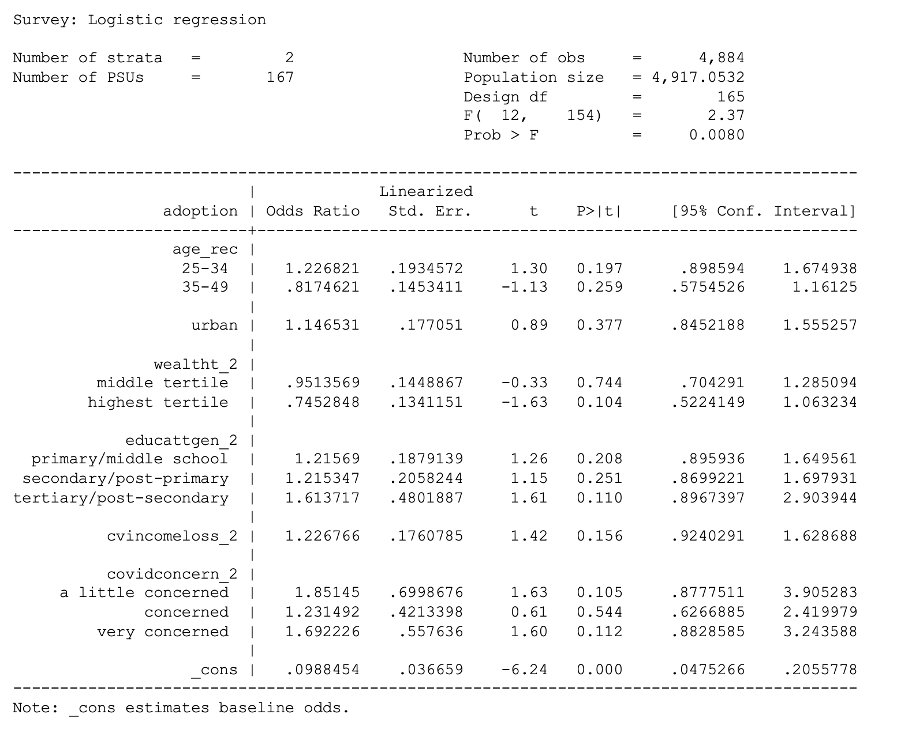
```


```
. svy: logit adoption i.age_rec urban i.wealtht_2 i.educattgen_2 
cvincomeloss_2 i.covidconcern_2 if country == 7 
```

```{r, echo = FALSE, fig.align='center'}
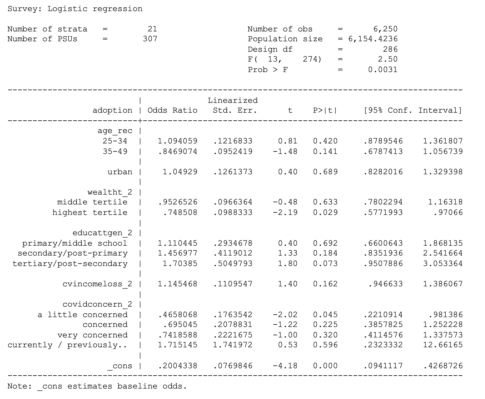
```

```
. svy: logit discontinue i.age_rec urban i.wealtht_2 i.educattgen_2 
cvincomeloss_2 i.covidconcern_2 if country == 1 
```
```{r, echo = FALSE, fig.align='center'}
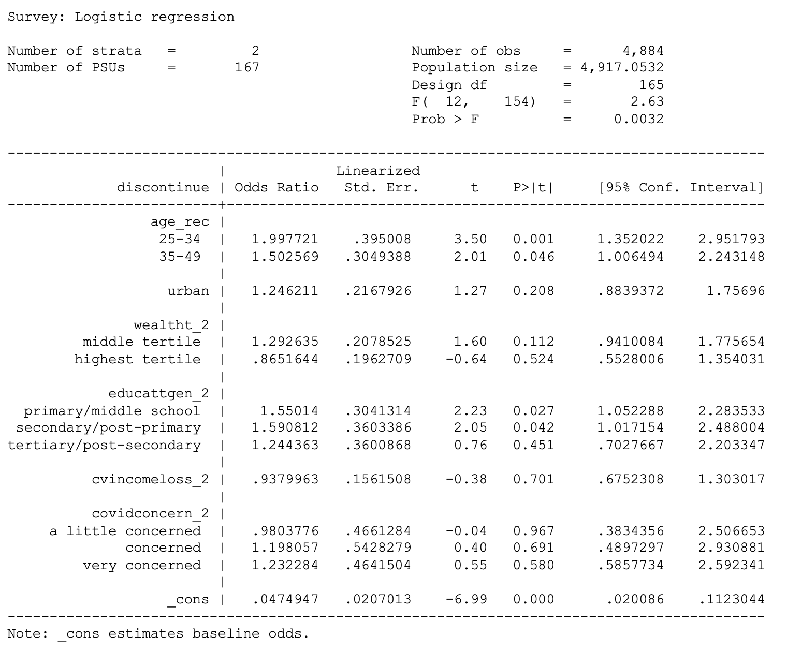
```

```
. svy: logit discontinue i.age_rec urban i.wealtht_2 i.educattgen_2 
cvincomeloss_2 i.covidconcern_2 if country == 7 
```

```{r, echo = FALSE, fig.align='center'}
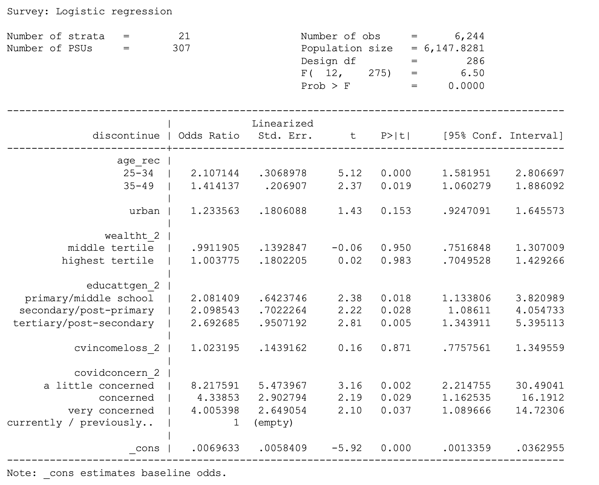
```

## Logistic regressions with parity

```
. svy: logit adoption i.age_rec i.birth_rec urban i.wealtht_2 i.educattgen_2 
cvincomeloss_2 i.covidconcern_2 if country == 1 
```

```{r, echo = FALSE, fig.align='center'}
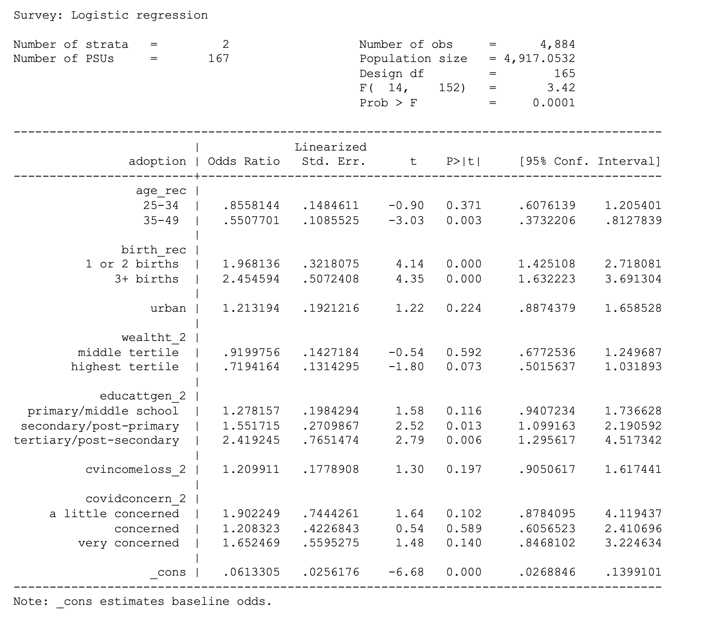
```

```
. svy: logit adoption i.age_rec i.birth_rec urban i.wealtht_2 i.educattgen_2 
cvincomeloss_2 i.covidconcern_2 if country == 7 
```

```{r, echo = FALSE, fig.align='center'}
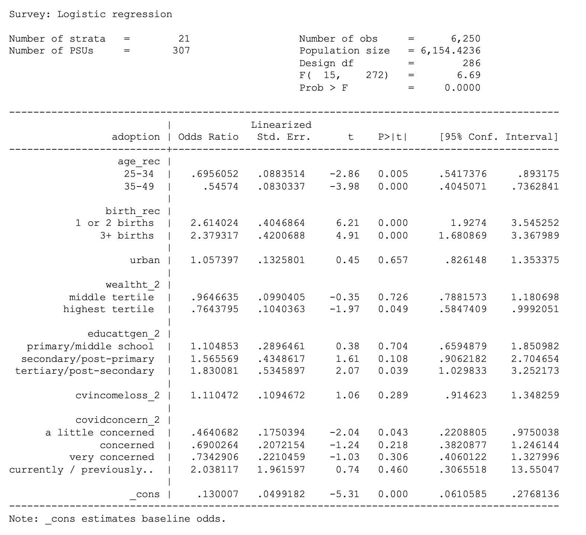
```

```
. svy: logit discontinue i.age_rec i.birth_rec urban i.wealtht_2 i.educattgen_2 
cvincomeloss_2 i.covidconcern_2 if country == 1 
```

```{r, echo = FALSE, fig.align='center'}
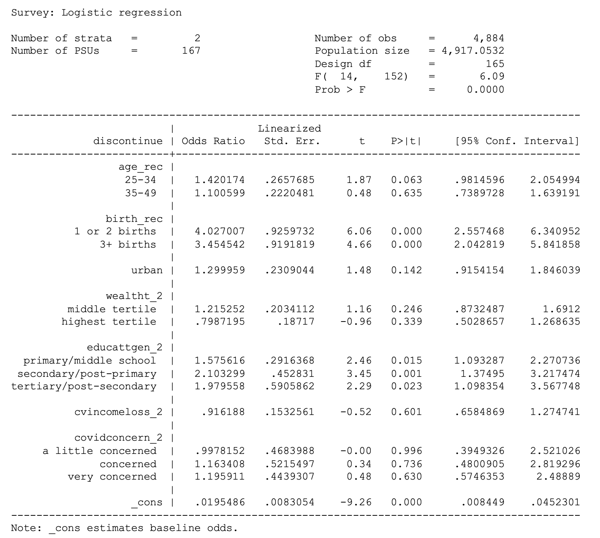
```

```
. svy: logit discontinue i.age_rec i.birth_rec urban i.wealtht_2 i.educattgen_2 
cvincomeloss_2 i.covidconcern_2 if country == 7 
```

```{r, echo = FALSE, fig.align='center'}
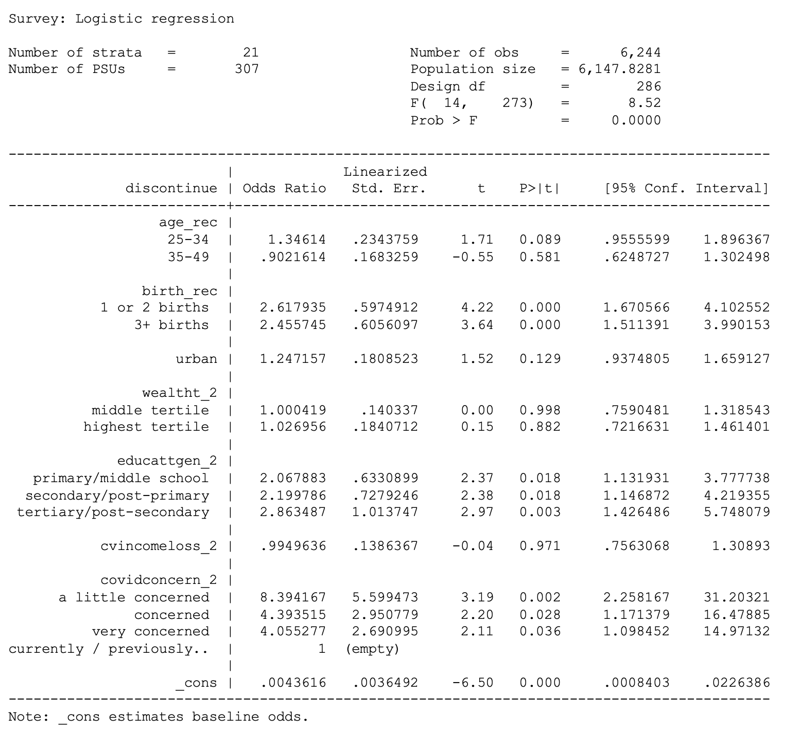
```
