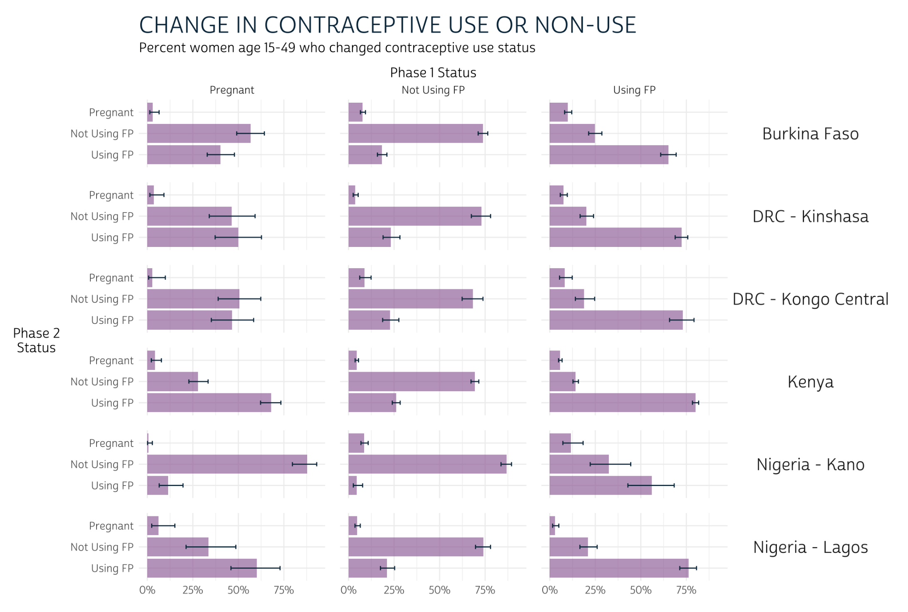

```{r setup, echo=FALSE}
# knitr options 
knitr::opts_chunk$set(
  echo = TRUE, 
  eval = TRUE,
  fig.width = 12,
  fig.height = 8,
  R.options = list(width = 80),
  layout = "l-body"
)

# load utils 
source(here::here("r/utilities.r"))
set_postpath("2022-07-15-facet-maps")
```

Because the [IPUMS PMA data website](https://pma.ipums.org/pma/) allows users to combine samples from multiple countries and multiple years together in a single download, tools like [facet_wrap](https://ggplot2.tidyverse.org/reference/facet_wrap.html) and [facet_grid](https://ggplot2.tidyverse.org/reference/facet_grid.html) are an indispensable part of our data visualization toolkit. As we've shown elsewhere on this blog, **facets** are a simple way to create plots for multiple samples displayed as an array of panels.  

For instance, in [this recent post](../2022-04-15-phase2-indicators/), we used faceted bar charts to show change in contraceptive use status for women in six samples arranged over 18 panels. 

```{r, echo=FALSE}

```

In this post, we'll practice building [choropleth maps](https://r-graph-gallery.com/327-chloropleth-map-from-geojson-with-ggplot2.html) showing modern contraceptive prevalence^[Surveyed methods may vary by country and within the same country following a survey redesign period between rounds. Modern methods could include: female sterilization, male sterilization, implants, IUDs, injectables, pills, emergency contraception, male condoms, female condoms, diaphragms, foam, beads, N tablet, and lactational amenorrhea method (LAM).] for major (admin 1) regions in several PMA samples. As with the bar charts shown above, we'll use **facets** to arrange data for each sample together in an array of panels; however, we'll see that [facet_wrap](https://ggplot2.tidyverse.org/reference/facet_wrap.html) and [facet_grid](https://ggplot2.tidyverse.org/reference/facet_grid.html) may not always be the best option for maps. Instead, we'll introduce a new package, [cowplot](https://wilkelab.org/cowplot/), designed to bring additional flexibility to the alignment and arrangement of panels built with [ggplot2](https://ggplot2.tidyverse.org). 

We've created a summary table `modern_tbl` for this post with variables from the [current or recent family planning use](https://pma.ipums.org/pma-action/variables/group?id=fem_fpuc) variable group, where the column `PCT` gives the estimated modern method prevalence within the population of women aged 15-49 in each region `GEO` in each sample year `YEAR` for each of three countries - Burkina Faso, Ethiopia, and Uganda - listed in `COUNTRY` We've also attached GPS coordinate vectors representing the boundary of each region in the `geometry` column - these come from a shapefile downloaded from [this page](https://pma.ipums.org/pma/gis_boundary_files.shtml) on the IPUMS PMA data website. (If you're interested, check out our data preparation steps by clicking the button below). 

```{r, code_folding="Show data preparation steps", eval = FALSE}
library(tidyverse)
library(ipumsr)
library(srvyr)
library(sf)
library(ggspatial)

# Load IPUMS PMA data extract into R
# This sample includes data from 3 countries, all available cross-sections
dat <- read_ipums_micro(
  ddi = "data/pma_00143.xml",
  data = "data/pma_00143.dat.gz"
)

# `COUNTRY` as a factor (for readability)
dat <- dat %>% mutate(COUNTRY = as_factor(COUNTRY))

# Create unique `YEAR` labels where multiple rounds of data were drawn
dat <- dat %>%
  mutate(
    YEAR = case_when(
      COUNTRY == "Ethiopia" & ROUND == 1 ~ "2014a",
      COUNTRY == "Ethiopia" & ROUND == 2 ~ "2014b",
      COUNTRY == "Uganda" & ROUND == 2 ~ "2015a",
      COUNTRY == "Uganda" & ROUND == 3 ~ "2015b",
      COUNTRY == "Burkina Faso" & ROUND == 3 ~ "2016a",
      COUNTRY == "Burkina Faso" & ROUND == 4 ~ "2016b",
      TRUE ~ as.character(YEAR)
    )
  )

# Uganda has 15 regions in one sample, but just 10 in others 
# Harmonize regions so that all samples have the same 
dat <- dat %>% 
  mutate(
    GEOUG = GEOUG %>% 
      lbl_relabel(
        lbl(5, "Kampala") ~ .val == 0,
        lbl(1, "Central 1") ~ .val == 1,
        lbl(2, "Central 2") ~ .val == 2,
        lbl(3, "East Central, Eastern") ~ .val %in% 3:6,
        lbl(6, "Karamoja") ~ .val == 7,
        lbl(7, "North") ~ .val %in% 8:9,
        lbl(8, "South West") ~ .val %in% 13:14,
        lbl(9, "West Nile") ~ .val == 10,
        lbl(10, "Western") ~ .val %in% 11:12
      ) %>% 
      as_factor() %>% 
      if_else(is.na(.), as_factor(GEOUGSH), .)
  )

# Now, rename any regions that do not match the labels in our shapefile 
# Harmonize region vars for all countries together in a single var, `GEO`
dat <- dat %>% 
  mutate(
    across(starts_with("GEO"), ~as_factor(.x) %>% as.character),
    GEOBF = GEOBF %>% recode("Plateau-Central" = "Plateau Central"),
    GEOET = GEOET %>% recode("Oromiya" = "Oromia"),
    GEOUG = GEOUG %>% recode("South West" = "Southwest"),
    GEO = case_when(
      !is.na(GEOUG) ~ GEOUG,
      !is.na(GEOET) ~ GEOET,
      !is.na(GEOBF) ~ GEOBF
    )
  )

# A `modern_user` is anyone using a method other than rhythm, withdrawal, or
# other traditional 
dat <- dat %>% 
  mutate(
    modern_user = if_any(
      starts_with("FPNOW") & -c(FPNOWUSRHY, FPNOWUSWD, FPNOWUSTRAD),
      ~.x %in% 1 # note: `%in%` generates FALSE if NA 
    )
  )

# Estimate the population proportion for modern use / non-use in each `GEO`
modern_tbl <- dat %>% 
  as_survey_design(weight = FQWEIGHT, id = EAID, strata = COUNTRY) %>%
  group_by(YEAR, COUNTRY, GEO, modern_user) %>%
  summarise(pct = 100*survey_mean(vartype = NULL)) %>% 
  ungroup()

# We use `pivot_wider` to create 0% values if no modern users were found
modern_tbl <- modern_tbl %>% 
  pivot_wider(
    c(YEAR, COUNTRY, GEO), 
    names_from = modern_user, 
    values_from = pct,
    values_fill = 0
  ) %>% 
  select(-`FALSE`) %>% 
  rename(PCT = `TRUE`)

# Load shapefile and harmonize variable names with `dat`
# Include only our 4 countries of interest
shape <- st_read("../../data_local/shapefiles/subnational") %>% 
  st_transform(crs = 4326) %>% 
  select(COUNTRY = CNTRY_NAME, GEO = ADMIN_NAME) %>% 
  filter(COUNTRY %in% c("Burkina Faso", "Ethiopia", "Uganda"))

# Ensure that all shapes are fully enclosed, and smooth borders to 1000 meters 
# Drop any regions marked "Waterbodies" (no households are there)
shape <- shape %>% 
  st_make_valid() %>% 
  st_simplify(dTolerance = 1000) %>% 
  filter(GEO != "Waterbodies")

# Attach shapes for each `GEO`
modern_tbl <- modern_tbl %>% full_join(shape) 

# If no data collected in a region, duplicate `NA` for each `YEAR`
# This requires `pivot_wider` to create placeholder `NA` values
# Then, `pivot_longer` again: new rows appear for each `YEAR`
modern_tbl <- modern_tbl %>% 
  pivot_wider(
    names_from = YEAR,
    values_from = PCT
  ) %>% 
  select(-`NA`) %>% 
  pivot_longer(
    where(is.double),
    names_to = "YEAR",
    values_to = "PCT"
  ) 

# Note that some countries may have 2 samples drawn in the same year, but others 
# included only 1 sample. Drop any extra `YEAR` labels for each `COUNTRY` here
modern_tbl <- modern_tbl %>% 
  group_by(COUNTRY, YEAR) %>% 
  filter(!all(is.na(PCT))) %>% 
  ungroup()

# Rearrange columns and rows for improved display 
modern_tbl <- modern_tbl %>% 
  relocate(c(YEAR, PCT), .after = GEO) %>% 
  arrange(COUNTRY, YEAR, GEO)
```

```{r, echo=FALSE}
library(tidyverse)
library(ipumsr)
library(srvyr)
library(sf)
library(ggspatial)

# modern_tbl %>% write_rds("data/modern_tbl.rds")
modern_tbl <- read_rds("data/modern_tbl.rds")
```

```{r}
modern_tbl
```

# Facets: one country over time 

Let's look at an example featuring data from just *one* country first. We'll use our favorite mapping package [ggspatial](https://paleolimbot.github.io/ggspatial/), since it allows us to use familiar tools from [ggplot2](https://ggplot2.tidyverse.org) to customize the layout of our panel array. Most crucially, we use [facet_wrap](https://ggplot2.tidyverse.org/reference/facet_wrap.html) to create one panel for each sample `YEAR`. Additionally, we'll define the `fill` color for each region with [scale_fill_gradient](https://ggplot2.tidyverse.org/reference/scale_gradient.html): we'll use a red color [#BD262D](https://www.google.com/search?q=%23BD262D&oq=%23BD262D&aqs=chrome..69i57.429j0j4&sourceid=chrome&ie=UTF-8) for high-levels on modern method prevalence, and we'll use `transparent` for regions where no modern method users were sampled. The grey shade [#CFCFCF](https://www.google.com/search?q=%23cfcfcf&oq=%23CFCFCF&aqs=chrome.0.0i512l3j0i7i10i30j0i7i30j0i7i15i30l5.2249j0j9&sourceid=chrome&ie=UTF-8) will represent regions were no women were sampled. 

Finally, we'll customize the look of our plot with a theme we'll call `theme_pma`. We encourage you to experiment with your own theme, but feel free to use ours as a template if you're interested.

```{r,  code_folding="How to build theme_pma"}
# Define `theme_pma` for maps
library(showtext)
sysfonts::font_add(
  family = "cabrito", 
  regular = "../../fonts/cabritosansnormregular-webfont.ttf"
)
showtext::showtext_auto()

theme_pma <- theme_void() %+replace% 
  theme(
    text = element_text(family = "cabrito", size = 13),
    plot.title = element_text(
      size = 22, 
      color = "#00263A", 
      hjust = .5, 
      margin = margin(b = 10)
    ),
    plot.caption = element_text(
      size = 22, 
      color = "#00263A", 
      hjust = .5, 
      margin = margin(t = 10)
    ),
    panel.spacing = unit(1, "lines"),
    legend.position = "right"
  )
```

```{r}
ggplot() + 
  layer_spatial(modern_tbl %>% filter(COUNTRY == "Ethiopia"), aes(fill = PCT)) + 
  facet_wrap(vars(YEAR), strip.position = "bottom", ) + 
  scale_fill_gradient(
    low = "transparent",
    high = "#BD262D",
    na.value = "#CFCFCF"
  ) + 
  labs(
    title = "Modern Contraceptive Prevalence in Ethiopia: 2014-2019",
    fill = "Percent Women \nAge 15-49"
  ) + 
  theme_pma 
```

Our use of [facet_wrap](https://ggplot2.tidyverse.org/reference/facet_wrap.html) works well in this case because the spatial extent of each panel is identical: we've only plotted the same country seven times. Watch what happens, though, when we try the same approach to faceting maps with *different* spatial extents. Here, we'll create one choloropleth for each of three countries sampled by PMA in 2019. 

```{r}
ggplot() + 
  layer_spatial(modern_tbl %>% filter(YEAR == "2019"), aes(fill = PCT)) + 
  facet_wrap(vars(COUNTRY), strip.position = "bottom", ) + 
  scale_fill_gradient(
    low = "transparent",
    high = "#BD262D",
    na.value = "#CFCFCF"
  ) + 
  labs(
    title = "Modern Contraceptive Prevalence: 2019",
    fill = "Percent Women \nAge 15-49"
  ) + 
  theme_pma 
```

The problem here is that [facet_wrap](https://ggplot2.tidyverse.org/reference/facet_wrap.html) attempts to use the same scales along the x and y-axes by default. When we facet by `COUNTRY`, each map is drawn to scale and in absolute position. Instead, we want each country's map to appear approximately the same size and in the center of each panel. 

In most [ggplot2](https://ggplot2.tidyverse.org) applications, we'd resolve this problem by setting `scales = "free"`. This *should* allow [facet_wrap](https://ggplot2.tidyverse.org/reference/facet_wrap.html) to identify axes that fit the data in each panel. Instead, it generates the following error: 

```{r, eval = FALSE}
ggplot() + 
  layer_spatial(modern_tbl %>% filter(YEAR == "2019"), aes(fill = PCT)) + 
  facet_wrap(vars(COUNTRY), strip.position = "bottom", scales = "free") + 
  scale_fill_gradient(
    low = "transparent",
    high = "#BD262D",
    na.value = "#CFCFCF"
  ) + 
  labs(
    title = "Modern Contraceptive Prevalence: 2019",
    fill = "Percent Women \nAge 15-49"
  ) + 
  theme_pma 
```
```
Error in `f()`:
! coord_sf doesn't support free scales
```

Fortunately, we were able to find [this excellent blog post](https://jayrobwilliams.com/posts/2021/05/geom-sf-facet) with an explanation and work-around. 

> It turns out the the `ggplot2` codebase [assumes that it can maniulate axes independently of one another](https://github.com/tidyverse/ggplot2/issues/2651#issuecomment-391011703). This is very much not the case with geographic data where a meter vertically needs to equal a meter horizontally, so `coord_sf()` locks the axes in much the same manner as `coord_fixed()`.
>
> `r tufte::quote_footer('--- [Rob Williams,
Data Scientist](https://jayrobwilliams.com)')`

<div>
Williams suggests a different approach using the [cowplot](https://wilkelab.org/cowplot/index.html) package developed by biologist [Claus O. Wilke](https://wilkelab.org/) at the University of Texas at Austin. We've never featured `cowplot` before on our blog, so we first needed to install it from CRAN:

```{r, eval=FALSE}
install.packages("cowplot")
```
```{r}
library(cowplot)
```


The key difference in this approach is that you create each panel separately, and then use [cowplot](https://wilkelab.org/cowplot/index.html) to align them. Panels can be arranged in rows or columns, and their sizes can be identical or individually specified. You can also overlay plots on top of each other to produce annotations or even watermarks. A general introduction is available [here](https://wilkelab.org/cowplot/articles/introduction.html#generic-plot-annotations-1). 
</div>
<aside>
```{r, echo=FALSE}
hex("cowplot")
```
<br>
The [cowplot](https://wilkelab.org/cowplot/index.html) package is featured extensively in the book [Fundamentals of Data Visualization](https://www.amazon.com/gp/product/1492031089).
</aside>

# Cowplot: combining countries 

```{r, echo = FALSE}
knitr::opts_chunk$set(layout = "l-body")
```


The function [cowplot::plot_grid](https://wilkelab.org/cowplot/reference/plot_grid.html) takes a list of plots as input, so we first need to write a function that will generate one plot for each of our four 2019 samples. We'll start with Ethiopia first: 

```{r}
ggplot() + 
  layer_spatial(
    modern_tbl %>% filter(COUNTRY == "Ethiopia" & YEAR == 2019),
    aes(fill = PCT)
  ) + 
  scale_fill_gradient(
    low = "transparent",
    high = "#BD262D",
    na.value = "#CFCFCF",
    guide = guide_colorbar(
      title.position = "left", 
      direction = "horizontal", 
      barwidth = unit(5, "cm")
    )
  ) + 
  labs(
    caption = "Ethiopia",
    fill = "Percent Women \nAge 15-49"
  ) + 
  theme_pma 
```

If we want to switch countries to Burkina Faso, for example, we only need to replace the string `"Ethiopia"` in two places. 

```{r}
ggplot() + 
  layer_spatial(
    modern_tbl %>% filter(COUNTRY == "Burkina Faso" & YEAR == 2019),
    aes(fill = PCT)
  ) + 
  scale_fill_gradient(
    low = "transparent",
    high = "#BD262D",
    na.value = "#CFCFCF",
    guide = guide_colorbar(
      title.position = "left", 
      direction = "horizontal", 
      barwidth = unit(5, "cm")
    )
  ) + 
  labs(
    caption = "Burkina Faso",
    fill = "Percent Women \nAge 15-49"
  ) + 
  theme_pma
```

Notice that the range of values shown on our legend changes automatically when we switch countries? When we combine countries into a single plot, we'll want to specify these values manually so that the same `fill` color represents the same value on every plot. We'll use 0% as a minimum value, but the maximum value should be only slightly higher than the maximum value in our data: this maximizes the dynamic color range between any two data points. 

```{r}
modern_tbl %>% filter(YEAR == 2019) %>% summarise(max(PCT, na.rm = TRUE))
```

We'll now set `limits` at 0% and 37% in [scale_fill_gradient](https://ggplot2.tidyverse.org/reference/scale_gradient.html). (As expected, this decreases the dynamic color range between each region.)

```{r}
ggplot() + 
  layer_spatial(
    modern_tbl %>% filter(COUNTRY == "Burkina Faso" & YEAR == 2019),
    aes(fill = PCT)
  ) + 
  scale_fill_gradient(
    low = "transparent",
    high = "#BD262D",
    na.value = "#CFCFCF",
    guide = guide_colorbar(
      title.position = "left", 
      direction = "horizontal", 
      barwidth = unit(5, "cm")
    ),
    limits = c(0, 37)  # Legend limits inserted here 
  ) + 
  labs(
    caption = "Burkina Faso",
    fill = "Percent Women \nAge 15-49"
  ) + 
  theme_pma 
```

Finally, we'll use the [map](https://purrr.tidyverse.org/reference/map.html) function from the [purrr](https://purrr.tidyverse.org/index.html) package to build a list containing one map for each country. Remember: here `map` refers to a function applied iteratively to each item in a list - not the kind of spatial map we're trying to add to our plot! The easiest way to reference a list item within a mapped function is to use the symbol `~`, which signals an [anonymous funciton](http://adv-r.had.co.nz/Functional-programming.html#anonymous-functions) where the list item is represented by the variable `.x`. Here, we use `.x` in place of each country name in our data. 

<aside>
```{r, echo=FALSE}
hex("purrr")
```
</aside>

```{r}
plotlist <- unique(modern_tbl$COUNTRY) %>% 
  map(~{
    ggplot() + 
      layer_spatial(
        modern_tbl %>% filter(COUNTRY == .x & YEAR == 2019),
        aes(fill = PCT)
      ) + 
      scale_fill_gradient(
        low = "transparent",
        high = "#BD262D",
        na.value = "#CFCFCF",
        guide = guide_colorbar(
          title.position = "left", 
          direction = "horizontal", 
          barwidth = unit(10, "cm")
        ),
        limits = c(0, 37)
      ) + 
      labs(
        caption = .x,
        fill = "Percent Women \nAge 15-49"
      ) + 
      theme_pma 
  })
```

Now, `plotlist` is a list with four items: one plot per country. The function `unique(modern_tbl$COUNTRY)` listed our countries alphabetically:

```{r}
plotlist[[1]]
plotlist[[2]]
plotlist[[3]]
```

Before we assemble these plots in an array, we'll want to extract *one* copy of the shared legend. Here, we use [get_legend](https://wilkelab.org/cowplot/reference/get_legend.html) to extract the legend from Burkina Faso:

```{r}
legend <- get_legend(plotlist[[1]])
```

We can now strip all of the legends from each of the individual panels with another [map](https://purrr.tidyverse.org/reference/map.html) function. 

```{r}
plotlist <- plotlist %>% map(~.x + theme(legend.position = "none"))
```

We'll also build a title with [ggdraw](https://wilkelab.org/cowplot/reference/ggdraw.html) that will span all three panels. Make sure to check out the complete list of [cowplot functions](https://wilkelab.org/cowplot/reference/index.html) available to help customize your plot. 

```{r, fig.height=2}
title <- ggdraw() + 
  draw_label(
    toupper("Modern Contraceptive Prevalence: 2019"),
    fontfamily = 'cabrito',
    x = 0.5, 
    y = 0.5,
    hjust = 0.5,
    color = "#00263A",
    size = 30
  )

title
```

We'll build our final plot in two steps, both using [plot_grid](https://wilkelab.org/cowplot/reference/plot_grid.html). The first arranges our three panels in a single row with three columns. It took some trial and error to get the set the relative width of each panel with `rel_widths` (for example, the Uganda plot is about 72% narrower than the Burkina Faso plot: if both were plotted with the same width, the Uganda plot would be taller). 

```{r, fig.height=4.5}
output <- plot_grid(plotlist = plotlist, nrow = 1, rel_widths = c(1, 0.95, 0.72))

output
```

The second step arranges this `output` between our `title` and `legend`, creating three rows total. Here, we use `rel_heights` to make the `output` row three times taller than the rows containing `title` and `legend`.

```{r, preview = TRUE, fig.height=7}
plot_grid(
  title,
  output,
  legend,
  ncol = 1, 
  rel_heights = c(1, 3, 1)
)
```

And there you have it! With [cowplot](https://wilkelab.org/cowplot/index.html), it's easy to build an array of maps - or any combination of plots - with a shared title, legend, or any other annotation you might need. And, because it's built to work with [ggplot2](https://ggplot2.tidyverse.org/index.html), [cowplot](https://wilkelab.org/cowplot/index.html) works perfectly with our existing data visualization workflow.