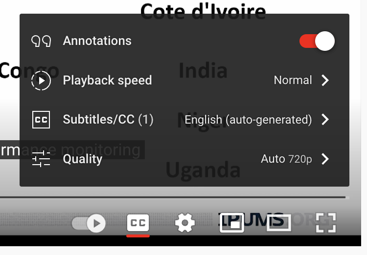
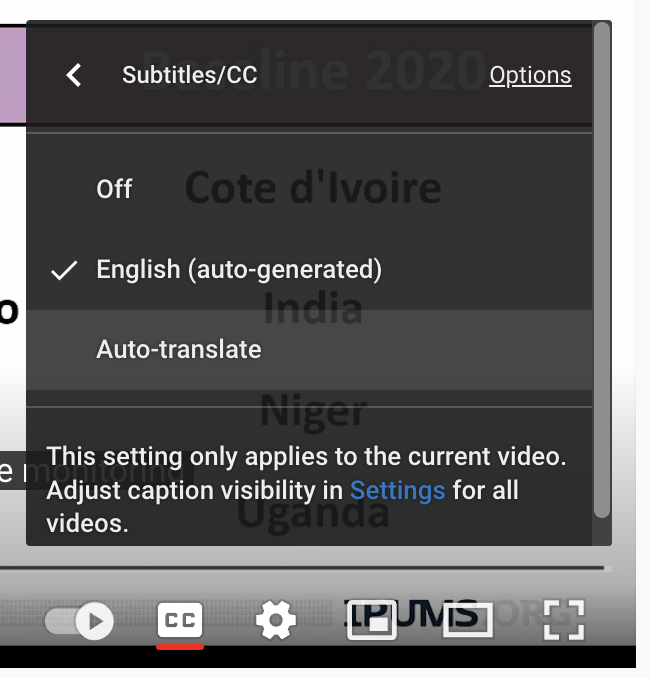
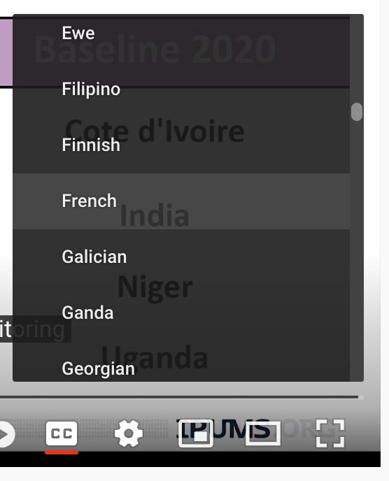
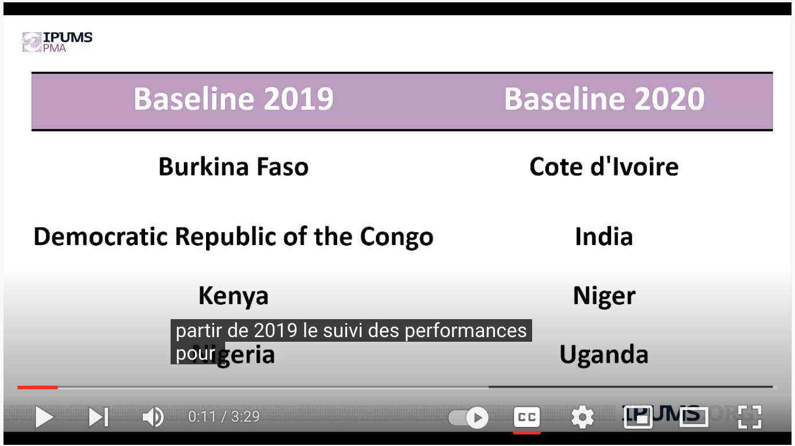

```{r setup, echo=FALSE}
# knitr options 
knitr::opts_chunk$set(
  echo = FALSE, 
  eval = TRUE,
  fig.width = 12,
  fig.height = 8,
  R.options = list(width = 100),
  layout = "l-body"
)

# load utils 
source(here::here("r/utilities.r"))
set_postpath("2022-08-01-youtube-transcripts")
```

IPUMS and IPUMS PMA offer several [Youtube video tutorials](https://www.youtube.com/user/MPCIPUMS) covering topics like: 

  * [How to create an account to use IPUMS PMA](https://www.youtube.com/watch?v=FfE5913B4t8)
  * [IPUMS PMA Units of Analysis](https://www.youtube.com/watch?v=VnS8S9h6pSA)
  * [How to create an extract using IPUMS PMA](https://www.youtube.com/watch?v=7180op6qw64)
  * [IPUMS PMA Case Selection Feature](https://www.youtube.com/watch?v=VeGmVJBI-YQ)
  * [How IPUMS PMA population expansion weights were created](https://www.youtube.com/watch?v=GnCq26t4zgM)
  * [Introduction to PMA Longitudinal Data](https://youtu.be/VwjYHDvpHk0)
  * [Using Female and Service Delivery Point Data Together](https://youtu.be/GHDsvN4ygB4)
  
<aside>
Links to all of our video tutorials and recorded webinars can be found [on this page](https://pma.ipums.org/pma/tutorials.shtml).
</aside>

These videos have been recorded in English but, [as of spring 2022](https://www.engadget.com/youtube-auto-captions-mobile-transcript-ios-android-173448101.html), Youtube now provides automatically generated captions in multiple languages. You'll find captions available for all videos posted on the [IPUMS Youtube channel](https://www.youtube.com/user/MPCIPUMS). Neither the transcription nor the translation are perfect, but because these services are [powered by artificial intelligence from Google](https://chromeunboxed.com/youtube-ai-features-googleio), we expect their quality to improve over time. 

# Enable Captions

To turn on captions in your preferred language, click the cog icon next to the `CC` button in the bottom-right corner of the video toolbar. 

```{r, fig.align='center'}

```

You can choose between "English (auto-generated)" or "Auto-translate".

```{r, fig.align='center'}

```

There are several language options available. We'll choose French.

```{r, fig.align='center'}

```

French captions will appear on the bottom of your video right away. 

```{r, fig.align='center'}

```

```{r}
knitr::opts_chunk$set(echo = TRUE)
```

# Transcripts 

Captions are great, but sometimes it's useful to have a full transcript that you can read at your own pace. Fortunately, it's possible to download a full-text version of these captions with help from the [YouTube Transcript API](https://github.com/jdepoix/youtube-transcript-api) for Python. And, thanks to the [reticulate](https://rstudio.github.io/reticulate/index.html) package for R, those of us with little or no Python knowledge can use this tool, too! 

## Building a Python Environment

<div>
To get started, you'll need to install [reticulate](https://rstudio.github.io/reticulate/index.html) if you've never done so before: 

```{r, eval=FALSE}
install.packages("reticulate")
```

Then, we'll load it together with [tidyverse](https://tidyverse.tidyverse.org/) tools we'll need for processing the downloaded text. 

```{r}
library(tidyverse)
library(reticulate)
```
</div>

<aside>
```{r, echo = FALSE}
hex("reticulate")
```
</aside>

The [YouTube Transcript API](https://github.com/jdepoix/youtube-transcript-api) is a Python package, which is analogous to an R package you'd normally download from CRAN. With R, your downloaded packages get saved to a library on your computer. For example, here's the location of my own R library on my Mac:

```{r}
.libPaths()
```

Python packages will also be downloaded onto your computer, but it's not unusual for Python users to have multiple libraries setup for individual projects. Moreover, it's common to have different versions of Python associated with different projects. This ensures that your old Python projects won't break when you upgrade to new tools. 

<aside>
If the idea of project-specific environments sounds appealing, check out the [renv](https://rstudio.github.io/renv/index.html) package for R.
</aside>

[Conda](https://conda.io/en/latest/) is a tool used to build and maintain Python environments. With [reticulate](https://rstudio.github.io/reticulate/index.html), you can quickly create a Conda environment with [conda_create](https://rstudio.github.io/reticulate/reference/conda-tools.html). Let's call our environment `pma_env`:

<div>
```{r, eval=FALSE}
conda_create("./pma_env")
```

This creates a new folder called `pma_env` in R's working directory, and it installs several packages (including the most recent version of Python and [pip](https://pypi.org/project/pip/), a Python package installer) in that location. 

Next, we'll tell [reticulate](https://rstudio.github.io/reticulate/index.html) to use this environment for the duration of our R session. 

```{r}
use_condaenv("./pma_env")
```
</div>

<aside>
[conda_create](https://rstudio.github.io/reticulate/reference/conda-tools.html) creates an environment by name *or* by path. We use `./` to identify the path to R's working directory. If you provide only a name, the new environment will appear in a default location elsewhere on your computer. 
</aside>

<div>
And finally, we'll install the [YouTube Transcript API](https://github.com/jdepoix/youtube-transcript-api) (via [pip](https://pypi.org/project/pip/)) in our environment. 

```{r, eval=FALSE}
py_install(packages = "youtube_transcript_api", pip = TRUE)
```

</div>

<aside>
Just like R packages, Python packages only need to be installed in your environment once! No need to run this in your next session.
</aside>

## Using the API  

Before we can use the package, we'll need to [import](https://rstudio.github.io/reticulate/reference/import.html) it into R. 

```{r}
import("youtube_transcript_api")
```

As an R user, you might expect this to work like the [library](https://www.rdocumentation.org/packages/base/versions/3.6.2/topics/library) function we use to [attach R packages](https://adv-r.hadley.nz/environments.html#search-path). Instead, R returns an object wrapping a `Module` named `youtube_transcript_api`; if we look in the R search path, we won't find anything related to the API. What's going on here? 

```{r, R.options = list(width = 70)}
search()
```

<aside>
The [search](https://rdrr.io/r/base/search.html) function shows all of our currently attached R packages. Many of these are loaded with [tidyverse](https://tidyverse.tidyverse.org/), and others are tools we use behind the scenes on this blog. 
</aside>

Unlike R packages, Python packages are not attached with [import](https://rstudio.github.io/reticulate/reference/import.html). Instead, you'll need to attach them to the [Global Environment](https://adv-r.hadley.nz/environments.html#environments). We'll call this module `api`:

```{r}
api <- import("youtube_transcript_api")
```

An imported Python module works like [named list](https://www.rdocumentation.org/packages/base/versions/3.6.2/topics/list). Each item in the list is a **method** - a function associated with a particular object. 

```{r}
names(api)
```

Here, we'll only need the last method `YouTubeTranscriptApi`, so we'll drop the others from `api`. 

```{r}
api <- api$YouTubeTranscriptApi
```

This method contains three sub-methods:

```{r}
names(api)
```

To determine what each method does, you'll need to [visit the documentation page](https://github.com/jdepoix/youtube-transcript-api). We'll focus here on `list_transcripts`, which retrieves a full list of all available transcripts for a certain YouTube video. The `video_id` is a character string in the URL for your video immediately after `https://www.youtube.com/watch?v=`. 

```{r}
transcript_list <- api$list_transcripts(video_id = "VwjYHDvpHk0")
```

In fact, `transcript_list` returns a second layer of sub-methods:

```{r}
names(transcript_list)
```

Among these, we'll use `find_transcript` to locate a transcript associated with the *original* language spoken in the video, which is English. (We found this a bit tricky: you must provide the two-letter language code *as a list*.)

```{r, error=TRUE}
transcript <- transcript_list$find_transcript(language_codes = list("en"))
names(transcript)
```

Use the `fetch` method to get the English transcript:

```{r}
english <- transcript$fetch()
```

Use the `translate` method to get automatically translated transcripts in a language of your choice. We'll request a French version like so: 

```{r}
french <- transcript$translate("fr")
french <- french$fetch()
```

## Summary 

If you were keeping track, you might have noticed that we had to sort through 5 nested levels of methods to find the function we needed to get an English transcript (and 6 levels for the French transcript).

If you know what you're looking for, you can chain multiple methods together with the `$` operator. This way, you can import the API and download both transcripts with just four lines of code: 

```{r}
api <- import("youtube_transcript_api")
transcript <- api$YouTubeTranscriptApi$list_transcripts("VwjYHDvpHk0")$find_transcript(list("en"))
english <- transcript$fetch()
french <- transcript$translate("fr")$fetch()
```

## Explore and Export 

Now that we've got one `english` and one `french` transcript, we'll use [tidyverse](https://tidyverse.tidyverse.org) tools to export them in a reader-friendly format. 

The API imports each transcript as a **list**, where each list item contains one line of `text`, a timestamp for the `start` of that line, and a code marking its `duration`. For example, the very first line in the `english` transcript starts 0.64 seconds into the video:

```{r}
english[[1]]
```

Here is the same line from the `french` transcript: 

```{r}
french[[1]]
```

Because of linguistic differences in grammar or syntax, the two transcripts contain a different total number of lines. 

```{r}
length(english)
length(french)
```

Even so, it's easy align both transcripts together in a table. First, we'll use [map_dfr](https://purrr.tidyverse.org/reference/map.html) to iteratively transform each `english` list-item into a [tibble](https://tibble.tidyverse.org/reference/as_tibble.html) - the `dfr` suffix places the output in a data frame (`df`) rowwise (`r`).

```{r}
english <- map_dfr(english, as_tibble)

english
```

Next, we'll do the same thing with our `french` transcript: 

```{r}
french <- map_dfr(french, as_tibble)

french
```

If you want to merge the two table together, use [full_join](https://dplyr.tidyverse.org/reference/mutate-joins.html) to ensure that all rows from both tables are kept. Just be sure to change the column `text` so that it describes the language of the source table (and relocate columns as you see fit): 

```{r}
output <- full_join(
  english %>% rename(english = text),
  french %>% rename(french = text),
  by = c("start", "duration")
)

output <- output %>% relocate(french, .after = english)

output
```

From here, you can use familiar R tools to apply changes to every line in one or both transcripts. Notice, for example, that the transcript tends to hear "iphone's pma" instead of "IPUMS PMA" (see line 2). You could use [str_replace](https://stringr.tidyverse.org/reference/str_replace.html) from the [stringr](https://stringr.tidyverse.org) package to replace every occurrence of "iphone's" with "IPUMS" (but do so with care - it's easy to make accidental changes!) 

```{r}
output %>% 
  mutate(english = english %>% str_replace("iphone's", "IPUMS"))
```

You'll also notice that there are places where `french` is more concise, so it requires fewer lines. In this case, you'll find `NA` in the `french` column like so:

```{r}
output %>% filter(start > 110)
```

If you intend to paste these lines into a text document later, you might want to use [replace_na](https://tidyr.tidyverse.org/reference/replace_na.html) from [tidyr](https://tidyr.tidyverse.org) to replace those values with an empty string, `""`. 

```{r}
output %>% 
  mutate(french = french %>% replace_na("")) %>% 
  filter(start > 110) 
```

Once you're finished tidying the data in R, you can write the result to a CSV file that can be opened in Excel or other similar programs. 

```{r, eval = FALSE}
output %>% write_csv("output.csv")
```

```{r, echo=FALSE, eval=FALSE}
"https://www.youtube.com/watch?v=VwjYHDvpHk0&ab_channel=IPUMS"
```

