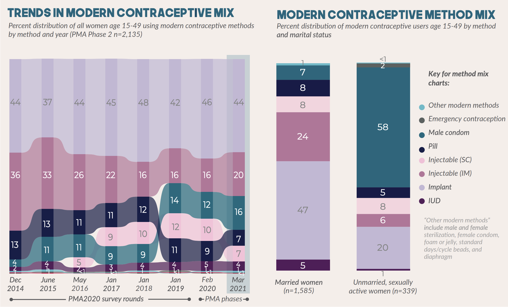

```{r setup, echo=FALSE, results='hide'}
# knitr options 
knitr::opts_chunk$set(
  echo = TRUE, 
  eval = TRUE,
  fig.width = 10,
  fig.height = 10,
  fig.align='center',
  R.options = list(width = 100),
  layout = "l-page"
)

options(tibble.print_min = 20)

# load utils 
source(here::here("r/utilities.r"))
set_postpath("2022-08-15-method-mix-trends")

update_geom_defaults("text", list(family = "cabrito", size = 4))
```

Modern Contraceptive Method Mix is a core indicator in the [FP2030 Measurement Framework](https://fp2030.org/what-we-measure) representing **the distribution of modern method users by method**. Researchers use this distribution to understand which family planning methods are preferred and accessible in a particular place.

> While there is no “right” method mix or “ideal” method, there is general agreement that providing access to a wide variety of methods is both a component of quality of care as well as an important principle of rights-based family planning.
>
> `r tufte::quote_footer('--- [FP2030 Core Indicators](http://2015-2016progress.familyplanning2020.org/page/measurement/modern-contraceptive-method-mix-indicator-9)')`

Modern Method Mix can change year-to-year in response to the introduction of new methods in-country, access restrictions (e.g. stockouts), increased need for specific methods (e.g. those that protect against sexually transmitted infections), and shifting user preferences.^[[USAID - Data for Impact](https://www.data4impactproject.org/prh/family-planning/method-choice/method-mix/)] Cross-sectional PMA surveys are fielded approximately once per year, allowing researchers to monitor these changes at annual intervals. Typically, you'll find "Trends in Modern Contraceptive Mix" updated in the [PMA Survey Results Summary](https://www.pmadata.org/data/survey-results-summaries) published for each new sample.

```{r, echo = FALSE, layout = "l-body"}

```

<aside>
**Source:** 

[Burkina Faso Phase 2](https://www.pmadata.org/sites/default/files/data_product_results/Burkina%20National_Phase%202_XS_Results%20Brief_English_Final_17Sep2021.pdf) 

Cross-sectional Survey Results Summary
</aside>

In this post, we'll show how you can make a graphic similar to this one in R using a single data extract downloaded from [IPUMS PMA](https://pma.ipums.org). We'll be focusing on Modern Method Mix, but we recommend using IPUMS data any time you want to investigate how indicators change over time or how they compare across populations. That's because the IPUMS PMA data extract system is designed both to allow researchers to combine data from multiple samples and to flag important comparability issues between those samples. 

# Setup 

You can compare trends in Modern Method Mix for any number of PMA samples with a single data extract from IPUMS PMA. Here, we'll illustrate using data from two countries, Burkina Faso and Kenya, where cross-sectional data have been collected continuously between 2014 and 2021. 

| Country      | Sample Year | Data Collection Period | 
| ------------ | ----------- | ---------------------- |
| Burkina Faso | 2014        | Nov 2014 - Jan 2015
|              | 2015        | Apr 2015 - June 2015
|              | 2016a       | Mar 2016 - Apr 2016
|              | 2016b       | Nov 2016 - Feb 2017
|              | 2017        | Nov 2017 - Jan 2018
|              | 2018        | Dec 2018 - Jan 2019 
|              | 2020        | Dec 2019 - Feb 2020 
|              | 2021        | Dec 2020 - Mar 2021
| Kenya        | 2014a       | May 2014 - Aug 2014
|              | 2014b       | Nov 2014 - Dec 2014
|              | 2015a       | Jun 2015 - Jul 2015
|              | 2015b       | Nov 2015 - Dec 2015
|              | 2016        | Nov 2016 - Dec 2016
|              | 2017        | Nov 2017 - Dec 2017
|              | 2018        | Nov 2018 - Jan 2019
|              | 2019        | Nov 2019 - Dec 2019 
|              | 2020        | Nov 2020 - Dec 2020

<aside>
This extract includes **cross-sectional** samples for Burkina Faso and Kenya.

For information on **panel data** collected in 2019-2020, see our [longitudinal guide](../../index.html#category:Panel_Data). 
</aside>

Our extract will contain all of these cross-sectional samples, filtered to include [only Female Respondents](https://pma.ipums.org/pma-action/samples). It will also contain the following variables: 

  * `r varlink(SAMPLE)`
  * `r varlink(COUNTRY)`
  * `r varlink(YEAR)`
  * `r varlink(INTFQMON)`
  * `r varlink(INTFQYEAR)`
  * `r varlink(FQWEIGHT)`
  * `r varlink(EAID)`
  * `r varlink(STRATA)`
  * `r varlink(RESIDENT)`
  * `r varlink(LASTDOBCMC)`
  * `r varlink(TIMEMENSTRUATE)`
  * `r varlink(TIMEMENSTRUATEVAL)`
  * `r varlink(MCP)`
  * `r varlink(FPCURRUSE)`
  * `r varlink(FPCURREFFMETH)`
  * `r varlink(FPCURREFFMETHRC)`
  * `r varlink(FPEFFECTIVEYR)`
  * `r varlink(FPCURRINJTYPE)`
  * `r varlink(FP1STMETHOD)`
  * `r varlink(MARSTAT)`
  * `r varlink(AGE)`
  
We'll load the extract and a few key packages into R like so: 

```{r, results='hide'}
# Load packages 
library(ipumsr)
library(tidyverse)
library(srvyr)
library(ggalluvial)

# Load data extract 
dat <- read_ipums_micro(
  ddi = "data/pma_00165.xml",
  data = "data/pma_00165.dat.gz"
)
```

Additionally, we'll modify a few variables to improve readability: 

  * A [Century Month Code (CMC)](../2022-05-15-phase2-calendar/#century-month-codes-cmc) we call `INTFQCMC` will be created for each individual woman's interview date^[IPUMS PMA includes a variable [INTFQCMC](https://pma.ipums.org/pma-action/variables/INTFQCMC), but it is not currently available for all samples.]
  * We'll store the median interview date for each sample in `INTFQMED` 
  * All key categorical variables will be recoded with [as_factor](https://forcats.tidyverse.org/reference/as_factor.html)
  

```{r}
dat <- dat %>% 
  group_by(SAMPLE) %>% 
  mutate(
    INTFQCMC = 12*(INTFQYEAR - 1900) + INTFQMON,
    INTFQMED = median(INTFQCMC), 
    across(
      c(COUNTRY, INTFQMON, TIMEMENSTRUATE, MCP, FPCURRUSE, FPCURREFFMETH,
        FPCURREFFMETHRC, FPEFFECTIVEYR, FPCURRINJTYPE, FP1STMETHOD, MARSTAT),
      as_factor
    )
  ) %>% 
  ungroup()
```

# Most Effective Method 

PMA surveys ask each woman to report *all* family planning methods she or her partner are currently using to delay or avoid getting pregnant. The question looks something like this one, where the respondent is prompted to select all options that apply:

```
Which method or methods are you using?

PROBE: Anything else?

Select all methods mentioned. 
SCROLL TO THE BOTTOM to see all choices.

  [] Female sterilization
  [] Male sterilization
  [] Implant
  [] IUD
  [] Injectables
  [] Pill
  [] Emergency Contraception
  [] Male condom
  [] Female condom
  [] Diaphragm
  [] Foam/Jelly
  [] Standard Days/Cycle beads
  [] LAM
  [] Rhythm method
  [] Withdrawal
  [] Other traditional method
  [] No response
```

<aside>
**Source:** 

[Burkina Faso Phase 2 Questionnaire](https://pma.ipums.org/pma-action/source_documents/enum_form_bf2021a_f_tag.xml#124)

Method list may vary by sample!
</aside>

Because a woman can report more than one method, PMA ranks the effectiveness of each method and uses only her **most effective method** to calculate Modern Method Mix. This ensures that sum of all methods included in Modern Method Mix is 100%. 

Every PMA sample includes a variable [FPCURREFFMETH](https://pma.ipums.org/pma-action/variables/FPCURREFFMETH) that indicates the most effective method reported by the respondent on this question. However, it's important to note that the list of methods may vary between samples. 

Fortunately, IPUMS makes it easy to identify whether each method is available for the researcher's samples of interest. On the `FPCURREFFMETH` [codes tab](https://pma.ipums.org/pma-action/variables/FPCURREFFMETH#codes_section), we see the availability of every method in each sample from Burkina Faso and Kenya.

```{r, echo = FALSE}
knitr::include_graphics("images/codes.png")
```

Certain methods like N-tablet, Washing, or "Other Modern" were included in none of our samples. Others, like Diaphragm and Foam, appear intermittently: these methods may have been listed on the questionnaire, but appear unavailable if no women selected the associated response option (or if they were only selected in combination with a more effective method). 

`FPCURREFFMETH` uses composite coding, where general categories like Injectables (code 120) are used if a particular questionnaire did not distinguish between specific sub-categories like 3-month, monthly, or Sayana Press (codes 121, 122, and 123). In Burkina Faso and Kenya samples, women were not asked to specify injectable type on this question; however, later samples included the following supplementary question (accompanied by a visual aid):

```
Was the injection administered via syringe or small needle?

Show the image to the respondent.

  [] Syringe
  [] Small needle (Sayana Press)
  [] No response
```

Responses to this question are recorded in the variable [FPCURRINJTYPE](https://pma.ipums.org/pma-action/variables/FPCURRINJTYPE). The IPUMS system shows that it was added to Burkina Faso samples beginning in 2016, and that it was added to Kenya samples beginning in 2018:

```{r, echo = FALSE}
knitr::include_graphics("images/inj.png")
```

## Recoding 

When the supplementary question associated with `FPCURRINJTYPE` was added, PMA released a recoded version of **most effective method** that you'll find in [FPCURREFFMETHRC](https://pma.ipums.org/pma-action/variables/FPCURREFFMETHRC#codes_section) (the suffix `RC` indicates "recoded"). This variable makes four adjustments to the original variable `FPCURREFFMETH` (see [description tab](https://pma.ipums.org/pma-action/variables/FPCURREFFMETHRC#description_section)): 

  1. Women who report Sayana Press in `FPCURRINJTYPE` are differentiated from those using 3-month injectables. (Sayana Press users are identified as "Injectable (SC)" in the graphic at the top of this post.) 
  2. Women who report using the lactational amenorrhea method (LAM) in `FPCURREFFMETH` are coded "other traditional" in `FPCURREFFMETHRC` if they fail to meet the criteria for effective use of LAM. Specifically, LAM users must be less than six months post-partum (see [LASTDOBCMC](https://pma.ipums.org/pma-action/variables/LASTDOBCMC)) and amenorrheic / not currently menstruating (see [TIMEMENSTRUATE](https://pma.ipums.org/pma-action/variables/TIMEMENSTRUATE) and [TIMEMENSTRUATEVAL](https://pma.ipums.org/pma-action/variables/TIMEMENSTRUATEVAL)).
  3. Women who did not report current use of a contraceptive method (coded  "NIU (not in universe)" in `FPCURREFFMETH`) are coded "emergency contraception" in `FPCURREFFMETHRC` if they reported using an emergency method at all in the last 12 months (see [FPEFFECTIVEYR](https://pma.ipums.org/pma-action/variables/FPEFFECTIVEYR), or [FPECUSYR](https://pma.ipums.org/pma-action/variables/FPECUSYR) for later samples).
  4. Women who did not report using Female Sterilization as a current method in `FPCURREFFMETH` are coded "female sterilization" if they indicated elsewhere that they had been sterilized (see [FP1STMETHOD](https://pma.ipums.org/pma-action/variables/FP1STMETHOD)). 
    
PMA uses `FPCURREFFMETHRC` in its calculation of Modern Method Mix, but `FPCURREFFMETHRC` was not retroactively added to older samples. We'll demonstrate how to recode `FPCURREFFMETH` manually for samples where `FPCURREFFMETHRC` is not available. 

Notably, we won't be able to identify users of Sayana Press for samples prior to the introduction of `FPCURRINJTYPE` (this explains the apparent growth from 0% in June 2015 to 5% in May 2016 in the Burkina Faso graphic at the top of this post). 

Instead, we'll begin with the adjustment made for LAM users who are not post-partum amenorrheic (PPA). Unfortunately, PMA does not include a variable indicating whether women are PPA, so we'll need to make our own variable called `PPA`. 

```{r}
# `TIMEMENSTRUATE` gives a unit, while `TIMEMENSTRUATEVAL` gives a value
# We use these variables to calculate months since last period: `MENSTR_MOS`
dat <- dat %>% 
  mutate(
    MENSTR_MOS = case_when(
      TIMEMENSTRUATE == "Days" ~ TIMEMENSTRUATEVAL / 30,
      TIMEMENSTRUATE == "Weeks" ~ TIMEMENSTRUATEVAL / 4,
      TIMEMENSTRUATE == "Months" ~ TIMEMENSTRUATEVAL %>% as.double,
      TIMEMENSTRUATE == "Years" ~ TIMEMENSTRUATEVAL * 12
    ) 
  )

# `INTFQCMC` gives the month of the interview, while
# `LASTDOBCMC` gives the month of most recent birth (or 9999 for no prior birth) 
# The difference is the number of months since last birth: `BIRTH_MOS`
dat <- dat %>% 
  mutate(
    BIRTH_MOS = case_when(
      LASTDOBCMC < 9000 ~ INTFQCMC - LASTDOBCMC
    ) 
  )

# `TIMEMENSTRUATE` can also be "Before last birth" 
# If so, or if MENSTR_MOS > BIRTH_MOS, women who gave birth < 6 months are PPA
# All others are not PPA (or NA if most recent period cannot be determined)
dat <- dat %>% 
  mutate(
    PPA = case_when(
      BIRTH_MOS < 6 & TIMEMENSTRUATE == "Before last birth" ~ TRUE,
      BIRTH_MOS < 6 & MENSTR_MOS > BIRTH_MOS ~ TRUE,
      BIRTH_MOS >= 6 | LASTDOBCMC > 9000 ~ FALSE
    )
  ) 
```

We use our `PPA` variable together with `FP1STMETHOD` and `FPEFFECTIVEYR` to manually build `FPCURREFFMETHRC` for early samples where it is not available. Otherwise, we use the version of `FPCURREFFMETHRC` provided by PMA for later samples. 

```{r}
dat <- dat %>% 
  mutate(
    FPCURREFFMETHRC = case_when(
      !is.na(`FPCURREFFMETHRC`) ~ FPCURREFFMETHRC %>% as_factor %>% as.character,
      FP1STMETHOD == "Female sterilization" ~ "Female Sterilization",
      FPCURRUSE != "Yes" & FPEFFECTIVEYR == "Emergency Contraception" ~ "Emergency Contraception",
      FPCURREFFMETH == "Lactational amenorrhea method (LAM)" & !PPA ~ "Other traditional",
      TRUE ~ FPCURREFFMETH %>% as_factor %>% as.character
    )
  )
```

You can review the changes made to `FPCURREFFMETH` in `FPCURREFFMETHRC` like so:

```{r}
dat %>% 
  filter(FPCURREFFMETH != FPCURREFFMETHRC) %>% 
  count(FPCURREFFMETH, FPCURREFFMETHRC)
```

# Modern Method Users 

<div>
When we calculate Modern Method Mix, we'll determine the share of women who use each method as a proportion of women age 15-49 who use any modern method. Every PMA sample includes a variable [MCP](https://pma.ipums.org/pma-action/variables/MCP) indicating whether the woman is currently using a modern method (any method except Rhythm, Withdrawal, or Other Traditional). 

`MCP` also uses the woman's **most effective current method** if she indicates that she is using more than one method. Fortunately, `MCP` uses the same recoding logic shown for `FPCURREFFMETHRC` above: it adjusts for non-PPA use of LAM, Emergency Contraception within the past year, and prior sterilization (see [description tab](https://pma.ipums.org/pma-action/variables/MCP#description_section) for details). Because `MCP` is available for every PMA sample, we need to make no additional changes here. 
</div> 

<aside>
Modern Method Mix is a proportion among women age 15-49 **who use modern methods**. 

Note that this is different from the **prevalence** of individual methods, which would reflect the proportion among *all* women age 15-49. 
</aside>

## Missing values 

`MCP` includes the values "Yes", "No", and "No response or missing". If you compare `MCP` with `FPCURREFFMETH`, you'll see that there are several cases where `MCP` is "missing" even though the woman reported use of a method:

```{r}
dat %>% 
  filter(MCP == "No response or missing") %>% 
  count(MCP, FPCURREFFMETH)
```

How can this be? A strong majority of these cases are women who were not members of the *de facto* population of women who slept in the household during the night before the household screening interview (see `r varlink(RESIDENT)`). As a result, they are not considered part of the analytic sample, and they are assigned a weight of 0 in `r varlink(FQWEIGHT)`: these cases drop out in weighted population inference (or we can drop them ourselves to suppress a warning message). 

```{r}
dat %>% 
  filter(MCP == "No response or missing") %>% 
  count(FQWEIGHT == 0)
```

The remaining 35 cases are women who were missing data on one or more of the variables used in recoding for `MCP`. We'll keep them in our data in order to calculate the correct degrees of freedom for each sample. 

# Modern Method Mix 

Finally, we're ready to use `FPCURREFFMETHRC` and `MCP` to calculate Modern Method Mix. PMA uses a stratified cluster-sample design, so we'll use the variables `r varlink(EAID)` and `r varlink(STRATA)` together with `FQWEIGHT` as survey design information. 

Because our data extract contains multiple samples, we'll need to use [group_by](https://dplyr.tidyverse.org/reference/group_by.html) to iterate through each independent sample (identified by our labeling variables `COUNTRY` and `INTFQMED`). To make this easier, we'll use two *nested* [summarise](https://dplyr.tidyverse.org/reference/summarise.html) functions: 

  1. The outer [summarise](https://dplyr.tidyverse.org/reference/summarise.html) function allows us to specify [survey design information](http://gdfe.co/srvyr/reference/as_survey_design.html) for each independent sample (referenced iteratively as [cur_data](https://dplyr.tidyverse.org/reference/context.html))
  2. The inner [summarise](https://dplyr.tidyverse.org/reference/summarise.html) function estimates the proportion of women for each combination of `MCP` and `FPCURREFFMETHRC` in each population

```{r}
dat %>% 
  filter(FQWEIGHT > 0) %>% 
  group_by(COUNTRY, INTFQMED) %>% 
  summarise(
    .groups = "keep",
    cur_data() %>% 
      as_survey_design(weights = FQWEIGHT, ids = EAID, strata = STRATA) %>% 
      group_by(MCP = as_factor(MCP), FPCURREFFMETHRC) %>% 
      summarise(survey_mean(prop = TRUE, prop_method = "logit", vartype = "ci"))
  ) 
```

Here, `coef` sums to 100% for each level of `MCP`, while the columns `_low` and `_upp` report a 95% confidence interval for each estimate. Because we're only concerned with Modern Method Mix, we can disregard any rows where `MCP != "Yes"`. 

# Data Visualization

To match the PMA graphic shown at the top of this post, we'll make a few minor modifications to our summary table. First, we'll combine a few of the lesser-used modern methods under "Other Modern Method": 

  * Male Sterilization
  * Female Sterilization 
  * Female Condom
  * Foam
  * Standard Days / Cycle Beads
  * Diaphragm 
  * LAM^[Not included in the PMA graphic above]
  
You can use [fct_collapse](https://forcats.tidyverse.org/reference/fct_collapse.html) to combine several factors levels into a new level like "other". Conveniently, you can also use it to relabel levels as shown here for Implant, Injectable (IM), Injectable (SC), and Emergency contraception:
  
```{r}
dat <- dat %>% 
  mutate(
    FPCURREFFMETHRC = FPCURREFFMETHRC %>% 
      fct_collapse(
        "Other modern methods" = c(
          "Male Sterilization", "Female Sterilization", "Female condom",
          "Foam", "Standard Days/Cycle Beads Method", "Diaphragm",
          "Lactational amenorrhea method (LAM)"
        ),
        "Implant" = "Implants",
        "Injectable (IM)" = "Injectables (3 months)",
        "Injectable (SC)" = "Injectables (Sayana Press)",
        "Emergency contraception" = "Emergency Contraception",
      ) 
  ) 
```

We'll now save the revised summary table as a data frame called `mix_tbl`. We'll also remove any of the rows that aren't necessary to calculate Modern Method Mix (where `MCP` is "No" and "No response or missing"). 

```{r}
mix_tbl <- dat %>% 
  filter(FQWEIGHT > 0) %>% 
  group_by(COUNTRY, INTFQMED) %>% 
  summarise(
    .groups = "keep",
    cur_data() %>% 
      as_survey_design(weights = FQWEIGHT, ids = EAID, strata = STRATA) %>% 
      group_by(MCP = as_factor(MCP), FPCURREFFMETHRC) %>% 
      summarise(survey_mean(prop = TRUE, prop_method = "logit", vartype = "ci"))
  ) %>% 
  filter(MCP == "Yes")

mix_tbl
```

With these revisions in place, we're now ready to make our plot. We've showcased the excellent [ggalluvial](https://corybrunson.github.io/ggalluvial) package in [earlier posts](../2022-05-01-phase2-alluvial/index.html), so we won't dig into the details too deeply here. In short: we use [geom_stratum](https://corybrunson.github.io/ggalluvial/reference/geom_stratum.html) to build stacked bars for each sample, and we use [geom_flow](https://corybrunson.github.io/ggalluvial/reference/geom_flow.html) to show change over time. The argument `decreasing = FALSE` ensures that the methods are arranged in order of popularity for each sample. 

A basic alluvial plot can be made like so: 

```{r, fig.height=5}
mix_plot <- mix_tbl %>% 
  ggplot(aes(
    x = INTFQMED, 
    y = coef,
    fill = FPCURREFFMETHRC,
    stratum = FPCURREFFMETHRC,
    alluvium = FPCURREFFMETHRC
  )) + 
  facet_wrap(vars(COUNTRY), ncol = 1) + 
  geom_flow(decreasing = FALSE) + 
  geom_stratum(size = 0, width = 2, decreasing = FALSE)

mix_plot
```

As always, we'll apply our own custom theme and labels to clean-up the final result. If you intend to make multiple plots with the same theme, we recommend saving it as a function; we'll call ours `theme_pma`. 

```{r}
# Fonts 
library(showtext)
sysfonts::font_add(
  family = "cabrito", 
  regular = "../../fonts/cabritosansnormregular-webfont.ttf"
)
showtext_auto()

# Fonts for geom_text
update_geom_defaults("text", list(family = "cabrito", size = 4))

# Theme 
theme_pma <- function(){
  components <- list(
    # Edit `theme_minimal`
    theme_minimal() %+replace% theme(
      text = element_text(family = "cabrito", size = 12),
      plot.title = element_text(size = 26, color = "#00263A",
                                hjust = 0, margin = margin(b = 5)),
      plot.subtitle = element_text(hjust = 0, margin = margin(b = 0), size = 18),
      plot.caption = element_text(hjust = 1, size = 10, margin = margin(t = 15)),
      plot.caption.position = "plot",
      strip.background = element_blank(),
      strip.text.x = element_text(size = 14, hjust = 1),
      strip.text.y = element_text(size = 14, angle = 0),
      panel.spacing = unit(1, "lines"),
      legend.position = "bottom",
      legend.title = element_blank()
    ) ,
    
    # Add breaks by percent to y-axis, dates to x-axis
    scale_y_continuous(labels = scales::label_percent()),
    scale_x_continuous(
      breaks = map(2014:2021, ~c(12*(.x - 1900) + 1, 12*(.x - 1900) + 7)) %>%
        unlist(),
      labels = map(2014:2021, ~c(paste("Jan", .x), paste("Jul", .x))) %>%
        unlist() %>% 
        str_wrap(3)
    ),
    
    # Custom colors copied from the PMA graphic
    scale_fill_manual(values = c(
      "Implant" = "#C3B7D5",
      "Injectable (IM)" = "#B7749A", 
      "Injectable (SC)" = "#F6BFD8", 
      "Pill" = "#171E48", 
      "Male condom" = "#11687E", 
      "IUD" = "#541E59", 
      "Emergency contraception" = "#5B6160", 
      "Other modern methods" = "#5BBBC9"
    )),
    
    # Switch text labels from white to black for Implant & Injectable (SC)
    scale_color_manual(values = c("white", "black")),
    
    # Add text labels for each method (if > 3%)
    stat_stratum(
      geom = "text",
      aes(
        label = if_else(
          coef > 0.03,
          scales::percent(coef, 1, suffix = NULL),
          ""
        ),
        color = FPCURREFFMETHRC %in% c("Implant", "Injectable (SC)")
      ),
      size = 4,
      show.legend = FALSE,
      decreasing = FALSE
    ),
    
    # Customize labels 
    labs(
      x = NULL, y = NULL,
      title = "Trends in Modern Method Mix",
      subtitle = paste(
        "Percent distribution of all women age 15-49 using modern",
        "contraceptive methods by method and year"
      ),
      caption = paste(
        '"Other modern methods" includes male and female sterilization,',
        'the female condom, contraceptive foam or jelly, the standard days',
        'method/cycle beads, and diaphragm.') %>% 
        str_wrap(85) %>% 
        paste0('\n\nValues < 3% not labelled.')
    ) 
  )
}
```

You can apply your theme to `mix_plot` like so: 

```{r, preview = TRUE,fig.height=10, fig.width=14}
mix_plot + theme_pma()
```

# Disaggregation 

Finally, you'll also notice that PMA reports Modern Method Mix disaggregated by marital status `r varlink(MARSTAT)`. You may also see Modern Method Mix disaggregated by age `r varlink(AGE)`, education `r varlink(EDUCATTGEN)`, or parity `r varlink(BIRTHEVENT)`. 

It's easy to update our code for `mix_tbl` with these or other variables, but it's important to note that there may be zero observations available for certain methods in some subgroups. In this case, [survey_mean](http://gdfe.co/srvyr/reference/survey_mean.html) will be unable to estimate the standard error for each proportion, and you'll receive a warning message like this one: 

```{r, warning=TRUE, results='hide', echo=FALSE}
dat %>% 
  filter(COUNTRY == "Burkina Faso" & YEAR == 2014) %>% 
  filter(FQWEIGHT > 0) %>% 
  as_survey_design(weights = FQWEIGHT, ids = EAID, strata = STRATA) %>% 
  group_by(MARSTAT, MCP = as_factor(MCP), FPCURREFFMETHRC) %>% 
  summarise(survey_mean(prop = TRUE, prop_method = "logit", vartype = "ci"))
```

If you're simply constructing a graphic like the one we made above, you can skip standard error estimation altogether by setting `vartype = NULL`. Here, we demonstrate using a recoded version of `MARSTAT`. 

```{r}
mar_tbl <- dat %>% 
  mutate(
    MARSTAT = case_when(
      MARSTAT == "Currently married" ~ "Married / Partnered",
      MARSTAT == "Currently living with partner" ~ "Married / Partnered",
      TRUE ~ "Not Married / Partnered"
    ),
    MARSTAT = as_factor(MARSTAT)
  ) %>% 
  filter(FQWEIGHT > 0) %>% 
  group_by(COUNTRY, INTFQMED) %>% 
  summarise(
    .groups = "keep",
    cur_data() %>% 
      as_survey_design(weights = FQWEIGHT, ids = EAID, strata = STRATA) %>% 
      group_by(
        MARSTAT, # Add `MARSTAT`
        MCP = as_factor(MCP), 
        FPCURREFFMETHRC
      ) %>% 
      summarise(survey_mean(vartype = NULL))
  ) %>% 
  filter(MCP == "Yes")

mar_tbl
```

Only minor changes are needed to incorporate `MARSTAT` into our graphic. We'll switch from [facet_wrap](https://ggplot2.tidyverse.org/reference/facet_wrap.html) to [facet_grid](https://ggplot2.tidyverse.org/reference/facet_grid.html), where we'll add new column facets for `MARSTAT`. 

```{r, fig.height=10, fig.width=14}
mar_tbl %>% 
  ggplot(aes(
    x = INTFQMED, 
    y = coef,
    fill = FPCURREFFMETHRC,
    stratum = FPCURREFFMETHRC,
    alluvium = FPCURREFFMETHRC
  )) + 
  facet_grid(
    rows = vars(COUNTRY), 
    cols = vars(MARSTAT) # Add `MARSTAT`
  ) + 
  geom_flow(decreasing = FALSE) + 
  geom_stratum(size = 0, width = 2, decreasing = FALSE) + 
  theme_pma()
```

In both countries, there's quite a big difference in the popularity of modern methods between married / partnered and non-partnered women. Of course, the demand for modern family planning methods is probably very different for women in each of these subgroups. In the next few weeks, we'll dig deeper into issues surrounding measurement of demand for family planning, and related measures like [unmet need](https://pma.ipums.org/pma-action/variables/UNMETNEED#codes_section). 