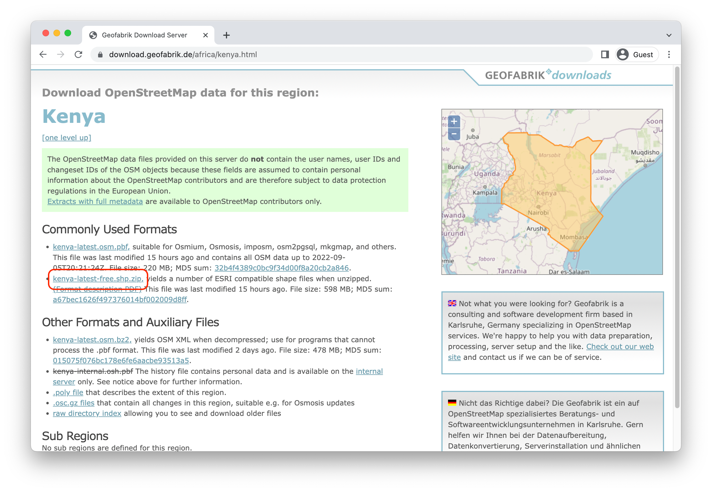

```{r setup, include=FALSE}
knitr::opts_chunk$set(
  echo = TRUE,
  eval = TRUE,
  fig.width = 12,
  fig.height = 8,
  R.options = list(width = 80)
)

knitr::opts_hooks$set(
  map_chunk = function(options) {
    options$fig.width = 14
    options$fig.height = 10
    options$layout = "l-body-outset"
    options
  },
  mini_map_chunk = function(options) {
    options$fig.width = 14
    options$fig.height = 4
    options$layout = "l-body-outset"
    options
  }
)

# load utils
source(here::here("r/utilities.r"))
set_postpath("2022-09-07-leaflet-eda")
```

Several recent posts have introduced techniques for integrating spatial data sources with PMA survey data. We've [explored precipitation patterns](../2021-11-01-nutrition-analysis/) in Burkina Faso using `r funlink(terra)`, considered the [evolution of conflict areas](../2021-12-15-cei-conflict/) in Uganda from 2019-2020, and created [multi-country faceted maps](../2022-07-15-facet-maps/) using `r funlink(cowplot)`.

In each of these cases, we've relied on the familiar `r funlink(ggplot2)` and `r funlink(ggspatial)` packages as our cartographic workhorses. `ggplot2` can be a powerful tool when making maps, and its standardized syntax for both spatial and non-spatial data visualization is appealing, but in practice it is best for producing **static** maps.

In many — probably most — cases, a static map is all that we need to display the spatial patterns present in our data, but there are situations in which it can be beneficial to be able to interact with the map directly. **Interactivity** is often thought of as a feature to be employed in a final visualization product, but it can be extremely useful during data exploration, as well.

By allowing the reader to click to receive specific information about certain spatial features, zoom and pan to see both macro- and micro-level patterns, toggle between different metrics, and more, interactive maps can make it easier to:

* Familiarize oneself with a new spatial data source
* Conduct quality assurance to ensure that spatial computations are behaving as might be expected
* Visualize variables that show a broad range of spatial variation. (For example, some areas may have a high density of features, while other areas have no features at all.)
* Generate new hypotheses or research questions based on initial exploration of the spatial distribution of a variable
* Compare different operational definitions of a spatial variable of interest

<div>
In this post, we'll use the `r funlink(leaflet)` package to explore the spatial distribution of two competing metrics for urbanism using [PMA panel data](..//2022-03-01-phase2-discovery/) from Kenya. IPUMS PMA has a variable indicating whether an enumeration area is urban or rural (`r varlink(URBAN, tab = description)`), but the definition of this variable is not well-standardized across countries, so an external data source may provide a more reliable indication of urbanism.

The `leaflet` package provides an R interface with the [leaflet.js](https://leafletjs.com/) JavaScript library. While not all of the functionality available in the JavaScript version is available in R, the package makes it surprisingly easy to quickly assemble professional-quality interactive maps for data exploration and presentation.
</div>

<aside>
```{r, echo=FALSE}
hex("leaflet")
```
<br>
`r funlink(leaflet)` R package © RStudio, Inc. (GPL-3)
</aside>

# Setup

To showcase the advantages of interactive maps, we'll use the variable `r varlink(PANELBIRTH)`, which indicates whether a woman gave birth in the year between Phase 1 and Phase 2 of the Kenya panel study. As you might imagine, PMA surveys already contain a number of key predictors for childbirth. We'll feature only a few variables representing each woman's

  * `r varlink(AGE)` - age,
  * `r varlink(MARSTAT)` - marital status, and
  * `r varlink(WEALTHQ)` - household wealth quintile
  
As we'll see, an interactive map allows the user to zoom-in on each PMA sample cluster - known as an enumeration area (EA) - and dynamically render a summary table for the average age, marital status, and wealth of reproductive age women in that specific location. 

Mapping also allows us to examine the relationship between PMA variables and data from external sources. We mentioned above that IPUMS PMA includes the variable `URBAN`, which indicates whether each country's statistical bureau classifies a woman's EA as "urban" or "rural". Because this definition varies by country, PMA researchers like Zhang [-@Zhang2022-sh] sometimes use road network density as a standardized proxy for urbanism. To demonstrate, we'll obtain road network data from [Geofabrik](https://www.geofabrik.de/data/) and plot local road density together with PMA summary data for each EA. 

To get started, we'll load the following packages in R. (If you haven't installed all of these yet, you can do so with `r funlink(utils::install.packages)` first.)

```{r libraries} 
library(ipumsr)
library(tidyverse)
library(srvyr)
library(leaflet)
library(sf)
library(terra)
library(spatstat)
library(gtsummary)

```

Next, we'll obtain a [long-format longitudinal extract](https://pma.ipums.org/pma-action/samples) with members of the Kenya panel study (Female Respondents only). To keep things simple, we'll `r funlink(dplyr::filter)` to include only records from the Phase 2 interview.^[This extract includes follow-up interviews with women from the Phase 1 sample *and* new interviews with women who moved into the study area or reached age 15 within the year.] 

```{r microdata-read, results='hide'}
dat <- read_ipums_micro(
  ddi = "data/pma_00149.xml",
  data = "data/pma_00149.dat.gz"
)

dat <- dat %>% filter(YEAR == 2020 & RESULTFQ == 1)
```

<div>
We've mentioned previously on this blog that researchers must [apply with PMA](https://www.pmadata.org/data/request-access-datasets) to access the GPS coordinates for each EA. These GPS data come in the form of a CSV file of **displaced centroid** points in latitude/longitude format. The PMA [documentation](PMA_displacement.pdf) goes into more detail about this displacement methodology. For our purposes, it is enough to keep in mind that the point locations in our GPS data are **approximate**: they represent the center of each sample cluster, but this center is randomly displaced up to 10 kilometers in order to further protect participant confidentiality. 

The GPS data come in CSV format, which we'll load into R with `r funlink(readr::read_csv)`. We'll then use the `r funlink(sf)` package to convert the imported data into an `sf` spatial object, which will use the **coordinate reference system** WGS 84.^[We won't delve too deeply into map projections for this post, but WGS 84 represents a particular **reference frame** for the Earth. When we talk about latitude/longitude, we're typically talking about coordinates relative to the WGS 84 reference frame. Spatial reference systems are standardized in a registry called the [EPSG Geodetic Parameter Dataset](https://epsg.org/home.html), which identifies reference systems by a unique code.] We can pass [EPSG code 4326](https://epsg.io/4326) to `r funlink(sf::st_set_crs)` to indicate that our coordinates are relative to the WGS 84 system. 
</div>

<aside>
This post will assume some familiarity with the `sf` package and `simple features` objects in general. If you need a refresher, there are previous posts [here](../2021-01-29-mapping-sdp-variables/) and [here](../2021-02-04-merging-external-spatial-data) that have discussed these topics in more depth.
</aside>

```{r gps-data}
ea_coords <- read_csv("data/ea/gps_kenya.csv") %>%
  st_as_sf(coords = c("GPSLONG", "GPSLAT")) %>%
  st_set_crs("epsg:4326") %>% 
  select(EAID, geometry)
```

Now that we have our PMA data and EA coordinates prepared, we can start working with `leaflet` itself.

# Introduction to Leaflet

For those familiar with `ggplot2`, the conceptual framework when building a `leaflet` map should be fairly familiar. In both cases, we'll construct our final visual product in a series of layers, which will be superimposed to form the final output.

Accordingly, when we initialize a `leaflet` map with its eponymous function, `r funlink(leaflet::leaflet)`, we see only a blank gray canvas, just like we might expect with `ggplot2`:

```{r leaflet-init, mini_map_chunk=TRUE}
leaflet()
```

As with `ggplot`, the `leaflet` function allows you to attach data and set several other map-wide parameters. 

At its core, though, calling `leaflet` is enough to get a map going.

## Basemaps

Most web basemaps rely on a set of square tiles that can be stitched together to form an entire map. This improves processing since only the new tiles in the region being viewed need to be downloaded as the user pans or zooms. `leaflet` has several built-in basemaps, which can be added with `r funlink(leaflet::addProviderTiles)`. Available map providers can be accessed using `r funlink(leaflet::providers)`. 

<aside>
To see a visual catalog of provider tiles, click [here](https://leaflet-extras.github.io/leaflet-providers/preview/index.html).
</aside> 

For our maps, we'll use the Positron tiles from [Carto](https://carto.com). These understated basemap tiles are well-suited for emphasizing our data, which we will overlay later.

```{r provider-tiles, mini_map_chunk=TRUE}
leaflet() %>%
  addProviderTiles(providers$CartoDB.PositronNoLabels)
```

We can set some initial parameters using the `options` argument in `addProviderTiles`. This argument itself takes a function, `r funlink(leaflet::providerTileOptions)`, whose arguments correspond to several of the options available for standard JavaScript `leaflet` maps. Here, we set the minimum and maximum zoom range for the map. We then use the `r funlink(leaflet::setView)` function to initialize the map over our area of interest with an appropriate zoom level.

```{r basemap, map_chunk=TRUE}
basemap <- leaflet() %>%
  addProviderTiles(
    provider = providers$CartoDB.PositronNoLabels,
    options = providerTileOptions(minZoom = 6, maxZoom = 12),
  ) %>%
  setView(lat = -0.06, lng = 37.48, zoom = 7)

basemap
```

## Adding Spatial Features

Even though our basemap shows up-to-date borders from [OpenStreetMap](https://www.openstreetmap.org/about), it would be nice to emphasize Kenya's administrative regions to draw the viewer's attention to our area of interest. We load a shapefile of Kenya's administrative borders for use in our maps:

```{r border-data-1, results="hide"}
borders_sub <- st_read("data/ke_boundaries/ke_boundaries.shp")
```

```{r, eval=FALSE, echo=FALSE}
# Unsure if we want to include this processing (which was already done prior
# to writing boundaries shapefile) or just do this in the background and load 
# a clean file
borders_sub <- st_read("data/subnational/subnational.shp") %>%
  filter(CNTRY_NAME == "Kenya", ADMIN_NAME != "Waterbodies") %>%
  st_transform("epsg:4326") %>%
  st_make_valid()
```

To get a border for the entire country, we can dissolve the internal administrative region borders to the external border with `r funlink(sf::st_union)`:

```{r border-data-2, eval=FALSE}
borders_cntry <- borders_sub %>% st_union() %>% st_sf()
```

```{r, border-data-2-load, echo=FALSE}
borders_cntry <- read_rds("data/borders_ntl.rds.gz")
```

Just like with `ggplot2`, `leaflet` has a variety of similar `r funlink(leaflet::addCircles, alt_text = "layer types")`, each of which is specific to the types of spatial features being mapped. For instance, data of point locations call for the use of `addCircles` or `addCircleMarkers`, whereas data of polygon areas would require `addPolygons`.

Each of these functions anticipates a `map` object as its first argument. This makes `leaflet` maps respond well to the pipe syntax you may be familiar with from data manipulation in the `tidyverse`, since each of these functions also *returns* a `map` object. The only difference is that instead of piping data through each step in the processing pipeline, we're piping our map.

So, to add both our borders and our EA coordinates to the map, we simply have to pipe our basemap into a call to `addPolygons` where we specify that the data associated with this map layer come from our `borders_sub` object. Then we can pipe this output directly into a call to `addCircleMarkers`, adding the EA points to the map. The other function arguments, like `fillColor`, `opacity`, and so on, control the aesthetics of these layers.

```{r ea-map, map_chunk=TRUE}
basemap %>%
  addPolygons(
    data = borders_sub,
    fill = NA,
    opacity = 0.8,
    weight = 2,
    color = "#9D9D9D"
  ) %>%
  addCircleMarkers(
    data = ea_coords,
    radius = 4,
    fillColor = "#575757",
    fillOpacity = 0.8,
    color = "#1D1D1D",
    opacity = 0,
    weight = 1.5
  )
```

As we can see, all of the EAs fall into a few specific administrative regions, reflecting the regions that were included in the 2019 survey. And one of the advantages of the interactive map is already becoming apparent: while the western portions of the map are too dense with EAs to adequately see their distribution, we can easily **zoom in** to get a better sense of their layout. In our case, we expect this clustered distribution of EAs, but with less-familiar data sources, these types of observations might lead to important questions about the quality and collection mechanism of the data being used.

# Road Network Metrics

Now that we've mapped the centroid of each EA, we're ready to begin work on a road network measure that classifies each EA as either "urban" or "rural". Because `leaflet` allows readers to **toggle between layers** in real-time, we'll consider two metrics in turn: 

  1) distance from the EA centroid to the nearest road 
  2) road density near the EA centroid 

Researchers may disagree about which metric works best as a proxy for urbanism in this context, but the interactive features built into our map could allow readers to compare potentially several measures at once. The tools shown here could also showcase layers for landcover, population density, light pollution, and much more.

## Obtaining Data

First, we need to obtain data on the Kenyan road network. We will use [OpenStreetMap](https://www.openstreetmap.org/about), which is a publicly available, crowdsourced geospatial database covering the entire globe. There are several ways to access OpenStreetMap data. We've downloaded road network data for Kenya from [Geofabrik](https://www.geofabrik.de/data/), which distributes OpenStreetMap data in manageable region-specific chunks.

To access the data we are using for this post, click [here](https://download.geofabrik.de/africa/kenya.html) to go to the download page for Kenya and download the "kenya-latest-free.shp.zip" file. 

```{r, echo=FALSE}

```

This file will include several different ESRI shapefiles; we are using "gis_osm_roads_free_1.shp". To improve processing for this brief demo, we restrict our focus to the 6 principal road categories used in the OpenStreetMap [classification scheme](https://wiki.openstreetmap.org/wiki/Key:highway), which greatly thins out the number of features present in the road network shapefile.

```{r road-data, eval=FALSE}
ke_roads <- st_read("data/kenya-latest-free.shp/gis_osm_roads_free_1.shp") %>%
  filter(fclass %in% c("motorway", "trunk", "primary", "secondary", 
                       "tertiary", "unclassified"))
```

```{r load-road-data-hidden, include=FALSE}
ke_roads <- read_rds("data/ke_roads/ke_roads.rds.gz")
```

Before we continue, we need to project the road network to a CRS that is better suited for working with spatial distance calculations. Latitude/longitude data are insufficient for this purpose because the distance between degrees of latitude or longitude varies at different points on the Earth's surface.

While the most accurate method of calculating distances between points is the **geodesic distance**, which takes into account the three-dimensional nature of the Earth's surface, this method is often more computationally intensive than alternatives. Since we're focusing on visualization rather than rigorous analysis in this post, we'll opt to calculate simpler **Euclidean distances**, requiring that we convert our data to a Cartesian (X/Y) coordinate system.

One of the most common projected reference systems is the **Universal Transverse Mercator (UTM)**. The UTM is a common map projection system that divides the Earth into 60 projection zones. Each zone runs in a north/south band. While map projects inherently introduce distortion, the narrow bands used by the UTM help to reduce these inaccuracies provided that the area under consideration roughly fits into one of these bands. Fortunately, Kenya is almost entirely contained within UTM Zone 37N, which has the [EPSG code 20137](https://epsg.io/20137).

We can use `r funlink(sf::st_transform)` to project the road data into this new CRS. You'll notice that our data are now represented in meters, rather than in degrees:

```{r write-road-data, eval=FALSE, include=FALSE}
# write_rds(ke_roads, "data/ke/ke_roads.rds.gz", compress = "gz")
```

```{r roads-utm}
ke_roads <- st_transform(ke_roads, "epsg:20137")

ke_roads %>% select(geometry)
```

## Road Distance

Now that the road network data are prepared, we can use `sf` to calculate the distances of each EA centroid to its nearest road.

First, we'll have to project `ea_coords` into UTM 37N coordinates to match the CRS of our road data:

```{r ea-utm}
ea_coords <- st_transform(ea_coords, "epsg:20137")
```

Now we can use `r funlink(sf::st_nearest_feature)` to identify the index of the nearest feature in `ke_roads` for each EA centroid. Because `st_nearest_feature` returns the row index of the nearest road in `ke_roads`, we can subset the `ke_roads` data to extract only those features that are closest to at least one of the EA centroids.

```{r nearest-rds-eas}
ea_nearest_rds <- ke_roads[st_nearest_feature(ea_coords, ke_roads), ]
```

Finally, we use `r funlink(sf::st_distance)` to calculate the distance from each of the EA centroids to its nearest road. This produces a point layer of EA centroids where each EA has a calculated distance stored in the `DIST` variable.

```{r ea-dist}
ea_dist <- ea_coords %>%
  mutate(
    DIST = ea_coords %>% 
      st_distance(ea_nearest_rds, by_element = TRUE) %>% 
      as.numeric / 1000  # Get units in km.
  )
```

Now we have the data we need to visualize the distribution of road distances across the EAs.

### Mapping EAs

To start, we'll demonstrate how to assign a color gradient to the EA circle markers shown in grey on our map above. This time, we'll use color to represent the `DIST` variable we created in `ea_dist`. With `leaflet`, we'll have to create a palette function that specifies which values should be mapped to which colors on the scale. You can use one of several built-in `r funlink(leaflet::colorNumeric, alt_text = "palette generators")` to facilitate the creation of different types of color palettes:

* `colorNumeric`: Map continuous values to colors
* `colorBin`: Map continuous values to colors, but group them into binned categories by value
* `colorQuantile`: Map continuous values to colors, but group them into binned categories by quantile
* `colorFactor`: Map discrete values to colors

Each of these functions takes a `palette` argument, which takes a vector of colors or the name of an available palette (e.g. a palette provided by [RColorBrewer](https://cran.r-project.org/web/packages/RColorBrewer/RColorBrewer.pdf) or `r funlink(viridis)`), and a `domain` argument, which indicates the domain of all data values that should be mapped to the interpolated colors in the provided palette.

In our case, we use the `r funlink(colorspace)` package to create a vector of colors from its "Blue-Yellow" palette, and we provide the entire range of distance values calculated in the previous step as the domain.

```{r dist-pal-1}
pal <- colorBin(
  colorspace::sequential_hcl(10, "Blue-Yellow", rev = TRUE),
  domain = ea_dist$DIST
)
```

This `pal` variable is actually a **function** — one that maps data values to color values. So, to use the palette for the fill color of our grid cells, we pass the data values of the cells (`DIST`) into our `pal` using the `~` syntax to indicate that the `fillColor` is a **function** of our data, not a static value.

Since we're adding colors, we'll also create a legend with `r funlink(leaflet::addLegend)` using the `pal` function we made above. 

We'll also return `ea_dist` to its original WGS 84 projection, overriding the default Web Mercator projection used in `leaflet` by default.[^WebMercator]

[^WebMercator]: We have to re-transform our data because `leaflet` expects that our spatial features will be provided in the WGS84 coordinate system. Though it anticipates data in WGS84 coordinates (because they are so common), `leaflet` actually does its own transformation before displaying the data: it transforms the provided spatial data from EPSG 4326 to EPSG 3857, or the Web Mercator projection. <br><br> Web Mercator is the standard for web-based mapping applications because it has certain properties that are well-suited toward interactive web maps. For instance, the Web Mercator projection produces minimal shape distortion even at large zoom levels. It also preserves directions, so that at all locations on the map, north points upward, east points to the user's right, and so on. Finally, the Web Mercator is based on a set of slightly simpler calculations that use a model of the Earth as a sphere (rather than an ellipsoid), enabling improved performance in web-based settings. <br><br> However, because of these simplifications, Web Mercator is *not* usually an ideal projection for rigorous spatial analysis, and should generally be restricted to visualization purposes.
  
```{r ea-dist-map-1, map_chunk=TRUE}
basemap %>%
  addPolygons(
    data = borders_sub,
    fill = NA,
    opacity = 0.8,
    weight = 2,
    color = "#9D9D9D"
  ) %>%
  addCircleMarkers(
    data = st_transform(ea_dist, "epsg:4326"),
    radius = 6,
    fillColor = ~pal(DIST),
    fillOpacity = 0.8,
    color = "#6F6F6F",
    weight = 1.5
  ) %>%
  addLegend(
    title = "Distance to Nearest Road (km)",
    position = "bottomright",
    pal = pal,
    values = ea_dist$DIST
  )
```

At first glance, it doesn't look like there is much variability in road distance across our enumeration areas. Most of the areas appear to be within a single kilometer of their nearest road. However, because our EAs are not evenly distributed across the country, we're lacking in some context. That is, we have no indication of how far someone would need to travel to the nearest road in areas of the country where there aren't any EAs in this survey, and this could be giving us a distorted view of how outlying the high-distance EAs really are.

### Grid Layer 

<div>
To solve this problem, we'll create a new layer on our map that shows the distance to the nearest road on a **grid** spanning the complete land area for Kenya. That is: rather than coloring the circle markers for each EA, we'll situate grey circle markers on a layer showing the spatial variance of road distances throughout the country. This grid will be comprised of hexagonal cells built with `r funlink(sf::st_make_grid)`, and fitted to the national border in `borders_cntry` with `r funlink(sf::st_filter)`:

```{r make-hex-grid}
hex_grid <- borders_cntry %>% 
  st_make_grid(cellsize = 0.1, what = "polygons", square = FALSE) %>%
  st_sf() %>% 
  st_filter(borders_cntry)
```
</div>

<aside>
Hexagonal grids have several appealing properties when compared square grids, both for analysis and visualization. 

One cartographically-important example: they are less likely to bias the eye toward seeing spurious vertical or horizontal patterns.
</aside>

Let's take a look at the grid we've created so far: 

```{r}
basemap %>%
  addPolygons(
    data = hex_grid,
    fill = NA,
    opacity = 0.8,
    weight = 2,
    color = "#9D9D9D"
  )
```

Next, we'll proceed as we did earlier, except that we'll find the distance to the nearest road from the centroid of each *hexagonal cell* rather than the centroid of each EA. To find each centroid, we'll use `r funlink(sf::st_centroid)`.

```{r}
hex_grid <- hex_grid %>% st_transform("epsg:20137")

hex_ctrs <- st_centroid(hex_grid)

hex_nearest_rds <- ke_roads[st_nearest_feature(hex_ctrs, ke_roads), ]

hex_grid <- hex_grid %>%
  mutate(
    DIST = hex_ctrs %>% 
      st_distance(hex_nearest_rds, by_element = TRUE) %>% 
      as.numeric / 1000 # Get units in km.
  )
```

We'll need to update the `domain` in our palette function, since it currently only captures the range of distances for our EAs, which will be a subset of the total range of distances across the new grid layer.

```{r dist-pal-2}
pal <- colorBin(
  colorspace::sequential_hcl(10, "Blue-Yellow", rev = TRUE),
  domain = hex_grid$DIST
)
```

We'll now use `pal` to color each of the grid cells, and then we'll add layers for sub-national borders and EA circle markers as we did before. Lastly, we'll update `addLegend` to span the range of values in our new grid layer.

```{r dist-map, map_chunk=TRUE}
basemap %>%
  addPolygons(
    data = hex_grid %>% st_transform("epsg:4326"),
    fillColor = ~pal(DIST),
    color = "#fefefe",
    fillOpacity = 0.5,
    weight = 1,
    group = "Road Distance"
  ) %>%
  addPolygons(
    data = borders_sub,
    fill = NA,
    opacity = 0.8,
    weight = 2,
    color = "#9D9D9D"
  ) %>%
  addCircleMarkers(
    data = ea_coords %>% st_transform("epsg:4326"),
    radius = 4,
    fillColor = "#575757",
    fillOpacity = 0.8,
    color = "#1D1D1D",
    opacity = 0,
    weight = 1.5
  ) %>%
  addLegend(
    title = "Distance to Nearest Road (km)",
    position = "bottomright",
    pal = pal,
    values = hex_grid$DIST
  ) 
```

This country-wide map shows us what we suspected earlier: while the most remote EAs were only about 3 kilometers from the nearest road, the entire range of road distances spans all the way to roughly 40 kilometers in some places. In fact, *all* of the EAs would fall into the lowest binned color class using the full range of distance values!

Of course, this may not be a true cause for concern. Areas of high distance might also have few inhabitants, making those regions someone less representative of the bulk of the population. Similarly, depending on the research questions of interest, it may well be the case that the difference between a 500m distance and 1km distance is conceptually meaningful, even though it composes only a tiny fraction of the overall range of possible road distances.

However, it might also be the case that the distance from the nearest road simply isn't a very useful measure of urbanism. Even though we aren't using residential roads or other minor road classes recorded in the OpenStreetMap data, a sufficiently comprehensive road network database would probably suggest that most EAs are very close to *some* type of road.

Instead of road distance, it might make more sense to calculate road density. Even EAs that are fairly close to some road may not be in an area that has a dense *network* of roads.

## Road Density

To calculate the road density from our `ke_roads` data, we'll use the `r funlink(spatstat)` package, which provides a collection of point pattern analysis tools. First, we'll convert our `ke_roads` object to a `r funlink(spatstat.geom::psp.object, alt_text = "psp")` object. This is a class that `spatstat` uses to represent line segment data.

We can then use the `r funlink(spatstat.core::density.psp)` function to calculate the density of our road network and convert to a more familiar `r funlink(terra::SpatRaster)` object from the `terra` package.

In a true analysis, it would be worth spending time to identify an appropriate value for the standard deviation parameter `sigma` and the pixel resolution `eps`, but the following should do for our purposes:

```{r dens-calc, eval=FALSE}
ke_roads_dens <- ke_roads %>% 
  st_geometry() %>% 
  as.psp() %>% 
  density.psp(sigma = 5000, eps = 2000) %>% 
  rast()

crs(ke_roads_dens) <- "epsg:20137"
```

```{r dens-load-hidden, echo=FALSE}
ke_roads_dens <- terra::rast("data/ke_roads/road_density.tif")
```

<div>
We could go ahead and map our raster object directly. However, for better visual comparison with our previous gridded map, we'll convert the raster to a hexagonal grid, so we use `r funlink(terra::extract)` to get the mean density values within each hexagon. 

```{r grid-dens-calc}
hex_grid <- hex_grid %>%
  mutate(
    DENS = ke_roads_dens %>% 
      extract(vect(hex_grid), fun = "mean", na.rm = TRUE) %>% 
      .$`lyr.1`
  )
```
</div>

<aside>
`leaflet` does support raster mapping with `r funlink(leaflet::addRasterImage)`, but its functionality is slightly more limited than functions for mapping vector data, and performance can suffer for medium-sized raster files or larger.
</aside>

Our Road Density map will closely resemble our previous Road Distance map, so we'll want to be sure to create a distinctive color palette for each to help readers tell the two metrics apart. This time, we'll use a red / orange palette.

```{r}
 pal <- colorNumeric(
    colorspace::sequential_hcl(10, "OrRd", rev = TRUE), # substitute "OrRd"
    domain = hex_grid$DENS # substitute "DENS"
  )
```

We can use the same code for our new Road Density map, except that we'll need to make several substitutions for the new variable `DENS` and for our legend (which we'll now show at the bottom-left). 

```{r}
basemap %>%
  addPolygons(
    data = hex_grid %>% st_transform("epsg:4326"),
    fillColor = ~pal(DENS), # substitute "DENS"
    color = "#fefefe",
    fillOpacity = 0.5,
    weight = 1,
    group = "Road Density" # substitute "Road Density"
  ) %>%
  addPolygons(
    data = borders_sub,
    fill = NA,
    opacity = 0.8,
    weight = 2,
    color = "#9D9D9D"
  ) %>%
  addCircleMarkers(
    data = ea_coords %>% st_transform("epsg:4326"),
    radius = 4,
    fillColor = "#575757",
    fillOpacity = 0.8,
    color = "#1D1D1D",
    opacity = 0,
    weight = 1.5
  ) %>%
  addLegend(
    title = "Desnity of road network", # new legend title  
    position = "bottomleft", # new legend position 
    pal = pal,
    values = hex_grid$DENS # substitute "DENS"
  ) 
```

Compared with our previous map, we see that there appears to be more variation in road density across our EAs, a potential sign that this metric may capture a wider spectrum of urbanism. Of course, this is a relatively simple density calculation, and a more sophisticated approach might take into account the different types of roads present in the network and adjust for the fact that the road density will inherently decrease along coastlines, and so on.

Of course, we want to avoid asking our reader to compare maps by scrolling upward and downward on this page! To make this comparison easier to see, we'll now demonstrate how to combine the two metrics on a single map that allows the reader to switch between metrics of interest. 

### Layer Toggle

In our combined map, we'll have 2 grid layers - each showing a different road network metric. We'll introduce a toggle at the top-right corner of our map allowing the user to choose between Road Distance and Road Density. 

Remember: in addition to both of the grid layers, we're also mapping layers for sub-national borders and the location of each EA. With so many layers in-play, we'll want to control the order in which each one is plotted on top of the next. To do so, we'll use `r funlink(leaflet::addMapPane)` to create a name and `zIndex` for each layer: a `zIndex` value should typically fall between 400 (the default overlay pane) and 500 (the default shadow pane). Let's update `basemap` to include the following "map panes": 

  * `Hex` for the hexagonal grid layers, 
  * `Borders` for the sub-national borders 
  * `EAs` for the EA centroid locations 
  
```{r}
basemap <- basemap %>% 
  addMapPane("Hex", zIndex = 430) %>%
  addMapPane("Borders", zIndex = 450) %>%
  addMapPane("EAs", zIndex = 500)
```

Next, we'll start building the layers that will comprise our new map, which we'll call `toggle_map`. First, we'll recycle code from the sections above to plot the `Borders` and `EAs`. The `options` argument allows us to assign a "map pane" for each.  

```{r}
toggle_map <- basemap %>% 
  addPolygons(
    data = borders_sub,
    fill = NA,
    opacity = 0.8,
    weight = 2,
    color = "#9D9D9D",
    options = pathOptions(pane = "Borders") # <-------------- New part!
  ) %>%
  addCircleMarkers(
    data = ea_coords %>% st_transform("epsg:4326"),
    radius = 4,
    fillColor = "#575757",
    fillOpacity = 0.8,
    color = "#1D1D1D",
    opacity = 0,
    weight = 1.5,
    options = pathOptions(pane = "EAs") # <-------------- New part!
  )
```

Next, we'd like to use `addPolygons` and `addLegend` twice each: once for the Road Distance layer, and once again for the Road Density layer. However, we need to update our color palette function `pal` with different colors for each metric. In this case, it might make sense to write a custom function that runs `addPolygons`  and `addLegend` with changes provided by user input. 

This function, which we'll call `add_hex_grid`, takes a unique `var` (either "DIST" or "DENS"), `legend_title`, and `legend_position` for each grid layer. We'll also create one `group` name for each layer, which will allow us to toggle between layers with `r funlink(leaflet::addLayersControl)`. 

<aside>
Unfortunately, R's `leaflet` doesn't fully support toggling of legends, so we have to space them out around the map if there are more than one.
</aside>

```{r}
add_hex_grid <- function(map, data, var, palette, group, 
                         legend_title, legend_position) {
  
  data <- st_transform(data, "epsg:4326")
  
  pal <- colorNumeric(
    colorspace::sequential_hcl(10, palette, rev = TRUE),
    domain = data[[var]]
  )
  
  map %>%
    addPolygons(
      data = data,
      fillColor = ~pal(data[[var]]),
      color = "#fefefe",
      fillOpacity = 0.7,
      weight = 1,
      group = group,
      options = pathOptions(pane = "Hex")
    ) %>%
    addLegend(
      title = legend_title,
      position = legend_position,
      pal = pal,
      values = data[[var]]
    )
}
```

Now, we'll use `add_hex_grid` once for each grid layer, followed by `addLayersControl` to toggle between them. 

```{r}
toggle_map %>% 
  add_hex_grid(
    data = hex_grid,
    palette = "Blue-Yellow",
    var = "DIST",
    legend_title = "Distance to nearest road (km)",
    legend_position = "bottomright",
    group = "Road Distance"
  ) %>%
  add_hex_grid(
    data = hex_grid,
    palette = "OrRd",
    var = "DENS",
    legend_title = "Density of road network",
    legend_position = "bottomleft",
    group = "Road Density"
  ) %>% 
  addLayersControl(
    baseGroups = c("Road Distance", "Road Density"),
    options = layersControlOptions(collapsed = FALSE)
  )
```

# Popup Tables 

We've focused pretty extensively on the grid layers for our two Road Network metrics so far. Let's now return to our original IPUMS PMA data extract `dat`. In the [Setup](./index.html#setup) section at the top of this post, we mentioned that PMA variables like `AGE`, `MARSTAT`, and `WEALTHQ` are important predictors for our variable of interest, `PANELBIRTH`. Our current map shows the where Kenya's roads are located, but how could we now add information about these four variables without creating excessive clutter? 

Fortunately, `leaflet` maps can include popup tables or figures in response to user input. Here, we might consider showing a summary table for these four variables when the user clicks or hovers over a specific EA. 

First, we'll need to create one summary table for each EA rendered in HTML format. We'll use the `r funlink(gtsummary)` package featured [elsewhere](../../#category:gtsummary) on this blog, and we'll extract HTML representing the summary table with `r funlink(gtsummary::as_gt)` and `r funlink(gt::as_raw_html)`. 

```{r, eval = FALSE}
# Recode variables of interest 
dat <- dat %>% 
  transmute(
    EAID, 
    PANELBIRTH = PANELBIRTH == 1,
    MARSTAT = MARSTAT %in% 21:22,
    WEALTHQ = WEALTHQ %>% 
      as_factor() %>% 
      fct_drop() %>% 
      fct_relabel(~str_remove(.x, " quintile")),
    AGE = AGE %>% 
      as_factor() %>% 
      fct_drop() %>% 
      fct_collapse(
        "15-19" = as.character(15:20),
        "20-29" = as.character(20:29),
        "30-39" = as.character(30:39),
        "40-49" = as.character(40:49)
      )
  )

# Compact tables 
gtsummary::theme_gtsummary_compact()

# Summary HTML tables for each EA
dat <- dat %>% 
  group_by(EAID) %>% 
  summarise(
    HTML = cur_data() %>% 
      tbl_summary(
        label = list(
          PANELBIRTH ~ "Recent birth",
          MARSTAT ~ "In union",
          WEALTHQ ~ "Wealth quintile",
          AGE ~ "Age"
        ),
        stat = list(all_categorical() ~"{p}")
      ) %>% 
      add_stat_label() %>% 
      modify_header(update = list(label ~ " ")) %>%
      modify_spanning_header(everything() ~ paste0("**EAID ", cur_group(), "**")) %>% 
      as_gt() %>% 
      gt::as_raw_html() %>% 
      list()
  ) 
```

```{r, echo = FALSE}
dat <- read_rds("data/tbl_summary.rds")
```

```{r}
dat
```

Next, we'll attach the GPS coordinates for each EA from `ea_coords`. 

```{r}
dat <- dat %>% right_join(ea_coords, ., by = "EAID")
```

Finally, we'll rebuild `toggle_map` with `dat` substituted for `ea_coords`. The argument `popup` allows us to select the `HTML` tables we created above. 

```{r}
basemap %>%
  addPolygons(
    data = borders_sub,
    fill = NA,
    opacity = 0.8,
    weight = 2,
    color = "#9D9D9D",
    options = pathOptions(pane = "Borders")
  ) %>%
  addCircleMarkers(
    data = dat %>% st_transform("epsg:4326"), # <-------------- New part!
    radius = 4,
    fillColor = "#575757",
    fillOpacity = 0.8,
    color = "#1D1D1D",
    opacity = 0,
    weight = 1.5,
    options = pathOptions(pane = "EAs"),
    popup = ~HTML # <-------------- New part!
  ) %>%
  add_hex_grid(
    data = hex_grid,
    palette = "Blue-Yellow",
    var = "DIST",
    legend_title = "Distance to nearest road (km)",
    legend_position = "bottomright",
    group = "Road Distance"
  ) %>%
  add_hex_grid(
    data = hex_grid,
    palette = "OrRd",
    var = "DENS",
    legend_title = "Density of road network",
    legend_position = "bottomleft",
    group = "Road Density"
  ) %>%
  addLayersControl(
    baseGroups = c("Road Distance", "Road Density"),
    options = layersControlOptions(collapsed = FALSE)
  )
```

That's it! We've made a map that allows us to compare different spatial metrics and check ancillary data for particular EAs all in one interface. And because we've demonstrated how to wrap some of our layers into functions, we could easily add similar layers for other metrics, as well. At this point, it's easy to compare summary statistics and road network metrics to any EAs of interest simply by clicking and zooming around this map.

This demo has introduced the functions at the heart of the `leaflet` package, but more customization options remain, especially for those who want to get more hands-on with the HTML and CSS underlying the map display (the `r funlink(htmltools)` package can facilitate more advanced handling of these features). The web-based, interactive nature of the maps makes them well-suited for inclusion in `r funlink(shiny)` apps and a valuable addition to other common visualization packages in R, like `ggplot2` and `r funlink(tmap)`.

<aside>
For more `leaflet` materials, check out RStudio's page [here](https://rstudio.github.io/leaflet/), and take a look at related packages, like `r funlink(leaflet.extras)` and `r funlink(leaflet.extras2)`.
</aside>

That being said, it is always important to critically consider whether an interactive approach is necessary—oftentimes a static map will display all the information that's needed, and interactivity is superfluous and distracting. Still, restrained and deliberate use of interactive features can certainly make for more informative, engaging, and effective visualization when warranted.
