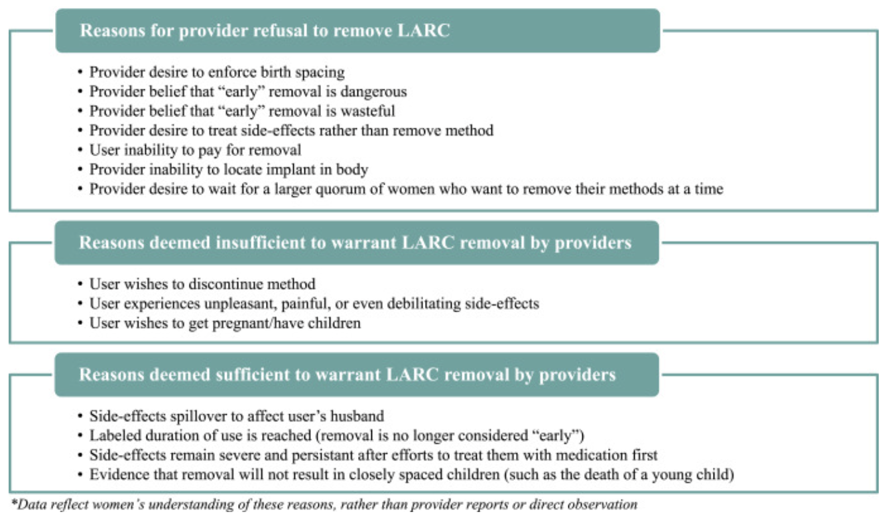

```{r setup, echo=FALSE, results='hide'}
# knitr options 
knitr::opts_chunk$set(
  echo = TRUE, 
  eval = TRUE,
  fig.align='center',
  R.options = list(width = 100)
)

options(tibble.print_min = 20)

# load utils 
source(here::here("r/utilities.r"))
set_postpath("2022-10-07-implant-removal")

update_geom_defaults("text", list(family = "cabrito", size = 4))
```

Subdermal implants - together with IUDs - are part of a group of family planning methods known as **long-acting reversible contraceptives** (LARCs). Because they are highly effective, increasingly affordable, and relatively easy to provide, use of implants has [grown very rapidly](http://progress.familyplanning2020.org/measurement) in nearly all of the countries surveyed by PMA since 2014. However, researchers have cautioned that some implant users in these countries experience difficulty seeking implant *removal* services from their healthcare provider. Senderowicz and Kolenda [-@Senderowicz2022-sl], for example, show that focus group participants in one FP2020 country struggled to convince providers to remove their implant prior to its labelled duration; women's expressed desire to discontinue the method were not considered legitimate in comparison with other factors: 

```{r, echo=FALSE, fig.width=4}

```

<aside>
Source: Senderowicz and Kolenda  [-@Senderowicz2022-sl]
</aside>

In response to these concerns, recent PMA surveys have asked current implant users 1) whether they have tried to get their implant removed in the past year, and 2) if so, why they were unable to get their implant removed. Let's take a look at the results they have collected to date. 


# Data Availability  

The structure of these two questions has evolved somewhat since they were first posed to sampled women in Burkina Faso, Ethiopia, and Kenya between 2015 and 2016. Initially, current implant users in  Ethiopia and Kenya were asked whether they had *ever* tried to have their implant removed ([FPIMPREMOVETRY](https://pma.ipums.org/pma-action/variables/FPIMPREMOVETRY)), and users in all three countries could only select *one* reason why they were unable to have it removed at that time ([FPIMPRMVYNOT](https://pma.ipums.org/pma-action/variables/FPIMPRMVYNOT)).

After 2016, the questionnaire in each country was changed to ask only about implant removal *in the last year* ([FPIMPREMOVEYR](https://pma.ipums.org/pma-action/variables/FPIMPREMOVEYR)), and the Burkina Faso and Kenya questionnaires allowed women to select *more than one* reason why they were unable to have it removed (Ethiopia continued to allow selection of only one reason). Each of the 11 reasons included in this multiple-response question is available as a binary variable named with the prefix `FPIMPRMVY` (listed in questionnaire order):

  - [FPIMPRMVYCLOSED](https://pma.ipums.org/pma-action/variables/FPIMPRMVYCLOSED) - Facility not open
  - [FPIMPRMVYUNAVAIL](https://pma.ipums.org/pma-action/variables/FPIMPRMVYUNAVAIL) - Qualified provider not available
  - [FPIMPRMVYUNSUCC](https://pma.ipums.org/pma-action/variables/FPIMPRMVYUNSUCC) - Provider attempted but could not remove the implant
  - [FPIMPRMVYREFUSE](https://pma.ipums.org/pma-action/variables/FPIMPRMVYREFUSE) - Provider refused
  - [FPIMPRMVYCOST](https://pma.ipums.org/pma-action/variables/FPIMPRMVYCOST) - Cost of removal services
  - [FPIMPRMVYTRAVEL](https://pma.ipums.org/pma-action/variables/FPIMPRMVYTRAVEL) - Travel cost
  - [FPIMPRMVYCOUNS](https://pma.ipums.org/pma-action/variables/FPIMPRMVYCOUNS) - Provider counseled against removal
  - [FPIMPRMVYRETURN](https://pma.ipums.org/pma-action/variables/FPIMPRMVYRETURN) - Told to return another day
  - [FPIMPRMVYELSEWH](https://pma.ipums.org/pma-action/variables/FPIMPRMVYELSEWH) - Referred elsewhwere
  - [FPIMPRMVYOTH](https://pma.ipums.org/pma-action/variables/FPIMPRMVYOTH) - Other
  - [FPIMPRMVYDK](https://pma.ipums.org/pma-action/variables/FPIMPRMVYDK) - Don't know

These questions were added to samples collected from the DRC, Nigeria, and Uganda beginning in 2020; however, no information is available about reasons for non-removal in the Uganda sample, where neither of the 3 qualifying women selected a reason. In Nigeria, only 4 women qualified and provided a reason across both samples from Lagos and Kano; in the DRC, there were only 4 in Kongo Central and 11 in Kinshasa. 

Data availability is summarised in the table below. Women could offer multiple reasons for an implant removal attempted in the last year *unless otherwise noted*.

| Country      | Sample Years | Notes                   |
| ------------ | ------------ | ----------------------- |
| Burkina Faso | 2016b-2021   | Select *one* reason (2016b)
| DRC          | 2020         | 
| Ethiopia     | 2016-2019    | Select *one* reason (2016-2019); *Ever* tried (2016)
| Kenya        | 2015b-2020   | Select *one* reason (2015-2016); Reasons unavailable (2017); *Ever* tried (2015b)
| Nigeria      | 2020         | 
| Uganda       | 2020         | Reasons unavailable 

# Removal Prevalence  

With these caveats in mind, we'll start by combining `FPIMPREMOVETRY` with `FPIMPREMOVEYR` to estimate the prevalence of attempted implant removal among current implant users in each population. 

We've downloaded an extract from IPUMS PMA containing all of the variables and samples listed above (female respondents only), and we'll load it into R along with several analysis packages as follows: 

```{r, results='hide'}
library(ipumsr)
library(tidyverse)
library(srvyr)

dat <- read_ipums_micro(
  ddi = "data/pma_00175.xml",
  data = "data/pma_00175.dat.gz"
)
```

```{r, echo=FALSE}
dat <- dat %>% filter(!is.na(FPIMPREMOVETRY) | !is.na(FPIMPREMOVEYR))
```


Before we jump into our analysis, we'll make three minor adjustments to this data extract. First, we'll drop cases where PMA has assigned a weight of zero in `r varlink(FQWEIGHT)`.^[Usually, PMA assigns zero weight to women who are not members of the *de facto* population. Removal of these cases is not technically necessary, because they drop out automatically when weights are applied; doing so simply prevents `srvyr` from issuing a warning message.] Second, we'll create a variable called `POP` to label the population represented by each sample.^[All of the samples included in our analysis are nationally representative, except for subnationally representative samples from the DRC and Nigeria. We'll label these samples with their respective regions.]. Finally, we'll make two minor modifications to `r varlink(STRATA)` so that it can be used for samples with data where it is missing, or where there are strata with data from only one sample cluster (`r varlink(EAID)`).^[Each of the DRC samples uses a single stratum, so `STRATA` is `NA` (blank) in the original data; we'll replace these blank values with a numeric code representing the two represented regions (`r varlink(GEOCD)`). The Ethiopia and Uganda samples are stratified by urban and rural areas with in each region, resulting in 27 strata for Ethiopia and 92 strata for Uganda; many of these strata contain data from only one sample cluster, but each stratum must contain *at least two* clusters in order to correctly calculate standard error under a stratified cluster sample design. R generates an error if we use `STRATA` as provided, so we'll oversimplify the original design by dividing Ethiopia and Uganda samples into just two urban and rural strata.]

```{r}
dat <- dat %>% 
  filter(FQWEIGHT > 0) %>% 
  mutate(
    POP = case_when(
      !is.na(GEOCD) ~ paste("DRC -", GEOCD %>% as_factor, YEAR),
      !is.na(GEONG) ~ paste("Nigeria -", GEONG %>% as_factor, YEAR),
      TRUE ~ paste(COUNTRY %>% as_factor, YEAR)
    ),
    STRATARC = case_when(
      !is.na(GEOCD) ~ as.numeric(GEOCD),
      as_factor(COUNTRY) %in% c("Ethiopia", "Uganda") ~ as.numeric(URBAN), 
      TRUE ~ as.numeric(STRATA)
    )
  ) 
```

## Estimation

Now, we can easily calculate the estimated proportion of implant users in each population who tried to have their implant removed in the last year (or *ever* as noted in some early samples). We start by combining the information in `FPIMPREMOVETRY` with `FPIMPREMOVEYR` in a variable we'll call `tried`.

Notice that `FPIMPREMOVETRY` and `FPIMPREMOVEYR` use **composite coding** to indicate both 1) whether implant removal was attempted, and 2) whether removal was sought by a health professional (in available samples). However, `FPIMPREMOVETRY` uses codes 21 and 22 to indicate "yes", while `FPIMPREMOVEYR` uses codes 10, 11, and 12. The code 98 is used for non-response, while 99 is used for women who were not currently implant users; we'll recode these values with `NA`. 

```{r}
dat <- dat %>% 
  mutate(
    tried = case_when(
      FPIMPREMOVETRY < 90 ~ FPIMPREMOVETRY %in% 20:30,
      FPIMPREMOVEYR < 90 ~ FPIMPREMOVEYR %in% 10:20
    )
  ) 

# review recoding
dat %>% count(tried, FPIMPREMOVETRY, FPIMPREMOVEYR)
```

In `tried`, we've created a **logical** binary variable. For users who might only be interested in the point-estimate for each population (ignoring confidence interval estimation), you can now take a `r funlink(stats::weighted.mean)` of `tried` weighted by `r varlink(FQWEIGHT)`. We'll also include `n` to show the number of responding implant users in each sample.

```{r}
dat %>% 
  group_by(POP) %>% 
  summarise(
    tried_prop = weighted.mean(tried, FQWEIGHT, na.rm= TRUE),
    n = sum(!is.na(tried))
  )
```

To obtain a 95% confidence interval for each estimate, we'll need to use tools from the `r funlink(srvyr)` package. First, we group the data by `POP` to ensure that the correct degrees of freedom are used from each sample. Then, we `r funlink(dplyr::summarise)` each group using `FQWEIGHT` and sample-specific clusters and strata. Finally, `r funlink(srvyr::survey_mean)` gives us an asymmetric confidence interval (adjusted for proportions near 0% or 100%). 

We'll want to graph these results, so we'll save the output as `tried_tbl`.

```{r}
tried_tbl <- dat %>%
  group_by(POP) %>% 
  summarise(
    cur_data() %>% 
      as_survey_design(weight = FQWEIGHT, id = EAID, strata = STRATARC) %>%
      summarise(
        tried_prop = survey_mean(tried, proportion = TRUE, vartype = "ci"),
        n = sum(!is.na(tried))
      )
  )

tried_tbl
```

## Graphics 

Let's plot these results as a bar chart with error bars for each confidence interval. We'll organize the bar for each sample in rows, where the length of each bar on the x-axis is mapped to `tried_prop`. The length of each error bar will be mapped to `tried_prop_low` and `tried_prop_upp`. Because the Ethiopia 2016 and Kenya 2015 samples actually ask whether the woman *ever* tried to have her implant removed, we'll add a `*` symbol to each of those `POP` labels, along with a caption at the bottom.

```{r, fig.width=12, fig.height=9, layout = "l-body-outset"}
tried_tbl %>% 
  mutate(
    POP = if_else(
      POP %in% c("Ethiopia 2016", "Kenya 2015"),
      paste0(POP, "*"),
      POP
    ),
    POP = paste0(POP, "\nN = ", n)
  ) %>% 
  ggplot(aes(x = tried_prop, y = POP, 
             xmin = tried_prop_low, xmax = tried_prop_upp)) + 
  geom_bar(stat = "identity", fill = "#00263A", alpha = 0.7) +
  geom_errorbar(width = 0.2, alpha = 0.4) +
  scale_x_continuous(labels = scales::label_percent()) + 
  labs(
    title = paste("IN THE PAST 12 MONTHS, HAVE YOU TRIED TO HAVE YOUR CURRENT",
                  "IMPLANT REMOVED?") %>% 
      str_wrap(50),
    subtitle = paste("Weighted percentages (95% CI) from sampled women age",
                     "15-49 who were currently using an implant (N)"),
    caption = paste("* Includes women who have EVER tried to have their",
                    "current implant removed"),
    y = NULL, 
    x = NULL
  ) + 
  theme_minimal() +
  theme(
    text = element_text(family="cabrito"),
    panel.grid.major.y = element_blank(),
    plot.title = element_text(size = 22, color = "#00263A",
                              hjust = 0, margin = margin(b = 5)),
    plot.subtitle = element_text(size = 12, hjust = 0, 
                                 margin = margin(b = 10)),
    legend.position = "none"
  ) 
```

Looking at these results, a few things stand out: first, there doesn't appear to be (at least to my eye) a clear pattern in the way this issue has developed over time or across countries. While the number of sampled implant users has grown over time (reflecting its increased popularity), the share of current users who have tried to have their implant removed is almost always within a fairly regular confidence interval. Second, we rarely expect that more than 10% of current implant users have attempted removal, and most outlying populations probably don't exceed about 15% of current users; the mean value across sampled populations is probably closer to 5%.

Another important thing to consider here is the effect of [survival bias](https://en.wikipedia.org/wiki/Survivorship_bias). Remember: these data only include women who are current implant users, so they exclude women who actually *did* have their implant removed successfully within the past year. If we were able to identify all of the women who used implants in the past year, the proportion who attempted removal would be higher, but it would include women who experienced no difficulty doing so. 

# Reasons for Failed Removal

Turning our attention to reasons for failed removal, we'll again have to contend with two sets of variables: in one set, women could only select one reason in `FPIMPRMVYNOT`; in the other set, women could select any number of reasons in other variables named with the prefix `FPIMPRMVY`. 

We'll be modifying the latter set with responses from `FPIMPRMVYNOT`, so it might be useful to set our IPUMS **variable labels** aside for now. We'll return to them after data manipulation so that we can use them directly on our graph. 

## Variable Labels 

**Tip:** you can use `r funlink(ipumsr::ipums_var_info)` to get a tidy data dictionary for any IPUMS extract! This includes columns for the variable label, a full-text variable description, and a table of value labels. 

```{r}
reason_labels <- dat %>% 
  select(starts_with("FPIMPRMVY")) %>% 
  ipums_var_info()

reason_labels
```

We'll remove the repeated text "Why implant not removed: ", along with the other columns we won't be using here. 

```{r}
reason_labels <- reason_labels %>% 
  mutate(var_label = var_label %>% str_remove("Why implant not removed: ")) %>% 
  select(var_name, var_label)

reason_labels
```

## Data Cleaning 

We'll again transform each of our multiple-response variables into a **logical** binary variable, where `NA` represents women who were either not currently an implant user or had not tried to remove it in the last year (these cases are marked "NIU" for "Not in universe"). This should impact all of the variables with the prefix `FPIMPRMVY` except `FPIMPRMVYNOT` (the variable used for samples accepting only one reason per woman). 

```{r}
dat <- dat %>% 
  mutate(
    across(
      starts_with("FPIMPRMVY") & !FPIMPRMVYNOT,
      ~case_when(tried ~ .x == 1) 
    )
  )
```

Next, we'll make a helper variable to indicate whether we should `update` each of these variables with appropriate values from `FPIMPRMVYNOT`. This is the case only if a woman `tried` to remove her implant and `FPIMPRMVYNOT` is not missing (`NA`) for her sample. 

```{r}
dat <- dat %>% mutate(update = tried & !is.na(FPIMPRMVYNOT))
```

Finally, we'll `update` each of the multiple-response variables with each of the appropriate values from `FPIMPRMVYNOT` as needed, leaving it unchanged otherwise. 
  
```{r}
dat <- dat %>% 
  mutate(
    FPIMPRMVYCLOSED = update %>% if_else(FPIMPRMVYNOT == 1, FPIMPRMVYCLOSED),
    FPIMPRMVYUNAVAIL = update %>% if_else(FPIMPRMVYNOT == 2, FPIMPRMVYUNAVAIL),
    FPIMPRMVYUNSUCC = update %>% if_else(FPIMPRMVYNOT == 3, FPIMPRMVYUNSUCC),
    FPIMPRMVYREFUSE = update %>% if_else(FPIMPRMVYNOT == 4, FPIMPRMVYREFUSE),
    FPIMPRMVYCOST = update %>% if_else(FPIMPRMVYNOT == 5, FPIMPRMVYCOST),
    FPIMPRMVYTRAVEL = update %>% if_else(FPIMPRMVYNOT == 6, FPIMPRMVYTRAVEL),
    FPIMPRMVYCOUNS = update %>% if_else(FPIMPRMVYNOT == 7, FPIMPRMVYCOUNS),
    FPIMPRMVYRETURN = update %>% if_else(FPIMPRMVYNOT == 8, FPIMPRMVYRETURN),
    FPIMPRMVYELSEWH = update %>% if_else(FPIMPRMVYNOT == 9, FPIMPRMVYELSEWH),
    FPIMPRMVYOTH = update %>% if_else(FPIMPRMVYNOT == 10, FPIMPRMVYOTH),
    FPIMPRMVYDK = update %>% if_else(FPIMPRMVYNOT == 97, FPIMPRMVYDK),
  ) 
```

## Estimation 

Before we can estimate the proportion of failed removal cases caused by each reason, we'll need to address a few more data availability issues. For starters, we mentioned above that the Kenya 2017 and Uganda 2020 samples contain no data on any of the reasons, so we'll drop them from our dataset right away. 

```{r}
reasons <- dat %>% filter(POP != "Kenya 2017", POP != "Uganda 2020")
```

Another issue is that some samples include *very* few implant users who attempted to remove it in the last year. Following our data cleaning procedure above, you'll see the total number of qualifying cases if you count the number of non-NA values for any one of the `FPIMPRMVY` variables we've modified. For example, we'll use `FPIMPRMVYCOUNS`:

```{r}
pop_cases <- reasons %>% 
  filter(!is.na(FPIMPRMVYCOUNS)) %>% 
  count(POP)

pop_cases
```

In some cases, fewer than five women reported trying to remove their implant in the past year. We'll omit these samples from our final analysis, where the proportion selecting any one reason is not likely to be very meaningful. 

```{r}
pop_cases <- pop_cases %>% filter(n > 5)
reasons <- reasons %>% filter(POP %in% pop_cases$POP)
```

Finally, there are also several samples where certain reasons were not included in the questionnaire: the Kenya 2018-2019 samples do not include "failed attempt by provider", while the Kenya 2018-2020, Burkina Faso 2019-2021, and DRC 2020 samples include no option for "don't know". These samples include only `NA` values for the variables representing each of those reasons. 

If you attempt to estimate the standard error for proportion containing only `NA` values, the `srvyr` package generates an error like this one: 

```{r, error=TRUE}
reasons %>% 
  filter(POP == "Kenya 2020") %>% 
  as_survey_design(weight = FQWEIGHT, id = EAID, strata = STRATARC) %>% 
  summarise(
    survey_mean(FPIMPRMVYDK, proportion = TRUE, vartype = "ci")
  )
```

Fortunately, you can avoid this error by setting `proportion = FALSE` in only those cases. This will return `NA` for the estimated proportion and confidence interval.

```{r}
reasons %>% 
  filter(POP == "Kenya 2020") %>% 
  as_survey_design(weight = FQWEIGHT, id = EAID, strata = STRATARC) %>% 
  summarise(
    survey_mean(FPIMPRMVYDK, proportion = !all(is.na(FPIMPRMVYDK)), vartype = "ci")
  )
```

We'll use `r funlink(dplyr::across)` to `r funlink(dplyr::summarise)` each reason this way, and then we'll use `r funlink(tidyr::pivot_longer)` to store the results from each reason in a separate row. 

```{r}
reasons_tbl <- reasons %>% 
  group_by(POP) %>%
  summarise(
    cur_data() %>%
      as_survey_design(weight = FQWEIGHT, id = EAID, strata = STRATARC) %>% 
      summarise(across(
        starts_with("FPIMPRMVY") & !FPIMPRMVYNOT,
        ~survey_mean(
          .x,
          proportion = !all(is.na(.x)),
          vartype = "ci"
        ) %>% list()
      )) 
  ) %>% 
  pivot_longer(where(is.list), names_to = "var_name") %>% 
  unnest(value)
  
reasons_tbl
```

To finish the table, we'll now attach the number of `pop_cases` and the appropriate `reason_labels` we saved above. 

```{r}
reasons_tbl <- reasons_tbl %>% 
  left_join(pop_cases, by = "POP") %>% 
  left_join(reason_labels, by = "var_name")

reasons_tbl
```

## Graphics 

Because we're working with a larger number of samples and reasons for failed removal, we'll build a concise **heatmap** showing the proportion associated with each response. We'll arrange the reasons on our x-axis in the order of their average proportion across samples. Then, we'll map a color gradient and text label to the proportion in each cell (switching font color from white to black if the proportion exceeds 0.35). 

```{r, fig.width=12, fig.height=9, layout = "l-body-outset", preview=TRUE}
reasons_tbl %>% 
  mutate(
    var_label = var_label %>% fct_reorder(coef, mean, na.rm = T) %>% fct_rev(),
    final = paste0(POP, paste0("\nN = ", n)),
    coef_pct = if_else(is.na(coef), "NA", scales::percent(coef, 1))
  ) %>%  
  ggplot(aes(x = var_label, y = final, fill = coef)) + 
  geom_tile() + 
  geom_text(aes(label = coef_pct, color = coef > 0.35)) +
  theme_minimal() +  
  theme(
    text = element_text(family="cabrito"),
    panel.grid = element_blank(),
    axis.text.x = element_text(angle = 45, vjust = 1, hjust = 1, 
                               margin = margin(t = 5)),
    plot.title = element_text(size = 22, color = "#00263A",
                              hjust = 0, margin = margin(b = 5)),
    plot.subtitle = element_text(size = 12, hjust = 0, margin = margin(b = 10)),
    legend.position = "none"
  ) + 
   scale_fill_gradient(
    na.value = "transparent",
    low =  "#00263A05",
    high = "#00263A"
  ) + 
  scale_color_manual(values = c("black", "white")) + 
  labs(
    title = "WHY WERE YOU NOT ABLE TO HAVE YOUR IMPLANT REMOVED?",
    subtitle = paste(
      "Weighted percentages for women age 15-49 who were currently using an",
      "implant and attempted to have it \nremoved within the last 12 months (N)"
    ),
    y = NULL, 
    x = NULL
  )
```

Again, we should keep in-mind that the overall number of women who were unable to remove their current implant is quite low across samples (as shown by `N`). However, among those who did experience difficulty, the most popular reasons include provider counseling, delays, and refusals (together with "Other" reasons). Issues related to access - costs, provider availability, facility closure, etc. - are less commonly listed as barriers to removal.  