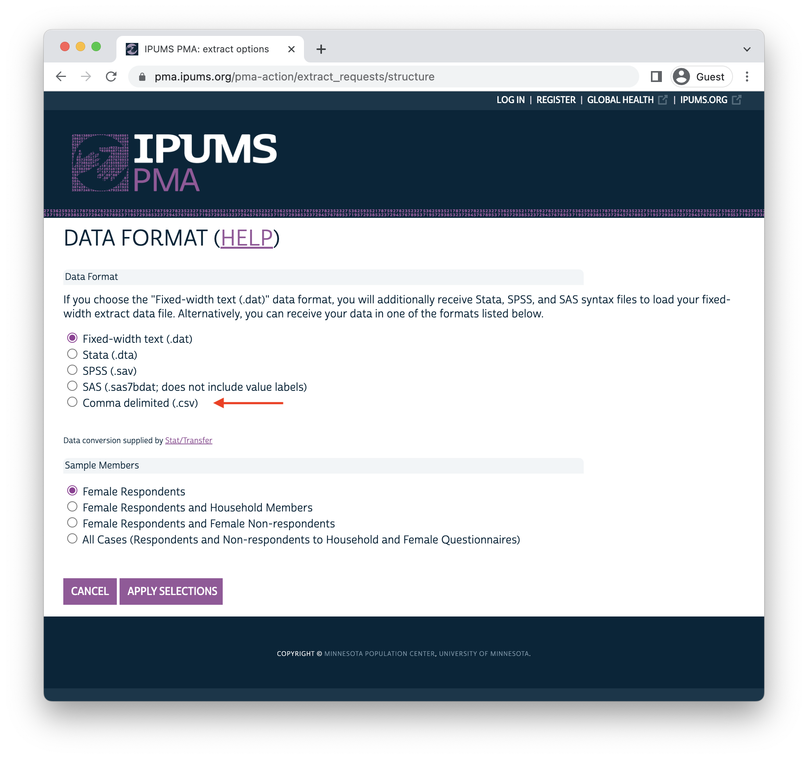

```{r setup, echo=FALSE, results='hide'}
# knitr options 
knitr::opts_chunk$set(
  echo = TRUE, 
  eval = TRUE,
  fig.align='center',
  R.options = list(width = 80)
)

options(tibble.print_min = 20)

# load utils 
source(here::here("r/utilities.r"))
set_postpath("2022-12-09-data-dictionary")
update_geom_defaults("text", list(family = "cabrito", size = 4))
```

Have you ever wondered why IPUMS encourages R users to download data in the **Fixed-width text (.dat)** data format? After all, most analysts are probably more familiar with the **Comma delimited (.csv)** format, and you might already know some handy functions like `r funlink(readr::read_csv)` that can help identify variable classes when you load `.csv` data into R. 

In fact, IPUMS *does* make `.csv` data available at checkout. You can find it listed at the bottom of the Data Format menu here: 

```{r, echo=FALSE}

```

One big problem with using `r funlink(readr::read_csv)` to import such a file is that the resulting dataset contains no helpful [attributes](http://adv-r.had.co.nz/Data-structures.html#attributes) to tell the analyst more about the data they're working with! 

Another issue is that `r funlink(readr::read_csv)` makes a guess about the appropriate variable class for each column - and particularly when one of your columns contains a lot of blank strings, it can guess *wrong*. Here, we've downloaded a `.csv` file containing the variables `r varlink(ABORDECOTHSP)` and `r varlink(ABORCFOTHSP)`, which contain open string responses describing a woman's abortion experience only if she 1) reported having an abortion, and 2) exhausted a number of response options listed on the questionnaire.

If you check the documentation for `r funlink(readr::read_csv)`, you'll see that `r funlink(readr::read_csv)` makes guesses about column type based only on the *first 1000 rows by default*. In our dataset, the first 1000 rows for `r varlink(ABORDECOTHSP)` and `r varlink(ABORCFOTHSP)` are blank, so `r funlink(readr::read_csv)` guesses that they might be **logical**, rather than **character** variables. 

```{r, message=TRUE, warning=TRUE}
library(tidyverse)
csv <- read_csv("data/pma_00181.csv.gz")
```

This is a big problem! To see why, let's count the responses in `r varlink(ABORDECOTHSP)`:

```{r}
csv %>% count(ABORDECOTHSP)
```

You should expect to see several responses listed here, but instead only `NA` values are found. This is because **logical** values should only be `TRUE`, `FALSE`, or `NA` - when R encounters any *other* value, it transforms them into `NA` by [coercion](http://adv-r.had.co.nz/Data-structures.html#vectors). **If you're not careful with** `r funlink(readr::read_csv)`, **it is easy to accidentally distort or remove data by coercion.** 

Meanwhile, if we examine a variable like `r varlink(COUNTRY)`, we'll find only numeric codes with no value labels attached: 

```{r}
csv %>% count(COUNTRY)
```

You can certainly find the labels for each value on the IPUMS PMA website, but it would be much more convenient to have these and other attributes loaded into R. 

# Data Dictionary 


Now let's import the same data as a **fixed width (.dat)** file together with metadata provided by an accompanying `.xml` file. As recommended, we'll use the function `r funlink(ipumsr::read_ipums_micro)` to load these two files into R. 

```{r, results='hide'}
library(ipumsr)
dat <- read_ipums_micro(
  ddi = "data/pma_00180.xml",
  data = "data/pma_00180.dat.gz"
)
```

The `.xml` file contains all the information R needs to correctly identify the class for each variable. Note that `r varlink(ABORDECOTHSP)` now contains the string responses we expected to see (reported in the language spoken by the respondent): 

```{r}
dat %>% count(ABORDECOTHSP)
```

Moreover, value labels for `r varlink(COUNTRY)` are printed to the console: 

```{r}
dat %>% count(COUNTRY)
```

In fact, value labels are only one of several attributes associated with each variable in an IPUMS dataset. The `.xml` file also provides 1) a brief label for each variable, and 2) the detailed variable description shown on the DESCRIPTION tab on our website. For instance, here is the DESCRIPTION tab for the variable  `r varlink(PREGENDEV)`:

```{r, layout="l-body-outset", echo = FALSE}
knitr::include_url(
  "https://pma.ipums.org/pma-action/variables/PREGENDEV#description_section",
  "800px"
)
```

You can access all of the `.xml` metadata for `r varlink(PREGENDEV)` with the functions `r funlink(ipumsr::ipums_val_labels)`, `r funlink(ipumsr::ipums_var_label)`, and `r funlink(ipumsr::ipums_var_desc)`, or you can combine them into a tabular **data dictionary** with the function `r funlink(ipumsr::ipums_var_info)`. Let's call this table `dd`. 

```{r}
dd <- dat %>% ipums_var_info()
dd
```

Just a quick note on terminology here: the terms **data dictionary** and **codebook** are often used interchangeably. Personally, I think of a  **data dictionary** as a tabular or machine-readable tool describing the contents of a dataset (usually for the purpose of improving user experience with statistical software); a **codebook** is usually - well, *book*-like. Analysts often create a **codebook** containing metadata and summary statistics for each variable in a survey dataset. 

You might want access to a **data dictionary** like `dd` if you wanted to quickly identify all of the variables in a data extract that contain a search term like "abort". 

```{r}
dd %>% 
  filter(var_label %>% str_detect("abort")) %>% 
  pull(var_name)
```

You can also search the detailed **variable description** for each variable the same way: 

```{r}
dd %>% 
  filter(var_desc %>% str_detect("abort")) %>% 
  pull(var_name)
```

# Codebook 

Another reason you might want access to a **data dictionary** is that - combined with tools like `r funlink(pagedown)` or `r funlink(bookdown)`- it can help generate a detailed **codebook** with just a few lines of code. 

<div>
Here, we'll build a quick **codebook** with `r funlink(pagedown)`, so we'll need to create an RMarkdown file called `codebook.Rmd` with the following YAML header pointing to a helper CSS file in our working directory. We'll specify that we want the output to be paginated for HTML (although we'll ultimately tell R to turn that output into a PDF with `r funlink(pagedown::chrome_print)`), and we'll give a custom title to our Table Contents page. 

```
---
output:
  pagedown::html_paged: 
    toc: true
    self_contained: false
toc-title: 'IPUMS PMA Codebook: <br>Pregnancy Termination Variables'
css:  'custom.css'
---
```
</div>

<aside>
```{r, echo=FALSE}
hex("pagedown")
```
</aside>

The first few lines of code in this Rmarkdown file should load your dataset and create a **data dictionary** called `dd` as shown above. Additionally, we'll drop the first 12 variables that are preselected for every IPUMS PMA data extract.

```{r, eval = FALSE }
library(ipumsr)
library(tidyverse)
library(gtsummary)
library(gt)

dat <- read_ipums_micro(
  ddi = "data/pma_00180.xml",
  data = "data/pma_00180.dat.gz"
)

dd <- dat %>% ipums_var_info() %>% slice(-c(1:12))
```

<div>
Besides the information already contained in `dd`, we might want to add a table showing the frequency of each response for every labelled variable (excluding mainly ID variables like `r varlink(EAID)` and `r varlink(FQINSTID)`). We'll use `r funlink(gtsummary)` to create a frequency table for every such variable, and we'll attach the results in a column called `tbl` in our **data dictionary**. 

```{r, eval=FALSE }
dd$tbl <- dd$var_name %>% 
  map(
    ~if(dat[[.x]] %>% is.labelled){
      dat %>%
        select(!!.x) %>%
        mutate(across(where(is.labelled), ~.x %>% as_factor %>% fct_drop)) %>%
        tbl_summary() %>%
        modify_footnote(update = list(stat_0 ~ NA)) %>%
        bold_labels() %>%
        as_gt() %>%
        tab_options(
          column_labels.hidden = TRUE,
          table.font.names = "cabrito_sans_norm_regular",
          table.width = pct(100),
          table.font.size = ".8em"
        )
    }
  )
```
</div>

<aside>
```{r, echo=FALSE}
hex("gtsummary")
```
<br>
Check out [this post](../2021-07-01-covid-tables/) for an in-depth tutorial on  `r funlink(gtsummary)` tables.
</aside> 

Next we'll use `r funlink(purrr::pwalk)` to iterate over each of the rows in `dd`: the `r funlink(purrr::walk)` family of functions works just like the iterative function `r funlink(purrr::map)`, except that the results are *not* returned in a list. Instead, we'll call `r funlink(base::cat)` to capture the text results within each iteration. 

What about the `r funlink(purrr::pwalk, "p")` in `r funlink(purrr::pwalk)`? This stands for "parallel" in the sense that an arbitrary number of inputs can be processed in parallel. In our case, we want to return text from the columns `var_name` and `var_desc`, and then return either HTML code representing our `r funlink(gtsummary)` table or an explanation like *Table omitted for space constraints*. 

This is achieved with a custom [function](https://r4ds.had.co.nz/functions.html) with unnamed arguments represented by the ellipsis `...` - this carries *all* of the columns in each row of `dd` into a list we call `text`. Hence, `text$var_name` returns `r varlink(SAMPLE)` in the first iteration, while `text$var_desc` returns its variable description and `text$tbl` returns its `r funlink(gtsummary)` table. The second iteration returns text for `r varlink(COUNTRY)`, and so-on.  

```{r, eval=FALSE }
dd %>% 
  pwalk(function(...){
    text <- list(...)
    text$var_name %>% 
      paste("#", ., "{.unnumbered} \n\n") %>% 
      paste(text$var_desc, "\n\n") %>% 
      cat()
    if(is.null(text$tbl)){
      cat("*Table omitted for space constraints*\n\n")
    } else {
      text$tbl %>% as_raw_html() %>% cat()
    }
  })
```

<aside>
Make sure to use the option `results='asis'` in this chunk to capture the output of `r funlink(base::cat)` as plain text. 
</aside>

Once you've saved this RMarkdown file, type the following function *directly into the R console* to generate a PDF. 

```{r, eval=FALSE}
pagedown::chrome_print("codebook.Rmd","codebook.pdf")
```

The result looks like this: 

```{r, layout="l-body-outset", echo = FALSE}
knitr::include_url("codebook.pdf#zoom=75", "800px")
```

# Scraping Additional Metadata 

This codebook is a great start, but you'll find even more metadata available on the IPUMS PMA website. For example, the AVAILABILITY tab for `r varlink(PREGENDEV)` tells us that this variable is only available for certain samples:

```{r, layout="l-body-outset", echo = FALSE}
knitr::include_url(
  "https://pma.ipums.org/pma-action/variables/PREGENDEV#availability_section",
  "800px"
)
```

Although this information is not included in the `.xml` file we used to produce `dd`, we can easily **scrape** it from the website with help from the `r funlink(rvest)` package. First, locate the URL for the variable you want to scrape:

```{r}
pma_url <- "https://pma.ipums.org/pma-action/variables/PREGENDEV"
```

<div>
Next, we'll load `r funlink(rvest)` and use a few of its basic functions to load the AVAILABILITY text into R. Each tab on the IPUMS PMA website is represented by CSS tag that also appears at the end of URL when you click on the tab. For example, clicking on the AVAILABILITY tab add the suffix `#availability_section` to the URL shown in `pma_url`. 

Simply use `r funlink(rvest::read_html)` to read the full HTML for `pma_url`, then pipe the HTML to `r funlink(rvest::html_elements)` to select "#availability_section" and `r funlink(rvest::html_text2)` to return the text located there. 
</div>

<aside>
```{r, echo=FALSE}
hex("rvest")
```
</aside> 

```{r}
library(rvest)

pma_text <- pma_url %>% 
  read_html() %>% 
  html_elements("#availability_section") %>% 
  html_text2()

pma_text
```

This text includes special characters indicating line-breaks. Again, you can preview the formatted text with `r funlink(base::cat)`.

```{r}
cat(pma_text)
```

All of the tabs you'll find on the IPUMS PMA site can be accessed this way, except for the CODES and QUESTIONNAIRE TEXT tabs. While the CODES tab is redundant with information already accessible in our dataset, there may be instances where you want to access the original text of the questionnaire. If you use the same approach to scrape it, you'll get no results: 

```{r}
pma_url %>% 
  read_html() %>% 
  html_elements("#questionnaire_text_section") %>% 
  html_text2() 
```

This is because Javascript is required to display text on both of these tabs. Fortunately, IPUMS also has a hidden static HTML page (which you can find by right-clicking on the QUESTIONNAIRE TEXT tab and clicking "inspect" on most browsers). You can use the following modified URL to scrape questionnaire text if needed: 

```{r}
pma_enum_text <- pma_url %>% 
  paste0("/ajax_enum_text") %>% 
  read_html() %>% 
  html_elements(".docSectionSample") %>% 
  map_df(
    ~c(
      SAMPLE = .x %>% html_element(".td1") %>% html_text2(),
      TEXT = .x %>% html_element(".enum_section_text") %>% html_text2()
    )
  )

pma_enum_text
```

So what if we want to add text from each tab to our **codebook**? We'll just need to iterate over each tab for every variable, and then add the results to `dd`. 

```{r, eval=FALSE}
dd <- dd %>% 
  rowwise() %>% 
  mutate(
    url = paste0("https://pma.ipums.org/pma-action/variables/", var_name),
    comp = url %>% 
      read_html() %>% 
      html_elements("#comparability_section") %>% 
      html_text2(),
    avail = url %>% 
      read_html() %>% 
      html_elements("#availability_section") %>% 
      html_text2(),
    universe = url %>% 
      read_html() %>% 
      html_elements("#universe_section") %>% 
      html_text2(),
    qtext = url %>% 
      paste0("/ajax_enum_text") %>% 
      read_html() %>% 
      html_elements(".docSectionSample") %>% 
      map_df(
        ~c(
          SAMPLE = .x %>% html_element(".td1") %>% html_text2(),
          TEXT = .x %>% html_element(".enum_section_text") %>% html_text2()
        )
      ) %>% 
      list()
  ) %>% 
  ungroup()
```

```{r, echo=FALSE, eval=FALSE}
dd %>% write_rds("data/dd.rds.gz", compress = "gz")
```

```{r, echo=FALSE}
dd <- read_rds("data/dd.rds.gz")
```

We'll then need to modify the final chunk in `codebook.Rmd` to add the text from each of these new columns. Our data extract contains 17 different samples, so we'll choose not to show the questionnaire text we've scraped in each case - you could easily add it, though, if it's important to compare small variations in the question administred in each survey. 

```{r, eval = FALSE }
# Create headings for each metadata section 
dd <- dd %>% 
  mutate(
    var_name = var_name %>% 
      paste("#", ., "{.unnumbered}"),
    comp = comp %>% 
      str_replace("Comparability", "#### Comparability {.unnumbered}\n"),
    avail = avail %>% 
      str_replace_all("\n", "\n - ") %>% 
      str_replace("Availability", "#### Availability {.unnumbered}\n"),
    universe = universe %>% 
      str_replace_all("\n", "\n - ") %>% 
      str_replace("Universe", "#### Universe {.unnumbered}\n")
  )

# Add one new `cat` for each new metadata section
dd %>% 
  ungroup() %>% 
  pwalk(function(...){
    text <- list(...)
    text$var_name %>% cat("\n\n")
    text$var_desc %>% cat("\n\n")
    text$comp %>% cat("\n\n")
    text$avail %>% cat("\n\n")
    text$universe %>% cat("\n\n")
    cat("#### Results {.unnumbered} \n\n")
    if(is.null(text$tbl)){
      cat("*Table omitted for space constraints*\n\n")
    } else {
      text$tbl %>% as_raw_html() %>% cat()
    }
  })
```

And here's the final result - a fully automated **codebook** containing nearly all of the metadata available for each variable in the Pregnancy Termination group on the IPUMS PMA website! 

```{r, echo=FALSE, eval=FALSE}
pagedown::chrome_print("codebook2.Rmd","codebook2.pdf")
```

```{r, layout="l-body-outset", echo = FALSE}
knitr::include_url("codebook2.pdf#zoom=75", "800px")
```

