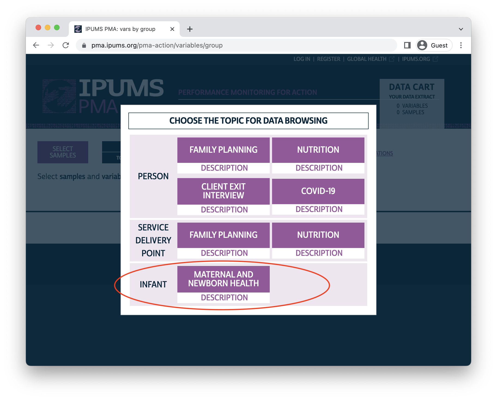

```{r setup, include=FALSE}
source(here::here("r/utilities.r"))
set_postpath("2023-01-31-abor-discovery")
test_links <- FALSE 

knitr::opts_chunk$set(
  echo = FALSE, 
  eval = TRUE,
  fig.align='center',
  R.options = list(width = 100)
)
```

Here at IPUMS PMA, we're kicking off 2023 with a huge release of newly harmonized family planning data! This release spans multiple units of analysis and represents surveys conducted in several countries, so we'll provide a quick tour of the major topics in this post. We'll then cover each of those topics in detail throughout multiple blog series in the first half of the year, beginning with our upcoming series on PMA abortion data.

As always, we've also provided full [release notes](https://pma.ipums.org/pma-action/revisions) over on our website, where you'll also find information about a few improvements to data in previously released samples. 

# Abortion Data 

Three of the surveys included in this release are primarily focused on women's experiences seeking and accessing abortion services. Each is a **follow-up** to a **cross sectional** survey conducted with the same women in 2018 in the following countries: 

| Country | Baseline Survey | Follow-Up  | Follow-Up Eligibility   |
| ------ | ------ | ------ | --------------- | 
| Côte d'Ivoire | 2018  | 2019  | Any woman who had <br> "removed a pregnancy" or <br> "regulated her period" |
| Nigeria       | 2018  | 2020  | Any woman who had <br> "removed a pregnancy" or <br> "regulated her period" |
| Ethiopia      | 2018  | 2020  | All previously interviewed women |


In the 2018 Côte d'Ivoire and Nigeria samples, women were asked whether they had "ever done something to remove a pregnancy" or "done something to regulate your period" when pregnant or worried that they were pregnant. Those who answered "Yes" to *either question* were invited to participate in the follow-up surveys included in this release. All women in the 2018 Ethiopia sample were invited to participate in the follow-up, regardless of their answer to these questions. 

This distinction is particularly notable: while PMA User Notes for the [Côte d'Ivoire](https://pma.ipums.org/pma/resources/dataset_notes/hhf/PMA2020_CIR2FU_Abortion_FQ_UserNotes_En_v1.0_20Aug2021.pdf) and [Nigeria](https://pma.ipums.org/pma/resources/dataset_notes/hhf/PMA2020_NGR5FU_Abortion_FQ_UserNotes_En_v1.0_14Dec2021.pdf) use the shorthand title "Follow-up (Abortion) Surveys", women participating in the survey do not necessarily describe their experiences as abortion. In our upcoming series, we'll examine how experiences differ for women who reported "removing a pregnancy" compared with those who reported "regulating their period". 

We'll also explore how researchers might approach the **longitudinal structure** of these surveys. Like the PMA [panel surveys](../../#category:Panel_Data)[^1] we covered here in Spring 2022, IPUMS PMA has made these data available in both **wide format** (one woman per row) and **long format** (separate rows for cross sectional and follow-up surveys) so that you can select the data that best meet your needs. 

[^1]: PMA abortion follow-up surveys are *not* part of the PMA **panel study**, which covers a broader range of family planning topics. The PMA **panel study** includes three interviews with women of reproductive age, each conducted one year apart. For more information, check out our [blog series](../../#category:Panel_Data) or our [PDF guide](../2022-11-18-phase2-pdf/) published earlier this year. 
 
These follow-up surveys focus on several topics related to the woman's own abortion experiences, often described in separate questions for pregnancy removal and period regulation: 

  - The `r varlink("group?id=fem_term", alt = "timing and circumstances")` surrounding pregnancy removal, including whether the woman was `r varlink("group?id=abor_life", alt = "using contraception")` beforehand 
  - Providers and methods used for `r varlink("group?id=fem_abormeth", alt = "pregnancy removal")` and `r varlink("group?id=fem_regmeth", alt = "period regulation")`
  - Whether the woman experienced `r varlink("group?id=fem_issues", alt = "problems related to")` pregnancy removal or period regulation, including whether and where she sought treatment
  - Whether the woman was able to use her `r varlink("group?id=fem_aborsource", alt = "preferred method and provider")`
  - The overall `r varlink("group?id=fem_termcare", alt = "quality of care")` she received 
  - Whether she adopted a `r varlink("group?id=abor_fp", alt = "family planning method")` or discussed one with a provider afterward 
  - Whether other people were involved in the decision to `r varlink("group?id=abor_dec", alt = "remove her pregnancy")` or `r varlink("group?id=fem_reg", alt = "regulate her period")`
  - Her general `r varlink("group?id=abor_att", alt = "views on abortion")`, including specific circumstances in which she thinks abortion should be legal or acceptable, and whether she believes certain methods are "period regulation" or "pregnancy removal"

Additionally, each woman is asked to reflect on abortion in her community. These questions cover topics like: 
  
  - Her knowledge about the `r varlink("group?id=fem_abornet", alt = "pregnancy removal")` and `r varlink("group?id=fem_regnet", alt = "period regulation")` experiences of other women, including up to three close confidantes
  - `r varlink("group?id=fem_aborcomm", alt = "Common methods")` used by women in her community
  
Watch for upcoming posts showcasing these social network questions as well: we'll learn how some researchers use the [network scale-up method](https://www.demographic-research.org/volumes/vol43/56/default.htm) to estimate incidence ratios for pregnancy removal and period regulation procedures in hidden populations. 

# Maternal and Newborn Health 

Maternal and Newborn Health (MNH) surveys are a unique product from [PMA Ethiopia](https://www.pmadata.org/countries/ethiopia): they represent panel data following women who were pregnant at the time of a baseline survey, and who participated in regular follow-up surveys following childbirth. Prior to this release, IPUMS PMA had published data from a single cohort of women interviewed at baseline in 2016; this release includes data from a **new cohort** interviewed at baseline in 2019. 

| Country | Baseline <br> Survey | Follow-Up Schedule | Follow-Up Eligibility   |
| ------ | ------ | ------ | ------------------ | 
| Ethiopia | 2016  | 7 days <br> 6 weeks <br> 6 months  | Pregnant at baseline |
| *Ethiopia* | *2019*  | *6 weeks <br> 6 months <br> 1 year*  | *Pregnant or < 9 weeks postpartum at baseline* |

Because 2019 baseline surveys were collected just months before the emergence of COVID-19, researchers at PMA Ethiopia were able to quickly modify follow-up surveys to include questions about the pandemic's impact on mothers and the newborn children in the panel. These revised questionnaires address whether pandemic restrictions impacted women's ability to receive [postnatal care or vaccinations](https://pma.ipums.org/pma-action/variables/group?id=fem_cvhealth), changed the [planned location of delivery](https://pma.ipums.org/pma-action/variables/group?id=fem_cvexp), or otherwise impacted their pregnancy. The new variables `r varlink(SURVEYVERSION_6W)` and `r varlink(SURVEYVERSION_6M)` indicate whether panel members received a questionnaire that was modified to address COVID-19. 

You'll notice that, compared with other PMA Family Planning surveys, MNH surveys have a unique data stricture: MNH data from the 2019 cohort includes records for household members and the women who are part of the panel. **IPUMS has adjusted the data format such that each non-household member record represents one infant (both live and stillbirth),** or a panel member woman if the pregnancy ended in miscarriage or abortion. There are multiple cases of twins, in which case the attributes of the mother and the household are attached on each infant's record. Therefore, in each file, mothers of twins are represented twice. There are also a small number of cases of households with more than one pregnant woman. These households will also be represented more than once.

Because of the unique structure of MNH data, you'll find them under a separate [unit of analysis](https://pma.ipums.org/pma-action/variables/group) in the IPUMS PMA data extract system. 

```{r}

```

# New Family Planning Panel Data 

Finally, the third component of this release includes an update to the ongoing  [PMA panel study](../../#category:Panel_Data) we've been covering for the last year on this blog. IPUMS PMA has now released the final Phase 1 (baseline) survey in this study: a nationally representative sample from **Niger**. 

```{r, layout="l-body-outset"}
library(kableExtra)
options(knitr.kable.NA = '')

avail <- read_csv("data/sample_avail.csv") 
names(avail)[2] <- paste0(
  names(avail)[2], 
  footnote_marker_symbol(1)
)

avail %>%   
  arrange(Sample) %>% 
  kable(escape = FALSE, format = "html", table.attr = "style='width:100%;'") %>% 
  kable_styling() %>% 
  row_spec(7, italic = TRUE) %>% 
  add_header_above(c(" " = 2, "Now Available from IPUMS PMA" = 3)) %>% 
  scroll_box(
    width = "100%", 
    box_css = paste(
      sep = "; ",
      "margin-bottom: 1em",
      "margin-top: 0em",
      "border: 0px solid #ddd",
      "padding: 5px"
    )
  ) %>%
  footnote(
    symbol = "Each data collection phase is spaced one year apart", 
    escape = TRUE
  )

```

All of these samples are now available in Cross-sectional format, while those with two or more available phases are also available in Longitudinal format. Check back here over the coming months for updates on Phase 2 and Phase 3 samples!