# All users: first time setup 

## R, RStudio, and required packages

To get a copy of R, visit the [Comprehensive R Archive Network](https://cloud.r-project.org/) (CRAN) and choose the right download link for your operating system. 

The PMA Data Hub is organized as an [RStudio Project](https://support.rstudio.com/hc/en-us/articles/200526207-Using-Projects), so you'll also need to use [RStudio](https://rstudio.com/products/rstudio/download/) (not base R). 

*Note: a copy of RStudio running R version 4.0.2 (or higher) lives on the MPC gp1 server* [here](https://rstudio4.gp1.pop.umn.edu/). Members of the MPC GitHub organization can access an article specifically about using RStudio on gp1 (e.g. how to build a package library) [here](https://pages.github.umn.edu/mpc/ipumsPMA/articles/rstudio_gp1.html).

When you've got RStudio set up, install these packages:

```{r, eval = F, echo = T}
install.packages("rmarkdown")
install.packages("knitr")
install.packages("distill")
install.packages("usethis")
```

**Troubleshooting note:** the package `rmarkdown` comes along with RStudio, but you may receive an older version than we need to build the site. So, when you try `install.packages("rmarkdown")`, you may get a message asking to restart R (avoiding a conflict with the prior version). *We've found that it's best to reply 'No' to the restart prompt, wait for rmarkdown to install, and then re-launch RStudio.* If you do choose to restart, you may experience a recursive loop of restart prompts! 

## Initialize your UMN GitHub account

Contributors to the PMA Data Hub will work on an internal copy of the public site - it's visible only to certain people affiliated with the MPC. A smaller team of Data Hub "admin" (currently Matt & Nina) will take care of migrating content from the private site to our public site: we're always here to help with formatting, editing, and version control! 

**So what is UMN GitHub?** GitHub, itself, is a company that hosts projects on proprietary server: when you make a repository "public", anyone in the world can visit your project on a GitHub server. GitHub also makes its underlying software available to institutions that want to provide a similar service *restricted to institutional members*. In practice, UMN operates its own GitHub server where organizations like the MPC can host projects that are more private in scope. 

UMN GitHub is an instance of [Enterprise GitHub](https://docs.github.com/en/github/getting-started-with-github/githubs-products#github-enterprise), whereas the public version of our blog lives in a space that folks sometimes call "public GitHub". It's common for people to have one account for "public GitHub" and one account for their job associated with an "enterprise GitHub". **To initialize an account for UMN GitHub, visit [github.umn.edu](https://github.umn.edu) and log in with your University Internet ID and password.**  

## Using UMN GitHub from RStudio

First things first: you must install install [Git](https://git-scm.com/) on your computer if it isn't there already. Mac OS comes with git installed,^[You can check its location by running "which git" in Terminal, and "git --version" to check the installed version. If git is somehow not installed, use the "Install git using Homebrew" instructions [here](https://jennybc.github.io/2014-05-12-ubc/ubc-r/session03_git.html)] while other users should [download](http://git-scm.com/downloads) the right Git for their operation system. *If you're using RStudio on the gp1 server, Git is already installed.*

Next, open the `Global Options` menu in RStudio and locate the Git/SVN tab. Ensure that the box shown below is checked, and then enter the location of the executable file^[Mac users: type "which git" in terminal and enter the result; Windows users: look for git.exe (most likely in Program Files)] for your Git installation:

```{r}
knitr::include_graphics("images/internal/git-menu.png")
```

Lastly, you should provide Git with a username, email, and Personal Access Token (PAT) for your UMN GitHub account. If you've installed [usethis](https://usethis.r-lib.org/articles/articles/git-credentials.html) as shown [above](#r-rstudio-and-required-packages), you'll be able to set these up with R commands (changes will be applied to globally wherever you use Git on your operating system). First, set the username and email address for your UMN GitHub account. For example, mine are:

<aside> 
<b>Why a PAT?</b> GitHub plans to deprecate password authentication in the near future. You could use one for now (like the example below), but you'll need one soon!
</aside> 

```{r, eval=F, echo=T}
gert::git_config_global_set("user.name", "Matt Gunther")
gert::git_config_global_set("user.email", "mgunther@umn.edu")
```

Then, create a PAT for your account with:

```{r, eval = F, echo = T}
usethis::create_github_token(host = "https://github.umn.edu")
```

Your browser will open to a webpage. **Check all the boxes you see**, then click the green `Generate Token` button. On the next page, notice the very long string shown in the green box: this is your PAT. *Don't close this page yet!*. Return to R and call:

```{r, eval=F, echo=T}
gitcreds::gitcreds_set("https://github.umn.edu")
```

You'll be asked to enter a new password or token: copy and paste your PAT from your browser and press Enter. From now on, RStudio and Git will be able to access your UMN GitHub account automatically! (If you have a personal GitHub account at github.com, you could repeat this process substituting `https://github.com` for `https://github.umn.edu`, and Git will automatically choose the right credentials based on the repository associated with your project). 

## The PMA Data Hub Repository

Open RStudio and navigate to `File > New Project`, then select `Version Control`:

```{r}
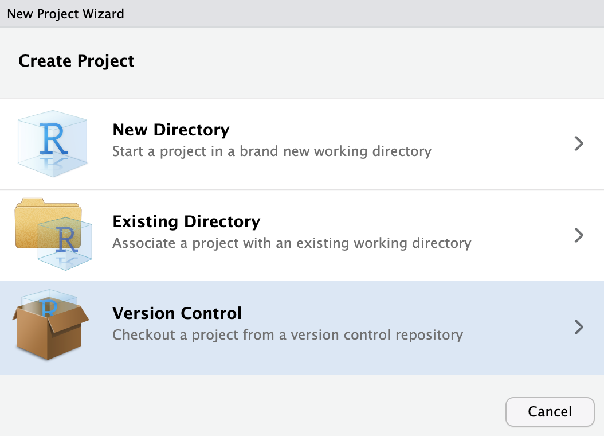
```

Choose `Git` to clone our project from a GitHub repository:

```{r}
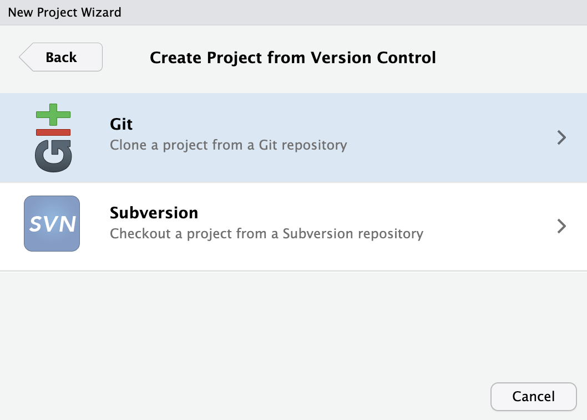
```

On the next menu page, enter the address for the enterprise repository exactly as shown (do not clone the public repository):

```
https://github.umn.edu/mpc/pma-data-hub/
```

Also enter the project directory name "pma-data-hub" as shown:

```
pma-data-hub
```

In the third field, choose a location where you would like to save this file on your computer (mine was "~/R" - **insert your own path, instead**). Finally, click `Create Project`.

<aside>
When choosing a place to save this project, <b>do not save to a network drive</b>. This seems to cause RStudio to crash!
</aside>

```{r}
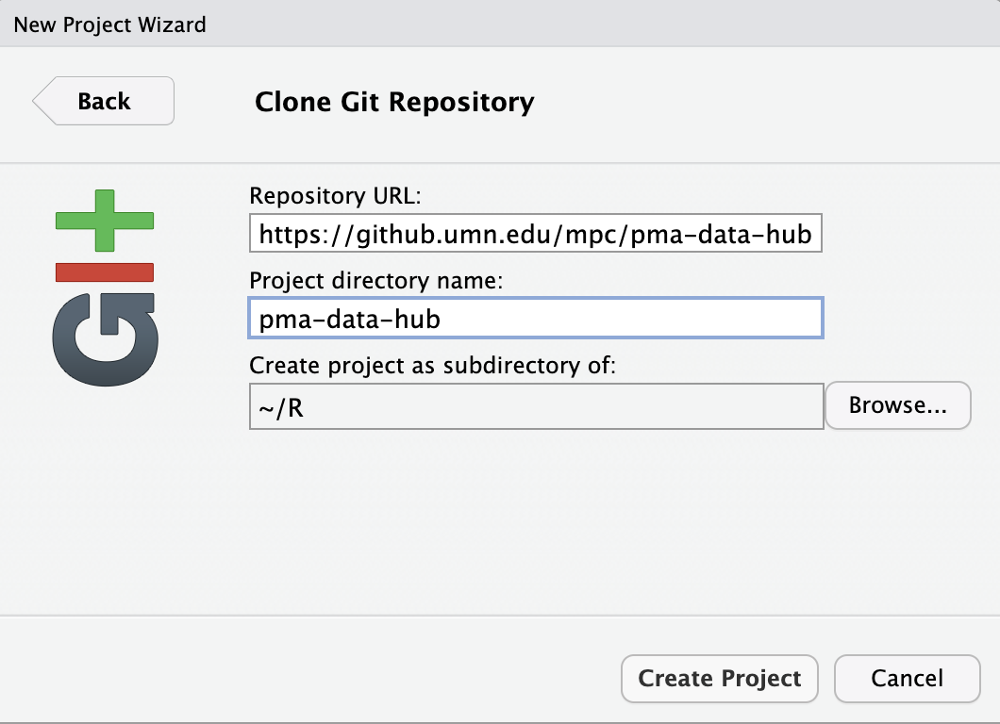
```

If you have not configured Git to automatically use your UMN GitHub credentials with the [steps shown above](#using-umn-github-from-rstudio), you may be prompted to provide them in a pop-up window:

```{r}
knitr::include_graphics("images/internal/username.png")
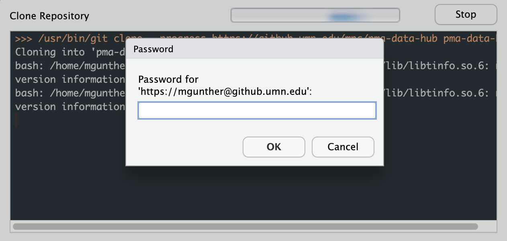
```

<aside>
Until you configure Git with these credentials, you'll have to do this every time you interact with GitHub. Additionally, <b>password authentication for GitHub will be deprecated in the near future</b> so you'll need to do it soon!
</aside>

After a short bit, RStudio will relaunch and open the new project. If you adjust the windows to show the tabs `Git` (left) and `Files` (right), you should see something like this:

```{r}
knitr::include_graphics("images/internal/clone_success.png")
```

You have now downloaded a copy of the Enterprise repository to your computer! 

Moreover, because you've connected these files to a GitHub repository, the RStudio Project will now keep track of changes you make to the files in this folder, and it will prompt you to upload your changes back to GitHub: as you add, edit, or delete files, a list of changes will appear in the `Git` tab. 

<aside>
To open an RStudio project, click on the file <b>pma-data-hub.Rproj</b>. If you ever forget, RStudio won't know to look for a Git history associated with all of the underlying files.
</aside>

Notice the word `master` shown in the `Git` tab - this shows that any changes we make to files will be recorded in our local copy of the "master" version of the repository. If we made changes here and then *pushed* them to GitHub, they would be reflected on the "master" version we've saved there, too.

In general, Matt and Nina will be responsible for merging finished blog posts to the master branch and deploying its contents to the "live" blog that's seen by users. **All other contributors should create their own branch when writing a new blog post**; Matt or Nina will merge them to "master" after they've been reviewed and approved by an editor. Read on!

# Authors: Creating a new post

## Create a new branch

Notice that the `Git` tab in RStudio has a purple icon:

```{r}
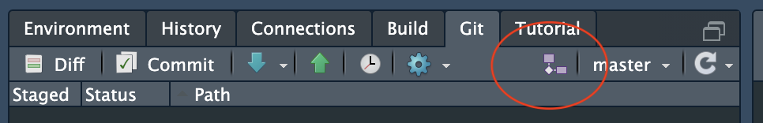
```

Click this icon to create a new branch. You can name it anything you like, but we recommend using your URL slug if possible (e.g. "blog-post-workflow" is the end of the URL for this webpage). Leave the box next to "Sync branch with remote" **checked**, as this will create your branch both locally and on our GitHub page:

```{r}
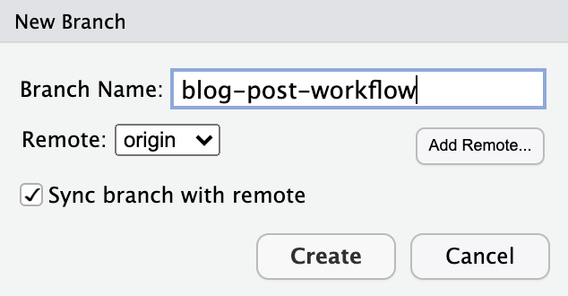
```

RStudio now displays the new branch in place of "master" to show that we're working on the new branch, instead! 

## Create a new folder in "_posts"

Now that you've created a new branch in the `Git` window, take a look at the `File` window.

```{r}
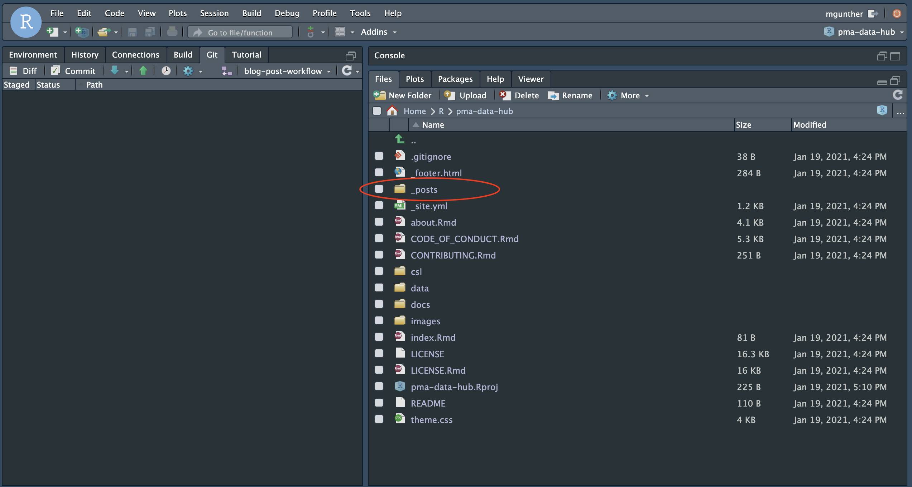
```

The program we use to build the blog is called [Distill](https://rstudio.github.io/distill/), and it takes care of all the back-end work as long as we put every new blog post inside of a unique folder within the "_posts" directory. Opening "_posts", you can see that every post is contained within a time-stamped subfolder:

```{r}
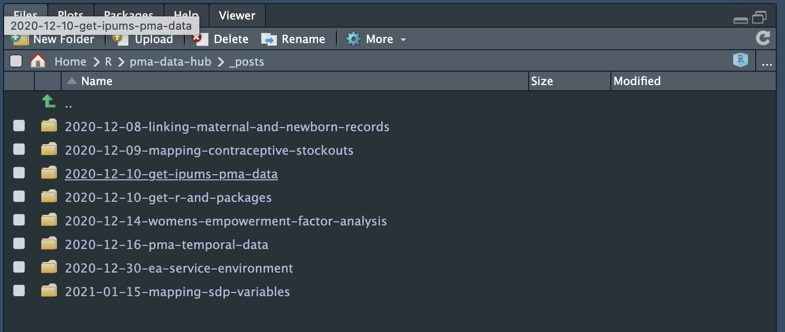
```

To create one of these folders for your new post, enter the following command into R:

```{r, eval=F, echo=T}
distill::create_post("Blog post workflow")
```

This does two things: it creates the folder automatically (circled in red), and it opens a new RMarkdown file where you can begin writing your post (circled in green).

```{r}
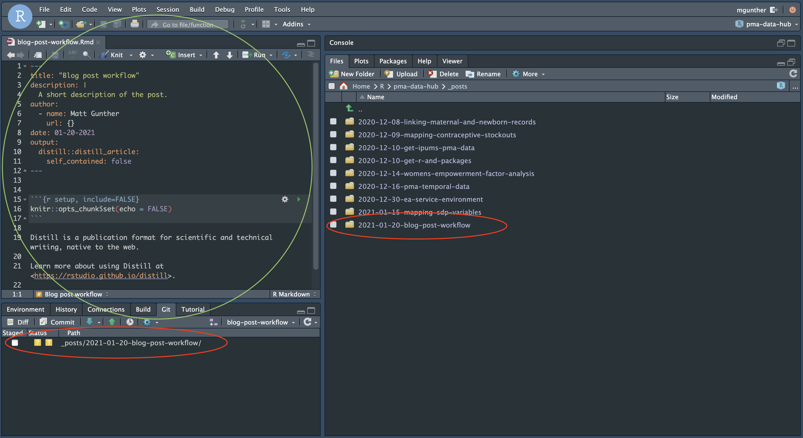
```

<aside>
In red: notice the folder appears in both your <b>File</b> tab and your <b>Git</b> tab. (Don't worry about the date on this folder - it's for internal use and does not need to match the publication date.)

In green: this is the RMarkdown file where you'll write your post.
</aside>

Check out our [Quick-start Guide for authoring content in RMarkdown](rmarkdown-intro.html)!

As you're writing your post, you can preview it as a fully formatted webpage by hitting the `Knit` button at the top of your RMarkdown file:

```{r}
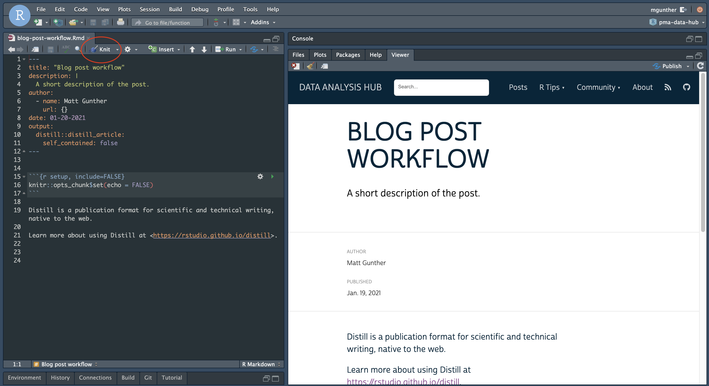
```

<aside>
You can switch between previewing the page in the RStudio Viewer tab, or in your computer's default web browser. Click the settings icon next to "Knit" for preview options.
</aside>

## Push your post to GitHub

When you're finished writing, follow these steps to share your post with the team on our Enterprise GitHub page (reminder: it won't go "live" until Matt or Nina merges your post to `master` and publishes it to the public GitHub page). 

**Press the "Knit" button one more time to render a final HTML version of the page.** (At this point, you may see a number of automatically created files related to your RMarkdown file in the `Git` tab.)

Now, enter the following commands directly into the R console, *but please adjust the brief commit "message" as necessary to describe your change!*

```{r, echo=T, eval=F}
gert::git_add(".")
gert::git_commit("Draft published: blog-post-workflow")
gert::git_push()
```

Now, if you visit our Enterprise GitHub page, your post will appear in a new branch! (It will not yet appear on the copy of the blog we have posted there, which is rendered only from `master`.)

```{r}
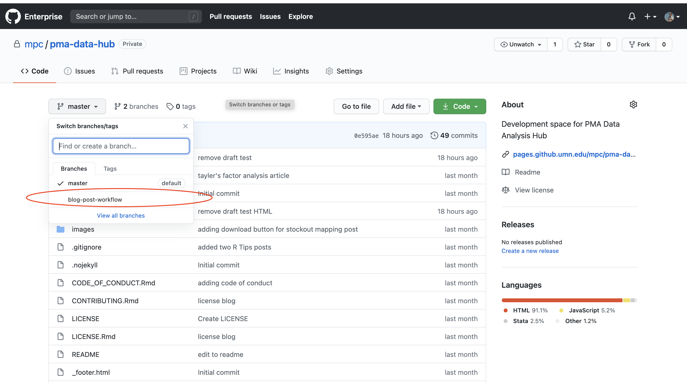
```

# Editors 

## Pull the author's branch to your computer

Any time that you want to review an author's post, you'll always need to get the latest copy of their branch from our Enterprise GitHub page. If this is the first time you've read a draft for the post, the author's branch won't yet be listed in RStudio.

```{r}
knitr::include_graphics("images/internal/master_only.png")
```

<aside>
This editor's RStudio only knows about the "master" branch so far. 
</aside>

The `Pull` button in RStudio's `Git` tab will gather information about all of the new branches on GitHub, and it will download a copy of each one onto your computer:

```{r}
knitr::include_graphics("images/internal/pull_button.png")
```

Clicking it will bring up a dialogue screen. RStudio reports that it discovered a new branch `blog-post-workflow` living at the remote repository `origin`.

```{r}
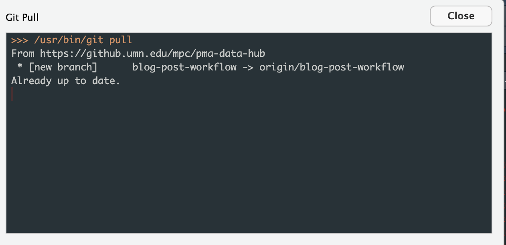
```

Returning to RStudio's main window, notice that you can now toggle between the working on the remote `master` branch, or the new remote branch called `blog-post-workflow`. When you're ready to edit the author's post, use this menu to select their branch.

```{r}
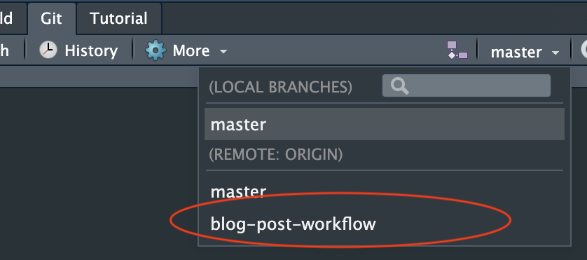
```

RStudio automatically creates a local version of this branch on your computer, and it reports that your changes will be tracked and pushed to the remote branch of the same name.

```{r}
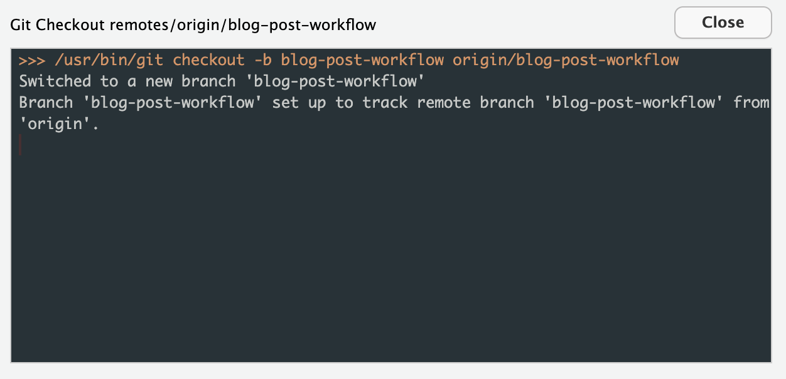
```

## Locate and edit the new post

Now, RStudio shows that you're working on the author's branch in the `Git` tab, and you'll see their post listed in the `_posts` folder on the `Files` tab. Navigate to the `.Rmd` file for their post, then click it to begin making edits.

```{r}
knitr::include_graphics("images/internal/author_post_appears.png")
```

Check out our [Quick-start Guide for authoring content in RMarkdown](rmarkdown-intro.html)!

As you're writing your post, you can preview it as a fully formatted webpage by hitting the `Knit` button at the top of your RMarkdown file:

```{r}
knitr::include_graphics("images/internal/edit_knit.png")
```

<aside>
You can switch between previewing the page in the RStudio Viewer tab, or in your computer's default web browser. Click the settings icon next to "Knit" for preview options.
</aside>

## Push the edited post back to GitHub

When you're finished editing, follow these steps to send the revised file back to GitHub. (Reminder: it won't appear on the website until Matt or Nina merges the post to `master` and publishes it to the public GitHub page).

**Press the "Knit" button one more time to render a final HTML version of the page.** (At this point, you may see a number of automatically created files related to your RMarkdown file in the `Git` tab.)

Now, enter the following commands directly into the R console, *but please adjust the brief commit "message" as necessary to describe your change!*

```{r, echo=T, eval=F}
gert::git_add(".")
gert::git_commit("Draft edited: blog-post-workflow")
gert::git_push()
```

Now, if you visit our Enterprise GitHub page, you'll see that your edited files  appear on the author's branch. (They will not yet appear on the copy of the blog we have posted there, which is rendered only from `master`.)

```{r}
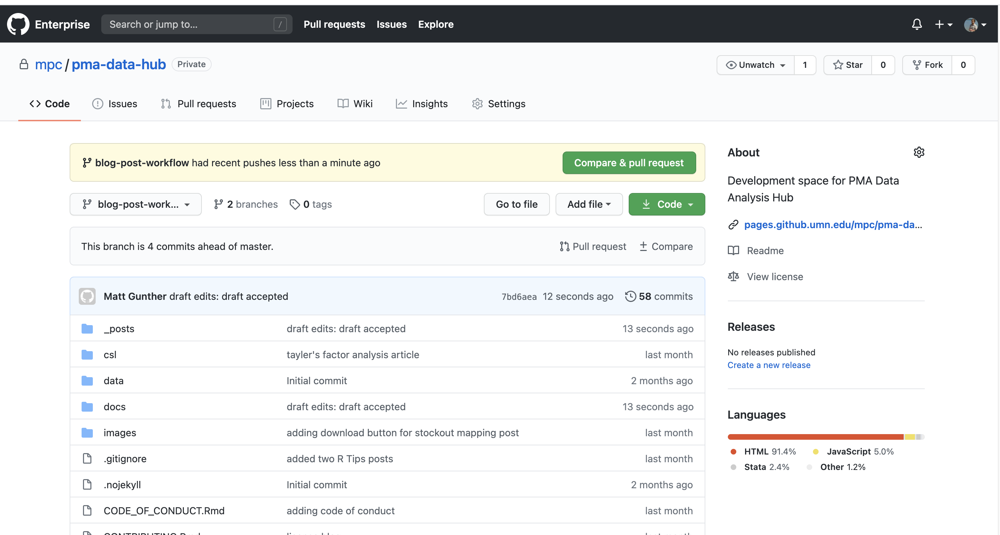
```

# All users: making revisions

When you've finished pushing something to GitHub, **please email your collaborators to let them know about next steps!**

To get your collaborator's latest updates from GitHub, **you should launch the pma-data-hub RStudio project file** called `pma-data-hub.Rproj`. If you forget to open the project file, RStudio will not be able to access the contents of your Git folder (it won't know that there's a GitHub repository for the project at all). 

When you open the project file, RStudio will again display a `Git` tab. Click on the `Pull` button to get your collaborator's latest changes.

```{r}
knitr::include_graphics("images/internal/pull_button.png")
```

Switch from the `master` branch to the branch associated with your post:

```{r}

```

After you're finished incorporating their feedback into the RMarkdown file (.Rmd), **click Knit** and then run these commands in Terminal again to send your work back to GitHub:

```{r, echo=T, eval=F}
gert::git_add(".")
gert::git_commit("Draft complete: blog-post-workflow")
gert::git_push()
```


