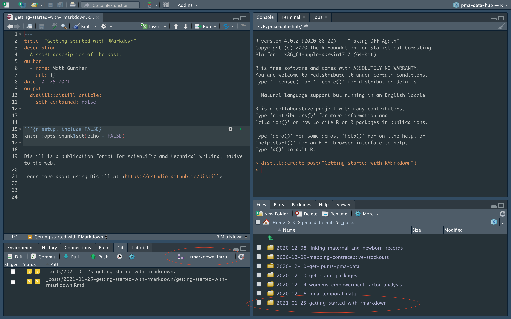
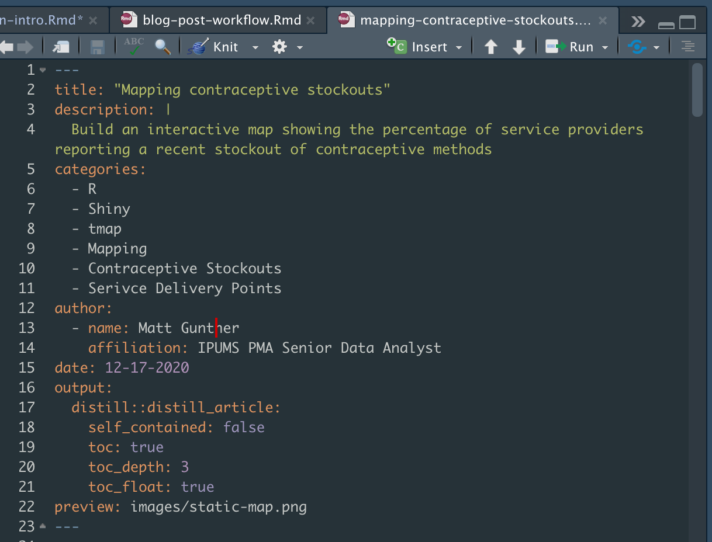
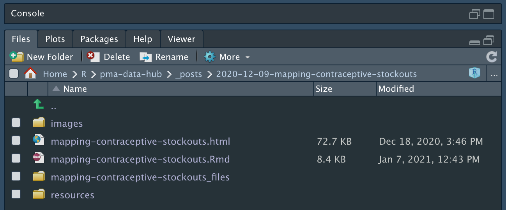
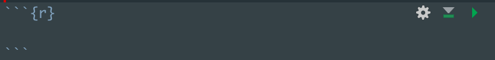

```{r setup, include=FALSE}
knitr::opts_chunk$set(echo = TRUE)
```

RMarkdown documents (.Rmd) work just like regular R scripts (.R) in that you can use them as a space to develop code before sending it to the R Console. The main difference is that an RMarkdown file breaks code into discrete "chunks" of code that can be separated by blocks of text. When you run an RMarkdown document, the Console ignores anything that's not included in a code chunk (so there's no need to use the comment indicator `#`).

RMarkdown is a powerful tool for sharing and teaching R code, but it has become even more useful with the advent of packages like [knitr](https://yihui.org/knitr/), which can transform RMarkdown files into Word documents, PDFs, sideshows, HTML pages, and more. The PMA Data Hub is built with `knitr` and another package called [distill](https://rstudio.github.io/distill/), which transforms RMarkdown files into fully formatted blog posts. 

If you've never used RMarkdown, `knitr`, or `distill` before, you'll need to install them with your R Console now:

```{r, eval=F}
install.packages("RMarkdown")
install.packages("knitr")
install.packages("distill")
```

# Creating a blog post

In this post, we'll assume that you've already reviewed the [Blog Post Workflow](../2021-02-02-blog-post-workflow/index.html), so you're familiar with the process for creating *a new blog post on a new branch* of the Git repository. 

Assuming you've created a new branch for your post, you'll create and open an RMarkdown file when you run:

```{r, eval=F}
distill::create_post("Getting started with RMarkdown")
```

At this point, RStudio should look something like this:

```{r, echo = F}

```

<aside>
Circled in red: notice that a new folder was created in the "_posts" directory shown in the <b>Files</b> tab, and your new files also are now being tracked in the <b>Git</b> tab. 
</aside>

An RMarkdown file opens with a template showing a YAML metadata header, a code chunk called "setup", and some boilerplate text. 

# YAML Metadata

Your RMarkdown template contains a header consisting of a series of `key: "value"` pairs written in [YAML](https://yaml.org/). This is where we store metadata for each article appearing both at 1) the top of every blog post, and 2) on the blog homepage. 

Here's an example of a complete YAML header for a post on the Data Hub:

```{r, echo = F}

```

## Title

This will be the main Title shown in CSS style H1 at the top of your post. We automatically reformat to all-caps, so this is *not* case-sensitive. 

Please do not use sentence punctuation (unless your title is a question).

Ensure that your Title matches the "H1 Title" on the Data Hub Tracking Sheet.

## Description

This is the subtitle shown in CSS style H2 (just below the H1 Title). This subtitle *is* case-senstive. 

Please do not use sentence punctuation (unless your subtitle is a question).

Try your best to avoid repeating the subtitle pattern "How to X". Subtitles should emphasize the importance of a post *in the particular context of analyzing PMA data* if possible.

## Categories 

The are the "tags" that will help readers filter posts and navigate through different thematic modules. What tags should you include?

  * Module name (Column A of the tracking sheet)
  * Post type (Column B of the tracking sheet)
  * Important package functions (`package::function`) or techniques 
  * Analysis tools

Always check to see if your tags have been used in a previous post and, if so, make sure to match their existing style, spelling, etc.

## Author 

Always include your name and your affiliation with the project. Optionally, *feel free to link to a personal website or social media account!*

Examples:

```{r, eval = F}
author:
  - first_name: "Yihui"
    last_name: "Xie"
    url: https://github.com/yihui
    affiliation: RStudio
    affiliation_url: https://www.rstudio.com
    orcid_id: 0000-0003-0645-5666
  - name: "JJ Allaire"
    url: https://github.com/jjallaire
    affiliation: RStudio
    affiliation_url: https://www.rstudio.com
  - name: "Rich Iannone"
    url: https://github.com/rich-iannone
    affiliation: RStudio
    affiliation_url: https://www.rstudio.com
```

## Date 

Admin will update this to reflect date of publication.

## Output (Table of Contents)

The PMA Data Hub uses a floating table of contents that follows up to 3 heading depths. Please format exactly as shown:

```{r, eval = F}
output:
  distill::distill_article:
    self_contained: false
    toc: true
    toc_depth: 3
    toc_float: true
```

## Preview

This is the image that will appear alongside your post in the blog homepage. If you don't specify an image, `distill` will automatically select the first image in your post; if there are no images, the space will be left blank (but please consider using one!) 

The file path to your image should be *relative to the RMarkdown file, itself*. For example: 

```{r, echo = F}

```

This shows the folder "2020-12-09-mapping-contraceptive-stockouts" in the "_posts" folder. The .Rmd file lives in the top level of the folder, and the desired image `Rlogo.png` lives in the `images` subfolder. The correct way to reference the image is:

```{r, eval = F}
preview: images/static-map.png
```

# Code chunks

Each chunk of code in your RMarkdown file must be offset as shown here (note the tic-marks and "r" in curly brackets):

```{r, echo = F}

```

<aside>
The "r" tells R to interpret this chunk as R code (RMarkdown also  supports other languages like Python, Julia, C++, and SQL).
</aside>

You can quickly insert a code chunk via the `Code` menu in RStudio's menu bar, or *by using the keyboard shortcut shown there* (e.g. command + option + I for mac users). 

## Chunk options

You can set specific rendering instructions for RMarkdown inside the curly brackets. Some common options include:

```{r, eval = F}
r, eval = F # don't run the code in this chunk
r, echo = F # hide the code, but not the results 
r, eval = T, echo = F # combine options with commas like this
r, error = F, message = F, warning = F # hide errors, messages, & warnings
```

*A full list of chunk options are explained [here](https://yihui.org/knitr/options/).* 

You can also set default options for all of your code chunks at the top of your RMarkdown document (see the `setup` chunk that opens in a new template):

```{r, eval = F}
knitr::opts_chunk$set(
  echo = TRUE, 
  eval = FALSE,
  error = FALSE,
  message = FALSE, 
  warning = FALSE
)
```

## Data Visualizations from chunks

The Distill website explains how to format [figures](https://rstudio.github.io/distill/figures.html), [tables](https://rstudio.github.io/distill/tables.html), and [diagrams](https://rstudio.github.io/distill/diagrams.html) via code chunk arguments.

# Formatted Text 

Here, we'll show some examples for adding formatted text to the body of your RMarkdown file (i.e. everything that *not* included in the YAML header or a code chunk). 

## Headings 

Use the `#` symbol once for an H1 heading, twice `##` for an H2 heading, or three times `###` for an H3 heading. 

Look at the table of contents for this page: H1 headings are left aligned, and H2 headings are indented once; any H3 headings would be indented twice if we had them. 

## Bold and Italics 

*Italics* are offset by one `*` like this:

```{r, eval = F}
*Italics* are offset by one `*` like this:
```

**Bold** text is offset by two `**` like this:

```{r, eval = F}
**Bold** text is offset by two `**` like this:
```

## Inline code (variable names, packages, functions, etc)

We use a particular font for code chunks, and this font also gets applied in the text body to any mention of a variable name, package, or function - basically anything that might appear in the console. 

**Note:** the *first* time you use a variable name, package, or function in a post, it's usually best in include a hyperlink to the underlying documentation. *When you insert a hyperlink, do not offset text for inline code*.

`Inline code` is offset by one ` like this:

```{r, eval = F}
`Inline code` is offset by one ` like this:
```

## Hyperlinks

A hyperlink should be used the first time you mention a variable, package, function, or anything else that has underlying documentation at an external source.

A [hyperlink](http://bitly.com/98K8eH) can be inserted like this:

```
A [hyperlink](http://bitly.com/98K8eH) can be inserted like this:
```

If you want to link to another page on the PMA Data Hub, use relative links (do not include the full path). For example:

A relative path to the [ABOUT](about.html) page:

```
A relative path to the [ABOUT](about.html) page:
```

Or, a relative path to one of the [blog posts](posts/2020-12-09-mapping-contraceptive-stockouts/index.html):

```
Or, a relative path to one of the [blog posts](posts/2020-12-09-mapping-contraceptive-stockouts/index.html)
```

Here is a relative path to one of the [headings](posts/2020-12-09-mapping-contraceptive-stockouts/index.html#shiny-application) on that blog post:

```
Here is a relative path to one of the [headings](posts/2020-12-09-mapping-contraceptive-stockouts/index.html#shiny-application) on that blog post
```

## Asides and Footnotes 

Asides are designed for very brief comments rendered to the side of the text body. They must be offset with `<aside>` tags like this:

```
<aside>
FYI: formatted text in an "aside" must use <b>HTML tags</b>
</aside>
```

<aside>
FYI: formatted text in an "aside" must use <b>HTML tags</b>
</aside>

Asides are associated with a particular paragraph or code chunk, so they will create white-space in the text body if they become longer than their partner! For longer comments, consider using a footnote.^[Footnotes appear as hover-text, and they also populate at the bottom of the page.]

```
Insert a footnote here^[This is my footnote]
```

